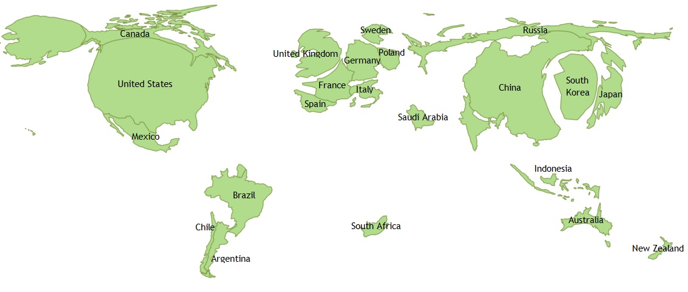
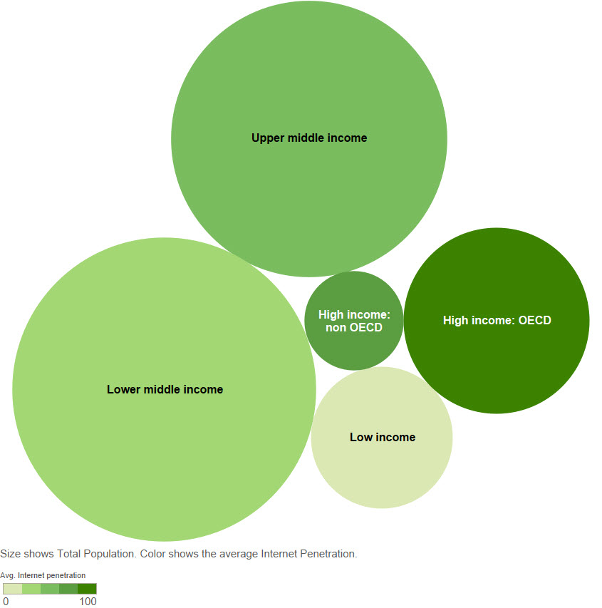
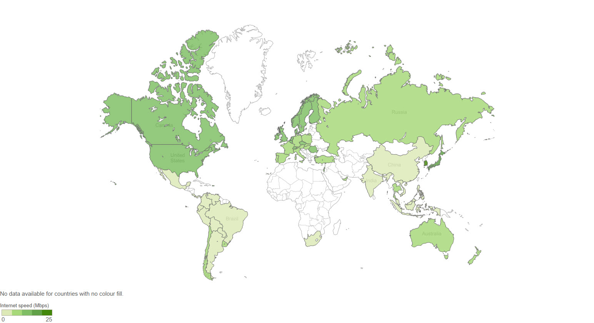
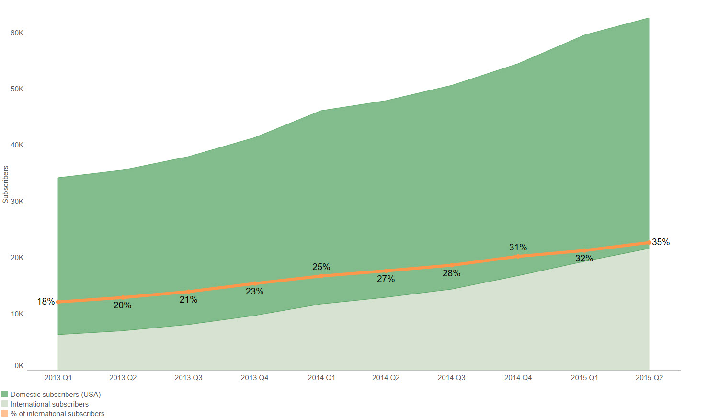
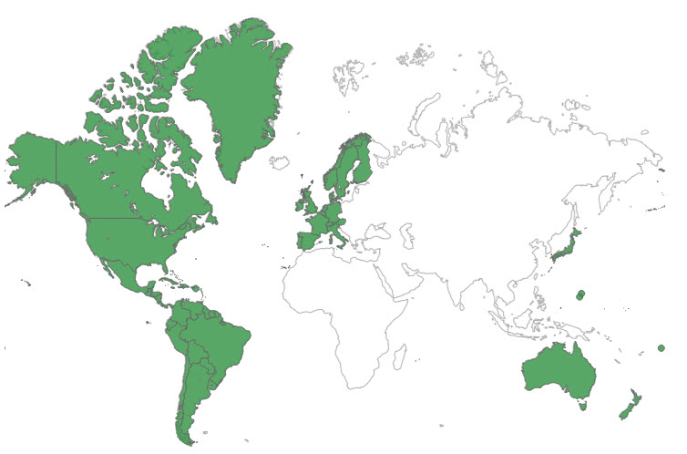
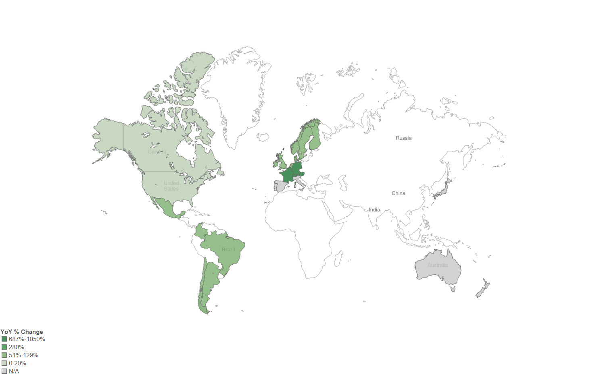
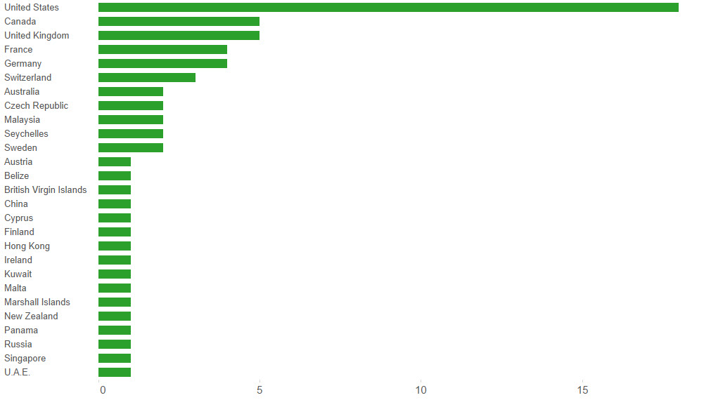
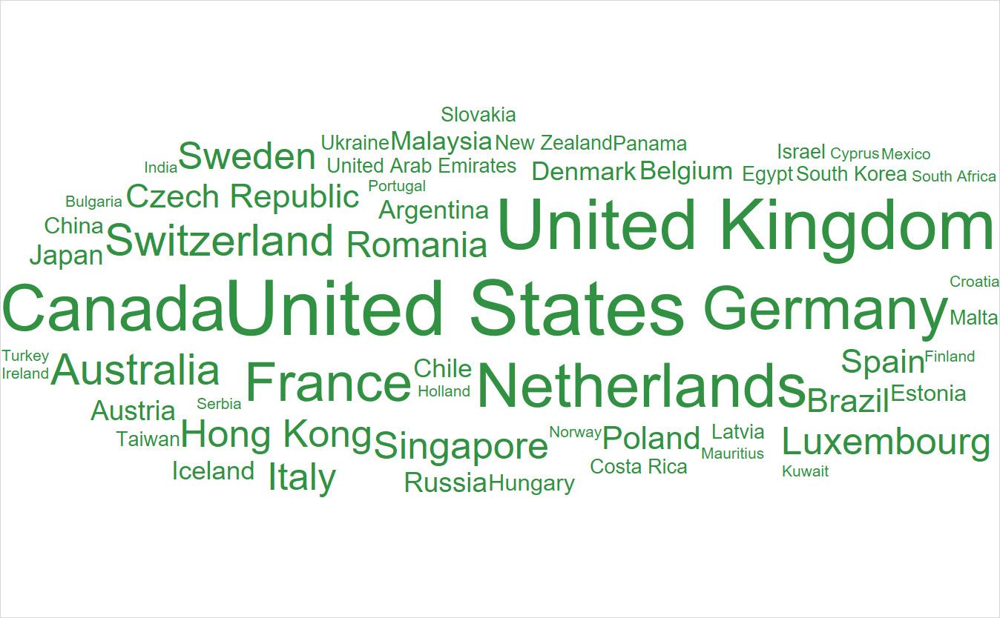

---
Pr-id: Publications
P-id: Theory on Demand
A-id: 18
Type (formerly called Item): book 
Book-type: anthology
Anthology item: article
Item-id: 
Article-title: Geoblocking and Global Video Culture
Article-status: accepted
Author: Ramon Lobato, James Meese, Juan Llamas-Rodriguez, Cameran Ashraf, Marketa Trimble, Adam Rugg, Florian Hoof, Roland Burke, Jinying Li, Çiğdem Bozdağ, Chris Baumann, Aneta Podkalicka, Chris Baumann, Sandra Hanchard, Vanessa Mendes Moreira de Sa, Hadi Sohrabi, Fidel Alejandro Rodriguez, Evan Elkins.
Author-email: rlobato@swin.edu.au, James.Meese@uts.edu.au
Author-bio:
Abstract:   short description of the article (100 words)
Keywords:   50 keywords for search and indexing
Rights: Creative Commons Attribution-NonCommercial-ShareAlike 4.0 International (CC-BY-NC-SA 4.0)
...

##Global Streaming: Scale and Infrastructure

Figure 1. A cartogram of consumer internet video traffic.
Data source: Cisco Visual Networking Index: Global IP Traffic Forecast, 2014–2019

Figure 2. Income status of global internet users.
Data source: The World Bank

Figure 3. Average internet connection speeds around the world.
Data source: Akamai State of the Internet Report Q4 2014

##Netflix by Numbers

Figure 4. U.S. and international Netflix subscribers, 2013-2015.
Data source: Netflix Inc. quarterly reports

Figure 5. Countries where Netflix is officially available. Data source: Netflix, [https://help.netflix.com/en/node/14164](https://help.netflix.com/en/node/14164)

Figure 6. Size of Netflix catalogue in various countries (Number of available titles). Data source: UnblockUS, [https://blog.unblock-us.com/how-many-titles-are-available-in-each-netflix-region
](https://blog.unblock-us.com/how-many-titles-are-available-in-each-netflix-region)

Figure 7. Countries with highest Netflix subscriber growth since 2014. Data source: Digital TV Research forecast

##VPN Geography

Figure 8. Most popular VPN server locations. Data source: Swinburne University

Figure 9. Number of VPNs by host country.
Data source: Swinburne University, Berkman Center for Internet and Society