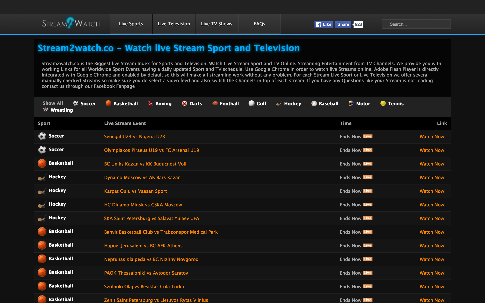

---
Pr-id: MoneyLab
P-id: INC Reader
A-id: 10
Type: article
Book-type: anthology
Anthology item: article
Item-id: unique no.
Article-title: title of the article
Article-status: accepted
Author: name(s) of author(s)
Author-email:   corresponding address
Author-bio:  about the author
Abstract:   short description of the article (100 words)
Keywords:   50 keywords for search and indexing
Rights: CC BY-NC 4.0
...

# Live Sports, Piracy and Uncertainty: Understanding Illegal Streaming Aggregation Platforms

###Florian Hoof##

## Geoblocked in Australia

Experiencing live football without having access to live TV coverage can
be exceptionally thrilling – even though it might not be the preferred
way to watch a match. On the sixth of May 2002, just after midnight, I
was sitting nervously in a run-down internet cafe in Potts Point,
Sydney, Australia. I was not here to watch a Champions League game, but
was hoping to follow a football drama that unfolded live back in
Germany’s second division. My club VfL Bochum, Germany’s most boring
football team, had a chance to make it into the first division and one
goal could make all the difference. As a fan of this rather
insignificant team, I followed the score via live text ticker on a
German sports web page.

Several circumstances brought me to this internet cafe. In 2002 options
for accessing live football coverage were scarce. There was no way to
live-stream the match. Of course in an era of analogue television, there
were no digital live images available. Even if there were, the bandwidth
provided by a 56k dial-up modem could not cope with that amount of data
anyway. At that time TV coverage of German Bundesliga football in
Australia was available only via the multicultural public broadcaster,
SBS (the Special Broadcasting Service). They broadcast the German news
every Sunday morning as a service for the German immigrant community in
Australia, but only the highlights would have been shown, and with a
one-week delay. There might have been the option to access live coverage
via the satellite service Sky Sports Australia – but in that case I
would have needed to find a sports bar that would turn their screens to
a German second-division football match. This seemed unlikely in a
country obsessed with Australian Rules Football, rugby and cricket, and
I might have ended up having no access to the match at all. So as I was
completely geoblocked from live TV coverage, I was forced to sit in
front of a grey monitor, operating a dirty mouse that was sitting on an
even dirtier mouse pad, pushing the reload button of the live ticker
hoping that VfL Bochum would prevail.

In 2002 geoblocking was not an optional digital rights management
feature that could be imposed on a given ‘information good’,[^07HoofLivesportspiracyanduncertainty_1] in this
case a German football match. It was inherent in the materiality of the
situation I found myself in, as a result of geographic, cultural and
infrastructural circumstances that could not be circumvented – at least
not with the resources available to me. Of course, circumstances have
changed dramatically since then.[^07HoofLivesportspiracyanduncertainty_2] Digital video broadcasting has
become the new standard and the broadcast television industry is
struggling to adapt to this changed environment. Bandwidth is no longer
only a restricting factor but, due to advances in video compression, has
turned into a negotiable and scalable question of image resolution and
quality. Furthermore, a whole array of different options for viewing
live sports events has evolved. Now the German branch of Sky Sports has
an app and a pay-tv subscription plan (Sky Go), allowing you to follow
every match of Germany’s second division on your computer, tablet or
mobile phone.

Despite these advances, if I wanted to watch a VfL Bochum match in
Australia today, I would still struggle. Six matches per week of
Germany’s first division are broadcast by beIN SPORTS Australia, a
subsidiary of the Al Jazeera Media Network, but there is still no live
coverage of the second division. Furthermore, all the aforementioned Sky
Sports live-streaming services are geoblocked in Australia. There is
still no legal way for Australians to access live sports coverage from
Germany’s second division. However, if we move beyond live sports
coverage provided by legal distribution channels a wide range of
informal options are available which did not exist in 2002.

If in Australia today, I would most likely end up in front of a laptop
or tablet in my apartment watching illegal live streams that can easily
be accessed via streaming aggregation platforms such as Rojadirecta.me
and Stream2watch.me. I might even be tempted to ask friends back in
Germany to stream this live broadcast to me via a live-streaming service
such as Periscope. For the consumer or sports fan, the increased
availability of illegal distribution channels significantly changes the
viewing situation. Information about these illegal options including the
legal and security risks involved is widespread, with pay-TV
circumvention practices discussed openly in mainstream newspapers, such
as the Munich-based *tz*.[^07HoofLivesportspiracyanduncertainty_3] Illegal live sport streams are not exact
copies of the authorized live experience. Offered for free, they deliver
a highly unstable live experience, one that may disappear unexpectedly
mid-match, and with noticeably poor image quality. Moreover, structures
and mechanisms – such as legal measures or technological circumstances –
that affect the availability of these streams remain an inaccessible
black box to the user. As a result, the user is confronted by an
uncertain situation that they cannot control or manage. Thus, even
though such streams are literally ‘for free’ they also involve costs for
the user precisely because of their unreliability.

## Illegal Live Sport Streams as ‘Digital Lemons’

I am specifically interested in understanding these costs and how they
relate to consumers and market structures. Therefore, I analyze how
quality, instability and uncertainty affect markets for digital
information goods by focusing on live sports consumption via illegal
streaming aggregation platforms. To theorize the productivity of
uncertainty for digital network markets, I combine media and social
theory with information economics. I use the concept of ‘lemons’,
originally established by information economics to understand
uncertainty in the market for used cars.[^07HoofLivesportspiracyanduncertainty_4] It describes the situation
of a buyer with insufficient information about the quality of a vehicle
he is offered by the car dealer. This used car might be a bargain but
could also turn out to be a lemon – a product that is actually
overpriced due to hidden quality deficiencies. The latter results in
costs to the buyer as he pays more than normal market prices would
indicate. The mechanisms at play can be transferred to the case of live
sport streaming. In both cases uncertainty relates to – if not
restricted to a purely monetary definition – additional costs for the
user or consumer.

My framework specifically focuses on the costs that accrue to users in
the process of locating, accessing and watching illegal information
goods and services without knowing if the resource is a ‘digital lemon’.
I use this term to refer to poor quality streaming sites, often
containing malware, and offering an unreliable and unstable streaming
resource – one which could carry legal implications for the user. In the
same way that the term lemon is used to describe uncertainty and quality
in the market for used cars, a ‘digital lemon’ is a sport stream of poor
or uncertain quality.

Sports broadcasting is well suited to an analysis of the ‘digital
lemons’ phenomenon because of its inherent liveness.[^07HoofLivesportspiracyanduncertainty_5] Unlike music or
movies, which have a much longer commodity lifespan, live sports cannot
be replicated through classical forms of piracy – such as recording and
circulating copies after the match – because its value will have
diminished greatly after the final score is known. Consequently, illegal
sport streams are more likely to be affected by the phenomenon of
‘digital lemons’. While reproducible information goods can simply be
downloaded and stored for later consumption, a dysfunctional live stream
poses a much higher risk. If a stream is disrupted due to a
technological failure or a copyright takedown request, there are limited
options to switch to a legal source. Because of the non-reproducible
liveness of sports events, the individual will face costs that are
fundamentally different when compared to downloading music or movies.
This makes live sports events an extremely valuable resource for content
providers. From a theoretical point of view, the high-risk
characteristics of ‘live’ information goods make them a suitable case to
study the relations between quality and uncertainty in digital markets.

### Legal Risks versus Illegal Uncertainty

Following a legal live ticker in an internet cafe and watching illegal
live streams at home are both connected to uncertainty and risks that
might interrupt the user experience of ‘liveness’. In 2002 my live text
ticker experience was disrupted because the owner of the internet cafe
started to intentionally walk around my desk and began to shut down all
the computers around me. As I was the only customer left, he was
desperate to close his shop and get some sleep. This posed a serious but
measurable risk to my live sports experience. I had plenty of
information at hand to grasp the character of the situation and to
develop strategies for dealing with it. One option to manage the
evolving risk would be to talk to the owner of the internet café, asking
him not to shut down my computer. Legitimate channels of distribution
such as pay TV offer information goods characterized by a predictable
stability in the user experience. To pay for such a subscription plan or
to try to start a conversation with the owner of the internet cafe are
both risk strategies to lower the probability of a disrupted live
experience.

When it comes to live-streaming, this risk emerges in a different way.
As it is not visible to the consumer it cannot be turned into a
manageable risk strategy. Instead it remains uncertain and
unpredictable. In order to comfortably access live football streams
consumers rely on live stream aggregation platforms that compile a vast
amount of live streaming channels. By systemizing them and making them
visible, they provide easy access to these kinds of illegal resources.
Platforms such as Stream2watch.me (Fig. 1) provide different categories
of live sport events on their starting page. These broad categories can
be filtered by country or league. After selecting a certain live sports
event a submenu appears (Fig. 2), listing the diverse live streams
available. The streams are sorted by resolution, quality, data transfer
rate, and language of the commentary.

Figure 1. Categories displayed on the starting page of the streaming
aggregation platform Stream2watch.me

Figure 2. Live stream selection submenu of a streaming aggregation
platform

Figure 3. Variable quality, freezing and signal disruption are persistent
risks when live-streaming sport

Streams available for the German Bundesliga are either pirated coverage
from the German branch of Sky Sports or from foreign broadcasters based
in India, Russia, Italy, Spain, United States or China. Some streams are
simply filmed from someone’s computer or television screen, while others
directly access the original digital stream. Depending on the design of
the platform and the available streams, between three and fifteen
streams are typically listed per match. Popular matches that involve
clubs with a worldwide fan base such as FC Bayern Munich tend to attract
a larger number of streams. However the quality of these streams is
quite diverse, ranging from high-definition resolution to low-quality,
heavily compressed video in which it is often difficult to recognize the
players. Blurring and compression marks are often visible, making it
hard to follow the match (Fig. 3). In addition, streaming channels that
infringe the intellectual property of Sky Sports Germany are often
disconnected in the last third of a 90-minute football match, reflecting
the time it takes to send and process takedown notices. Streams based on
foreign broadcast channels are normally not affected by takedown
notices. URLs for streaming aggregation platforms change frequently, and
platforms often disappear then reappear with a slightly different
address.

Figure 4. Malware is a common security hazard people have to negotiate
when using streaming platforms

There is also the risk that there are no streams available at all, or
that the quality is too low. Previously stable, high-quality streams can
turn into dysfunctional broadcasts if too many users are trying to
access them. Other dangers relate to the diverse business models adopted
by the streaming providers. Some operators generate profits as part of
the ‘grey’ advertising market and utilize live streaming as an
advertising platform, displaying multiple ads via popup windows or Flash
content. Others utilize streaming channels as landing pages to spread
malware, enabling them to extend bot-networks, conduct identity theft or
commit credit card fraud. They use false plug-ins, updates or video
player software installers; prepare hidden, transparent buttons; operate
with Javascript-based drive-by-download attacks; or take advantage of
security holes in software such as Flash (Fig. 4). Consumers that rely
on illegal live streams significantly increase their risk of being
affected by such attacks.

While many people argue that digital network markets are new forms of
collaborative capitalism, which can provide free goods, the case of live
sports streaming demonstrates that there are significant costs involved.
The whole process of locating and consuming illegal ‘live’ information
goods has to be understood as a risky investment of resources that is
continuously affected by the problem of ‘lemons’. The prevailing
uncertainty is a result of different aspects that constitute information
goods as ‘digital lemons’:

1\. *search ability* (via well-known streaming platforms; by links that
suddenly appear in social networks).

2*.* *accessibility* (via browser, video player software or via specific
software packages; skills required to access streams).

3\. *image and sound quality* (compression artifacts; image resolution;
time lag issues; foreign language commentaries; loudness; sound
modulation).

4\. *stability* and *reliability* (interruption of streams due to
copyright issues, bandwidth issues or technical problems).

5\. *security hazards* (caused by malware and viruses while using illegal
streaming platforms).

## Conclusion: Uncertain Information Goods and Digital Network Markets

A better understanding of the relations between uncertainty, risk and
the consumer provides for a more precise analysis of contemporary
digital markets characterized by the phenomenon of piracy as well as by
‘freemium’ or free-service business models. Live streaming, because of
the increased risk of ‘digital lemons’, offers an exemplary case to
investigate uncertainty on the consumer side. Here, the heterogeneous
relations between piracy and legitimate consumption structure the gray
area between scarcity and abundance of live information goods. The
market oscillates between paid and free content and is characterized by
information asymmetries that relate to quality and uncertainty. These
dynamic structures are not bound to a technologically determined idea of
network media that automatically turn goods into public goods. Piracy
and measures taken against it – such as geoblocking – are part of
continuously fought ‘battles and dramas between formal and informal, the
ill structured and the well structured, the standardized and the
wild’.[^07HoofLivesportspiracyanduncertainty_6] Here, consumers move continuously ‘back-and-forth between ill
structured and well structured’[^07HoofLivesportspiracyanduncertainty_7] situations. If not restricted to the
idea of ‘free’, ‘convergence’ or ‘access’, to dualisms such as ‘formal’
versus ‘informal’ or ‘legal’ versus ‘illegal’, these continuous
negotiations between infrastructure, information goods and the market
can be understood as a *modus operandi* that structures, stabilizes and
changes digital markets. Focusing on the productivity of uncertainty and
risk enables us to open up the black box of copy and access culture and
to situate it as an intrinsic part of those markets. But it also
connects piracy and circumvention practices to a broader perspective
that uses risks and uncertainty to explain how stability and change
operate in society.[^07HoofLivesportspiracyanduncertainty_8]

## References

Akerlof, G.A. ‘The Market for “Lemons”: Quality Uncertainty and the
Market Mechanism’, *Quarterly Journal of Economics* 84.3 (1970):
488-500.

Beck, Ulrich. *Risk Society. Towards a New Modernity*. London: Sage,
1992.

Couldry, Nick. ‘Liveness, “Reality”, and the Mediated Habitus from
Television to the Mobile Phone’, *Communication Review* 7.4 (2004):
353-361.

Curtin, Michael, Jennifer Holt, and Kevin Sanson (eds) *Distribution
Revolution: Conversations about the Digital Future of Film and
Television*, Berkley: University of California Press, 2014.

Feuer, J. ‘The Concept of Live Television: Ontology as Ideology’, in
E.A. Kaplan (ed.) *Regarding Television: Critical Approaches - An
Anthology*, Los Angeles: American Film Institute, 1983, pp. 12-21.

Giddens, Anthony. ‘Risk and Responsibility’, *Modern Law Review* 62.1
(1999): 1-10.

Hutter, Michael. ‘Information Goods’, in R. Towse and Edward Elgar (eds)
*A Handbook of Cultural Economics,* Cheltenham, 2006, pp. 263-268.

Levine, E. ‘Distinguishing Television. The Changing Meanings of
Television Liveness’, *Media, Culture & Society* 30.3 (2008): 393-409.

Luhmann, Niklas. *Risk. A Sociological Theory*, Berlin/New York: De
Gruyter, 1993.

Star, Susan L. ‘This Is Not a Boundary Object: Reflections on the Origin
of a Concept’, *Science, Technology and Human Values* 35.5 (2010): 601-617.

tz. ‘Hier sehen Sie Borussia Dortmund gegen FK Krasnodar jetzt im TV und
Live-Stream’, 17 September 2015,
[https://www.tz.de/sport/fussball/europa-league-borussia-dortmund-gegen-fk-krasnodar-tv-live-stream-sky-sport1-5515199.html](https://www.tz.de/sport/fussball/europa-league-borussia-dortmund-gegen-fk-krasnodar-tv-live-stream-sky-sport1-5515199.html).

[^07HoofLivesportspiracyanduncertainty_1]: Michael Hutter, ‘Information Goods’, in Ruth Towse (ed.), *A
    Handbook of Cultural Economics,* Cheltenham: Edward Elgar, 2006, pp.
    263-268.

[^07HoofLivesportspiracyanduncertainty_2]: See, for example, Michael Curtin, Jennifer Holt, and Kevin Sanson (eds), *Distribution Revolution: Conversations about the Digital Future of Film and Television*, Berkley: University of California
    Press, 2014.

[^07HoofLivesportspiracyanduncertainty_3]: See: Sophie Rohringer, ‘Hier sehen Sie Borussia Dortmund gegen FK
    Krasnodar jetzt im TV und Live-Stream’, *tz*, 30 September 2015,
    [https://www.tz.de/sport/fussball/europa-league-borussia-dortmund-gegen-fk-krasnodar-tv-live-stream-sky-sport1-5515199.html](https://www.tz.de/sport/fussball/europa-league-borussia-dortmund-gegen-fk-krasnodar-tv-live-stream-sky-sport1-5515199.html).

[^07HoofLivesportspiracyanduncertainty_4]: G. A. Akerlof, ‘The Market for “Lemons”: Quality Uncertainty and the Market Mechanism’, *Quarterly Journal of Economics* 84.3 (1970): 488-500.

[^07HoofLivesportspiracyanduncertainty_5]: Nick Couldry, ‘Liveness, “Reality”, and the Mediated Habitus from Television to the Mobile Phone’, *Communication Review* 7.4 (2004): 353-361.; Elena Levine, ‘Distinguishing Television. The Changing
    Meanings of Television Liveness’, *Media, Culture & Society* 30.3 (2008): 393-409; Jane Feuer, ‘The Concept of Live Television: Ontology as Ideology’, in E.A. Kaplan (ed.), *Regarding Television: Critical Approaches – An Anthology*, Los Angeles: American Film Institute, 1983, pp. 12-21.

[^07HoofLivesportspiracyanduncertainty_6]: Susan L. Star, ‘This Is Not a Boundary Object: Reflections on the Origin of a Concept’, *Science, Technology and Human Values* 35.5 (2010): 601-617, p. 614.

[^07HoofLivesportspiracyanduncertainty_7]: Star, ‘This Is Not a Boundary Object’, p. 614.

[^07HoofLivesportspiracyanduncertainty_8]: See: Ulrich Beck, *Risk Society. Towards a New Modernity*, London:
    Sage, 1992; Anthony Giddens, ‘Risk and Responsibility’, *Modern Law Review* 62.1 (1999): 1-10; Niklas Luhmann, *Risk. A Sociological
    Theory*, Berlin/New York: De Gruyter, 1993.
