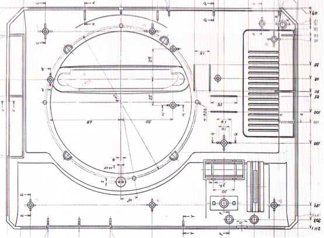

---
Pr-id: Publications
P-id: Theory on Demand
A-id: 18
Type (formerly called Item): book 
Book-type: anthology
Anthology item: article
Item-id: 
Article-title: Geoblocking and Global Video Culture
Article-status: accepted
Authors: Ramon Lobato, James Meese, Juan Llamas-Rodriguez, Cameran Ashraf, Marketa Trimble, Adam Rugg, Florian Hoof, Roland Burke, Jinying Li, Çiğdem Bozdağ, Chris Baumann, Aneta Podkalicka, Chris Baumann, Sandra Hanchard, Vanessa Mendes Moreira de Sa, Hadi Sohrabi, Fidel Alejandro Rodriguez, Evan Elkins.
Author-email: rlobato@swin.edu.au, James.Meese@uts.edu.au
Author-bio:
Abstract: Video platforms like Youtube, IPlayer, DailyMotion, Netflix, Periscope and Youku use geoblocking to filter international audiences. Geoblocking and Global Video Culture examines the geography of video streaming across different cultures. Studying the linkages between various blocking and circumvention practices and the tactics people use to get around them. The research decodes the approach to geoblocking in various countries like China, Iran, Malaysia, Turkey, Cuba, Brazil, USA, Sweden and Australia, by analyzing how different users negotiate geoblocking and internet filtering controls. This collection of essays offer a series of distinctive stories about this fast-changing and complex issue. Keywords:internet censorship, copyright, Institute of Network Cultures, video distribution, public sphere, proxy filtering, P2P file-sharing, territorialisation, geographies of control, surveillance, VPN, connectivity, anonymity, IP-address, digital infrastructure, USA, China, Sweden, Turkey, Australia, Malaysia, Brazil, Iran, Cuba, piracy, privacy, streaming aggregation platforms, mobile video culture, authorized and unauthorized channels, site-blocking, circumvention practices 
Rights: Creative Commons Attribution-NonCommercial-ShareAlike 4.0 International (CC-BY-NC-SA 4.0)
Font(s) used: Open Sans
...

#The Future in a Vault of Plastic: Physical Geolocking in the Era of the 16-bit Video Game Cartridge, 1988-1993\

###Roland Burke###

Figure 1. Drawing the Borders: Detail of the original Sega Megadrive
design schematic, with the assorted cartridge slot shapes indicated.
Reproduced from Stuart and Wall, Sega Mega Drive/Genesis: Collected
Works, n.p: Read Only Memory, 2014

IP address geoblocking has been implemented to partition what would
otherwise be potentially borderless worlds of information and
entertainment delivered via the internet.[^08BurkeGamecartridges_1] Digital media markets,
differentiated in price and access to different ‘regions’ of the globe,
now provoke widespread circumvention. Perhaps unsurprisingly, the
established hierarchy of digital citizenship has been contested most
actively by the citizenry on its margins; particularly in Australia, a
wealthy but remote country, with very rapid uptake of technology.
Australia’s digital citizens, who are amongst the most privileged and
prosperous in the physical world, have railed against their digital
marginalization with an exceptional intensity.

This is, however, not a wholly new phenomenon. There is a long history
of Australian consumers subverting the efforts of their electronic
suzerains, not only in the United States, but also Japan, through
unauthorised circumvention and parallel importation. Among the most
dedicated consumers are Australian gamers, who have been manually
modifying game cartridges meant for other markets for at least two
decades. This chapter recovers some of that past, and points to a much
longer tradition of citizen-led circumvention. It also seeks to restore,
in a modest way, an aspect of digital entertainment that has been
largely neglected; namely, the creation and circulation of digital
information as a discrete physical entity.[^08BurkeGamecartridges_2]

## The Future Elsewhere: Japan’s revival of home video gaming

Video gaming, as a consumer past time, emerged in the United States.
After a number of comparatively unsuccessful precursors, Atari
inaugurated a popular culture boom in video games between 1978 and 1983.
It was not to last, and after quality control concerns, and catastrophic
market oversupply, this first video game efflorescence dramatically
darkened, before a slow recovery in the mid to late 1980s.[^08BurkeGamecartridges_3] The
epicentre of the revival of home video gaming was Japan, a market
partially decoupled from the precipitous collapse of the US home gaming
industry across 1982-84.[^08BurkeGamecartridges_4]  As the iconic brands of the preceding
Atari age fell, not merely into hardship, but in many cases, bankruptcy,
Japan was a kind of sanctuary site. This was where the new custodians of
electronic entertainment, Nintendo and Sega, prospered - first at home,
and, from late 1985, abroad.[^08BurkeGamecartridges_5]  Japanese gaming consoles repopulated a
desolate American market, and conquered the PAL television system
countries of Western Europe and Australia in turn. The Nintendo
Entertainment System, and its counterpart, the Sega Master System,
restored gaming to its more or less continuous trajectory of growth – a
steady gradient which would advance video games to their current,
ascendant, position as largest global media industry.

Regional lock-out mechanisms were largely absent from the consoles of
the late 1970s and early 1980s. The Atari VCS, Mattel Intellivision,
Milton-Bradley Vectrex, and Coleco Toys Colecovision contained no
explicit regional locking provisions, though this was no absolute
assurance of pan-regional compatibility. In the case of the Atari VCS,
the first mass-market system with interchangeable game cartridges, the
reality of highly constrained hardware mandated an effective, if
inconsistent, region lock. The video display chip and CPU at the heart
of the VCS were closely coupled to the raster output of the television:
they literally ‘raced the beam’, or electron gun that painted the TV
screen.[^08BurkeGamecartridges_6] It followed that the precise timing mattered, and thus,
games needed to be finely calibrated for either NTSC (60Hz), or PAL
(50Hz).[^08BurkeGamecartridges_7] It was a regional lock of sorts, reflecting the difficulty
of making a functional, affordable video game system with mid-1970s
integrated circuit technology.

In the mid-1980s, with the new Japanese consoles, the relationship
between television system and console hardware was less intimate. Newer
graphics chips were not so closely coupled to the raster of the
television screen. More particularly, there was the emergence of
regional coding created independent of television system. Japanese
Nintendo games were regionally-locked to the Japanese Nintendo console
(Famicom), preventing its cartridges being played on the American
Nintendo.[^08BurkeGamecartridges_8] This was despite both systems being, in essence, fully
compatible, and sharing a common NTSC television output. Nintendo
redesigned the form factor of its cartridges to prevent their physical
access to American systems, and, for good measure, rerouted the gold
pins of the cartridge interface to a new, North American specific,
pattern. With the advent of the first Nintendo, the region lock was now
much more than a happy, market-segmenting accident derived from
television standards – it was a conscious technological strategy crafted
by the system vendor.[^08BurkeGamecartridges_9]

Between 1988 and 1993, the second wave of Japanese origin consoles,
first from Sega in 1988 (Japan, 1990 US, 1991 EU/Australia), and later
Nintendo (1990 Japan, 1991 US, 1992 EU/Australia) – arrived in the
historically neglected PAL markets. This chapter willfocus on Australia,
a geographically isolated region, with no land borders, and no proximate
NTSC neighbour – and one which often lagged behind Japan and the United
States, in terms of the release of both video game hardware and its
requisite software. The second wave of the console contest was the
crucible for the modern gaming market, when gaming began to escape to
the living room, and to the adult world. With improvements in transistor
density, increased global RAM supply after the catastrophic shortages of
the late 1980s, and larger markets across which to amortize research and
development, video games were markedly more accessible, sophisticated,
and aesthetically impressive experiences.[^08BurkeGamecartridges_10] A fierce format war
between Sega and Nintendo intensified competition, and accelerated the
rate of innovation.[^08BurkeGamecartridges_11] In this new gaming environment of the 1990s,
the issue of region locking became progressively more acute.

The Sega Megadrive was a revealing case. While provisioned with some
capacity for an electronic lockout, the console’s key region-locking
mechanism was a simple variation in the geometry of the cartridge
slot.[^08BurkeGamecartridges_12] In other words, for much of the Megadrive’s commercial life
geographic market segmentation was achieved solely by this decidedly
flimsy physical countermeasure.

Most cartridges released for the system, and almost all of the most
popular titles, would play without incident on both NTSC units, those
from Japan and the United States. They would also play on PAL systems,
provided they could be inserted into them. As a result, the barrier to
importing games was vastly diminished. There was no requirement to
purchase a Japanese or American console, a voltage transformer, or a
still highly esoteric multi-color system television. In many cases,
region-specific languages were also included on the same cartridge,
precluding the need for any local language translation for instance,
from Japanese to English – a need which was already modest given the
comparative narrative simplicity that defined the games of this
period.[^08BurkeGamecartridges_13] The Megadrive was a rare case where physical blockade was
the prime means for seeking a market segmentation; a segmentation that
always tended to disfavor the PAL regions of Europe and Australia.
Predictably, the unsophistication of the geometrical ‘lock out’ was
rapidly exploited by Australians.

## Breeching the Polypropylene Wall: Console Hacking with a Hacksaw and a Heated Carving Knife

Demand for Japanese cartridges in Australia was driven by the long delay
between releases in Japan, and those in the PAL countries.  In the late
1980s and early 1990s this delay typically amounted to a full fiscal
quarter, and often extended to an entire calendar year. Holding back the
flood of eager video gamers was, remarkably, a small piece of plastic,
which altered the geometry of the cartridge slot – with Japanese
cartridges shaped slightly more widely than the slots present on the PAL
Megadrive console units.  The difference which prevented their use in
the Megadrive machines of Britain and Australia, around 12mm, was
breathtakingly – perhaps heartbreakingly – close.[^08BurkeGamecartridges_14] In essence,
slightly more than a centimetre of matte black polypropylene was
assigned the weight of defending Australia’s cultural borders, or
perhaps more accurately, allowing market segmentation by the Japanese
parent and its subsidiary. Unremarkably, it was a barrier soon breached
by enterprising children, and nervous adults who looked on in fear as
their young performed makeshift surgery on the casing of the expensive
Megadrive hardware, or provisioned substantial sums of cash to purchase
grey market adaptors for the rival console, the Super Nintendo, from
dog-eared mail order forms. 

For the Megadrive, the process was elegant in concept, and alarming in
practice. The outer shell of the cartridge slot, the final sentinel
against imported software, had two small tabs of plastic excised. Due
care was required that the chosen implement, typically a heated carving
knife (for clean margins on the incision), or an electric variant, did
not make contact with the motherboard that resided beneath. With these
thermoset plastic border posts removed, by a doubtlessly tremulous pair
of hands, all cartridges could be inserted without impediment.
Marginally more sophisticated was the procedure for the Megadrive’s
rival, the Super Nintendo. A very crude region checking system had been
implemented; but one easily deceived by replicating the cartridge slot.
An aftermarket adaptor would accommodate one ‘native’ region cartridge
for chaperone duties (almost always *Super Mario World*), which would
present its endogenous credentials; and then immediately defer to the
‘foreign’ cartridge that was mounted in tandem in the replicated slot
alongside it. For the Sega system, circumvention involved punching a
hole in the geo-fence; for the Super Nintendo, it required a ‘native’
regional escort providing a fleeting moment of diplomatic cover. In both
cases, the breech was easily and cheaply made.

Figure 2. The Japanese Megadrive cartridge with its infuriating rounded
edge. The owner is mere millimetres away from fun. Source: Roland Burke

Figure 3. The localized Australian Megadrive cartridge, with its
distinctive curved spline. Source: Roland Burke

Circumvention was not a procedure undertaken without considerable
deliberation and forethought. Inexperienced hands, no matter how nimble,
could fatally damage the Megadrive, which was, at the time, an
extortionately priced piece of consumer electronics, with a price tag of
A\$399 in 1991. Acquiring the console required studious petitioning and
parental patronage, and even then, the cost involved made it the
preserve of the middle class.[^08BurkeGamecartridges_15] With Australia entering a very steep
and prolonged economic recession shortly after the release of the
Megadrive, it tookyears of depreciationand improving economic
conditionsbefore it arrived at a mass market price Breaching the
cartridge slot, and thus reaching the ‘future’ (actually the
geographically distant present), was an enterprise that involved great
risk. Physical puncture of the motherboard, or electrostatic discharge,
could permanently destroy a comparatively massive capital outlay.
Australians could leap to the future of Japanese games, but the penalty
for a failed attempt would be severe.

## Visible Public Networks: The Classroom VPNs of the early 1990s and the Prestige of Gaming Scarcity

As video game journalism matured during the 1990s, popular knowledge of
circumvention increased. Until this point, this gap between promised
excitement and local disappointment was present, but manageable.  The
latency between knowledge of new overseas games, as revealed in effusive
print reviews and colorful screenshots, was modest.  Almost all
dedicated English-language video game journalism was published in the UK
or the US.[^08BurkeGamecartridges_16]  Delivered via the most economical tier of surface mail,
the journey of the magazines -- the paper vectors for anticipation,
excitement, and, usually, frustration -- consumed much of the latency
period between knowledge and release.  The games arrived much later than
they did in Japan or the United States, but so too did the knowledge of
their existence, or in the case of reviews, the assurance of their
hedonic virtue. 

In the 1990s, this slothful symmetry between printed gaming magazine and
printed circuit board was radically disrupted; not by the internet,
which remained a mostly inaccessible, text-based curiosity, but by the
advent of widespread air mail distribution. Initially confined to
hyper-specialist outlets, most famously McGill’s Bookshop in Elizabeth
Street, Melbourne, the air mailed gaming magazine delivered the future
(geographically quarantined present), to the Australian suburbs. There
was a substantial price premium, with air-mailed issues almost double
the price (A\$8.95to A\$4.95), but air mail proliferated, particularly
through Pacific Computers, a specialist gaming vendor that rapidly
spread across suburban malls in southern Australia. Perhaps
appropriately, the air-mailed titles had their own informational lock
out. They were almost always sealed in plastic -- presumably a measure
of prophylaxis against physical damage, but also, a physical membrane
which foreclosed access to the knowledge within prior to purchase. This
was special, and expensive information. Purchasing a quantum of it was a
major outlay – one typically recouped in social capital when latest
magazine was circulated by its proud owner amongst school friends.

Beyond the circulation of expensive magazine knowledge, the ownership of
highly anticipated games, well in advance of their domestic launch
dates, lent social and cultural capital within school environments,
typically amongst late primary and early secondary boys. During the
early 1990s, in middle- and upper-middle class suburbs, where almost
every want or vaguely expressed material desire could be, and often was,
fulfilled, the special supra-monetary value of having an ‘import’ was a
socially advantageous asset. Study of the glossy printed materials,
which were richly illustrated, and the even the packaging, were
privileges to be disbursed judiciously over a playground lunchtime.
Indecipherable Kanji characters added an exoticism – though presumably
few pondered the sources of the mystique that a Japanese game held.
Parsimony in access not merely to the game, but to the material
artefacts of the game cartridge, preserved its scarcity. Custodianship
of a high-profile imported game, be it *Strider,* *Bare Knuckle*, or
most especially, *Street Fighter 2* was a solemn responsibility – albeit
one typically wielded with the glib caprice and irresponsibility that
inhered in schoolyard politics and classroom diplomacy.

It followed that pricing was not, in the main, driving demand for
Japanese or American releases. Very often, imported games, especially
highly anticipated titles, were more expensive at import than their
domestic siblings would be at their official launch. In July 1992,
*Street Fighter 2* for the Super Nintendo sold for A\$140 as an import,
with an additional A\$50 for the requisite cartridge adaptor.[^08BurkeGamecartridges_17] But
it was available – and available at exactly the moment that voluminous
reviews, each with praise more superlative than the last, arrived in
air-mail imported magazines. The transaction, in the most fundamental
form of exchange, repartitioned money into time – time with the game,
and in a stroke of serendipity, time which coincided with the two week
winter recess in Australian primary schools.[^08BurkeGamecartridges_18]

## Conclusion: Unlocking the Plastic Gates of the Future

The physical geo-lock of the 16-bit gaming era was an admixture of the
then high-tech Motorola 68000 CPU, and ultra-high performance
pseudo-SRAM chips, and the decidedly low technology of injection
moulding. Its very lack of sophistication marked it out as a profoundly
different, and strangely democratized, cultural milieu. Hierarchies were
based on depth of enthusiasm; whereby ownership of a prized Japanese
title was demonstrative not of greater funds (though plenty were still
needed – and always remained insufficient), or of ultra-specialist
technical skill, but of daring, and of being privy to seemingly special
personal networks. The later era of circumvention, which arrived with
optical disk based consoles, notably the Sony Playstation (1995) and the
Sega Saturn (1995), altered this arrangement. With the implementation of
a digital lockout, the barriers to circumvention were raised
dramatically. Bypassing this new generation of software-based
geo-locking required custom-made integrated circuits. The energetic
resourcefulness of young adults was no longer adequate; and the
cross-over with flat out illegality, insofar as the same anti-geolock
chips allowed piracy, loomed.

Equally, the 16-bit age represented a more restrained era in the
vendor-consumer arms race, a race which has often produced mutually
assured irritation. The Megadrive’s unsophisticated physical lock
allowed owners a degree of autonomy over their machines – and the
constraints on import were mostly those of logistical inconvenience.
Enthusiasm and desire could overcome these obstacles, but would only
ever do so for a limited market segment, and thus placed an upper
ceiling on disruption to local distribution channels and market control.
Legislative responses, insofar as they existed, were confined to the
sporadic and well-publicized confiscation of imported games by
Australian Customs (promptly and ostentatiously donated to local
children’s hospitals), an enforcement measure which was abandoned in the
wave of competition reforms which relaxed parallel import rules. Even
the expansive, omnibus anti-circumvention provisions of the Digital
Agenda Bill (2001) would seem ill-armed to counter the threat of a
kitchen knife and a determined young video game enthusiast with a poorly
developed sense of risk.

The five prime years of the 16-bit video game console also represented a
liminal moment in electronic entertainment. Dissemination of information
was, emphatically, still physical. News of video games arrived in
magazines – initially with considerable delay. The games themselves,
although digital, were housed in gaudy plastic carapaces. These
cartridge shells protected their contents from static electricity and
water (cola) – and, in their territory-specific geometry, sought to
prevent their migration from East to West. It was also the last
generation where gaming was dominated by the de facto duopoly of
Nintendo and Sega, companies with a strong heritage in physical
entertainment products. Unlike Sony, which had a large portion of its
enterprise tied in the ethereal intellectual property of music rights
and film, or Microsoft, which joined the console ‘wars’ in 2001 having
previously been a software company, Nintendo and Sega were experts in
producing entertainment objects.

The temptation for Nintendo to approach the new world of software with a
vestigial attachment to the physical and material was surely
powerful.[^08BurkeGamecartridges_19] The Nintendo 64 (June 1996 Japan, September 1996 US,
March 1997 Australia/Europe) utilized cartridges, years after its
competitors had migrated to optical disks, and despite the complaints of
software developers. Nintendo clearly had yet to be persuaded that the
delivery medium did not matter. The incredibly high quality of the N64
software library, its resistance to commercial piracy, and the elevated
value of these cartridges on the secondary market suggests there was
some merit in Nintendo’s caution in embracing fully commoditized data
formats like optical disc.[^08BurkeGamecartridges_20]

The schoolyard circumvention movement of the early 1990s was a fleeting
one, and while it presaged aspects of the future – notably, the dramatic
rise of the global video game market -- it probably resided more in the
last act of a past where entertainment media was unambiguously embodied
in a tactile object. The world of the Sega Megadrive and the Super
Nintendo consoles marked the zenith in the cartridge as a material
entity; with designs which had become, by the early 1990s, truly
Baroque. During the last years of cartridge distribution, there were
perceptible differences in weight – with the most recent and advanced
titles markedly heavier, owing to a denser array of ROM chips, which
held the game program.[^08BurkeGamecartridges_21] With ROM chips relatively expensive, in this
terminal phase of cartridge distribution, gaming data was being
purchased by the gram.

With the rise of the Playstation in the mid-1990s, the long decline into
digital weightlessness had begun. Optical disks varied little in
appearance, the same in form factor as the audio CD. Discs were a fully
commoditized and disappointingly insubstantial medium – pressed at will
from polycarbonate and aluminium, and holding only cents worth of
intrinsic value, which clung desperately to the optical platter, only
tens microns of ill-handling away from an unrecoverable scratch. The
ever-increasing abstraction of the game from its medium of delivery,
arguably heightened dissatisfaction with any delay in it reaching a PAL
market Gone was the material dimension of the cartridge; a proprietary
format, not interchangeable with mass market optical disks, and with a
distinctive design and aesthetic of its own.

There was, by the end of the first Playstation age in the late 1990s, no
more mystique about the physicality of gaming software. Interest in the
game software as an object rapidly became confined to the arcane
antiquarianism of retro-video game collectors.[^08BurkeGamecartridges_22]

Geometry lockout had matched, for a short moment, a hybrid digital
world, where information was digital, but had to be affixed to ROM chips
for its survival and global dissemination. It travelled in bulk
container ships and 747 cargo conversion holds, and was restricted by
the costs of commercial shipping, not arbitrarily emplaced IP block
ranges. Its encryption was a geometrical puzzle; an alteration in
cartridge shape, and no more. At the time of the 16-bit consoles,
especially the Megadrive, geo-locking was a spatial exercise – and its
resolution could be found in spatial ingenuity. For those passionate
enough to husband the safe travel of those bits through the geographic
space of Japan to Australia, and to pilot the delicate final leg,
through the micro-geographic shoals of occluded cartridge slot to
unshielded cartridge port, the impediments imposed were merely those of
the real geo-, not the stratified one prescribed by corporate entities.

##References

Altice, Nathan. *I Am Error: The Nintendo Family Computer / Entertainment System Platform*, Cambridge, MA: MIT Press, 2015. 

Baer, Ralph. *Videogames: In the Beginning, Springfield*, NJ:  Rolenta, 2005.

Burkart, Patrick. *Pirate Politics: The New Information Policy Contests*, Cambridge, MA:  MIT Press, 2014.

Christophers, Brett. *Envisioning Media Power: On Capital and the Geographies of Television*, Plymouth:  Lexington, 2009. 

Christophers, Brett. ‘Spaces of Media Capital’, in Paul Adams et al. (eds), *The Ashgate Research Companion to Media Geography*, Surrey: Ashgate, 2014, 363-376.

Dataquest, ‘Asian Semiconductor and Electronic Technology Service’, report, 1991, [http://archive.computerhistory.org/resources/access/text/2013/04/102723217-05-01-acc.pdf](http://archive.computerhistory.org/resources/access/text/2013/04/102723217-05-01-acc.pdf). 

Dillon, Roberto. *The Golden Age of Video Games: The Birth of a Multibillion Dollar Industry*, Boca Raton, FL: Taylor & Francis, 2011.

Donovan, Tristan. *Replay: The History of Video Games Paperback*, East Sussex: Yellow Ant, 2010.

Gorges, Florent. *The History of Nintendo 1889-1980*, Triel-sur-Seine: Les Editions Pix'N Love, 2012. 

Gorges, Florent. *The History of Nintendo 1980-1991*, Triel-sur-Seine: Les Editions Pix'N Love, 2012. 

Harris, Blake. *Console Wars: Sega, Nintendo, and the Battle that Defined a Generation*, New York: HarperCollins, 2014.

Herman, Leonard. Phoenix: The Fall and Rise of Video Games, Springfield, NJ: Rolenta, 1997. 

Johns, Adrian. *Piracy: The Intellectual Property Wars from Gutenberg to Gates*, Chicago:  University of Chicago Press, 2011.

Kent, Steven. *The Ultimate History of Video Games: From Pong to Pokemon: The Story Behind the Craze That Touched Our Lives and Changed the World*, New York: Three Rivers, 2001. 

Kohler, Chris. *Power-Up: How Japanese Video Games Gave the World an Extra Life*, Indianapolis, IN: Brady Games, 2004.

Lobato, Ramon. *Shadow Economies of Cinema: Mapping Informal Film Distribution*, London: British Film Institute, 2012.

Montfort, Nick. *Racing the Beam: The Atari Video Computer System*, Cambridge, MA: MIT Press, 2009. 

Ogawa, Megumi. *Protection of Broadcasters’ Rights*, Leiden: Brill, 2006.

Pettus, Sam. *Service Games: The Rise and Fall of SEGA: Enhanced Edition*, Seattle: CreateSpace, 2013. 

Postigo, Hector. *The Digital Rights Movement: The Role of Technology in Subverting Digital Copyright*, Cambridge, MA: MIT Press, 2012.

Ryan, Jeff. *Super Mario: How Nintendo Conquered America*, London: Penguin, 2012.

Sheff, David and Andy Eddy. *Game Over Press Start To Continue*, Wilton, CT: Cyberactive Press, 1999.

Slater, Jim. *Modern Television Systems*, London:  CRC Press / Longman, 1991.

‘Semiconductor Read-Only-Memory Chips Appear’, *Computer History Museum*, [http://www.computerhistory.org/semiconductor/timeline/1965-ROM.html](http://www.computerhistory.org/semiconductor/timeline/1965-ROM.html).

Integrated Circuit Engineering Corporation. ‘The MOS Memory Market’, report, 1996, [http://smithsonianchips.si.edu/ice/cd/MEM96/SEC01.pdf](http://smithsonianchips.si.edu/ice/cd/MEM96/SEC01.pdf). 

Strangelove, Michael. *Post-TV: Piracy, Cord-Cutting, and the Future of Television*, Toronto: University of Toronto Press, 2015. 

Stuart, Keith and Wall, Darren. *Sega Mega Drive/Genesis: Collected Works*, n.p:  Read Only Memory, 2014.

Szczepaniak, S.M.G. *The Untold History of Japanese Game Developers*, n.s., 2014.

Vendel, Curt and Marty Goldberg. *Atari Inc.: Business is Fun*, Carmel, NY: Syzygy Press, 2012.

Wilkins, Christopher.*The Story of the Sinclair ZX Spectrum in Pixels*, n.p., Fusion Retro Books, 2014.

Wilkins, Christopher. *The History of Ocean Software*, n.p., Fusion Retro Books, 2014.

Wilkins, Christopher. *The Story of U.S. Gold*, n.p., Fusion Retro Books, 2015. 

Wolf, Mark. *The Video Game Explosion: A History from Pong to PlayStation and Beyond*, Westport: Greenwood, 2007. 

Wolf, Mark (ed.), *Before the Crash: Early Video Game History*, Detroit: Wayne State University Press, 2012.

[^08BurkeGamecartridges_1]: See, for instance, Michael Strangelove, *Post-TV: Piracy,
    Cord-Cutting, and the Future of Television,* Toronto: University of
    Toronto Press, 2015; Brett Christophers, ‘Spaces of Media Capital’,
    in Paul Adams et al. (eds), *The Ashgate Research Companion to Media
    Geography,* Surrey: Ashgate, 2014, 363-376; and Christophers,
    *Envisioning Media Power: On Capital and the Geographies of
    Television,* Plymouth: Lexington, 2009. See also the sibling work on
    parallel, semi-subaltern, circumvention networks, physical and
    electronic, notably from Ramon Lobato, *Shadow Economies of Cinema:
    Mapping Informal Film Distribution*, London: Palgrave, 2012; and the
    large scale survey works from Adrian Johns, *Piracy: The
    Intellectual Property Wars from Gutenberg to Gates,* Chicago:
    University of Chicago Press, 2011; Patrick Bukart, *Pirate Politics:
    The New Information Policy Contests,* Cambridge, MA: MIT Press,
    2014; and Hector Postigo, *The Digital Rights Movement: The Role of
    Technology in Subverting Digital Copyright,* Cambridge, MA: MIT
    Press, 2012.

[^08BurkeGamecartridges_2]: The historical milieu of video games, and the labor process by
    which they were created, produced, and disseminated, has not yet
    received substantial scholarly investigation. The specialist
    periodical *Retrogamer* (Imagine) has produced some excellent
    episodic coverage and interview material, as has the recent work
    from Keith Stuart and Darren Wall, devoted solely to the Megadrive,
    with historical drawings, and interviews ranging from its lead
    software engineers, to the industrial designer who sculpted its
    casing. See Stuart and Wall, *Sega Mega Drive/Genesis: Collected
    Works,* n.p: Read Only Memory, 2014. Much of the investigation to
    date has been focused on the neo-Romantic period of British home
    computer video games, with recent studies from Christopher Witkins,
    *The Story of the Sinclair ZX Spectrum in Pixels*, n.p., Fusion
    Retro Books, 2014; and *The History of Ocean Software,* n.p., Fusion
    Retro Books, 2014, and a forthcoming book on software publisher US
    Gold (2015). Given its centrality to the birth of gaming, Atari has
    been the subject of some extensive historical coverage on labor
    environment and workplace culture, with a voluminous and insightful
    empirical account furnished by Curt Vendel and Marty Goldberg,
    *Atari Inc.: Business is Fun*, Carmel, NY: Syzygy Press, 2012. There
    appears to be a growing interest in Japan’s historical video game
    production environment, though current work is confined to S.M.G
    Szczepaniak, *The Untold History of Japanese Game Developers*, n.s.,
    2014.

[^08BurkeGamecartridges_3]: This story is detailed in numerous narrative histories, see
    Tristan Donovan, *Replay: The History of Video Games Paperback*,
    East Sussex: Yellow Ant, 2010; Steven Kent, *The Ultimate History of
    Video Games: From Pong to Pokemon: The Story Behind the Craze That
    Touched Our Lives and Changed the World,* New York: Three Rivers,
    2001; Mark Wolf, *The Video Game Explosion: A History from Pong to
    PlayStation and Beyond*, Westport: Greenwood, 2007. See also the
    dedicated studies of this foundational period, Mark Wolf, Jessica
    Aldred, Ralph Baer et al., *Before the Crash: Early Video Game
    History*, Detroit: Wayne State University Press, 2012; Roberto
    Dillon, *The Golden Age of Video Games: The Birth of a Multibillion
    Dollar Industry*, Boca Raton, FL: Taylor & Francis, 2011; see
    especially, the volume from Ralph Baer, inventor of the television
    game, *Videogames: In the Beginning*, Springfield, NJ:  Rolenta,
    2005.

[^08BurkeGamecartridges_4]: This Japanese revival is a central waypoint in the periodization
    of video game history, by near universal consensus across all of the
    major survey works, see for instance, Chris Kohler, *Power-Up: How
    Japanese Video Games Gave the World an Extra Life,* Indianapolis,
    IN: Brady Games, 2004; Leonard Herman, *Phoenix: The Fall & Rise of
    Video Games*, Springfield, NJ: Rolenta, 1997.

[^08BurkeGamecartridges_5]: Jeff Ryan, *Super Mario: How Nintendo Conquered America*, London:
    Penguin, 2012; David Sheff and Andy Eddy, *Game Over Press Start To
    Continue*, Wilton, CT: Cyberactive Press, 1999.

[^08BurkeGamecartridges_6]: For an outstanding study of the VCS, and the relationship between
    material, technological constraint and gameplay, see Nick Montfort,
    *Racing the Beam: The Atari Video Computer System*, Cambridge, MA:
    MIT Press, 2009.

[^08BurkeGamecartridges_7]: The differences between PAL and NTSC have been exhaustively
    parsed, see, for instance, Jim Slater, *Modern Television Systems*,
    London: CRC Press / Longman, 1991, 1-55; see also Megumi Ogawa,
    *Protection of Broadcasters’ Rights***,** Leiden: Brill, 2006, 55.

[^08BurkeGamecartridges_8]: For the most detailed empirical study of the origins, and broader
    impact, of the original Nintendo, see Nathan Altice**,** *I Am
    Error: The Nintendo Family Computer / Entertainment System
    Platform*, Cambridge, MA: MIT Press, 2015**. **

[^08BurkeGamecartridges_9]: This was a strategy continued by Nintendo’s rival, NEC, which
    re-badged its popular Japanese console, the PC-Engine, to the
    Turbografx-16 for US sale. The Turbografx, which had a different
    plastic shell, and a larger form factor, had its card-shaped
    cartridges region locked between Japan and the US via differences in
    the interface pins which connected game to console. The
    PC-Engine/Turbografx did not receive a PAL territory release, though
    one was planned, and some inventory prepared for Western Europe.

[^08BurkeGamecartridges_10]: For the state of the relevant segments of semiconductor industry
    in the latter 1980s, see Dataquest, ‘Report on Asian Semiconductor
    and Electronic Technology Service (1991)’, available at
    [http://archive.computerhistory.org/resources/access/text/2013/04/102723217-05-01-acc.pdf]( http://archive.computerhistory.org/resources/access/text/2013/04/102723217-05-01-acc.pdf).

[^08BurkeGamecartridges_11]: The early 1990s ‘Console War’ was regarded as something of a
    revolutionary period in gaming development, see generally, Blake
    Harris, *Console Wars: Sega, Nintendo, and the Battle that Defined a
    Generation*, New York: HarperCollins, 2014; and Sam Pettus et al.,
    *Service Games: The Rise and Fall of SEGA: Enhanced Edition*,
    Seattle: CreateSpace, 2013.

[^08BurkeGamecartridges_12]: The origins of the Megadrive's lockout policy were within
    management at Sega Japan, which held an almost imperial control over
    its regional subsidiaries, including the vast American market.
    Former director of Sega's US branch, Michael Katz, who presided over
    a considerable sales success in North America, noted that 'lockout
    decisions were made in Japan. The Sega Japan International VP
    handled international sales  and marketing'. Sega Japan's reasoning
    was explicitly designed to foreclose the operation of a flat
    internationalized market, with its former chief of public relations
    stating frankly that 'we implemented the security regionally to
    prevent game software being imported due to gaps of sales time
    between regions'. Quote reproduced in 'The Megadrive', in *The
    Videogames Hardware Handbook, Volume 2*, Willenhall:  William
    Gibbons and Imagine Publishing, 2015,  21.

[^08BurkeGamecartridges_13]: Speculatively, this may well have been to mitigate against the
    inventory risk that inhered to the cartridge format. As a write
    once, never erase medium for software, the Mask ROM chips which
    contained the software presented an immense risk to software
    publishers. An order of too few cartridges could produce
    unrecoverable shortages for key sales periods, such as the Northern
    Hemisphere winter; a situation which would take months to remedy
    given the austere limits on Mask ROM production. Conversely, too
    many units, and the risk of unsold, and expensive, stock, could
    obliterate any prospect of profit. By consolidating in a central
    inventory, only the external casing of the cartridge and packaging,
    manuals, and ephemera – all inexpensive, low lead-time items, needed
    to be altered to match product to diverse markets.

[^08BurkeGamecartridges_14]: A number of later revisions to the Sega Megadrive did have some
    software based lock-out mechanisms, which operated alongside
    anti-counterfeit protection, though it was very inconsistently
    applied. See *Electronic Gaming Monthly,* September 1992, 76.

[^08BurkeGamecartridges_15]: Putting aside the steady stream of game cartridges that would
    invariably be sought after the Sega Megadrive itself had been
    secured, at 399AUD, the console outlay alone represented a massive
    fraction of Australian adult average weekly earnings before tax,
    which stood at 568AUD in August 1991. See Australian Bureau of
    Statistics, Report on Average Weekly Earnings, August 1991, released
    19 December 1991, available at
    [http:/www.ausstats.abs.gov.au/ausstats/free.nsf/0/FAE37DAF57F82D9DCA2574FA00184F33/\$File/63020\_AUG1991.pdf](http:/www.ausstats.abs.gov.au/ausstats/free.nsf/0/FAE37DAF57F82D9DCA2574FA00184F33/\$File/63020\_AUG1991.pdf).

[^08BurkeGamecartridges_16]: EMAP Images, publishers of *Computer and Video Games*, and from
    late 1989, the console focussed sibling, *Mean Machines*, were the
    most widely distributed in Australian newsagents. Prevalent, but
    slightly less common, were the American *Electronic Gaming Monthly*
    (available in Australia in very early 1990), and *Gamepro*.

[^08BurkeGamecartridges_17]: Part of this expense derived from the generous amount of ROM
    employed to deliver a reasonably faithful reproduction of original
    arcade game, which had been wildly successful. The home version used
    16Mbit of ROM (2Mbyte), twice that of other premium Super Nintendo
    titles. American reporting prior to launch emphasized this vast
    reservoir of ROM, with a large photograph of the cartridge with its
    top shell removed, and banks of ROM chips visible on the circuit
    board. See *Electronic Gaming Monthly* (April 1992), 42.

[^08BurkeGamecartridges_18]: 1992, *Trinity Grammar School Diary*.

[^08BurkeGamecartridges_19]: For Nintendo’s longer genealogy, see the two volumes from Gorges
    et al. *The History of Nintendo 1889-1980* and *The History of Nintendo 1980-1991*, Triel-sur-Seine, France; London: Les Editions
    Pix'N Love, 2012.

[^08BurkeGamecartridges_20]: Nintendo was perhaps the most extreme example of physical
    locking, taking countermeasures even against mechanical access to
    the hardware. After initially using standard Philips head screws to
    assemble its console, it later migrated to a proprietary screw head
    for the outer screws which held the console’s case together. These
    special Nintendo ‘Gamebit’ screws required a Nintendo screwdriver to
    release – a screwdriver that was not available on the general
    market. In the absence of the screws, access to the inside of the
    Nintendo 64, for example, required the destruction of the screws
    with a power drill.

[^08BurkeGamecartridges_21]: For a précis of ROM technology, its characteristics, and
    evolution over time, see note at Computer History Museum,
    ‘Semiconductor Read-Only-Memory Chips Appear’, available at
    [http://www.computerhistory.org/semiconductor/timeline/1965-ROM.html](http://www.computerhistory.org/semiconductor/timeline/1965-ROM.html);
    for further detail, see University of Michigan, ‘ROM, EPROM,
    EEPROM’,
    [https://web.eecs.umich.edu/\~prabal/teaching/eecs373-f10/readings/rom-eprom-eeprom-technology.pdf](https://web.eecs.umich.edu/\~prabal/teaching/eecs373-f10/readings/rom-eprom-eeprom-technology.pdf);
    Smithsonian Institution, ‘The MOS Memory Market (1996)’, available
    at [http://smithsonianchips.si.edu/ice/cd/MEM96/SEC01.pdf](http://smithsonianchips.si.edu/ice/cd/MEM96/SEC01.pdf).

[^08BurkeGamecartridges_22]: The materiality of games and their conservation has only recently
    begun to emerge as a topic of academic inquiry, see notably Raiford
    Guins, *Game After: A Cultural Study of Video Game Afterlife*,
    Cambridge, MA: MIT Press, 2014.
