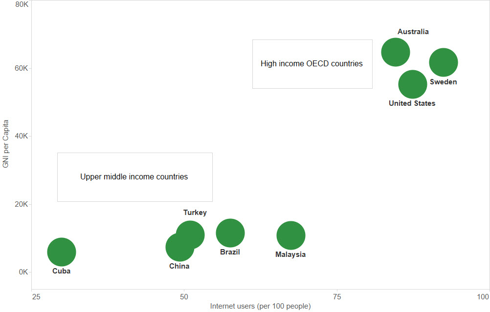

---
Pr-id: Publications
P-id: Theory on Demand
A-id: 18
Type (formerly called Item): book 
Book-type: anthology
Anthology item: article
Item-id: 
Article-title: Geoblocking and Global Video Culture
Article-status: accepted
Author: Ramon Lobato, James Meese, Juan Llamas-Rodriguez, Cameran Ashraf, Marketa Trimble, Adam Rugg, Florian Hoof, Roland Burke, Jinying Li, Çiğdem Bozdağ, Chris Baumann, Aneta Podkalicka, Chris Baumann, Sandra Hanchard, Vanessa Mendes Moreira de Sa, Hadi Sohrabi, Fidel Alejandro Rodriguez, Evan Elkins.
Author-email: rlobato@swin.edu.au, James.Meese@uts.edu.au
Author-bio:
Abstract:   short description of the article (100 words)
Keywords:   50 keywords for search and indexing
Rights: Creative Commons Attribution-NonCommercial-ShareAlike 4.0 International (CC-BY-NC-SA 4.0)
...

The following chapters focus on ground-level internet circumvention practices – how people around the world negotiate different kinds of blocks, including both commercial geo-blocking and government censorship. Together, these chapters reveal that the use of VPNs, proxies, and other workarounds is now a global phenomenon, even though tools and habits vary from country to country. 

Our comparison of nine countries – China, Australia, Turkey, Sweden, Malaysia, Brazil, Iran, Cuba and the United States – illuminates some of the continuities and specificities of global circumvention. As we will see, each region has its own mix of drivers and practices. In some parts of the world, circumvention is mostly driven by demand for first-release entertainment content. In other countries it is about gaining access to social networks or communication tools that have been blocked by the government. But in all cases, the use of circumvention software, apps and plugins changes the official geography of video access. The authors in this section tell richly detailed stories about these circumvention practices and discuss their implications for how digital media circulate today.

*Average connection speed (Mbps). Data source: Akamai State of the Internet Report Q4 2014*

*Internet users per 100 people. Data source: The World Bank*

*Figure 3 ...*

