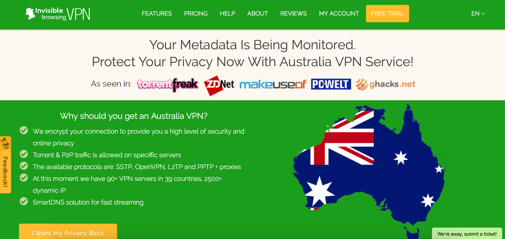

---
Pr-id: Publications
P-id: Theory on Demand
A-id: 18
Type (formerly called Item): book 
Book-type: anthology
Anthology item: article
Item-id: 
Article-title: Geoblocking and Global Video Culture
Article-status: accepted
Authors: Ramon Lobato, James Meese, Juan Llamas-Rodriguez, Cameran Ashraf, Marketa Trimble, Adam Rugg, Florian Hoof, Roland Burke, Jinying Li, Çiğdem Bozdağ, Chris Baumann, Aneta Podkalicka, Chris Baumann, Sandra Hanchard, Vanessa Mendes Moreira de Sa, Hadi Sohrabi, Fidel Alejandro Rodriguez, Evan Elkins.
Author-email: rlobato@swin.edu.au, James.Meese@uts.edu.au
Author-bio:
Abstract: Video platforms like Youtube, IPlayer, DailyMotion, Netflix, Periscope and Youku use geoblocking to filter international audiences. Geoblocking and Global Video Culture examines the geography of video streaming across different cultures. Studying the linkages between various blocking and circumvention practices and the tactics people use to get around them. The research decodes the approach to geoblocking in various countries like China, Iran, Malaysia, Turkey, Cuba, Brazil, USA, Sweden and Australia, by analyzing how different users negotiate geoblocking and internet filtering controls. This collection of essays offer a series of distinctive stories about this fast-changing and complex issue. Keywords:internet censorship, copyright, Institute of Network Cultures, video distribution, public sphere, proxy filtering, P2P file-sharing, territorialisation, geographies of control, surveillance, VPN, connectivity, anonymity, IP-address, digital infrastructure, USA, China, Sweden, Turkey, Australia, Malaysia, Brazil, Iran, Cuba, piracy, privacy, streaming aggregation platforms, mobile video culture, authorized and unauthorized channels, site-blocking, circumvention practices 
Rights: Creative Commons Attribution-NonCommercial-ShareAlike 4.0 International (CC-BY-NC-SA 4.0)
Font(s) used: Open Sans
...

#Australia: Circumvention Goes Mainstream 

###Ramon Lobato and James Meese

- 18%: proportion of Australians who use VPNs or proxies to access the
internet
- 200,000: estimated number of unauthorised Netflix subscribers in
Australia, as of late 2014
- \$25- \$134: Monthly cost of a Foxtel pay-TV subscription, in A\$
- \$15-\$20: Monthly cost of a US Netflix subscription and VPN, in A\$

>‘You’ve all got VPNs anyway. All of you appear to be somewhere in Iowa
when you go online ... I know that ... anyway, I won’t go on.’ –
Australia’s former Minister for Communications (and current Prime
Minister), Malcolm Turnbull, in 2014

Over the last decade Australia has become an unlikely hotspot of
circumvention activity. Frustrated by the high cost and slow delivery of
first-release TV and movies from the United States – and by their own
self-perceived status as ‘second-class’ media citizens – Australians
have taken to offshore streaming with a singular enthusiasm, signing up
for VPNs and proxy services and using them to access US Netflix, Hulu,
HBO Now, and BBC iPlayer. Unlike many nations in the Asia-Pacific
region, where circumvention has an overtly political dimension, the
conversation in Australia has revolved substantially around access to
entertainment rather than privacy, surveillance or censorship. Many
Australians have acquired a working knowledge of circumvention tools
simply because they were unable to watch episodes of their favourite
television shows quickly and legally.

Take for example *Game of Thrones* and *House of Cards*, which have
become massively popular in Australia thanks to unauthorised streaming
and torrenting*.* When these shows first aired here they were only
available as part of expensive packages with the pay-TV provider Foxtel.
In the case of *Game of Thrones*, episodes were initially screened up to
a week after their U.S. premiere (only later did they screen
simultaneously, after a subscriber backlash). *House of Cards* was
likewise locked to a pay-TV bundle, as Netflix was unavailable in
Australia until 2015 and had sold the rights to Foxtel in the interim.
Relatively few Australians watched these shows through the authorised
channels, yet everyone seemed to have seen the latest episodes. How? The
answer is directly related to the boom in popular circumvention, along
with a longstanding national fondness for Bit Torrent. During the last
few years Australian tech websites have been abuzz with tips and tricks
on how to evade geoblocks; DNS routing services like Getflix and
UnblockUS have attracted many Australian subscribers; and VPN brands
like HideMyAss and Witopia have almost become household names. A complex
informal apparatus for accessing digital content has become normalised
among the early adopters and TV junkies that drive consumer technology
adoption in Australia. In these circles, VPN- and proxy-enabled
streaming has become a mainstream pastime – the polite alternative to
Bit Torrent.

These early adopters are brazen about their circumvention. Most argue
that they have a right to access content if it is not available legally
and in a timely fashion, or if they feel they have to pay too much for
it. The Australian conversation on circumvention has been firmly
grounded in this discourse of audience rights. But there is more to the
story, as in recent years the geoblocking and access questions have
become inextricably linked to a wider set of policy debates concerning
Australia’s economic future and national self-image. As we will see,
geoblocking and circumvention are evolving into first-order political
issues, attracting the attention of parliamentarians, competition
regulators, consumer groups and rights-holders, and overlapping with
discussions around copyright protection, global governance, and tax
evasion. In other words, they are trigger points for a wider
conversation about Australia’s place in the world.

##Australian screen culture and the politics of distance

To understand the effects of geoblocking in Australia, we must first
consider the national broadcast system and how it has evolved over time.
There are three commercial free-to-air stations in Australia – Seven,
Nine and Ten – and two public-service broadcasters – the ABC (Australian
Broadcasting Corporation) and SBS (the Special Broadcasting Service, a
multicultural broadcaster). Each of these free-to-air stations has
additional digital multi-channels (ABC2, ABC3 and so on).
Government-mandated quotas on commercial channels require at least 55%
of prime-time programming to be locally produced, with the rest mostly
imported from the US and UK.

As noted, Australia does not have a strong tradition of cable and
satellite TV. There is only one pay-TV provider, Foxtel, which reaches
around a third of Australian households and has long been struggling to
grow its market share. Accustomed to free-to-air broadcasting,
Australians are generally uncomfortable with the idea of direct payments
for TV content.

Australian screen culture has also been strongly influenced by the
nation’s geography and politics. Australia is a huge and mostly
uninhabited island, almost as big as Europe, but with a much smaller
population (23 million). Its nearest neighbour is Papua New Guinea; New
Zealand is over a thousand kilometres away. There is no tradition of
cross-border satellite television here, as in Europe or the Middle East.
A colonial broadcast model endures in the development of the national
public-service broadcaster, the ABC (it was modelled on the BBC
template, with news presenters trained to speak in the Queen’s English,
and BBC content featuring prominently on this station well into the
twenty-first century). Australia’s post-war turn towards the United
States was reflected in our status as a high-margin English-language
export market for American content.

Imported movies and TV shows are subject to long delays. As Jock Given,
Rosemary Curtis and Marion McCutcheon note, ‘it was common for
Australians to wait 3-5 months to see US blockbusters in their
cinemas’.[^10LobatoandMeeseAustralia_1] Television programs were just as slow to arrive, due to
the U.S. premiere season occurring at the same time as the Australian
summer holiday season. Local networks preferred to hold over this
imported content until the official local ratings season started after
the summer break. Consequently, delays of several months – and sometimes
years – were common.

In the past this time-lag was not a huge problem. Australians had few
other alternatives and were generally content to wait. But the internet
has changed all that. Local audiences are hooked into global TV fandom
in real-time through Twitter, internet forums and fan websites. They
know what is happening in the US and refuse to wait for the latest
episodes. Broadcasters have tried to reduce these delays where possible,
with many shows now fast-tracked from the US. But these are the
exceptions that prove the rule. In the current licensing and advertising
environment Australian broadcasters simply cannot get content to air
quickly enough to satisfy audiences, who turn to Bit Torrent and VPNs as
a way around the time lag.

Making matters worse is the problem of pricing. Digital content is
invariably more expensive in Australia than overseas when purchased
through iTunes and other online services. According to the consumer
group Choice, Australian viewers of *The Walking Dead*, 'will be paying
up to 376% more than people watching the same show in the United
Kingdom'.[^10LobatoandMeeseAustralia_2] This discrepancy, known colloquially as the ‘Australia
tax’ has been a major topic of public discussion. Dissatisfaction about
digital pricing has become a rallying cry for Australian early adopters
who increasingly see themselves as ‘second-class’ media citizens, who
are ‘fed on a diet of geo-blocking, slow content delivery and price
gouging’.[^10LobatoandMeeseAustralia_3] This adds fuel to the fire of consumer resentment, and
provides a rhetorical justification for piracy and geo-hacking.

##Geoblocking and Cultural Nationalism

By 2012 geoblocking had become a political issue. Sensing the mood of
the public, Australian regulators were questioning the
price-discrimination policies of U.S. tech companies and asking why our
media and software products were more expensive than they needed to be.
Opportunistic politicians started to see geoblocking as a popular issue,
one that enabled a nationalist narrative (US-based multinationals
ripping off Australians) to be fused with a free-market narrative
(geoblocking as anti-competitive). In other words, it was a vote-winner.
As Labor MP Ed Husic put it,

> For too long, businesses and consumers have asked: why does it
> sometimes cost up to 80 per cent more to simply download software in
> Australia compared to overseas… No one doubts that IT firms should be
> able to recover legitimate costs but the Australian consumer shouldn’t
> shoulder an unfair share of the pricing load.[^10LobatoandMeeseAustralia_4]

The level of disquiet was such that the government announced a
Parliamentary Inquiry into the ‘Australia tax’ in 2012. Its final report
included some remarkable recommendations, including abolishing all
parallel-import restrictions, amending the 1968 Copyright Act to allow
lawful circumvention of geoblocking, and educating consumers about how
to use VPNs effectively.[^10LobatoandMeeseAustralia_5] The report even floated the possibility, as
an ‘option of last resort’, of a government ban on geoblocking. Although
none of these recommendations have been actioned, the report was widely
seen as tantamount to an official endorsement of circumvention. As a
Choice representative said during the hearings, ‘Look, if businesses
want to set up virtual walls to make Australians pay higher prices, then
we think Australians have every right to use legitimate means to climb
those walls, to knock them down, to get around them’.[^10LobatoandMeeseAustralia_6]

At this point, it is worth noting that this strong political push for
equitable pricing did not come out of nowhere. Australians have had to
pay a higher price for cultural goods for much of the twentieth century.
The country’s geographic isolation means higher shipping costs, lower
levels of competition, and, in many cases, price gouging by media
companies and publishers. Many incumbents have also been protected by legislative bans on parallel-importing cheaper goods from
overseas, keeping prices artificially high. While these parallel import
bans have been partly dismantled since the 1990s – imports of CDs are
now permitted, reducing what were previously ‘exceptionally high’ prices
for recorded music[^10LobatoandMeeseAustralia_7] – protectionist measures remain in other sectors.
There is still no broad provision to allow for the parallel importation
of books into Australia, which means that in addition to being charged
higher prices Australians have had to deal with the late publication of
new releases and shops regularly running out of stock.[^10LobatoandMeeseAustralia_8] This history
of geographic price discrimination is one reason why the practice of
geoblocking carries such cultural resonance for Australian consumers.

Indeed, it is partly due to the historical weight of these debates
around parallel importation that the issue of digital content
availability has such traction in Australia. With government officials
and consumer advocates singing from the same songbook, circumvention of
geoblocking has become a quasi-sanctioned practice. This state of
affairs arguably reflects the inequities of digital media geography,
with Australian consumers often facing significant pricing differentials
for the same products and companies regularly providing little or no
justification in response to complaints about the practice. But over
time these pricing issues have unfortunately become intertwined with
other discourses about foreign services and offshore ‘competition’,
leading to a situation where many Australians now see themselves as
victims of cultural globalization. A politics of resentment has taken
hold, tinged with nationalist overtones. Its central figure: the
ripped-off Aussie consumer.

##The VPN Explosion

Renewed attention to the parallel-import issue has naturally drawn
attention to geoblocking. Taking a cue from their elected
representatives, Australians have recently begun to sign up for offshore
streaming services in ever-greater numbers, using fake IDs and
location-masking tools. In part this was due to more people using
streaming services generally: internet speeds were rising, catch-up TV
was catching on, and everyone was used to watching TV in their browsers.
From here it was just a small step to hacking into BBC iPlayer, Netflix
and Hulu.

One of the first indicators of a shift came in August 2011 when a
national electronics retailer, Harvey Norman, caused a stir by selling a
product package designed explicitly for geo-circumvention. The product
in question was a set-top box – the McTivia – which came bundled with a
VPN subscription. ‘Stream direct from the USA!’, promised the marketing
material. ‘\[T\]ailor your home entertainment system to meet your
lifestyle and gain access to a global library of previously
geographically restricted media direct to your TV.’ A minor scandal
followed after the national newspaper *The Australian* picked up the
story, and Harvey Norman insisted that it did not mean to promote
geo-hacking.[^10LobatoandMeeseAustralia_9]

Detailed how-to guides also began to appear on Australia tech websites.
Forums overflowed with tips about which VPN had the best download speeds
or customer service. National newspapers buzzed with reports of 200,000
unauthorised Netflix subscribers in Australia. Tech journalists openly
instructed their readers on the finer points of VPN and proxy use,
proclaiming the benefits of browser plugins like MediaHint and Hola. On
tech websites, such as Gizmodo, Whirlpool and ITNews, the discussion
about circumvention was even more ubiquitous, and unapologetic.

This was the tip of the iceberg. By now, thousands of Australian
households had taken up personal VPNs and proxies. In research we
conducted during 2013 with Swinburne University’s World Internet
Project, a biannual telephone survey of 1000 Australian users, it
emerged that 18% of Australian internet users use VPNs or proxies – a
much higher figure than expected.[^10LobatoandMeeseAustralia_10] While some of this usage was
business-related, it still represents a remarkably high level of
familiarity with what were formerly obscure networking tools. A
follow-up study by Essential Research in 2015 produced similar findings,
suggesting that 16% of Australians have used VPNs or Tor.[^10LobatoandMeeseAustralia_11]

Australia’s then-Communications Minister and current Prime Minister
Malcolm Turnbull – a former internet entrepreneur known for his
early-adopter habits – summed up the general mood when he addressed a
crowd at a Govhack event in 2014. ‘You’ve all got VPNs anyway,’ he
laughed. ‘All of you appear to be somewhere in Iowa when you go online
... I know that ... anyway, I won’t go on.’ For a Minister to joke about
mass-scale internet circumvention in this way would in other
circumstances appear unusual. In Australia, it is now par for the
course.

##Governing Circumvention

Running through this debate about geoblocking are several unresolved
legal and policy issues. One of these is the uncertain legal status of
VPNs as circumvention tools.

There is no clear consensus as to whether or not using VPNs to access
offshore content infringes Australian copyright law. When he was
Communications Minister, Turnbull stated that circumventing geoblocking
in order to access content was not illegal under the Australian
Copyright Act – but rights-holder groups such as the Australian
Copyright Council disagree.[^10LobatoandMeeseAustralia_12] Some media producers have even called
for the government to legislate against unauthorized VPN use.[^10LobatoandMeeseAustralia_13] Legal
scholar Nic Suzor has examined the issue, and concluded that VPN-enabled
geo-circumvention is primarily a contractual issue between users and
platforms, but that it ‘might technically be an infringement of
copyright under Australian law, and there is a small possibility that it
might be a crime under Australian law as well’.[^10LobatoandMeeseAustralia_14] In other words,
this is a grey area of the law.

This legal uncertainty is an issue because it is clouding the Australian
public’s understanding of VPNs, which can of course be used for many
purposes unrelated to geo-evasion. In the wake of hacking scandals and
daily reports of cybercrime, VPN use is being promoted by consumer and
technology advocates as a way to stay safe online – an act of
responsible cyber-citizenship. VPN use is also being recommended as an
antidote to Australia’s controversial metadata retention law, the
Telecommunications (Interception and Access) Amendment (Data Retention)
Act 2015, which has just come into effect. This law requires ISPs and
telcos to retain logs of customer activity, NSA-style, for two years.
Unsurprisingly there has been massive public backlash against this data
retention regime, and VPN services are an appealing counter-measure.
Savvy VPN companies such as PureVPN and IBVPN, now promote themselves to
Australian users on this basis (see Figure 1).

Figure 1. Australia-specific VPN marketing. Source:  [http://www.ibvpn.com/australia-vpn-service/](http://www.ibvpn.com/australia-vpn-service/)

Recent developments in copyright law also bear directly on VPNs. In June
2015 federal legislation was passed that gives judges the power to block
access to pirate websites such as The Pirate Bay. While the law is
expected to mostly target file-sharing and streaming sites, the initial
wording of the law was vague and many consumer groups feared that
websites for VPN services could be blocked too. In the end the
government was forced to add an Explanatory Memorandum specifying that
the blocking should not apply to VPNs ‘that are promoted and used for
legitimate purposes, or merely used to access legitimate copyright
material distributed in a foreign geographic market’. But given that the
marketing practices adopted by many VPNs are not always legitimate,
there is still some ambiguity here. All this is happening at the same
time that the Government is trying to introduce a new internet industry
Code of Practice – a three-strikes graduated response scheme in which
repeat offenders receive infringement notices. Like the metadata law,
the three-strikes Code is likely to further increase demand for VPNs as
an identity-masking tool for P2P users. In this complex game of
whack-a-mole, public awareness of VPNs, proxies and other circumvention
tools is always on the rise.

##The Coming of Netflix

Another recent development is the launch in March 2015 of Netflix’s
Australian service. For the first time Australians can now access an
authorised, local version of the service, which should in theory reduce
the appeal of geo-hacking. However, due to existing licensing agreements
and limited investment in local content acquisition, the local Netflix
has a much smaller library. Only 1116 streaming titles were available at
launch, compared to 7000 in the United States. This is a sore point for
Australian consumers, and it has attracted a lot of media attention.

What does the arrival of Netflix mean for geoblocking and circumvention?
There are two contrasting implications here. On the one hand, there is
broad agreement that Netflix Australia has been a success: subscriber
numbers have been strong and Australians for the first time seem happy
to pay for TV. So in theory this should reduce both piracy and
circumvention. On the other hand, widespread awareness of the catalogue
disparity has stirred resentment and is fuelling a different kind of
circumvention – a kind of transnational ‘shopfront-hopping’ by paid-up
Netflix subscribers, which is considered to be a much more unthreatening
act of middle-class consumer rebellion. So, just as one driver for VPN
use disappears, another appears in its place. Consequently, it seems
reasonable to assume that geo-circumvention activity will be a feature
of Australian digital media consumption for some time to come.

The geoblocking issue has also become entwined with a sometimes heated
debate about taxation. In May 2015 the former Australian treasurer, Joe
Hockey, announced a ‘Netflix tax’ – a tax on offshore digital services
operating in Australia, designed to bring foreign over-the-top services
into line with local services that must by law charge a 10% Goods and
Services Tax. This policy was designed to boost the national coffers
while mollifying nervous Australian media moguls who have been
clamouring for government protection against foreign streaming services
(for example, Presto, owned by Foxtel and Seven West Media, and Stan,
owned by Fairfax Media and FTA broadcaster Nine, already argue that
Netflix’s GST-free status constitutes an unfair commercial advantage).
But the Netflix Tax had another political advantage for the government.
It played neatly into the narrative that both sides of Australian
politics have been pushing – that tax-dodging multinationals are ripping
off Australian consumers and citizens.

Looking ahead, one issue to watch is the relationship between internet
privacy and consumer advocacy. Historically, Australia does not have a
strong tradition of constitutional privacy protections unlike Europe and
the United States, and public discussion of surveillance and privacy is
somewhat muted by comparison. Yet the rise of VPNs seems to constitute
something of a turning point where privacy, anonymity and media
consumption are now fused together as a public controversy for the first
time. Many Australians already have a strong familiarity with the use of
VPNs to torrent safely and avoid geoblocking, so it is likely that there
will be some spill over into other privacy-related uses.

As we have seen in this chapter, in the wake of the Snowden revelations
these practices now appear to be spreading beyond early adopters and
geeks to include a certain subset of more mainstream users – exactly the
same community who are the biggest fans of streaming and download media.
Know-how relating to DIY internet privacy and anonymity circulates
widely among these users. Here again, a link between consumption and
citizenship is evident, as Australian consumers’ impatient desire for
the latest thing feeds directly into an understanding of digital
citizenship. The end result is something quite unexpected: the
mainstreaming of DIY privacy protection and anonymization as everyday
practices among a substantial minority of the population.

##References

‘Choice tells Australians to become digital smugglers’, ABC Radio *AM*
program, 23 March 2013,
[http://www.abc.net.au/news/2013-03-23/choice-tells-australians-to-become-digital/4590164](http://www.abc.net.au/news/2013-03-23/choice-tells-australians-to-become-digital/4590164).

Australian Copyright Council, information sheet G127v01, ‘Geo-blocking,
VPNs & Copyright’, July 2015.

Australian House of Representatives Standing Committee on Infrastructure
and Communications. ‘At what cost? IT Pricing and the “Australia tax”’,
The Parliament of the Commonwealth of Australia, 2013.

Cartwright, Madison. ‘Australians pay more’, *Choice*, 13 October 2014,
[https://www.choice.com.au/electronics-and-technology/internet/using-online-services/articles/digital-pricing-and-the-australia-tax](https://www.choice.com.au/electronics-and-technology/internet/using-online-services/articles/digital-pricing-and-the-australia-tax).

Christensen, Nic. ‘Harvey Norman Mulls Next Move after Questions on Sale
of McTivia’, *The Australian*, 12 September 2011.

Given, Jock, Rosemary Curtis and Marion McCutcheon. *Cinema in
Australia: An Industry Profile*, Melbourne: The Swinburne Institute,
2012.

Gregory, Mark. ‘Turnbull's piracy crackdown and the fate of VPNs’,
*Technology Spectator*, 21 April 2015,
[http://www.businessspectator.com.au/article/2015/4/21/technology/turnbulls-piracy-crackdown-and-fate-vpns](http://www.businessspectator.com.au/article/2015/4/21/technology/turnbulls-piracy-crackdown-and-fate-vpns).

Larsson, Stefan et al. ‘Law, Norms, Piracy and Online Anonymity:
Practices of De-identification in the Global File Sharing Community’,
*Journal of Research in Interactive Marketing* 6.4 (2012): 260-280.

Lobato, Ramon and Scott Ewing. ‘Unlocking the Geoblock: Australians
Embrace VPNs’, *The Conversation*, October 2 2014,
[https://theconversation.com/unlocking-the-geoblock-australians-embrace-vpns-32373](https://theconversation.com/unlocking-the-geoblock-australians-embrace-vpns-32373).

Richardson, David. ‘Copyright and Monopoly Profits: Books, Records and
Software’, Current Issues Brief 15, 1996, The Parliament of Australia,
[http://www.aph.gov.au/About\_Parliament/Parliamentary\_Departments/Parliamentary\_Library/Publications\_Archive/CIB/CIB9697/97cib15](http://www.aph.gov.au/About\_Parliament/Parliamentary\_Departments/Parliamentary\_Library/Publications\_Archive/CIB/CIB9697/97cib15).

Suzor, Nicolas. ‘Using a VPN to Access Netflix: Is it Legal?’,
*NicSuzor.Net*, July 22, 2013,
[http://nic.suzor.net/2013/07/22/using-a-vpn-to-access-netflix-is-it-legal/](http://www.aph.gov.au/About\_Parliament/Parliamentary\_Departments/Parliamentary\_Library/Publications\_Archive/CIB/CIB9697/97cib15).

[^10LobatoandMeeseAustralia_1]: Jock Given, Rosemary Curtis and Marion McCutcheon, *Cinema in
    Australia: An Industry Profile*, Melbourne: The Swinburne Institute,
    2012, p. 3.

[^10LobatoandMeeseAustralia_2]: Madison Cartwright, ‘Australians pay more’, *Choice*, 13 October
    2014,
    [https://www.choice.com.au/electronics-and-technology/internet/using-online-services/articles/digital-pricing-and-the-australia-tax](../customXml/item1.xml).

[^10LobatoandMeeseAustralia_3]: Mark Gregory, ‘Turnbull's piracy crackdown and the fate of VPNs’,
    *Technology Spectator*, 21 April 2015,
    [http://www.businessspectator.com.au/article/2015/4/21/technology/turnbulls-piracy-crackdown-and-fate-vpns](numbering.xml).

[^10LobatoandMeeseAustralia_4]: See [http://www.edhusic.com/it-pricing-inquiry-to-go-ahead/](http://www.edhusic.com/it-pricing-inquiry-to-go-ahead/).

[^10LobatoandMeeseAustralia_5]: ‘At what cost? IT Pricing and the “Australia tax”’, Australian
    House of Representatives Standing Committee on Infrastructure and
    Communications, The Parliament of the Commonwealth of Australia,
    2013.

[^10LobatoandMeeseAustralia_6]: ‘Choice tells Australians to become digital smugglers’, ABC Radio
    *AM* program, 23 March 2013,
    [http://www.abc.net.au/news/2013-03-23/choice-tells-australians-to-become-digital/4590164](http://www.abc.net.au/news/2013-03-23/choice-tells-australians-to-become-digital/4590164).

[^10LobatoandMeeseAustralia_7]: David Richardson, ‘Copyright and Monopoly Profits: Books, Records
    and Software’, Current Issues Brief 15, 1996, The Parliament of
    Australia,
    [http://www.aph.gov.au/About\_Parliament/Parliamentary\_Departments/Parliamentary\_Library/Publications\_Archive/CIB/CIB9697/97cib15]( http://www.aph.gov.au/About\_Parliament/Parliamentary\_Departments/Parliamentary\_Library/Publications\_Archive/CIB/CIB9697/97cib15).

[^10LobatoandMeeseAustralia_8]: Books can be legally parallel imported in specific circumstances
    to fill market gaps. For example, if an order for a book is not
    filled within ninety days by the copyright holder or licensee.

[^10LobatoandMeeseAustralia_9]: Nic Christensen, ‘Harvey Norman Mulls Next Move after Questions on
    Sale of McTivia’, *The Australian*, 12 September 2011.

[^10LobatoandMeeseAustralia_10]: Ramon Lobato and Scott Ewing, ‘Unlocking the Geoblock:
    Australians Embrace VPNs’, *The Conversation*, October 2 2014,
    [https://theconversation.com/unlocking-the-geoblock-australians-embrace-vpns-32373](https://theconversation.com/unlocking-the-geoblock-australians-embrace-vpns-32373.).

[^10LobatoandMeeseAustralia_11]: These usage levels are broadly in line with other early-adopter
    countries. In Sweden, for example, VPNs are used by 18% of the
    population. See Stefan Larsson et al, ‘Law, Norms, Piracy and Online
    Anonymity: Practices of De-identification in the Global File Sharing
    Community’, *Journal of Research in Interactive Marketing* 6.4
    (2012): 260-280.

[^10LobatoandMeeseAustralia_12]: See information sheet G127v01, ‘Geo-blocking, VPNs & Copyright’,
    Australian Copyright Council, July 2015.

[^10LobatoandMeeseAustralia_13]: Nick Murray, the managing director of TV producer Cornell Jigsaw
    Zapruder argues that these tools inhibit the ability of these
    companies to sell the same content to different regions, which is
    how ‘they make \[their\] money’. See
    [http://mumbrella.com.au/cjz-boss-calls-for-a-clampdown-on-australians-using-vpns-to-access-content-287634](http://mumbrella.com.au/cjz-boss-calls-for-a-clampdown-on-australians-using-vpns-to-access-content-287634).

[^10LobatoandMeeseAustralia_14]: Nicolas Suzor, ‘Using a VPN to Access Netflix: Is it Legal?’,
    *NicSuzor.Net*, July 22, 2013,
    [http://nic.suzor.net/2013/07/22/using-a-vpn-to-access-netflix-is-it-legal/](http://nic.suzor.net/2013/07/22/using-a-vpn-to-access-netflix-is-it-legal/).
