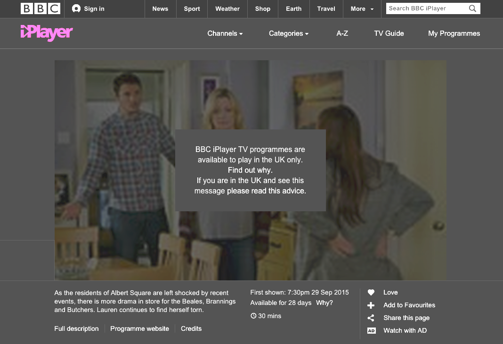

---
Pr-id: Publications
P-id: Theory on Demand
A-id: 18
Type (formerly called Item): book 
Book-type: anthology
Anthology item: article
Item-id: 
Article-title: Geoblocking and Global Video Culture
Article-status: accepted
Authors: Ramon Lobato, James Meese, Juan Llamas-Rodriguez, Cameran Ashraf, Marketa Trimble, Adam Rugg, Florian Hoof, Roland Burke, Jinying Li, Çiğdem Bozdağ, Chris Baumann, Aneta Podkalicka, Chris Baumann, Sandra Hanchard, Vanessa Mendes Moreira de Sa, Hadi Sohrabi, Fidel Alejandro Rodriguez, Evan Elkins.
Author-email: rlobato@swin.edu.au, James.Meese@uts.edu.au
Author-bio:
Abstract: Video platforms like Youtube, IPlayer, DailyMotion, Netflix, Periscope and Youku use geoblocking to filter international audiences. Geoblocking and Global Video Culture examines the geography of video streaming across different cultures. Studying the linkages between various blocking and circumvention practices and the tactics people use to get around them. The research decodes the approach to geoblocking in various countries like China, Iran, Malaysia, Turkey, Cuba, Brazil, USA, Sweden and Australia, by analyzing how different users negotiate geoblocking and internet filtering controls. This collection of essays offer a series of distinctive stories about this fast-changing and complex issue. Keywords:internet censorship, copyright, Institute of Network Cultures, video distribution, public sphere, proxy filtering, P2P file-sharing, territorialisation, geographies of control, surveillance, VPN, connectivity, anonymity, IP-address, digital infrastructure, USA, China, Sweden, Turkey, Australia, Malaysia, Brazil, Iran, Cuba, piracy, privacy, streaming aggregation platforms, mobile video culture, authorized and unauthorized channels, site-blocking, circumvention practices 
Rights: Creative Commons Attribution-NonCommercial-ShareAlike 4.0 International (CC-BY-NC-SA 4.0)
Font(s) used: Open Sans

Copyright 2015 Steve Matteson & GoogleFonts

Licensed under the Apache License, Version 2.0 (the "License");
you may not use this file except in compliance with the License.
You may obtain a copy of the License at

    http://www.apache.org/licenses/LICENSE-2.0

Unless required by applicable law or agreed to in writing, software
distributed under the License is distributed on an "AS IS" BASIS,
WITHOUT WARRANTIES OR CONDITIONS OF ANY KIND, either express or implied.
See the License for the specific language governing permissions and
limitations under the License.
...

# colophon

Theory on Demand #18  
**Geoblocking and Global Video Culture**

**Editors:** Ramon Lobato and James Meese 
**Copy-editing:** Leonieke van Dipten 
**Editorial support:** Miriam Rasch 

**Cover Design:** Katja Stiphout 
**DTP:** Leonieke van Dipten 
**Infographics:** Sandra Hanchard  
**EPUB development:** Leonieke van Dipten, Gottfried Haider  
**Infographics:** Sandra Hanchard

**Printer:** Print on Demand 
**Publisher:** Institute of Network Cultures, Amsterdam, 2015 
**ISBN:** 978-94-92302-03-8  

**Contact**

Institute of Network Cultures  
Phone: +3120 5951865 
Email: info@networkcultures.org 
Web: <http://www.networkcultures.org> 

This publication is available through various print on demand services.
For more information, and a freely downloadable PDF:
<http://networkcultures.org/publications> 
This publication is licensed under the Creative Commons Attribution-NonCommercial-NoDerivatives 4.0 International (CC BY-NC-SA 4.0). 

# Contents

<a href="ch004.xhtml">**Introduction: The New Video Geography**</a> 
*Ramon Lobato* 

##PART I: PERSPECTIVES ON GEOBLOCKING

<a href="ch006.xhtml">**Tunneling Media: Geoblocking and Online Border Resistance**</a> *Juan Llamas-Rodriguez* 

<a href="ch007.xhtml">**The Logics and Territorialities of Geoblocking**</a>  *Cameran Ashraf and Luis Felipe Alvarez León* 

<a href="ch008.xhtml">**Geoblocking, Technical Standards and the Law**</a> *Marketa Trimble* 

<a href="ch009.xhtml">**Periscope, Live Streaming and Mobile Video Culture**</a> *Adam Rugg and Ben Burroughs*

<a href="ch010.xhtml"> **Circumvention, Media Sport and the Fragmentation of Video Culture**
</a> *James Meese and Aneta Podkalicka*

<a href="ch011.xhtml">**Live Sports, Piracy and Uncertainty: Understanding Illegal Streaming
Aggregation Platforms**</a> *Florian Hoof*

<a href="ch012.xhtml">**The Future in a Vault of Plastic: Physical Geolocking in the Era of the 16-bit Video Game Cartridge, 1988 - 1993**</a> *Roland Burke*

##PART II: CIRCUMVENTION CASE STUDIES 

<a href="ch014.xhtml"> **China: The techno-politics of the Wall**</a> *Jinying Li*

<a href="ch015.xhtml">**Australia: Circumvention Goes Mainstream**</a> *Ramon Lobato and James Meese*

<a href="ch016.xhtml">**Turkey: Coping with Internet Censorship**</a> *Çiğdem Bozdağ*

<a href="ch017.xhtml"> **Sweden: Circumvention and the Quest for Privacy**</a> *Chris Baumann*

<a href="ch018.xhtml">**Malaysia: Global Binge-Viewing in a Restrictive State**</a> *Sandra Hanchard*

<a href="ch019.xhtml">**Brazil: Netflix, VPNs, and the 'Paying Pirates'**</a> *Vanessa Mendes Moreira de Sa*

<a href="ch020.xhtml">**Iran: A Friction Between State Ideology and Network Society**</a> *Hadi Sohrabi and Behzad Dowran*

<a href="ch021.xhtml">**Cuba: *Videos to the Left* – Circumvention Practices and
Audiovisual Ecologies**</a> *Fidel Alejandro Rodriguez*

<a href="ch022.xhtml">**United States: Geoblocking in a Privileged Market**</a> *Evan Elkins*

#Preface and acknowledgements

*Geoblocking and Global Video Culture* is the result of a collaborative research experiment we conducted with the contributors to this book. Our aim was to investigate how online blocking and circumvention are shaping access to digital video in different parts of the world, and explore what this means for screen culture today. Together, we set up a comparative research project around some common questions: What tools are people using to access blocked video content in different countries? What kinds of content are they watching? And what is the political context for these circumvention activities? The chapters collected here are the end result of this collaboration, and a corresponding call for papers. The first section of the book explores the dynamics, histories and possible futures of territorial rights control in various media industries, while the second section compares ground-level circumvention practices in nine countries – Australia, Brazil, China, Cuba, Iran, Malaysia, Sweden, Turkey, and the United States. 

Given how fast things move in video culture, a book of this nature cannot be definitive. We wanted instead to produce a timely, transnational account of the geoblocking phenomenon, with a comparative dimension that could speak across diverse local experiences. Rather than dense academic prose, our contributors provide vivid snapshots of user practices and provocative reflections on the relationship between geoblocking, government censorship, circumvention, and copyright. We hope you enjoy the eclectic nature of the collection.

Of course, we could not have undertaken such a task without the support and assistance of numerous colleagues and friends. We would like to thank Leonieke van Dipten, Geert Lovink and Miriam Rasch at Institute of Network Cultures for their enthusiastic support of the project, Karen Horsley for production assistance, and Sandra Hanchard for the maps and data visualizations. We are also indebted to Philip Branch, Angela Daly, Evan Elkins, Scott Ewing, Dan Golding, Jennifer Holt, Grace Lee, Teresa Calabria, Rebecca Olive, Claudy Op Den Kamp, Hal Roberts, Nic Suzor, Leah Tang, Julian Thomas and Patrick Vonderau, among others, for their advice, support and feedback. Finally, we thank Swinburne University of Technology and the Australian Research Council Discovery programme for funding this project.

# Introduction: The New Video Geography

###Ramon Lobato###

This book is about the cultural geography of video streaming. It is
about platforms – YouTube, iPlayer, DailyMotion, Netflix, Periscope,
Youku – and how they manage their international audiences and shape them
into markets. It is about governments, state institutions and
public-service broadcasters, and the technologies they use to regulate
video flows across national borders. It is about users and audiences,
and how they negotiate diverse forms of access and restriction. Above
all, it is about cultural circulation – how different kinds of content
reach dispersed audiences through authorized and unauthorized channels.

As an entry point into these wider issues, contributors to this book
focus on a specific technology of access control: geoblocking.
Geoblocking, a spatially-aware filtering technology that uses IP address
databases to determine a user’s location, has become a key mechanism for
managing international video streaming traffic and maintaining
separation of national media markets. The process is simple: when you
visit a website, your IP address (e.g. 198.8.80.200) is run through a
database to identify your ISP and geographic location, which is then
matched against a blacklist or whitelist to establish access rights. If
you are in an approved location, access is granted and the video
automatically plays. Those outside the authorized zone will likely see a
familiar error message – something like ‘this video is not available in
your region’ – or perhaps an endlessly buffering screen.

Most major video platforms use geoblocking to filter international
audiences. Geoblocking allows these platforms to customise their
offerings according to territory, language, and advertising markets, and
provides an automated mechanism to enforce territorial licensing
arrangements with rights-holders. In this sense it is a form of access
control enacted at the level of content and platform regulation, rather
than network infrastructure.[^01LobatoIntroduction_1] But geoblocking has more subtle effects
as well. Like search localisation and algorithmic recommendation,
geoblocking is a ‘soft’ form of cultural regulation. Its widespread
adoption is changing the nature of the open internet by locating users
within national cyberspaces and customising content based on certain
ideas about territorial markets.

*Geoblocking and Global Video Culture* takes these issues as the basis
for a critical and eclectic discussion of the internet’s changing
cultural geography. Many contributors to this book are screen scholars,
interested in the politics of media globalisation and how this
translates into the digital environment. Other contributors approach the
topic through legal analysis, cultural history, and spatial theory.
Together, these essays offer a series of distinctive stories about a
fast-changing and complex issue. Mixing macro-level insights with
bottom-up accounts of everyday user experience, and moving from Europe
to South America to the Asia-Pacific, the various essays in this book
provide provocative arguments about the cultural implications of the new
video geography.

A major theme of the book is circumvention. As with many digital rights
management technologies, geoblocking systems can be easily tricked. In
recent years the appearance of user-friendly circumvention tools –
including VPNs (virtual private networks), DNS (domain name system)
proxies, web proxies, and location-masking browser extensions – has
unleashed a wave of unauthorised cross-border media activity, allowing
audiences to easily access streaming, news and sports services from
other countries. As we shall soon see, these and other tools are used by
a wide cross-section of users, and for remarkably different purposes. In
exploring these various forms of blockage and circumvention, and the
connections between them, our aim is to tell a different kind of story
about internet blocking beyond the ‘digital divide’ paradigm.

Geoblocking circumvention is closely linked to other issues including
internet governance, censorship, and cultural policy, because the same
privacy tools that can be used to hack into iPlayer or Hulu are in
other contexts used to get around state internet censorship. As
researchers at Harvard University’s Berkman Center for Internet and
Society have documented, global circumvention – encompassing the use of
commercial VPNs, activist-designed tools, simple web proxies and
HTTP/SOCKS proxies – is an activity that involves tens of millions of
internet users worldwide.[^01LobatoIntroduction_2] In Turkey, Iran, China and other nations
where popular video and social networking platforms are regularly
blocked by the state, circumvention is a mainstream practice.

One of our aims in *Geoblocking and Global Video Culture* is to explore
linkages between these various blocking and circumvention practices –
site-blocking, geoblocking, and the tactics people use to get around
them. To this end, we have organized the book into two sections. The
first section, ‘Perspectives on Geoblocking’, probes the historical,
legal and cultural dimensions of geo-location and region control in
media industries. These essays investigate a diverse array of platforms
– from live-streaming apps and illegal streaming websites to the game
consoles of the 1980s – and provide theoretical tools to understand the
evolution of regional lock-out technologies in particular media sectors.
The second section, ‘Circumvention Case Studies’, looks at these issues
from the ground up, by analysing how users negotiate geoblocking and
internet filtering controls in different countries. Here, our nine
contributors – experts on informal media circulation that we have
collaborated with over the course of a year-long research project – have
written vivid first-hand accounts of ground-level circumvention
practices in nine countries: China, Australia, Turkey, Sweden, Malaysia,
Brazil, Iran, Cuba and the United States. Each of these countries has a
different story to tell when it comes to geoblocking, and together these
accounts provide a fascinating snapshot of global circumvention practice
(broadly defined).

To provide a taste of what is to come, I will now introduce three
cross-cutting issues that connect the various essays in this book.
First, I discuss the experience of blockage as a foundational logic of
the internet; second, the history of circumvention technologies and
practices; and third, the relationship between political censorship and
pleasurable consumption, as seen through the lens of geoblocking.

## Blockage and Flow

One of our starting points when developing the idea for this book was
the uncontroversial observation that, for many internet users, the
experience of online video is characterised by blockage rather than
flow. Governments (and ISPs) block internet sites for reasons related to
public policy and political expediency. Media companies use
geo-filtering to screen out undesirable audiences. Poor infrastructure
and choked servers lead to delays, dropouts and buffering. The end
result of these back-end blockages, from the perspective of the
end-user, is that digital video culture becomes a set of unevenly
distributed experiences with a peculiar geography of availability and
unavailability. As Ira Wagman and Peter Urquhart observe, ‘the fact
remains that *where* you access the internet says a lot about *what
kind* of internet you experience’.[^01LobatoIntroduction_3]

This is the messy reality of today’s digital video ecology. Rather than
free flow and instant access, the actually-existing experience from the
user’s perspective typically involves a series of partially-available
platforms that shift and change according to one’s location – a lumpy
landscape of formal and informal services that sometimes work and
sometimes do not, depending on where you are located. Consider the
following examples:

-   YouTube is available in 70 different country-specific versions,
    including dedicated platforms for countries such as Latvia
    and Yemen. But it is blocked in China, Iran, Pakistan and Syria,
    among other countries, and is intermittently unavailable in
    Thailand, Turkey, Bangladesh and Morocco.

-   YouTube also has significantly restricted content in Germany because
    of a long-running copyright dispute with music collecting societies.

-   The Netflix streaming catalog (as of 2016, unblocked everywhere but China) varies markedly between countries, with the availability of movies and TV content reflecting local licensing, copyright and censorship arrangements.

-   Major streaming sites including BBC iPlayer and Hulu are available
    only in their country of origin (the United Kingdom and United
    States, respectively) and are geoblocked everywhere else.

-   The catalogues of ‘global’ services such as Google Play, Amazon and
    iTunes vary widely between countries in terms of the content they
    offer and how much they charge for it, with 40%-50% price
    differentials between countries being a common occurrence.

-   Wealthy countries have abundant local catch-up TV while poorer
    countries have little or none, and rely on piracy as a
    post-broadcast circulatory system.

As this list suggests, video services are fast and free in some
countries but are unavailable or prohibitively expensive in others.
These examples underscore the enduring importance of geography to
digital video culture, reminding us that where we live – or at least
where websites think we live – makes a big difference to how we
experience the digital.

Jack Goldsmith and Tim Wu argue that internet history since the late
1990s can be described as a process of ‘becoming bordered’. ‘The
result,’ they write, ‘is an internet that differs among nations and
regions that are increasingly separated by walls of bandwidth, language,
and filters’.[^01LobatoIntroduction_4] The end result is the fragmentation of the internet
into a series of localised experiences and filtered environments. We are
not just talking here about the infrastructural geography of networks,
according to which some countries and demographics are blessed with
cheap and fast connectivity while others live with dial-up, mobile-only,
or no access at all. Instead, we are referring to an overlapping
political-economic geography of content and service availability, shaped
by market forces, licensing arrangements and state control, and which is
premised on the availability of geo-location databases, geo-caching
services (offered by content delivery networks such as Akamai), and
location-aware credit card processing.

Geolocation technology dates back to the end of the 1990s when the first
tech companies specialising in location detection, such as Infosplit,
began to appear. Up to this point, most websites had only one interface
for all global users. The more sophisticated corporate sites would
customise their offerings based on user-entered information (*Please
select your country/region*). But with the rise of geolocation databases
and third-party location-detection services, it became practical to
automate this process. Now location could be determined by IP address,
with pages detecting your location then loading language- and
territory-specific content to suit. The accuracy of these IP geolocation
systems was sometimes questionable, as many readers will no doubt
remember, and the present system still involves a messy patchwork of
different databases that do not always play well together. But over time
the kinks have been gradually ironed out to a point where IP geolocation
works as intended most of the time.

To the delight of digital advertising companies, content could now be
customised to local markets. Websites could now imagine, understand and
process their customers in geographic market segments, down to their
postcodes (Hulu, for example, boasts it ‘can target \[ads\] by Nielsen
DMA, State or zip code’)[^01LobatoIntroduction_5]. For internet idealists with their dreams
of global connectivity and universal access, this resurgence of physical
geography has been problematic. One widely discussed consequence is that
there is now no such thing as a universal internet – understood as a
stable set of globally available cultural materials – because
customisation means that content and experience change according to
location.

This brings us to television, and to its ongoing metamorphosis into an
online medium. As television becomes a streaming service, delivered over
the internet rather than through the airwaves, it becomes location-aware
(and location-blind) in new ways. IP geolocation now serves a primary
role in determining what content is available where, reconfiguring the
spatial ‘footprints’ and access-control functions familiar to us from
the broadcast model (TV as a local/national medium transmitted over the
airwaves) and through direct-broadcast satellite transmission (TV as a
set of internationally available but locally decoded channels).[^01LobatoIntroduction_6] In
other words, geoblocking becomes a kind of de facto global cultural
policy, shaping the communication environment by making available
certain kinds of materials, while restricting others.

One implication of this new TV landscape is that internet theory and
broadcast history are brought closer together. Approaching the internet
as a localised and unevenly available set of cultural experiences – as
opposed to a global, universal superhighway – reminds us that the
internet, like television, is always locally configured as well as
globally networked. This diversity of institutional forms is noted by
global television scholars, who emphasise that TV production cultures,
advertising systems, and regulatory frameworks still vary significantly
between countries*.* As Graeme Turner and Jinna Tay write in *Television
Studies after TV*, ‘Notwithstanding the internationalization of the
media industries, these days the answer to the question “What is
television?” very much depends on where you are’.[^01LobatoIntroduction_7] Turner and Tay
didn’t have geoblocking in mind when they wrote that sentence, but they
may as well have. Geoblocking reminds us that geography matters a great
deal to television, and never moreso than in the internet age.

## Control and Circumvention

A second cross-cutting theme in our book is circumvention – the tactics,
tools and workarounds that people use to access blocked video sites. As
our contributors elegantly describe, the geography of blockage and flow
is provisional rather than absolute because internet users have many
ways to work around geographic restrictions. Indeed, IP address
geoblocking is particularly easy to circumvent through basic software
tools – including VPNs, DNS proxies, web proxies, and TOR – which can
unlock geo-restricted content by rerouting data through an offshore IP
address, making it appear as though the user is located in another
country. In recent years a growing ecology of circumvention tools has
emerged, including free ad-supported services (Hotspot Shield, Hola,
Addtelly), subscription VPNs (Private internet Access, HotSpotNordVPN,
TigerVPN), and DNS proxies designed explicitly for unlocking offshore
content (Unblock-US, Getflix).

Figure 1. A VPN server selection menu

Figure 2. VPN marketing highlights unblocking functions

Circumvention is a complex topic, because most technologies used for
geoblocking circumvention were not designed for this purpose and have
other, licit functions. For example, VPNs are a popular security tool
with privacy-conscious internet users who want extra protection when
using public wifi networks. Others use VPNs for business-related
networking or to dial into remote servers when working from home. There
is nothing questionable about these activities, which are increasingly
part of mainstream computer use. Indeed, many consumer groups advocate
VPN adoption as a protection measure against hacking and identity theft.
But VPNs are confounding objects for internet governance because they
erode the link between IP address, location and identity. Allowing users
to ‘tunnel’ outside national borders, they offer an ideal workaround for
geoblocking, filtering and site-blocking, while presenting complex
challenges for governments and media corporations.

Our point here is that there are different kinds of circumvention and
proxying practices, associated with different kinds of internet use, and
enabled by different kinds of software tools – and none of these things
can be conflated in a straightforward manner. As Roberts, Zuckerman and
Palfrey write, circumvention needs to be understood as ‘a large topic
that reaches deeply into a number of other large topics, including
filtering, privacy, surveillance, and content neutrality’.[^01LobatoIntroduction_8] While the
focus of this book is on geoblocking circumvention, many contributors in
Section Two of the book also look at site-blocking circumvention,
anonymization, and the links between these practices.

In China, Iran and Turkey, for example, circumvention tools are used
widely because they open up access to YouTube, Twitter, and other
blocked sites. Some of this activity is politically inflected but a lot
of it is simply about social networking. In Australia, Sweden, and
Brazil, in contrast, circumvention is more about access to first-release
movies and TV, and to the expanded streaming catalogues available in the
major markets. Some countries, such as Malaysia, display a mix of these
two tendencies. In all cases, circumvention interfaces with
anonymization and privacy, but not always in predictable ways.

Thinking about circumvention from this perspective makes visible an
array of everyday location-masking practices, from prosaic acts of
access (Chinese teenagers using proxies to log into Facebook and
YouTube, German tourists streaming Euro league matches) through to more
overtly political resistances (as when Turkish activists share proxy
settings in defiance of government internet censorship). So there is a
nexus here between corporate media policies, censorship and
circumvention, which are all linked through the use of informal software
hacks. As our contributors show, this nexus is a rich site for
theorising. In the small-scale tactics of internet circumvention we see
larger stories unfolding about cultural regulation, networked activism,
and cyber-identity.

There are also interesting possibilities here for media historiography,
and for understanding the social shaping of network technologies. Each
piece of circumvention software has its own fascinating and largely
untold history: the VPN, for example, has been around for decades and
was used primarily as a business networking tool until the early 2000s
when it morphed into a personal computing product. Since then hundreds
of small VPN companies have appeared and disappeared (by our count,
there are at least 140 VPN brands in the market). In addition to these
international VPNs, there are also 'local' VPNs running in some
countries, notably Iran, which have Persian-language interfaces and
local payment systems. There is much scepticism as to the bona fides of
these companies, which are seen to be government-linked, but people use
them anyway because they are functional and cheap. In this unusual
state-supervised circumvention practice we see a strange mix of
sanctioned and unauthorised, formal and informal, all blurring together.

Some popular VPNs, such as the British service Hide My Ass, have become
major commercial enterprises. Founded in 2005 by a sixteen year old
high-school student from Norfolk, Jack Cator, Hide My Ass has built
itself into a mainstream privacy brand. Between its current VPN offering
and its older web proxy service – which was tailor-made for kids to get
around social media blocks on school computers – Hide My Ass claims to
have had more than two million customers over the years, with 200,000
paying subscribers currently on the books, and almost 100 staff based in
London, Kiev and Belgrade. This growth has paid off handsomely for
Cator, who in 2015 cashed in and sold his business to the antivirus
company AVG for £40 million.[^01LobatoIntroduction_9]

Browser plug-ins such as Unotelly and Hola Unblocker are another popular
circumvention option. These proxy services are even easier to use than
VPNs: just select a country or platform in the browser menu bar, and
your IP address will be changed accordingly. Unlike VPNs, these are free
services that do not require signup or subscription. But there is
sometimes a hidden cost: the possibility for your IP address to be
hijacked, as Hola users recently discovered when their bandwidth was
loaned out to a third-party company for a botnet attack.[^01LobatoIntroduction_10]
Experiences such as this are common when it comes to free or
ad-supported circumvention tools, especially apps, browsers extensions
and web proxies with questionable business models that aren’t
immediately apparent to the end user. The number of free tools is always
on the rise but the landscape is cluttered with commercial options of
varying legitimacy and security, and the risk of virus and malware
infection is ever-present.

Alongside these commercial products, there are other kinds of
circumvention tools designed explicitly to get around government
censorship. The peer-to-peer proxy service Lantern, for example,
provides a popular way to evade national internet filtering. Lantern
works by linking together users in filtered countries with a trusted
international network of volunteers who share access to their IP
addresses. A mix of start-up, NGO and private company, Lantern is
ostensibly non-profit but somewhat opaque in its ambitions. It has been
funded by the US State Department, reflecting the wider interest in
circumvention technologies as tools of foreign policy.

As these examples suggest, internet circumvention is a space that brings
together a strange mix of actors: activists, governments, entrepreneurs,
criminals, geeks, pirates, school kids, and millions of ordinary people
who wish to be conceal their identity or location temporarily. The
chapters in this book trace out some of these unlikely connections in
rich detail.

## Censorship and Consumption

A third theme in this book is the relationship between market and state
– or more specifically, the relationship between commercial technologies
of access control and government site-blocking, surveillance and
censorship. As we have seen already, from the user’s perspective these
two realities are closely intertwined: the geography of digital markets
is overlaid with a political geography of unavailability. While
technologically distinct, these two control systems need to be
considered in tandem if we are to understand their cultural
ramifications.

Geoblocking and government site-blocking occupy different ideological
terrain. Geoblocking is typically discussed as an issue of access to
markets and services. The paradigm here is consumer rights, rather than
communication or citizenship. Key voices in the debate include early
adopters, TV buffs and groups like the Electronic Frontier Foundation,
all strident critics of geoblocking. In contrast, discussion of
site-blocking tends to occur within a paradigm of internet freedom, and
is typically linked to a discourse of free speech, political liberalism,
communication rights and cyber-liberties.

Internet freedom is based on the idea that digital communication is
inherently liberating and access control is inherently suspect. It tends
to see the world through an ontology of free and unfree countries. A
shortcoming of the internet freedom literature is that it has little to
say about the everyday politics of pleasure and consumption. This realm,
so familiar to media and culture critics, has been absent from the
debate about internet filtering and censorship, which takes as its
prototypical text not the quotidian experience of checking Facebook or
watching a movie but the exceptional experience of political agitation,
activism and resistance. Our book tries very deliberately to work across
this gulf, foregrounding traces of the political in the everyday and
vice versa. As the following chapters demonstrate, there is no clear
distinction between pleasure and politics in internet use.

Does a Chinese VPN user need to be accessing an anti-government news
site for their activities to be considered ‘political’? If they are just
accessing Facebook to catch up with friends, does that matter?
Conversely, what larger political issues surround the seemingly
innocuous acts of everyday consumption enabled by entertainment-related
circumvention in the ostensibly ‘free’ West? What temporary political
affiliations and alliances may be produced in the consumer VPN scene?
These are some of the questions that arise when we think about
consumption and censorship together.

Rather than distinguishing between free and unfree societies, we take as
our departure point the understanding that internet access and cultural
consumption in all nations are shaped by overlapping forms of power,
including both state and market power. We keep an open mind to some of
the larger ethical questions lurking behind the internet freedom
debates, such as whether access in its own right is always unequivocally
a good thing, and whether states have the right to regulate their
national internet space.

We also pay attention to how ideas of internet censorship and
consumption are articulated, valued and debated according to cultural
context. As contributors to this book show, the problem of geoblocking
plays out quite differently in different countries. With the possible
exception of the United States – which, as Evan Elkins shows, is
shielded from the drama of geo-restriction due to its massive media
complex – each country has its own set of policies and priorities around
the geoblocking issue. In Australia and Canada, for example, a consumer
rights discourse prevails, in which the main issue is the timely and
affordable provision of digital content. The debate here is framed
around windowing and discrepant pricing policies, leading to delays and
price hikes for ‘peripheral’ English-language markets. This is what Tama
Leaver calls ‘the tyranny of digital distance’, or the lag between first
release in the center and availability at the edges.[^01LobatoIntroduction_11]

In Europe, the politics of geoblocking are quite different. With its
dense patchwork of languages, borders and diasporas, Europe has long
been a hotbed of unauthorised cross-border media consumption: people
watch satellite TV signals meant for other nations, buy
multiply-subtitled DVDs, and make shopping trips to neighbouring
countries where prices are cheaper. This is an enduring feature of
European consumption, one that has diminished little with the
establishment of a single currency. While much policy attention is now
directed at the creation of an EU Digital Single Market – in which all
28 EU member countries would share common pricing and availability for
digital goods – intra-European variances in price and availability
naturally persist.

Within the European integration project, geoblocking is starting to be
seen by as an anti-competitive – indeed, anti-European – technological
restriction on free trade. Andrus Ansip, the former Estonian prime
minister and current European Commission vice-president, has been
leading the charge. Since 2014, “tackling geoblocking” has been an
official policy priority of the European Commission. Its Digital Single
Market policy reads like a *Lifehacker* post: “Geo-blocking leaves many
Europeans unable to use the online services available in other EU
countries, or redirects them to a local store with different prices…
Such discrimination cannot exist in a single market.”[^01LobatoIntroduction_12] Here we see
the “merely cultural” issue of geoblocking framed quite seriously as a
threat to continental capitalism and its cherished values of free trade,
consumer rights, and smart regulation.

The politics of blockage and flow are different again in China, where a
fast-growing domestic media sector – including a massive digital media
production ecology – is overlaid with a carefully managed state system
of site blocks, filtering and slow-downs, designed to temper demand for
offshore services (especially Facebook and Google) and direct this
inward to the local, regulated alternatives. For China the geoblocking
issue is not so much the unavailability of content; when it comes to
Chinese-language media and services, everything you would need is now
inside the Great Firewall. Instead, it is about how and why certain user
groups feel the need to climb this wall. As Jinying Li’s chapter in this
book evocatively describes, ‘wall crossing’ desire is widespread but
unevenly distributed among the middle classes, and linked in complex
ways to internal governance.

All this represents a new challenge for digital media theory, because it
requires us to rethink some of the paradigms of control and censorship
that we have inherited from earlier periods. Geoblocking, broadly
defined, is a problem for many internet users in many countries, but to
different extents, and for different reasons. It affects rich and poor
alike, but can be circumvented easily for those with money or know-how.
It interacts in complex ways with other kinds of internet phenomena,
such as peer-to-peer piracy.

For example, we can see that the geoblocking issue has relatively little
in common with the paradigm of the ‘digital divide’ that shaped
discussion of the first decades of global internet use. Initially
organised around a binary of use and non-use, with use concentrated in
the developed world and non-use in the peripheries – and later
developing into a more complex theory about the mutually reinforcing
dynamics of class, infrastructure, education and state investment – the
spatial imaginary of the digital divide has limited relevance to the
problem of geoblocking. Nor is geoblocking a simplistic story of
internet freedom versus internet censorship, that Western liberal vision
of a free West against a censorious Rest. The new video geography does
not cleanly follow any of these imaginaries.

As the case studies in the second section of this book show, the rise of
circumvention practices around the world may instead be linked instead
to the emergence of a transnational class who are using circumvention
software for a mix of reasons – not just for “resistance”, nor
exclusively for consumption. This requires a variegated model of both
access and politics. As Sean Cubitt argues, the question of access in
internet culture needs to be understood through multiple registers
simultaneously:

> The network society affords various kinds of access: to the rich
> consumer, video-on-demand (VOD), and to the genuinely wealthy
> subscription or sale models which avoid the dull necessity of paying
> attention to ads. For the Chinese masses, the protection of the Golden
> Shield; for the wealthy, Virtual Private Networks (VPNs) which
> fasttrack past the firewall like express check-in at the airport. For
> the ordinary punter, a data feed from Bloomberg; for the wealthy
> subscriber, real-time data on every stock for sale on every
> market.[^01LobatoIntroduction_13] 

It may be that VPNs, proxies, and other geo-evasion technologies provide
a set of popular technical competencies that are, taken together, laying
the foundations for a global geo-circumvention system. This system
connects politics with pleasure; connects censorship with consumption;
embraces cutting-edge technologies while drawing on longer prehistories
of cross-border arbitrage; and brings activists, file-sharers, hackers
and mainstream users into unlikely and uncomfortable contact with each
other. The politics of circumvention are anything but straightforward,
as our authors illustrate. But in their complexity they provide the
coordinates for a different map of cultural power, and a new way to
think about the geopolitics of internet control.

## References

Christophers, Brett. *Envisioning Media Power: On Capital and
Geographies of Television*, Lanham: Lexington Books, 2009.

Cubitt, Sean. ‘Telecommunication Networks: Economy, Ecology, Rule’,
*Theory, Culture and Society* 31 (2014): 185-199.

Deibert, Ronald et al. (eds). *Access Controlled: The Shaping of Power,
Rights, and Rule in Cyberspace*, Cambridge, MA: MIT Press, 2010.

Deibert, Ronald et al. (eds). *Access Contested: Security, Identity, and
Resistance in Asian Cyberspace*, Cambridge, MA; MIT Press, 2012.

Deibert, Ronald et al. (eds). *Access Denied: The Practice and Policy of
Global Internet Filtering*, Cambridge, MA: MIT Press, 2008.

European Commission, ‘Better Online Access to Digital Services’, n.d.,
[http://ec.europa.eu/priorities/digital-single-market/access/index_en.htm](http://ec.europa.eu/priorities/digital-single-market/access/index_en.htm).

Goldsmith, Jack and Tim Wu. *Who Controls the Internet? Illusions of a
Borderless World*, Oxford: Oxford University Press, 2006.

Kompare, Derek. ‘Adverstreaming: Hulu Plus’, *Flow*, 24 Feb 2014,
[http://flowtv.org/2014/02/adverstreaming-hulu-plus/](http://flowtv.org/2014/02/adverstreaming-hulu-plus/).

Leaver, Tama. ‘Watching “Battlestar Galactica” in Australia and the
Tyranny of Digital Distance’, *Media International Australia*, 126
(2008): 145-154.

O’Regan, Tom. ‘From Piracy to Sovereignty: International VCR Trends’,
*Continuum: The Australian Journal of Media & Culture*, 4.2 (1991):
112-135.

Parks, Lisa and Nicole Starosielski. *Signal Traffic: Critical Studies
of Media Infrastructures*, University of Illinois Press, 2015.

Paul, Ian. ‘Ultra-popular Hola VPN Extension Sold Your Bandwidth for use
in a Botnet Attack’, *PC World*, 29 May 2015,
[http://www.pcworld.com/article/2928340/ultra-popular-hola-vpn-extension-sold-your-bandwidth-for-use-in-a-botnet-attack.html](http://www.pcworld.com/article/2928340/ultra-popular-hola-vpn-extension-sold-your-bandwidth-for-use-in-a-botnet-attack.html).

Roberts, Hal et al. *2010 Circumvention Tool Usage Report*, Cambridge,
MA: Berkman Center for Internet and Society, 2010

Roberts, Hal, Ethan Zuckerman, and John Palfrey, *2007 Circumvention
Landscape Report: Methods, Uses, and Tools,* Cambridge, MA: The Berkman
Center for Internet and Society, Harvard University, 2007.

Shadbolt, Peter. ‘How Misbehaving at School Made One Man a Millionaire’,
*BBC News*, 18 May 2015, [http://www.bbc.com/news/business-32702501](http://www.bbc.com/news/business-32702501).

Turner, Graeme and Jinna Tay. *Television Studies after TV:
Understanding Television in the Post-Broadcast Era*, London: Routledge,
2009.

Wagman, Ira and Peter Urquhart. ‘“This content is not available in your
region”: Geoblocking culture in Canada’, in Darren Wershle, Rosemary
Coombe and Martin Zeilinger (eds), *Dynamic Fair Dealing: Creating
Canadian Culture Online*, Toronto: University of Toronto Press, 2014,
pp. 124-132.

[^01LobatoIntroduction_1]: In this sense our approach can be distinguished from studies of
    the material infrastructure of the internet. For example, see: Lisa
    Parks and Nicole Starosielski, *Signal Traffic: Critical Studies of
    Media Infrastructures*, University of Illinois Press, 2015.

[^01LobatoIntroduction_2]: Berkman Center researchers have produced a series of pioneering
    studies of internet filtering, censorship and circumvention. See:
    Ronald Deibert et al. (eds), *Access Denied: The Practice and Policy
    of Global Internet Filtering*, Cambridge, MA: MIT Press, 2008; Hal
    Roberts et al, *2010 Circumvention Tool Usage Report*, Cambridge,
    MA: Berkman Center for Internet and Society, 2010; Deibert et al
    (eds), *Access Controlled: The Shaping of Power, Rights, and Rule in
    Cyberspace*, Cambridge, MA: MIT Press, 2010; Deibert et al. (eds),
    *Access Contested: Security, Identity, and Resistance in Asian
    Cyberspace*, Cambridge, MA; MIT Press, 2012.

[^01LobatoIntroduction_3]: Ira Wagman and Peter Urquhart, ‘“This content is not available in
    your region”: Geoblocking culture in Canada’, in Darren Wershle,
    Rosemary Coombe and Martin Zeilinger (eds), *Dynamic Fair Dealing:
    Creating Canadian Culture Online*, Toronto: University of Toronto
    Press, 2014, pp. 126.

[^01LobatoIntroduction_4]: Jack Goldsmith and Tim Wu, *Who Controls the Internet? Illusions
    of a Borderless World*, Oxford: Oxford University Press, 2006, p.
    viii.

[^01LobatoIntroduction_5]: Derek Kompare, ‘Adverstreaming: Hulu Plus’, *Flow*, 24 Feb 2014,
    [http://flowtv.org/2014/02/adverstreaming-hulu-plus/](http://flowtv.org/2014/02/adverstreaming-hulu-plus/).

[^01LobatoIntroduction_6]: These issues have been explored through key works in video
    geography, to which we are indebted. See: Tom O’Regan, ‘From Piracy
    to Sovereignty: International VCR Trends’, *Continuum: The
    Australian Journal of Media & Culture*, 4.2 (1991): 112-135; Brett
    Christophers, *Envisioning Media Power: On Capital and Geographies
    of Television* Lanham: Lexington Books, 2009.

[^01LobatoIntroduction_7]: Graeme Turner and Jinna Tay, *Television Studies after TV:
    Understanding Television in the Post-Broadcast Era*, London:
    Routledge, 2009, p.8.

[^01LobatoIntroduction_8]: Hal Roberts, Ethan Zuckerman, and John Palfrey, *2007
    Circumvention Landscape Report: Methods, Uses, and Tools,*
    Cambridge, MA: The Berkman Center for Internet and Society, Harvard
    University, 2007, p. 9.

[^01LobatoIntroduction_9]: Peter Shadbolt, ‘How Misbehaving at School Made One Man a
    Millionaire’, *BBC News*, 18 May 2015,
    [http://www.bbc.com/news/business-32702501](http://www.bbc.com/news/business-32702501).

[^01LobatoIntroduction_10]: Ian Paul, ‘Ultra-popular Hola VPN Extension Sold Your Bandwidth
    for use in a Botnet Attack’, *PC World*, 29 May 2015,
    [http://www.pcworld.com/article/2928340/ultra-popular-hola-vpn-extension-sold-your-bandwidth-for-use-in-a-botnet-attack.html](http://www.pcworld.com/article/2928340/ultra-popular-hola-vpn-extension-sold-your-bandwidth-for-use-in-a-botnet-attack.html).

[^01LobatoIntroduction_11]: Tama Leaver, ‘Watching “Battlestar Galactica” in Australia and
    the Tyranny of Digital Distance’, *Media International Australia*
    126 (2008), pp. 145-154.

[^01LobatoIntroduction_12]: European Commission, ‘Better Online Access to Digital Services’,
    [http://ec.europa.eu/priorities/digital-single-market/access/index\_en.html](http://ec.europa.eu/priorities/digital-single-market/access/index\_en.html).

[^01LobatoIntroduction_13]: Sean Cubitt, ‘Telecommunication Networks: Economy, Ecology,
    Rule’, *Theory, Culture and Society* 31 (2014), p. 191.

#PART I: PERSPECTIVES ON GEOBLOCKING

##Global Streaming: Scale and Infrastructure

Figure 1. A cartogram of consumer internet video traffic.
Data source: Cisco Visual Networking Index: Global IP Traffic Forecast, 2014–2019

Figure 2. Income status of global internet users.
Data source: The World Bank

Figure 3. Average internet connection speeds around the world.
Data source: Akamai State of the Internet Report Q4 2014

##Netflix by Numbers

Figure 4. US and international Netflix subscribers, 2013-2015.
Data source: Netflix Inc. quarterly reports

Figure 5. Countries where Netflix is officially available. Data source: Netflix, [https://help.netflix.com/en/node/14164](https://help.netflix.com/en/node/14164)

Figure 6. Size of Netflix catalogue in various countries (Number of available titles). Data source: UnblockUS, [https://blog.unblock-us.com/how-many-titles-are-available-in-each-netflix-region
](https://blog.unblock-us.com/how-many-titles-are-available-in-each-netflix-region)

Figure 7. Countries with highest Netflix subscriber growth since 2014. Data source: Digital TV Research forecast

##VPN Geography

Figure 8. Number of VPNs by host country. Data source: Swinburne University

Figure 9. Most popular VPN server locations.
Data source: Swinburne University, Berkman Center for Internet and Society

#Tunneling Media: Geoblocking and Online Border Resistance

###Juan Llamas-Rodriguez###

The highway functioned as an early metaphor for the increasingly
transnational network we now call the internet. The ‘information
superhighway’ promised interconnectivity that was faster and freer than
anything the world had seen before. In the decades since this initial
euphoria, the infrastructural metaphor for the internet has morphed into
variants like pipelines, tubes, and rhizomes, language that contests and
recalibrates what types of access and communication are possible.
Despite some residual techno-utopianism, the promise of a free network
of connectivity has turned out to be anything but in the midst of net
neutrality debates across the world. The internet is now a site for
struggles over sovereignty, surveillance, and control, concerns that
were once the domain of the offline world (or at least *imagined* as
such).[^02LlamasRodriguezTunnelingmedia_1] The web's fall from grace is mirrored in the metaphors used
to describe it. It is hardly surprising that the creators of Tor, an
online browser that allows for anonymous browsing in various websites,
liken their work to a ‘series of virtual tunnels’. As the power
struggles of the offline sphere become increasingly salient in the
online one, an alternative language that counteracts this dominant sense
of control has begun to coalesce. The metaphorical shift in the cultural
imaginary from a highway to a tunnel illustrates the death of that
initial fantasy of free, unfettered connectivity.

Metaphors are powerful means for understanding social life. Spatial
metaphors in particular proliferate across social theory and cultural
criticism, often without appropriate examination of their
implications.[^02LlamasRodriguezTunnelingmedia_2] Yet the tunnel metaphor invoked by the creators of
Tor, as well as consumer-friendly VPNs such as TunnelBear, is
instructive to think through the practices that circumvent ‘geofences’
since it likens these practices to the underground tunnels that allow
for bypassing borders in the physical realm. Surely there are many other
ways to describe alternative modes of online connectivity, but tunneling
is significant for a number of reasons. First, it alludes to a symbolic
vertical differentiation between channels of connectivity – these ‘dark
tunnels’ are not in some online elsewhere but they remain just below the
channels used for everyday navigating. As well, this vertical
differentiation reveals a struggle for legitimacy, where only accepted
channels are deemed (metaphorically) ‘above ground’. Vertical metaphors
for operations of power are all too common, especially for those
subordinated. The symbolic and material creation of vertical spaces in
turn produces sites for exposing and contesting these relations.
Thinking of these divergent forms of network connectivity as tunneling
practices signals one such space of contestation.

The intellectual task is therefore to pursue the metaphorical
implications of tunneling practices in order to theorize emergent and
resistant configurations of online connectivity. In particular, it is to
follow the example of physical border tunnels as a blueprint for
understanding the discourses around, and the technological restraints
of, contemporary borders as well as the methods for circumventing them.
At stake is not a comparison between two purportedly distinct spaces of
human activity, but rather a consideration of the consequences of
bordering processes in each of these spaces. If the aim is to analyze
how geoblocking technologies shape the cultural and political
geographies of the internet – in other words, how they de- and
re-territorialize the online world, then analyzing the methods for de-
and re-territorializing physical boundaries prove a generative starting
point. Metaphor, as a conceptual vehicle, allows for profound affinities
and adjacencies to be uncovered without differences being lost. Since
the verticality of the virtual sphere remains more symbolic and less
material than that of the physical sphere, the allusion to tunneling
translates the lessons and complications of the physical practice of
tunneling into the virtual realm while foregrounding the key differences
between them.

In essence, tunneling reorganizes geographies of control for a stretch
of time. If geoblocks, like borders, function not to protect sovereignty
but to sort populations, to categorize users and provide content based
on these categories, then tunneling provides an opportunity for change.
Yet not all tunneling is the same. Degrees of technological
sophistication for physical and virtual tunneling create a hierarchy
between those that can ‘hack’ their way around a geofence and those that
need the help of others. These various levels of differentiation
constitute users in relation to their distinct experiences of the
internet. Tunneling thus responds to, and counteracts, the control
enacted through borders, the hierarchization performed through technical
expertise, and the power imbalances engendered through different user
experiences.

## Borders on/off the Internet

Newfound spaces have always replicated the structures of already
existing ones. Tracing the connections between a pre-World War II
conception of air space, a Cold War era conception of outer space, and a
contemporary one of cyberspace, James Hay argues that each subsequent
invention of a space was tied to a reinvention of the liberal ideals of
governmentality.[^02LlamasRodriguezTunnelingmedia_3] If the notion of air space was integral to
supporting national sovereignty, the advent of outer space was key to
formulating questions about the reach and rule of new communication
technologies with a global reach. Cyberspace extends these questions
once again, projecting a virtual arena in which to rethink national
dominance and power. In accounting for both the physical and digital
realms, scholars write about ‘living in two planes’[^02LlamasRodriguezTunnelingmedia_4] or the
production of a ‘doubling of place’,[^02LlamasRodriguezTunnelingmedia_5] but these analyses posit the
internet as a ‘vehicle of mobility’ allowing you to end up somewhere
else from where you physically start. Instead, VPNs – as well as other
sorts of tunneling technologies – change the place you start at, a
critical difference since the regulation of online activities begins at
the national level.[^02LlamasRodriguezTunnelingmedia_6] Yet ‘changing the place you start at’ is more
than a feature enacted by user-friendly VPNs that provide the option of
choosing a location and mask an IP address to make it happen. It is a
characteristic that speaks to the changing nature of borders writ large.

The proliferation of information and communication technologies (ICTs)
have increased the function of borders as regulatory mechanisms.
Immigration agencies and border checkpoints operate as trackers of
movement, differentially regulating access to specific spaces for
specific subjects.[^02LlamasRodriguezTunnelingmedia_7] Oscar Gandy refers to these practices as the
‘panoptic sort’, where complex surveillance systems collect swathes of
information in order to ‘coordinate and control \[individuals’\] access
to the goods and services that define life in modern capitalist
economy’.[^02LlamasRodriguezTunnelingmedia_8] Given the sorting of both physical and virtual borders,
Didier Bigo suggests a dynamic conception of borders where it is the
borders themselves that are on the move. Borders, as we experience them,
are ‘concretions of power struggles in a specific space \[that are\]
materialized within a territory’.[^02LlamasRodriguezTunnelingmedia_9] A dynamic conception of borders
also demands a reconsideration of the movement that occurs across these,
the channels that restrict this movement, and the tunneling practices
that enable new forms of mobility.

While ICTs make border sorting faster and more efficient, they also
‘*add* friction, barriers or logistical costs to the mobility and
everyday lives of those deemed by dominant states or service providers
to be risky, unprofitable, or undeserving of mobility’.[^02LlamasRodriguezTunnelingmedia_10] The fact
that both nation states and service providers are implicated in these
practices speaks not only to the outsourcing of sovereign control – the
border tracking technologies used by countries are often privately
developed – but also to the blurring of the distinction between risky
citizens and risky consumers. Populations that are deemed unprofitable
become tantamount to undeserving citizens. Worse, they might be deemed
dangerous to the idealized freedoms of circulation promised for other,
more deserving consumers. The discursive slippage of the ‘dark web’, for
instance, groups into this concept both those users trying to avoid
spying from commercial trackers and those specialized in providing
illegal services online.

Thus, despite the sensationalism over building towering fences at
national borders, these boundaries are predicated less on ‘fencing off’
the national territory than on regulating what can be allowed through at
any given time. Global video culture is indicative of this shift in
bordering practices. The DVD market that once divided the globe into
sections required specific production characteristics (DVDs with the
appropriate language options, special features, and artwork depending on
the region) and targeted infrastructures (DVD players that were
region-specific or multi-region). The current video streaming markets
depend on local differences only in the last instance. Because they
capitalize on existing internet infrastructure and on centralized data
servers for storing content, the differently coded regions of the world
are thus only distinguished when verifying an IP address. The virtual
data point replaces the physical line. Much like ICT-enabled, ‘remote
control’ borders that can ‘jump scale’ into transnational space and
‘touch down’ in various nodes across the globe,[^02LlamasRodriguezTunnelingmedia_11] in contemporary
online video culture, content travels across the world only to be sorted
at endpoints. IP addresses become virtual passports to be presented at
the border checkpoints represented by various kinds of online geoblocks.
It is within this context of disaggregated, data-driven borders that
tunneling practices thrive, capitalizing on existing infrastructures to
create an alternative world of connectivity.

## A World of Tunnels

Tunnels come in multiple forms. The U.S. Department of Homeland Security
identifies at least three different types of underground border tunnels.
Rudimentary tunnels are small, shallow, often crudely constructed and
used to travel only a short distance. These are usually detected
when they cause a sinkhole, or ground surface collapse. In December
2013, officers from the U.S. Immigration and Customs Enforcement and
Homeland Security Investigations found one of these tunnels in the
backyard shed of a residence in Nogales, Arizona. It was a crude,
hand-dug tunnel, approximately 52 feet long and roughly two feet wide by
three feet tall, with some wood shoring.[^02LlamasRodriguezTunnelingmedia_12] In contrast to rudimentary
ones, sophisticated tunnels, also called ‘super tunnels’, are
elaborately constructed systems. They usually stretch more than 2,000
feet and may include shoring, ventilation, electricity, and rail
systems. In April 2014, one such tunnel was discovered inside Otay Mesa,
a neighborhood in southern San Diego.[^02LlamasRodriguezTunnelingmedia_13] The San Diego Tunnel Task
Force inspected a warehouse and discovered a small hole in the floor
that led to a 15-foot walkway which connected to a 68-foot vertical
shaft that dropped into the tunnel, one of the longest straight-down
drops the agency had ever seen. The tunnel itself was 600 yards long and
included a multi-tiered electric rail system and an array of ventilation
equipment. The exit point was sealed with material that made it seem
like it was painted concrete, and there was a half-ton winch pulley
system to hoist up goods up the vertical shaft.

Figure 1. Tunnel found in Otay Mesa, California, in 2011: dug through soil and sand. Source: U.S. Customs and Border Protection

The third type of tunnel is the interconnecting one, which is intended
to make use of existing subterranean infrastructure such as storm drains
or sewers. During a routine inspection of the city’s main storm drain
system, authorities in Nogales found a concrete access panel embedded in
the storm drain floor and discovered a tunnel when they removed the
panel. U.S. Border Patrol, in partnership with Mexican federal police,
inspected the unfinished tunnel and guessed it was intended to end
underneath a public parking lot a few miles north. The passageway was
almost 160 feet long and was roughly two feet wide by three feet tall.
In its wake, a water line, storm drain pipe and two fiber optic lines
were exposed.[^02LlamasRodriguezTunnelingmedia_14] These types of tunnels are suspected to proliferate
across the Mexico-US border, prompting the creation of a specialized
‘tunnel task forces’, but because they include existing storm drains and
sewers as parts of their structure, they have become the hardest type of
tunnel to detect and shut down.

The interconnecting tunnel best corresponds to the type of digital
practices that fall under ‘tunneling’ since the latter also use existing
infrastructure – in this case, that of the internet – to create
loopholes or roundabouts that allow for distinct avenues of
communication. Exploiting the existing infrastructure has advantages for
avoiding detection. Because they utilize storm drains and sewers, users
of interconnecting tunnels depend less on creating their own channels.
This reduced effort benefits tunnels users both because they take less
time to construct the tunnel and because they are less likely to be
found. There is no complete mapping of the existing sewage drains around
the Mexico-U.S. border, a region that extends almost 2000 miles, so
authorities need to evaluate whether an underground construction is
legitimate on an individual basis. In addition, interconnecting tunnels
take advantage of the geological affordances of the border region. The
physical characteristics of the local soil, for instance, vary
tremendously across the southern U.S. border. Any tunnel detection
technology would need to adapt to different levels of porosity and
texture, and tunnel task forces would have to map the variations in
types of soil across the entire area they wanted to surveil. These
features mean that standardizing border tunneling detection highly
costly and cumbersome, which explains why finding and shutting down
these tunnels has been a slow process focused on one tunnel at a
time.[^02LlamasRodriguezTunnelingmedia_15]

Figure 2. Tunnel found in Naco, Arizona, in 2015: dug through soil and clay.Source: U.S. Customs and Border Protection

Tunneling online follows similar deflection techniques. Small-scale
exploits, such as ad-blocking plugins or DNS proxies, capitalize on the
technologically taxing methods of real-time, extensive tracking,
allowing for restrictions can be temporarily circumvented. As well, VPNs
function by harnessing the complex system of IP address allocation and
user privacy laws in order to protect their users, making user targeting
a case-by-case ordeal. Large-scale tunneling structures such as Silk
Road can further obfuscate entire networks of activity from the
surveilled channels of the internet. This level of complexity once meant
that only people with sophisticated technological expertise could bypass
existing geoblocks. Yet the rise of consumer-friendly VPNs has made this
type of circumvention more accessible. It has also made it more
trackable. The rise of “anti-piracy industries” such as P2P traffic
measurement and packet inspection businesses has depended on the
centralization of contravention methods.[^02LlamasRodriguezTunnelingmedia_16] In the past, prosecuting
any one user bypassing geoblocking measures was almost never
economically or practically feasible, except in cases of users with
strong influence on multiple networks or deemed high security threats.
Now, the proliferation of technologies for geoblocking circumvention
results both in an increase of users and of methods to track and surveil
these users. Although tunneling by using existing infrastructure has its
advantages, the very fact that tunneling depends on structures that are
already in place means that these tunnels, physical or virtual, are not
intrinsically emancipatory solutions but rather temporary alternatives
to dominant forms of control.

## Temporalities of Tunneling

It is this temporal aspect that provides the last zone of overlap
between physical border tunnels and virtual tunneling practices. Recall
that tunneling reorganizes geographies of control for a stretch of time.
If borders have become dynamic, as Didier Bigo argues, then tunneling
takes advantage of this fluctuation to allow for previously restricted
traffic flow – but only temporarily. The dynamism of borders does not
imply an imbalance: tunneling creates new routes that are eventually
foreclosed again. The stretch of time that tunnels occupy thus becomes a
crucial aspect to their successful implementation. In the case of
physical tunnels, this ‘stretch of time’ acquires a double significance:
first, it refers to the span of time that the tunnel is active before it
is found and shut down; second, it alludes to the spatial stretch, that
is, to the time it takes to cross the tunnel. Tunnels are therefore
transitory both because they create conditions that enable fugitive
flows and because they exist for a reduced amount of time. In the case
of virtual tunnels, these two meanings of the ‘stretch of time’ of
tunneling are conflated. Here the time it takes to ‘cross the tunnel’ –
to transfer whatever communication was previously prevented by
geoblocking – is one and the same as the time that this tunneling
protocol is active.

Nowhere is this temporal correspondence better exemplified than in the
case of the consumer-friendly VPN TunnelBear. Promoted for its ease of
use, TunnelBear consists of a simple interface with two user inputs, a
dropdown menu to select the geographical location of the IP address
desired and a switch button to turn the application on or off. All the
user has to do is turn the knob ‘On’ and the VPN is activated. The
tunnel is active as the data transmission occurs and becomes inactive
once the user switches the knob ‘Off’. The simplification of this
protocol into an on/off knob metonymizes the temporal aspect of
tunneling: there is a beginning and an end, and this stretch of time is
finite and measurable. The second user input, the selection of IP
address location, represents the reorganization of geography intrinsic
to tunneling. It also evidences the fact that tunnels reorganize, rather
than alter, these political and cultural geographies. VPNs undermine but
do not undo practices of geoblocking. Similarly, physical tunnels bypass
borders but do not permanently erase these geopolitically enforced
boundaries. Acknowledging the ‘stretch of time’ that tunneling entails
means realizing that the structural imperatives that make tunneling
necessary remain in place, disturbed but not disrupted.

The temporality of tunneling shows the structures of power of the
internet beyond their spatial characteristics. It also reveals the
internet’s power-chronographies, Sarah Sharma’s conception for how time
is ‘worked on and differentially experienced at the intersections of
inequity’.[^02LlamasRodriguezTunnelingmedia_17] Time as lived experience is always political, argues
Sharma, because it is produced at the intersection of a range of social
differences and institutions. Tunneling exhibits not only how users
experience these power differentials based on their geographical
location but also how they constitute themselves in time. To some
extent, this is analogous to the temporalities that media industries
call ‘windowing’, schedules that release media at different times in
different formats and locations. But tunneling allows for the
multiplication of these temporalities. Affluent users can afford VPNs
that shorten the windows when they can watch content, and
technologically savvy users can access this content even faster than
mainstream users. When, and for how long, any user can view previously
geoblocked content is a consequence of their economic or cultural
capital. Tunneling therefore has implications for the cultural geography
*and* the cultural chronography of the internet.

Finally, the temporal aspect of virtual tunneling methods carries
implications for theorizing media objects themselves. Film, television,
and video are considered time-based media because of how they produce
structures of temporarily in our culture. Early accounts theorized how
these media captured and represented duration. Later, the time of
reception came into focus, particularly the disjointed and disorganized
forms of temporality enabled by the advent of digital technologies for
recording and storage. The rise of geoblocking and methods of
circumventing it add another layer of temporality to the consumption of
these time-based media. If in online spheres the time needed to
circumvent geoblocking mechanisms is often the time required for data
transmission, then running time becomes tunneling time. The
chronographies of power that differentially produce subjects become
projected on the moving image, shaping its reception and composing
hierarchies of audiences. Theorizing contemporary media will
increasingly necessitate accounting for this third temporality, the time
that geographies of control are reorganized for media reception to
occur.

## References

Baker, Debbi, and Sandra Dibble, ‘Two Drug Smuggling Tunnels Found’,*San Diego Union-Tribune*, 4 April 2014,
[http://www.utsandiego.com/news/2014/apr/04/cross-border-drug-tunnels-investigation/](http://www.utsandiego.com/news/2014/apr/04/cross-border-drug-tunnels-investigation/).

Bigo, Didier. ‘Globalized (In)Security: The field and the Ban-Opticon’, in Didier Bigo and Anastassia Tsoukala (eds) *Terror,Insecurity and Liberty: Illiberal practices of liberal regimes after
9/11*, London: Routledge, 2008, pp. 10-48.

Brenner, Neil. *New State Spaces: Urban Governance and the Rescaling of Statehood*, London: Oxford University Press, 2004.

Brighenti, Andrea. ‘Visibility: A Category for the Social Sciences’,*Current Sociology* 55.3 (2007): 323-342.

Burroughs, Benjamin, and Adam Rugg. ‘Extending the Broadcast: Streaming Culture and the Problems of Digital Geographies’, *Journalof Broadcasting & Electronic Media* 58.3 (2014): 365-380.

Department of Homeland Security Science and Technology Directorate, ‘Tunnel Detection: Going Underground to Enhance Security’, 31 October 2014,
[http://www.dhs.gov/sites/default/files/publications/Tunnel%20Detection-Going%20Underground%20to%20Enhance%20Security.pdf](http://www.dhs.gov/sites/default/files/publications/Tunnel%20Detection-Going%20Underground%20to%20Enhance%20Security.pdf).

Edwards, Paul N. *The Closed World*, Cambridge: MIT Press, 1997.

Gandy, Oscar. *The Panoptic Sort: A Political Economy of Personal Information*, Boulder, CO: Westview, 1993.

Graham, Stephen D.N. ‘The Software Sorted City: Rethinking the Digital Divide’, in Stephen Graham (ed) *The Cybercities Reader*, Oxford: Blackwell, 2004, pp. 324-330.

Hay, James. ‘The Invention of Air Space, Outer Space and Cyberspace’,in Lisa Parks and James Schwoch (eds) *Down to Earth: Satellite Technologies, Industries and Cultures*, New Brunswick: Rutgers University Press, 2012, pp. 19-42.

Lobato, Ramon, and Julian Thomas. “The Business of Anti-Piracy: New Zones of Enterprise in the Copyright Wars,” *International Journal of Communication* 6 (2012): 606-625.

Moores, Shaun. ‘The Doubling of Place: Electronic Media, Time-Space Arrangements, and Social Relationships’, in Nick Couldry and Anna McCarthy (eds) *MediaSpace: Place, Scale, and Culture in a Media Age*,
New York: Routledge, 2003, pp. 21-36.

Mosco, Vincent. *The Digital Sublime: Myth, Power, and Cyberspace*, Cambridge: MIT Press, 2005.

Parks, Lisa. ‘Mapping Orbit: Towards a Vertical Public Space,’ in Chris Berry, Janet Hardon, Rachel Moore (eds) *Media Space, Public Space,* New York: Palgrave Macmillan, 2013, pp. 61-87.

Sharma, Sarah. *In the Meantime: Temporality and Cultural Politics*, Durham: Duke University Press, 2014.

Smith, Neil, and Cindi Katz, ‘Grounding Metaphor – Towards a Spatialized Politics’, in Michael Keith and Steve Pile (eds) *Place and the Politics of Identity*, New York: Routledge, 1993, pp. 66-81.

Tinic, Serra. *On Location: Canada’s Television Industry in a Global Market*, Toronto: University of Toronto Press, 2005.

U.S. Immigration and Customs Enforcement, ‘US, Mexican authorities shut down smuggling tunnel under construction in Nogales’, 26 June 2013,
[https://www.ice.gov/news/releases/us-mexican-authorities-shut-down-smuggling-tunnel-under-construction-nogales](https://www.ice.gov/news/releases/us-mexican-authorities-shut-down-smuggling-tunnel-under-construction-nogales).

U.S. Immigration and Customs Enforcement, ‘Nogales Tunnel Task Force shuts down drug tunnel in backyard shed’, 18 December 2013,[http://www.ice.gov/news/releases/nogales-tunnel-task-force-shuts-down-drug-tunnel-backyard-shed](http://www.ice.gov/news/releases/nogales-tunnel-task-force-shuts-down-drug-tunnel-backyard-shed).

[^02LlamasRodriguezTunnelingmedia_1]: As Paul Edwards argues, struggles over sovereignty and control were always a constitutive part of the internet despite claims otherwise. See Paul N. Edwards, *The Closed World*, Cambridge: MIT Press, 1997.

[^02LlamasRodriguezTunnelingmedia_2]: Neil Smith and Cindi Katz, ‘Grounding Metaphor – Towards a Spatialized Politics’, in Michael Keith and Steve Pile (eds) *Place and the Politics of Identity*, New York: Routledge, 1993, p. 68.

[^02LlamasRodriguezTunnelingmedia_3]: James Hay, ‘The Invention of Air Space, Outer Space and Cyberspace’, in Lisa Parks and James Schwoch (eds) *Down to Earth:Satellite Technologies, Industries and Cultures*, New Brunswick:Rutgers University Press, 2012, p. 19.

[^02LlamasRodriguezTunnelingmedia_4]: Serra Tinic, *On Location: Canada’s Television Industry in a Global Market*, Toronto: University of Toronto Press, 2005, p. 17.

[^02LlamasRodriguezTunnelingmedia_5]: Shaun Moores, ‘The Doubling of Place: Electronic Media, Time-Space Arrangements, and Social Relationships’, in Nick Couldry and Anna McCarthy (eds) *MediaSpace: Place, Scale, and Culture in a Media Age*, New York: Routledge, 2003, p. 21.

[^02LlamasRodriguezTunnelingmedia_6]: Benjamin Burroughs and Adam Rugg, ‘Extending the Broadcast: Streaming Culture and the Problems of Digital Geographies’, *Journal of Broadcasting & Electronic Media* 58.3 (2014): 377.

[^02LlamasRodriguezTunnelingmedia_7]: Andrea Brighenti, ‘Visibility: A Category for the Social Sciences’, *Current Sociology* 55.3 (May, 2007): 337.

[^02LlamasRodriguezTunnelingmedia_8]: Oscar Gandy, *The Panoptic Sort: A Political Economy of Personal rInformation*, Boulder, CO: Westview, 1993, p. 15.

[^02LlamasRodriguezTunnelingmedia_9]: Didier Bigo, ‘Globalized (In)Security: The field and the Ban-Opticon’, in Didier Bigo and Anastassia Tsoukala (eds) *Terror, Insecurity and Liberty: Illiberal practices of liberal regimes after 9/11*, London: Routledge, 2008, p. 28.

[^02LlamasRodriguezTunnelingmedia_10]: Stephen D.N. Graham, ‘The Software Sorted City: Rethinking the Digital Divide’, in Stephen Graham (ed.) *The Cybercities Reader*, Oxford: Blackwell, 2004, p. 329.

[^02LlamasRodriguezTunnelingmedia_11]: Neil Brenner, *New State Spaces: Urban Governance and the Rescaling of Statehood*, London: Oxford University Press, 2004, p. 57.

[^02LlamasRodriguezTunnelingmedia_12]: U.S. Immigration and Customs Enforcement, ‘Nogales Tunnel Task Force shuts down drug tunnel in backyard shed’, 18 December 2013, [http://www.ice.gov/news/releases/nogales-tunnel-task-force-shuts-down-drug-tunnel-backyard-shed](http://www.ice.gov/news/releases/nogales-tunnel-task-force-shuts-down-drug-tunnel-backyard-shed).

[^02LlamasRodriguezTunnelingmedia_13]: Debbi Baker and Sandra Dibble, ‘Two Drug Smuggling Tunnels Found’, *San Diego Union-Tribune*, 4 April 2014, [http://www.utsandiego.com/news/2014/apr/04/cross-border-drug-tunnels-investigation/](http://www.utsandiego.com/news/2014/apr/04/cross-border-drug-tunnels-investigation/).

[^02LlamasRodriguezTunnelingmedia_14]: U.S. Immigration and Customs Enforcement, ‘US, Mexican authorities shut down smuggling tunnel under construction in Nogales’, press release, 26 June 2013, [https://www.ice.gov/news/releases/us-mexican-authorities-shut-down-smuggling-tunnel-under-construction-nogales](https://www.ice.gov/news/releases/us-mexican-authorities-shut-down-smuggling-tunnel-under-construction-nogales).

[^02LlamasRodriguezTunnelingmedia_15]: Department of Homeland Security Science and Technology Directorate, ‘Tunnel Detection: Going Underground to Enhance Security’, 31 October 2014, [http://www.dhs.gov/sites/default/files/publications/Tunnel%20Detection-Going%20Underground%20to%20Enhance%20Security.pdf](http://www.dhs.gov/sites/default/files/publications/Tunnel%20Detection-Going%20Underground%20to%20Enhance%20Security.pdf).

[^02LlamasRodriguezTunnelingmedia_16]: Ramon Lobato and Julian Thomas, ‘The Business of Anti-Piracy: New Zones of Enterprise in the Copyright Wars’, *International Journal of Communication* 6 (2012): 613.

[^02LlamasRodriguezTunnelingmedia_17]: Sarah Sharma, *In the Meantime: Temporality and Cultural Politics*. Durham: Duke University Press, 2014, p. 13.

#The Logics and Territorialities of Geoblocking
 
###Cameran Ashraf and Luis Felipe Alvarez León###

## Introduction

The internet is often represented as an open network threatened by the aberrations of internet censorship and control. However, its historical
development and architecture belie this binary model. The early split of the ARPANET by the U.S. Department of Defense into MILNET and ARPANET in order to protect sensitive military communications demonstrates that the
ability to close and control the internet was by design part of its very foundation. Indeed, few states would embrace the internet were there not
sufficient technical mechanisms to ensure an acceptable degree of management, surveillance, and control. In order to produce a better
understanding of the political dimensions of the internet, the binary
model of an open or closed system should be seen as part of a broader
range of geopolitical and geoeconomic logics espoused by states and
other actors, such as firms, who envision and construct the internet
through different territorial perspectives.

The purpose of this chapter is to examine the territorialities
associated with the internet through the lens of geoblocking.
Geoblocking, from this perspective, is a phenomenon that brings together
various actors, each with particular logics of action, and maps their
corresponding territorialities onto the internet. The geopolitical and
geoeconomic logics behind geoblocking and their resulting
territorialities will be illustrated by a comparative examination of
states and markets through two specific examples: state-sponsored
internet censorship and online video distribution markets. These two
perspectives reveal how geoblocking and its corresponding logics of
deployment produce a range of territorialities that transcend the
open/closed binary through which the internet is often understood.

## States
The international state system is predicated upon geographical concepts
which establish territorial states as distinct and discrete entities.
The state is free to act within its territory, which is demarcated by
borders, and its freedom to act within those borders is its sovereignty.
Territory, borders, and sovereignty are the geographical assumptions
underpinning the international state system. While these geographical
concepts manifest themselves in many familiar ways, such as passport
controls at airports or border fences, they need not be bound to the
explicitly physical domain of land. Indeed, they have been adapted
through airspace, territorial waters, and subterranean rights. The
development of the internet, however, represents a new space for states
to act and to reassert traditional notions of territory. For example,
early cyber-utopians such as John Perry Barlow, co-founder of the
Electronic Frontier Foundation, envisioned cyberspace as a radical space
where borders and states no longer mattered: 'Governments of the
Industrial World, you weary giants of flesh and steel, I come from
Cyberspace, the new home of Mind. On behalf of the future, I ask you of
the past to leave us alone. You are not welcome among us. You have no
sovereignty where we gather.'[^03AshrafandAlvarezLeonLogicsandterritorialities_1] In cyberspace one could be something
radically different and no longer be constrained by any of the perceived
drawbacks of the physical world, such as physical appearance or
geography.

Contrary to this vision, states have engaged with cyberspace by adapting
the ideas of territory, borders, and sovereignty to this environment
through the development of internet censorship and control. This is a
view of the internet as an extension of existing territory in the new
informational space through the development of laws and technical
systems to territorialize cyberspace. In effect, many aspects of the
international state system became duplicated online, such that the
internet experienced from within one state could radically differ from
the internet experienced from another. Through utilizing internet
controls states are able to restrict the flow of information inside and
outside of their borders, regardless of political circumstances. In
cyberspace internet filtering is the primary way states assert their
geopolitical visions, which are founded on the principles of sovereignty
and borders. This is the 'information curtain' first articulated by
Secretary of State Hillary Clinton in 2010.[^03AshrafandAlvarezLeonLogicsandterritorialities_2]

The rise of state internet controls and internet filtering has led many
scholars and critics to assert that the modern state has found renewed
vigor and life online.[^03AshrafandAlvarezLeonLogicsandterritorialities_3] The libertarian and utopian visions
surrounding the birth of cyberspace have given way to a colder realism
whereby cyberspace as a prototypical global public sphere[^03AshrafandAlvarezLeonLogicsandterritorialities_4] or global
cyber commons[^03AshrafandAlvarezLeonLogicsandterritorialities_5] is becoming increasingly balkanized and segmented
geopolitically. Censorship implementation and circumvention are a major
and growing industry, worth at least \$1.2 billion dollars in 2012 and
including well-known corporations such as Cisco Systems and McAfee.[^03AshrafandAlvarezLeonLogicsandterritorialities_6]

##Activity Regulations

According to Jonathan Zittrain and John Palfrey, activity regulations
embody the many levels in which state territorialities are mapped onto
cyberspace. Rather than internet-specific laws, activity regulations
often stem from extensions of pre-existing restrictions on freedom of
speech or other media controls with the specific forms they take vary
depending on social and political factors. For example, some states,
such as Saudi Arabia or Iran, choose to enact content regulations to
restrict or forbid citizens from developing, consuming, or distributing
certain types of content. On the other hand, states may choose to
'relocate' content regulations by requiring internet service providers
(ISPs) to filter content on behalf of the state in order to get a
business license. Companies that do not filter on behalf of the state
may be subject to various liabilities and penalties until they are in
compliance. Finally, in states with pervasive surveillance regimes,
users may engage in self-monitoring as a form of self-censorship echoing
Foucault's panopticon whereby the user, company, ISP, or other user or
provider censors themselves or the content and internet access they
provide without prompting or intervention by the state. [^03AshrafandAlvarezLeonLogicsandterritorialities_7] This is
often accompanied by a general level of surveillance and monitoring by
the state that facilitates self-monitoring and surveillance as a social
norm.

As with content classification, these filtering categories are not
necessarily demarcated clearly, nor are their existence mutually
exclusive. A state may implement some or all of these categories in
their own interpretation of how best to protect and create informational
sovereignty. In Iran, ISPs must obtain licenses, web hosting and mobile
data plans require home addresses and personal registration, and cyber
cafes must also register users while being under the threat of liability
or licensing requirements.[^03AshrafandAlvarezLeonLogicsandterritorialities_8] In China the state includes its content
restrictions in domestic copyright laws, creating a sheen of legitimacy
and the appearance of working with international copyright norms while
regulating content domestically. [^03AshrafandAlvarezLeonLogicsandterritorialities_9] Further, content restrictions may
not be aimed solely at an individual user; a university or other
organization may be held liable by a state for facilitating
objectionable activities online as evidenced by the numerous copyright
lawsuits filed by the Recording Industry Association of America (RIAA)
against U.S. university students. While these activity regulations are
often enforced to preserve state sovereignty, they can exist at the
confluence of multiple logics. For example, the use of copyright by
industry groups and enforced by the state can simultaneously advance a
specific kind of market logic while also enacting state territoriality.

## Technical Regulations

While activity regulations focus on *what* is controlled through the
process of internet blocking, technical regulations focus on the
instruments used to achieve this aim. Technical regulations and the
technical specifics of internet filtering are expansive and vast. They
can be grouped into four broad categories: in-line, DNS/domain
tampering, denial of service, and national cyberzones.[^03AshrafandAlvarezLeonLogicsandterritorialities_10] Each
category approaches filtering from a different perspective and each has
unique structural advantages and disadvantages. For example, in moments
of political crisis the easiest method to intimidate and control
information flows can be to attempt a denial of service attack either
conventionally or through identifying weaknesses in an offending
server/website and bringing it down.

In-line filtering is comprised of two methods: proxy filtering and
TCP/IP filtering. Proxy filtering seeks to insert another server between
the user and the internet. Users access this server, which retrieves
content on behalf of the user. Doing so allows the proxy server to cache
content, increasing performance and speed for the end user while
allowing administrators to have detailed abilities to block specific
assets rather than entire domains.[^03AshrafandAlvarezLeonLogicsandterritorialities_11] This approach limits the user's
ability to connect directly to the internet, ensuring that virtually all
content is localized within the territorial state, a technique used by
Syria after the Arab Spring uprising.[^03AshrafandAlvarezLeonLogicsandterritorialities_12]

TCP/IP filtering is the most commonly known method of internet
filtering. Data packets are inspected for specific attributes (IP
address, domain name, service port number, etc.) and this is checked
against a defined block list, usually provided by the state. This level
of analysis can occur at a router level or require a deeper level of
inspection. Filtering at the router level will examine just the header
of the information packet – equivalent to the address on an envelope – and
block or allow that packet to continue to its destination. Examining the
content of the data packet – equivalent to opening the envelope and
reading its contents – requires more sophisticated technologies, called
Deep Packet Inspection (DPI), which is currently believed to be in use
in Iran.[^03AshrafandAlvarezLeonLogicsandterritorialities_13]

In the DPI method of TCP/IP filtering, the data packets are checked not
only at the header level, but the actual content of the packet is
checked for prohibited content, search queries, words, or other
information. These are then checked against another list automatically
via algorithm, to determine whether the packet should continue to its
destination or be dropped or blocked. Depending on the sophistication of
the algorithm, the censor can capture or monitor a tremendous amount of
information at a highly granular level. This system can be used to not
only identify content, but to address specific signatures and patterns
in encrypted communications and block those packets, as evidenced by the
repeated blocking of the Tor circumvention and anonymity tool in
Iran.[^03AshrafandAlvarezLeonLogicsandterritorialities_14]

Most websites and online content are accessed using domain names, such
as Google.com or UCLA.edu. In order to effectively translate the human
readable domain names into machine readable IP addresses, users must
access their ISP's DNS server when requesting a website. This process is
normally invisible to the user, but within a filtering regime the ISP's
DNS server is fed with a list of specific domain names that should be
blocked. When a user attempts to access a website in a filtering regime
with DNS tampering, they will be unable to see the page.

Domain modifications and tampering are the counterparts to DNS
tampering. DNS tampering works to block a user within a national
filtering regime from accessing specific content. However, users outside
of the territorial filtering regime are still able to access that
content. If, for example, a website located in the Sudan is reporting on
atrocities within the country, then users in the home country would be
unable to access the content, but international media, such as CNN or
the BBC, would still be able to do so. Domain modifications prevent this
by removing the DNS entry for the domain name from the national DNS
servers, which outside users access in order to retrieve a domain.

The final category, denial of service, involves a range of actions
undertaken by states to filter both domestically and internationally. It
includes distributed denial of service (DDoS) attacks, hacking,
surveillance, and content takedown. The central logic of the denial of
service category is that it uses cyber-attacks and infiltration to
remove or alter undesirable content, regardless of where it is located
geographically.

Content takedowns are a relatively new method of filtering which
reflects the explosion of user-generated content in the web. In this
method, states and citizen sympathizers or paid actors 'flag' or report
objectionable content to content providers in the hopes of having the
offending content removed and the uploader banned.[^03AshrafandAlvarezLeonLogicsandterritorialities_15] If, for example,
a protest video were uploaded to video sharing site YouTube, a content
takedown would see state-affiliated actors register accounts and report
the video to YouTube so that it would be removed automatically.

The previous examples impose the territoriality of states by actively
filtering, blocking or removing content, thus altering information
flows. Surveillance, on the other hand, employs social, political,
legal, and technical means to observe, collect, and classify information
from the general populace and other targets of interest to the state.
In-line filtering, especially through DPI, aids in surveillance as all
aspects of data packets can be examined and then routed for storage and
further investigation. Surveillance supports filtering because it acts
as a digital panopticon whereby users are uncertain if they are being
observed or monitored, and thus practice self-censorship of content for
fear of punishment or other sanction.[^03AshrafandAlvarezLeonLogicsandterritorialities_16] Thus, surveillance as a
filtering method must be supported by social or legal consequences
otherwise it lacks ability to facilitate filtering.

Finally, the creation of national cyberzones marks an approach where
‘hard’ territoriality that mirrors the land boundaries of the state is
deployed through internet controls[^03AshrafandAlvarezLeonLogicsandterritorialities_17] to fence in flows of
information. This approach seeks to develop an internal or “national
internet” whereby users can only access information located within their
territorial borders by disconnecting from the broader internet and
relying on an exclusively domestic one. International connections still
exist, but are restricted to elites or those with other forms of
government approval. North Korea's Kwangmyong network is the oldest
example of a national cyberzone where users can only access websites and
resources located within North Korea and approved by state information
ministries.[^03AshrafandAlvarezLeonLogicsandterritorialities_18] As with many of the blocking techniques previously
discussed, national cyberzones can also intersect state with market
logic by creating market spaces that are free from external competition,
thus producing conditions that favor specific (often state-backed)
actors.

Geographical concepts such as borders, territory, and sovereignty thus
have both technical and legal analogues that have supported and extended
their conceptual development, mutation, and maturation throughout human
history. The Treaty of Westphalia's principle of mutual recognition, for
instance, was dependent upon surveying technologies that could
accurately demarcate and communicate borders. Technology plays a
critical role for states in demarcating their limits and extents as well
as communicating and defending those extents. To achieve this, states
must combine activity regulation within their geographies with
demarcation of these geographies through technical regulation. In spite
of ethereal metaphors such as ‘the cloud’, the internet is a
tremendously territorial medium grounded in space with easily
identifiable packets, standardized national domain registrars,
transnational data transit agreements and configuration, and national or
sub-national networks (autonomous systems) whose deployment is the
foundation of the internet and the purview of states.[^03AshrafandAlvarezLeonLogicsandterritorialities_19]

Cyberspace is increasingly territorialized by states through activity
and technical regulations. States see cyberspace as an extension of the
existing geographical status quo and have extended their legal and
technical domains to encompass this, while simultaneously beginning to
pursue international conventions in cyberspace. However, states are not
alone in mapping their territorialities onto cyberspace. Indeed, states
often see markets and firms as integral to efforts to normalize
territorialized cyberspace. Through the transactions of myriad actors,
markets deploy their own specific territorialities onto information
flows. While mostly guided by a profit-seeking logic, these
territorialities are constantly in dialogue, interaction, and sometimes
tension with those of the state. The following section discusses the
guiding logics of markets and their associated territorialities on the
internet, and in doing so demonstrates a non-state centric logic through
which geoblocking produces a broad range of territorialities which
transcend attempts to understand the internet through an open/closed
binary perspective.

## Markets

While states can control or record flows of information to preserve
their sovereignty and territorial power online, market actors pursue a
different type of territorialization: one that allows them to maximize
profit. Often this involves 'locking information' through technical
means, such as Digital Rights Management technologies, in order to
target specific authorized spaces or devices. This means that the
territorialities of information markets can be determined by the extent
of market segmentation, distribution and enforcement of intellectual
property rights, or the compatibility of technical means with particular
digital goods.

In order to understand how market actors territorialize information,
this process has to be put into the broader context of governance
structures, such as regulatory frameworks. Intellectual property
regimes, for example, have become instrumental in creating informational
market spaces by limiting the distribution of content to specific
jurisdictions. However, while this enables copyright holders, such as
film studios, to secure revenue from distribution rights, it also
presents new challenges. One of these is the difficulty of ensuring that
only ‘legitimate’ content flows within the territorialized information
markets. In digital environments it is very difficult to eradicate
market-anomalous behavior such as piracy and file-sharing due to the low
costs of reproduction and distribution online.

Another challenge for the construction of territorialized markets across
digital information networks is the globalizing scale of information
flows. This requires technical and governance frameworks such as payment
systems and intellectual property protections to be coordinated across
time and space at transnational scales. This level of coordination has
made it more difficult to maintain a strategy long used by film
distributors: the windowed release of products according to geographic
region, and even by medium, such as theater and then home video. This
strategy was designed to 'manage time and control speed through space so
as to minimize the threat posed by new technologies.'[^03AshrafandAlvarezLeonLogicsandterritorialities_20] Consistent
with the logic of market actors, the ultimate goal in this stepwise
control of information is to reach the highest possible price each
segmented market is capable of bearing.[^03AshrafandAlvarezLeonLogicsandterritorialities_21]

The distribution potential of digital networks presents a paradox to
copyright holders and their efforts to map their particular
territorialities onto these environments. While they present platforms
for wider distribution and expanded markets, they also enable the
development of actors who operate outside the bounds of those markets.
Configured in fluid, decentralized assemblages such as P2P file-sharing
networks and user communities, these actors often have the ability to
circumvent the territorial and legal controls imposed by states and
copyright holders.

Operating beyond the bounds established by territorialized information
markets, another type of information represents a potential for
disruption to profit-maximization in markets. This is the spread of
information outside the markets (through channels such as media outlets
and social networks) *about* content circulating within those markets.
The dissemination of this information may create network effects outside
the markets that increase demand for content circulating inside them.
Since digital goods such as films or TV shows are subject to the
territorial limits of the market, but reviews, commentary and memes are
not, this creates a spatial mismatch between the supply and demand. This
means that some demand may not be satisfied by legal means outside of
the markets due to either lack of authorized distribution or prices
higher than most consumers will pay. As Shujen Wang points out, in the
case of films and entertainment media, this has created an instant
demand for pirated products.[^03AshrafandAlvarezLeonLogicsandterritorialities_22]

This tension between market territorialization and increased demand
through digital networks *outside of the market* is an example of how
new territorialities are extending old ones. While windowing the release
of content by territory was an old strategy of copyright holders such as
film studios, this is increasingly difficult in an era of global
information flows. This has led to a multiplicity of coexisting
strategies such as hard territorial markets through geoblocking, hybrid
release campaigns across platforms, and simultaneous global releases.

Much like the controls of information enforced by states, the
'geographic rights management' approach behind geoblocking has been
successful in producing territorialized spaces of information through
exclusion. This process can be self-reinforcing because its deployment
in a digital network environment expands the scope of its control with
every digital copy. Lawrence Lessig has made the point that, through the
use of DRM and the internet

> \[…\] it is possible for \[copyright holders\] to centralize control
> over access to their content. Because each use of the Internet
> produces a copy, use on the Internet becomes subject of the copyright
> owner’s control. The technology expands the scope of effective control
> because the technology builds a copy into every transaction.[^03AshrafandAlvarezLeonLogicsandterritorialities_23]  

Yet, like states’ control of information, which is often contested (and
subverted) by groups of actors, the territorialities of information
markets advanced by copyright holders are not permanently settled. In
spite of the technical success of geoblocking technologies in
territorializing content markets, copyright holders cannot permanently
uphold their bid for control and centralization unless they offer
audiences alternatives that meet their demands. This has forced
copyright holders to seek different approaches that go beyond
centralized control of information and punishment of violations.

As shown by the millions of takedown notices collected by the Chilling
Effects project of the Berkman Center and the Electronic Frontier
Foundation, it is common practice for copyright holders such as media
companies, film studios, and states to demand the removal of copyrighted
content from video streaming websites such as YouTube. However, while
states seek to map their sovereignty and borders onto information
networks, the profit-seeking logic of market actors is reflected in more
malleable territorialities of information. For example, while the
punishment of piracy was a key strategy to keep digital market spaces
under control, copyright holders have opted to complement this approach
with strategies aimed at capturing the lost revenue outside of the
borders of these markets. Several studios have realized that if
consumers are demanding video streaming online then the takedown notices
and restrictions on streaming sites should be coupled with legitimate
supply alternatives that address such unmet demand. That is how the
service Hulu was born in 2008, which offers free streaming audiovisual
copyrighted content available anytime with reduced commercial breaks. In
a similar fashion, the television network websites are now offering part
of their media catalogs in streaming content free of charge.

These alternatives are premised on the capacity of the copyright holders
and distributors to enforce access controls on a territorial basis.
These video platforms are offered within the bounds of states or regions
that can provide a legal framework, a technological infrastructure, and
a target audience receptive to the media products they offer and the
advertisements that accompany them. Hulu, for example, detects if the IP
number – which identifies the physical location of a computer – is
within the United States or Japan, the two markets where this service
operates. While for some time users abroad were able to circumvent these
controls through the use of Virtual Private Networks or other
technologies[^03AshrafandAlvarezLeonLogicsandterritorialities_24], Hulu has now blocked this possibility[^03AshrafandAlvarezLeonLogicsandterritorialities_25] – further
demonstrating the territorialized construction of their market.

These video platforms present building blocks in territorialized
information markets that have the dual aim of restricting access to a
specific territory for legal purposes and also of providing highly
differentiated marketing opportunities for their sponsors at a local
level. Since markets cannot be created only through exclusion, but
require the negotiation of supply and demand, this means that content is
not only restricted through geoblocking, but also tailored by the
information provided by geo-targeting and geographic rights management
systems. This process of delimiting an audience geographically and
constructing territorial information markets is a step towards creating
“a well-mannered marketplace”, the fabled walled garden of the internet.

Geoblocking and DRM are technical means used by market actors to achieve
territorialities that can maximize their profit. These territorialities
do not substitute existing political geographies, such as state borders,
but complement and often correlate with them. As was argued above, the
territorialities of information markets necessitate the regulatory
protection that can be offered by confining the dissemination of
(supposedly borderless) information to the physical boundaries of
particular jurisdictions. This of course allows for the application of
jurisdiction-specific copyright laws jointly with the deployment of
Digital Rights Management, which would be much more difficult to oversee
in users and markets in other locations.

The complexities of enforcement highlight the continued presence of
state institutional frameworks on the internet and the intersections
between the territorialities of states and market actors in this
environment. An example that illustrates this intersection is the recent
Megaupload case, where millionaire Kim Dotcom was apprehended in New
Zealand in 2012 at the behest of US authorities for illegally hosting
copyrighted content in his storage service. In this case the reason why
the United States Department of Justice could claim jurisdiction was due
to the location of Megaupload’s hired servers in Virginia. This
confluence of factors resulting in a claim of territorial jurisdiction
and extraterritorial prosecution is, however (for now), an exceptional
case. Needless to say, much extra-legal copyrighted content distribution
takes place outside of the bounds of jurisdictions actively protected by
legal regimes and law enforcement agencies.

In an age of intense global competition the territorialities of online
markets are increasingly important for copyright industries. Market
segmentation strategies with rigid territorialities that rely on
windowed releases are becoming increasingly difficult in light of the
fluidity and reach of digital networks. These technologies have the
potential to bring new competitors and enable current market leaders to
deploy a multiplicity of territorial strategies. While the
infrastructural advantages of Hollywood studios and Anglo-European media
conglomerates are undeniable, the competition from emerging competitors
such as Korean and Chinese media industries highlights the imperative to
adapt in order to survive. The American film production system
successfully navigated a structural reconfiguration in the middle of the
20^th^ century, when its transformation from a vertically integrated
industry to a network dominated by flexible specialization ensured its
survival.[^03AshrafandAlvarezLeonLogicsandterritorialities_26] However, the challenge copyright holders face today is
unprecedented in the sense that it entails a fundamental reconfiguration
of media markets through the coexistence of multiple and shifting
territorialities.

If new and established copyright holders aim to develop markets
internationally, they must do so increasingly through digital networks.
The successful construction and profitable operation of digital markets
requires a balancing act between two countervailing forces. On the one
hand, copyright holders enact territorialities through enforcement and
control (by combining technical and legal means, such as geoblocking and
copyright law). On the other hand, (legal and illegal) competition
forces them to negotiate unmet market demand by developing alternative
territorialities through new forms of distribution. These
territorialities are built on the logic of profit-seeking, but also
intersect with technical capabilities and politico-legal frameworks
necessary to establish functioning markets. Thus, a key challenge in
this project is the construction of stable territorialities of
information markets. This requires considerable maneuvering and
negotiation between judicial systems, technology firms, content
providers, business strategies and consumer demands.

## Conclusion

Different actors have different territorial logics through which the
internet is envisioned and created. Certain actors, such as states and
firms, articulate clear territorialities based on intellectual property
regimes, markets, and internet censorship or control. The existence of
an “open” internet can be considered a techno-utopian vision at odds
with the historical development of this network.[^03AshrafandAlvarezLeonLogicsandterritorialities_27] Indeed, the word
'geoblocking' presupposes that there is something to be blocked,
necessitating a binary open/closed model of the internet. This idea
represents yet another frame of territorial logic mapped onto the
internet. However, as this chapter demonstrates, multiple actors
envision the internet less as an open network and more structured around
territorialized logics in pursuit of their own economic, political, and
social goals. Thus, the internet as a medium of experience is
heterogeneous rather than binary with multiple actors co-existing with
and creating multiple internets. This is the internet of lived
experience rather than one which is only conceptual or rhetorical: an
internet whose terrain is as varied as the globe it spans.

## References

Aryan, Simurgh, Homa Aryan, and J. Alex Halderman. ‘Internet Censorship in Iran: A First Look’, *Proceedings of the 3^rd^ USENIX Workshop on
Free and Open Communications on the Internet,* Washington, August 2013, [https://jhalderm.com/pub/papers/iran-foci13.pdf](https://jhalderm.com/pub/papers/iran-foci13.pdf).

Bendrath, Ralf, Johan Eriksson, and Giampiero Giacomello. ‘From “Cyberterrorism” to “Cyberwar”, Back and Forth’, in Johan Eriksson and Giampiero Giacomello (eds), *International Relations and Security in the
Digital Age*, Abingdon: Routledge, 2007, pp. 57-82.

Barlow, John Perry. ‘A Declaration of the Independence of Cyberspace,’ 8 February 1996, [https://homes.eff.org/\~barlow/Declaration-Final.html](https://homes.eff.org/\~barlow/Declaration-Final.html).

Choucri, Nazli. *Cyberpolitics in International Relations*, Cambridge, Mass: The MIT Press, 2012.

Christophers, Brett. ‘The Territorial Fix: Price, Power and Profit in the Geographies of Markets’, *Progress in Human Geography* 38.6 (2014): 1-17.

Deibert, Ronald. ‘Black Code: Censorship, Surveillance, and the Militarisation of Cyberspace’, *Millennium-Journal of International Studies* 32.3 (2003): 501-30.

Deibert, Ronald. ‘The Geopolitics of Internet Control: Censorship, Sovereignty, and Cyberspace’, in Andrew Chadwick and Philip N. Howard (eds) *The Routledge Handbook of Internet Politics*, Abingdon: Routledge, 2009, pp. 323-336.

Deibert, Ronald et al. *Access Controlled: The Shaping of Power, Rights,and Rule in Cyberspace*. Cambridge, Mass: MIT Press, 2010.

Deibert, Ronald, and Rafal Rohozinski. ‘Liberation vs. Control: The Future of Cyberspace’, *Journal of Democracy* 21.4 (2010): 43-57.

Digital Element, ‘Geographic Rights Management’, [http://www.digital-element.net/our\_technology/our\_technology.html](http://www.digital-element.net/our\_technology/our\_technology.html).

Eissa, T., and Gi-hwan Cho. ‘Internet Anonymity in Syria, Challenges and Solution’, in Kuinam J. Kim and Kyung-Yong Chung (eds), *IT Convergence and Security 2012*, Dordrecht: Springer Netherlands, 2012, pp. 177-86.

Foucault, Michel. *Discipline and Punish: The Birth of the Prison*, 2nd edition, New York: Vintage, 1995.

Goldsmith, Jack, and Tim Wu. *Who Controls the Internet?: Illusions of a Borderless World*, New York: Oxford University Press, 2008.

Hulu, ‘Why Can't I Use Hulu Internationally?', n.d.,
[http://www.hulu.com/help/articles/171122](http://www.hulu.com/help/articles/171122).

Lessig, Lawrence. *Free Culture*, New York: Penguin, 2004.

MacKinnon, Rebecca. ‘China’s “Networked Authoritarianism”’ *Journal of Democracy* 22.2 (2011): 32-46.

Murdoch, Steven J., and Ross Anderson. ‘Tools and Technology of Internet Filtering’, in Ronald Deibert et al. (eds), *Access Denied: The Practice and Policy of Global Internet Filtering*, Cambridge, MA: MIT Press,
2008, pp. 57-72.

Newland, Erica et al. 2011. ‘Account Deactivation and Content Removal: Guiding Principles and Practices for Companies and Users’, *Berkman Center Research Publication*, Harvard University, no. 2011-09.

Orans, L., and P. Firstbrook. 2011. ‘Magic Quadrant for Secure Web Gateways.’ *Gartner Inc.*, [http://www.gartner.com/technology/research/methodologies/magicQuadrants.jsp](http://www.gartner.com/technology/research/methodologies/magicQuadrants.jsp).

Papacharissi, Zizi. ‘The Virtual Sphere: The Internet as a Public Sphere’, *New Media & Society* 4.1 (2002): 9-27.

Roberts, Hal, David Larochelle, Rob Faris, and John Palfrey. 2011. “Mapping Local Internet Control.” In Computer Communications Workshop
(Hyannis, CA, 2011), IEEE

Scott, Allen J. *On Hollywood: The Place, The Industry*. Princeton: Princeton University Press, 2005.

Stone, Jeff, ‘Hulu Streaming: How To Evade The Ban On VPNs And Continue Watching Online TV’, *IB Times*, 7 July 2014, [http://www.ibtimes.com/hulu-streaming-how-evade-ban-vpns-continue-watching-online-tv-1620940](http://www.ibtimes.com/hulu-streaming-how-evade-ban-vpns-continue-watching-online-tv-1620940).

Stryszowski, Piotr and Danny Scorpecci. *Piracy of Digital Content*,Paris: OECD, 2009

Thomas, Julie. ‘Ethics of Hacktivism.’ *Information Security Reading Room* 12 (2001).

Villeneuve, Nart. ‘The Filtering Matrix: Integrated Mechanisms of Information Control and the Demarcation of Borders in Cyberspace’, *First Monday* 11.1 (2006),
[http://firstmonday.org/ojs/index.php/fm/article/view/1307/1227](http://firstmonday.org/ojs/index.php/fm/article/view/1307/1227).

Wang, Shujen. ‘Recontextualizing Copyright: Piracy, Hollywood, the State, and Globalization’, *Cinema Journal* 43.1 (2003): 25-43.

Warf, Barney. ‘The Hermit Kingdom in Cyberspace: Unveiling the North Korean Internet’, *Information, Communication & Society* 18.1 (2015):109-20.

Zittrain, Jonathan, and John Gorham Palfrey. ‘Internet Filtering: The Politics and Mechanisms of Control’, in Ronald Deibert et al. (eds), *Access Denied: The Practice and Policy of Global Internet Filtering*,
Cambridge, MA: MIT Press, 2007, pp. 29-56.

[^03AshrafandAlvarezLeonLogicsandterritorialities_1]: John Perry Barlow, 'A Declaration of the Independence of Cyberspace', 8 February 1996, [https://projects.eff.org/\~barlow/Declaration-Final.html](https://projects.eff.org/\~barlow/Declaration-Final.html)

[^03AshrafandAlvarezLeonLogicsandterritorialities_2]: Rebecca MacKinnon, ‘China’s “Networked Authoritarianism”’, *Journal of Democracy* 22.2 (2011): 32-46.

[^03AshrafandAlvarezLeonLogicsandterritorialities_3]: Ronald Deibert, ‘The Geopolitics of Internet Control: Censorship, Sovereignty, and Cyberspace’, in Andrew Chadwick and Philip N. Howard (eds) *The Routledge Handbook of Internet Politics*, Abingdon: Routledge, 2009, pp. 323-336; Nart Villeneuve, ‘The Filtering Matrix: Integrated Mechanisms of Information Control and the Demarcation of Borders in Cyberspace’, *First Monday* 11.1 (2006); Jack Goldsmith and Tim Wu, *Who Controls the Internet?*, New York: Oxford University Press, 2008.

[^03AshrafandAlvarezLeonLogicsandterritorialities_4]: Zizi Papacharissi, ‘The Virtual Sphere: The Internet as a Public Sphere’, *New Media & Society* 4.1 (2002): 9-27.

[^03AshrafandAlvarezLeonLogicsandterritorialities_5]: Nazli Choucri, *Cyberpolitics in International Relations*, Cambridge, Mass: The MIT Press, 2012.Choucri, *Cyberpolitics in International Relations*.

[^03AshrafandAlvarezLeonLogicsandterritorialities_6]: Orans and Firstbrook. 2011. “Magic Quadrant for Secure Web Gateways.”, Gartner Inc., available at [https://www.gartner.com/doc/3064318/magic-quadrant-secure-web-gateways](https://www.gartner.com/doc/3064318/magic-quadrant-secure-web-gateways).

[^03AshrafandAlvarezLeonLogicsandterritorialities_7]: Michel Foucault, *Discipline and Punish: The Birth of the Prison*, 2^nd^ edition, New York: Vintage, 1995.

[^03AshrafandAlvarezLeonLogicsandterritorialities_8]: Jonathan Zittrain and John Gorham Palfrey, ‘Internet Filtering: The Politics and Mechanisms of Control’, in Ronald Deibert et al. (eds), *Access Denied: The Practice and Policy of Global Internet Filtering*, Cambridge, MA: MIT Press, 2007, pp. 29-56.

[^03AshrafandAlvarezLeonLogicsandterritorialities_9]: Ibid.

[^03AshrafandAlvarezLeonLogicsandterritorialities_10]: Steven J. Murdoch and Ross Anderson, ‘Tools and Technology of Internet Filtering’, in Ronald Deibert et al. (eds), *Access Denied: The Practice and Policy of Global Internet Filtering*, Cambridge, MA: MIT Press, 2008, pp. 57-72.

[^03AshrafandAlvarezLeonLogicsandterritorialities_11]: Ibid.

[^03AshrafandAlvarezLeonLogicsandterritorialities_12]: T. Eissa and Gi-hwan Cho, ‘Internet Anonymity in Syria,
Challenges and Solution’, in Kuinam J. Kim and Kyung-Yong Chung (eds), *IT Convergence and Security 2012*, Dordrecht: Springer Netherlands, 2012, pp. 177-86.

[^03AshrafandAlvarezLeonLogicsandterritorialities_13]: Simurgh Aryan, Homa Aryan, and J. Alex Halderman, ‘Internet Censorship in Iran: A First Look’, *Proceedings of the 3rd USENIX Workshop on Free and Open Communications on the Internet*, Washington, August 2013, [https://jhalderm.com/pub/papers/iran-foci13.pdf](https://jhalderm.com/pub/papers/iran-foci13.pdf).

[^03AshrafandAlvarezLeonLogicsandterritorialities_14]: Ibid.

[^03AshrafandAlvarezLeonLogicsandterritorialities_15]: Erica Newland et al., ‘Account Deactivation and Content Removal: Guiding Principles and Practices for Companies and Users’, Berkman Center Research Publication, Harvard University, 2011, no. 2011-09.

[^03AshrafandAlvarezLeonLogicsandterritorialities_16]: Ronald Deibert, ‘Black Code: Censorship, Surveillance, and the Militarisation of Cyberspace’, *Millennium-Journal of International Studies* 32.3 (2003): 501-30; Ronald Deibert and Rafal Rohozinski, ‘Liberation vs. Control: The Future of Cyberspace’, *Journal of  Democracy* 21.4 (2010): 43-57.

[^03AshrafandAlvarezLeonLogicsandterritorialities_17]: Ronald Deibert et al. (eds), *Access Controlled: The Shaping of Power, Rights, and Rule in Cyberspace*, Cambridge, Mass: MIT Press, 2010.

[^03AshrafandAlvarezLeonLogicsandterritorialities_18]: Barney Warf, ‘The Hermit Kingdom in Cyberspace: Unveiling the North Korean Internet’, *Information, Communication & Society* 18.1 (2015): 109-20.

[^03AshrafandAlvarezLeonLogicsandterritorialities_19]: Roberts, Hal, David Larochelle, Rob Faris, and John Palfrey. 2011. “Mapping Local Internet Control.” In Computer Communications Workshop (Hyannis, CA, 2011), IEEE

[^03AshrafandAlvarezLeonLogicsandterritorialities_20]: Shujen Wang, ‘Recontextualizing Copyright: Piracy, Hollywood, the State, and Globalization’, *Cinema Journal* 43.1 (2003): 30.

[^03AshrafandAlvarezLeonLogicsandterritorialities_21]: Brett Christophers, ‘The Territorial Fix: Price, Power and Profit in the Geographies of Markets’, *Progress in Human Geography* 38.6
 (2014): 754-770.

[^03AshrafandAlvarezLeonLogicsandterritorialities_22]: Shujen Wang, ‘Recontextualizing Copyright’, p. 31.

[^03AshrafandAlvarezLeonLogicsandterritorialities_23]: Lawrence Lessig, *Free Culture*, New York: The Penguin Press, 2004, p. 147.

[^03AshrafandAlvarezLeonLogicsandterritorialities_24]: Hulu, ‘Why Can't I Use Hulu Internationally?', n.d., [http://www.hulu.com/help/articles/171122](http://www.hulu.com/help/articles/171122).

[^03AshrafandAlvarezLeonLogicsandterritorialities_25]: Jeff Stone, ‘Hulu Streaming: How To Evade The Ban On VPNs And Continue Watching Online TV’,*IB Times,* 7 July 2014, [http://www.ibtimes.com/hulu-streaming-how-evade-ban-vpns-continue-watching-online-tv-1620940](http://www.ibtimes.com/hulu-streaming-how-evade-ban-vpns-continue-watching-online-tv-1620940).

[^03AshrafandAlvarezLeonLogicsandterritorialities_26]: Allen J. Scott, *On Hollywood: The Place, The Industry*, Princeton: Princeton University Press, 2005.

[^03AshrafandAlvarezLeonLogicsandterritorialities_27]: Roberts, Hal, David Larochelle, Rob Faris, and John Palfrey. 2011. “Mapping Local Internet Control.” In Computer Communications Workshop (Hyannis, CA, 2011), IEEE

# Geoblocking, Technical Standards and the Law

###Marketa Trimble###

## Introduction
In a world where countries cannot agree on a single set of laws that
would apply uniformly around the globe, most national laws need to be
territorially confined. Without territorial limits, laws have
extraterritorial effects that often, although not always, impinge upon
other countries’ sovereignty and freedom to set their own laws and
policies. For example, what might work as law in the United States might
not work in France, and therefore French law might be different from
U.S. law. Some legal rights and responsibilities exist only within
countries’ jurisdictional limits, and therefore persons and entities may
enjoy the rights and must fulfill the responsibilities within the
defined territory. For example, copyright is territorially limited;
someone who owns copyright to a work in the United States under U.S. law
might not be the owner of copyright to that same work in France under
French law.[^04TrimbleGeoblockingandEvasion_1] As long as the world operates on the basis of national
laws, there will be a need to replicate national borders on the internet
to comply with these corresponding physical limitations.[^04TrimbleGeoblockingandEvasion_2] Geoblocking
is being used with increasing frequency to achieve this compliance.[^04TrimbleGeoblockingandEvasion_3]

The relationship between geoblocking and legal compliance has undergone
significant development in recent years. Legislators, courts, and
agencies previously did not view geoblocking as a reliable method of
achieving legal compliance. They assumed that the internet was
inherently borderless and geoblocking was invariably unreliable, and
they adopted laws, rendered judgments, and issued decisions with the
conviction that these would inevitably have global effects.[^04TrimbleGeoblockingandEvasion_4]
Recently, however, legislators, courts, and agencies have begun to
consider geoblocking as a viable tool for delineating the effects of
their laws, judgments, and decisions, and for territorially limiting
actions on the internet in general.

The idea that geoblocking could be used as a compliance tool is one part
of the development of the relationship between geoblocking and legal
compliance. This chapter outlines the three stages through which this
development will proceed. In the first stage, geoblocking will be
accepted as a tool of regulation and enforcement. While acceptance has
already occurred in some countries in some contexts, this acceptance is
certainly not yet general or widespread. In the second stage, minimum
standards for geoblocking will be promulgated because the use of
geoblocking for purposes of legal compliance necessarily calls for
minimum technological standards that geoblocking tools must meet in
order to create virtual borders sufficiently precise and impermeable to
satisfy the law. In the third stage, circumvention of geoblocking and
the tools that facilitate circumvention will be targeted by countries’
regulation. The three stages will likely begin at different times in
different countries, industries, and contexts, but will eventually
overlap and thereafter develop concurrently.

Figure 1. Geoblocking has a complicated relationship with national legal
systems but it is starting to be increasingly recognized as a useful
tool for legal compliance. Credit: Karen Roe (CC BY 2.0)

## Geoblocking as a Tool of Regulation and Enforcement

The first stage of the development of the relationship between
geoblocking and legal compliance – the process of accepting geoblocking
as a tool of regulation and enforcement – is already under way. Here,
three specific developments are notable: First, private party contracts
are including geoblocking to secure territorial limitations on
contractual obligations; second, regulators have turned to geoblocking
as their preferred means of achieving compliance with
territorially-limited regulatory requirements; and, third (the most
remarkable development so far), the legal profession is exploring the
potential for geoblocking as the *only* valid means to comply with laws
that create territorially-limited rights and responsibilities. We now
look at these developments in detail.

Parties enter contracts that include obligations to geoblock for various
reasons, not all of which are based in legal requirements.[^04TrimbleGeoblockingandEvasion_5] Geoblocking may be used to
customize localized services through supply of content in a particular
language, culturally-sensitive content, and localized advertising.
Geoblocking may be also used to enforce price differentiation in various
markets. Contractually-prescribed geoblocking need not follow national
borders; parties may define other, completely different territorial
limits if they wish – such as only the West Coast of the United States,
or the Flemish-speaking region of Belgium. Additionally, parties include
geoblocking in their contracts in order to comply with obligations
related to territorial limitations arising by law. For example, when a
content provider owns copyright to content in only some countries and
licenses that content only for some of the countries in which it owns
copyright, its license may require that the licensee geoblock users who
connect from outside the particular countries for which the license is
issued. For instance, when Czech Television obtains a license from BBC
to the *Doc Martin* TV show, BBC might limit the license to the
territory of the Czech Republic with the result that the Czech
Television must use geoblocking to prevent users who connect from
outside the Czech Republic from viewing the show on their platform.

The acceptance of geoblocking as a tool of regulation is another
important development. For example, online gambling regulators in some
jurisdictions require their licensees to use geoblocking tools and to
allow users to access content only within the jurisdictions where online
gambling is legal. In Germany, when doubts arose as to whether
geoblocking was and is a sufficiently reliably tool to meet the
territorial limitations set by law for online gambling, courts have
confirmed that geoblocking is sufficiently reliable for that
purpose.[^04TrimbleGeoblockingandEvasion_6] In the United States, a Kentucky court issued an order
directing an online gambling website to geoblock users connecting from
Kentucky in order for the website to comply with Kentucky law.[^04TrimbleGeoblockingandEvasion_7]

As these two court decisions suggest, geoblocking may eventually be
recognized by courts as *the* indispensable compliance tool. This
development is important because it could result in geoblocking being
accepted as standard practice on the internet – the standard measure
that every actor on the internet would be expected to employ in order to
satisfy an obligation to territorially restrict access to content on the
internet.

Typically, the law expects persons and entities to employ measures that
are reasonable according to the law to comply with the law, including
its territorial limitations. An example of an offline distribution of a
book is illustrative: When a distributor obtains a license to sell
copies of a book in one particular country, the law requires the
distributor to take reasonable measures to comply with the territorial
limitation of the license. The distributor takes a reasonable measure,
for example, when it checks the address of a purchaser before it ships a
copy of the book to the purchaser. The law does not require the
distributor to attach a weight to every copy to make transportation of
the copies more difficult, nor does the law expect the distributor to
attach a radio frequency identification tag to every copy and install a
surveillance system to monitor the movement of each copy and prevent
copies from leaving the country. The latter two measures are technically
feasible but are clearly not reasonable; a contract could in theory bind
the publisher to employ such measures, provided that the publisher would
agree to such unusual contractual terms. However, absent such
contractual terms or absent an explicit requirement in the law, no one
would read in the law – for example in copyright law in the present
example – an obligation to employ such extreme measures.

Is geoblocking today more consistent with checking purchasers’ addresses
or is it more like attaching weights and radio frequency identification
tags to books? If geoblocking is more like checking purchasers’
addresses and is a reasonable measure, then any territorial limitations
mandated by law should implicate the required use of geoblocking. If
geoblocking is more like a weight or radio tag, it is not a reasonable
measure and will not usually be required by law. The following dispute
involving video content made available on the internet highlights the
issue that needs to be clarified.

A dispute arose between *Spanski Enterprises, Inc.*, a Canadian
television distributor, and *Telewizja Polska, S.A.*, a Polish
government-owned corporation that operates several television channels
in Poland. *Spanski Enterprises* obtained an exclusive license from
*Telewizja Polska* to broadcast Polish television programming in North
and South America; later the parties updated the license to include
broadcasting on the internet. However, approximately seven years into
the license, *Spanski Enterprises* objected to the fact that internet
users in North and South America could access the *Telewizja Polska*
website and watch content on the website for which *Spanski Enterprises*
held an exclusive license.

The first lawsuit that *Spanski Enterprises* filed (in 2007) resulted in
a 2009 settlement agreement in which the parties agreed to 'maintain and
continue all internet geo-blocking which is currently in effect, and
\[…\] use their best efforts to conform their respective future
geo-blocking efforts to the latest widely disseminated and financially
practicable geo-blocking technologies.'[^04TrimbleGeoblockingandEvasion_8] Then, in 2012, *Spanski Enterprises* returned
to court with allegations that *Telewizja Polska* had 'turned off the
geoblocking feature and thereby intentionally made available to viewers
in the United States via the internet thousands of episodes of shows to
which \[*Spanski Enterprises*\] had the exclusive distribution rights in
the United States.'[^04TrimbleGeoblockingandEvasion_9] As of September 2015 the case was still pending
before the U.S. District Court for the District of Columbia with the
trial date set for December 7, 2015.[^04TrimbleGeoblockingandEvasion_10]

If *Telewizja Polska* did indeed disable geoblocking (an allegation it
denied), it would likely violate the settlement agreement. The more
difficult question is whether *Telewizja Polska*’s alleged actions would
violate U.S. copyright law – whether the use of geoblocking is a
reasonable measure that the law today should expect to be employed by
content providers to avoid infringing the copyrights of others. *Spanski
Enterprises* claims that *Telewizja Polska* infringed copyright under
U.S. law; *Telewizja Polska* contends that its 'obligation to geo-block
is a contractual covenant to protect the rights actually licensed to
\[*Spanski Enterprises*\] – it is not part of the licensed rights
themselves.'[^04TrimbleGeoblockingandEvasion_11]

*Telewizja Polska* argues that an obligation to geoblock is a
contractual covenant. If *Spanski Enterprises* can prove its
allegations, a breach of a contractual covenant would result only in
monetary remedies for a violation of the agreement; a finding of
copyright infringement would presumably be more costly for *Telewizja
Polska*. The outcome of the case could be of general importance for the
future of geoblocking because it should clarify whether geoblocking is
*the* reasonable measure – *the* standard means that internet actors
must employ to meet territorial limitations on rights and
responsibilities imposed by law.

## Minimum Standards for Geoblocking

Minimum standards for geoblocking – the hallmark of the second stage of
the development in the relationship between geoblocking and legal
compliance – have been the subject of debate. A range of geoblocking
tools exists, and more advanced tools are constantly being
developed.[^04TrimbleGeoblockingandEvasion_12] The difficulty, of course, is setting minimal legal
standards with sufficient precision, while still allowing improvements
in current tools and the development of new tools. To facilitate and
propel improvements, minimum standards must not include specific
technical details that would entrench old technology; to safeguard the
potential to develop new technology, minimum standards should follow the
principle of technological neutrality.

As mentioned earlier, minimum standards for geoblocking exist in
contracts between parties that have agreed to the use of geoblocking.
For example, the language of the 2009 settlement agreement between
*Spanski Enterprises* and *Telewizja Polska* sets a minimum standard for
geoblocking; the parties agreed to 'the latest widely disseminated and
financially practicable geo-blocking technologies.'[^04TrimbleGeoblockingandEvasion_13] In a licensing
agreement concluded between Sony and Netflix, the parties agreed on very
general language according to which Netflix would 'utilize an industry
standard geolocation service'[^04TrimbleGeoblockingandEvasion_14] and language that specified that the
geolocation service employed must, for example, 'provide geographic
location information based on DNS registrations, WHOIS databases and
internet subnet mapping' and 'provide geolocation bypass detection
technology designed to detect IP addresses located in the Territory, but
being used by Registered Users outside the Territory.'[^04TrimbleGeoblockingandEvasion_15] For the
purposes of legal compliance, courts and regulators will play an
important role in defining the minimum standards of geoblocking.

The general understanding is that geoblocking cannot be perfect;
geoblocking tools are not 100 percent reliable, particularly given that
users have access to readily available tools to circumvent
geoblocking.[^04TrimbleGeoblockingandEvasion_16] For example, users can use VPNs, such as Chameleon,
simpler tools, such as MyExpatNetwork, or more complicated tools, such
as Tor, to bypass geoblocking and access content on the internet that is
otherwise inaccessible to them because of their location. Not only might
it be unrealistic to expect perfect geoblocking, it might also be
illogical to require perfect geoblocking for purposes of legal
compliance. The offline physical borders on which legal compliance
relies are not impermeable, and the law accepts some cross-border
spillover. For example, countries recognize an intellectual property law
exception for small quantities of materials protected by intellectual
property rights that travelers carry in their luggage for personal
use.[^04TrimbleGeoblockingandEvasion_17] Similarly, some leakage through national borders on the
internet should be acceptable. The question is what an acceptable volume
of leakage is; the acceptable volume may vary depending on the area of
law and regulation. In other words, when does VPN or proxy use become
too much?

The fact that geoblocking circumvention tools exist does not mean that
geoblocking is incapable of meeting some minimum standards of
territorial restrictions sufficient for legal compliance. The approaches
that courts have taken to evaluate the effectiveness of technological
protection measures designed to protect access to copyrighted works is
instructive, given that, in the case of technological protection
measures, tools also exist that enable circumvention of these measures.
For example, the Regional Court of Munich, in a discussion of the
secondary liability of an online journal provider for providing a link
to a circumvention tool, noted that the ineffectiveness of a
technological measure cannot be concluded from the existence of a
circumvention tool; it might be sufficient for the measure to prevent
*average* users from accessing protected content.[^04TrimbleGeoblockingandEvasion_18] The U.S. District
Court for the Northern District of California rejected an argument
proposing that a measure not be considered effective if tools to
circumvent the measure are 'widely available on the internet.'[^04TrimbleGeoblockingandEvasion_19] The
court said that the argument is 'equivalent to a claim that, since it is
easy to find skeleton keys on the black market, a deadbolt is not an
effective lock to a door.'[^04TrimbleGeoblockingandEvasion_20]

## Regulating the Circumvention of Geoblocking

In the third stage of the process, the law will start to respond to the
easy availability of VPNs, proxies and other circumvention tools. Their
widespread use, as shown throughout this book, suggests that ongoing
evasions can no longer be considered negligible spillover.[^04TrimbleGeoblockingandEvasion_21] Some
content providers now include provisions in their terms of service that
prohibit internet users from evading geoblocking. For example, German
television station *Sat.1* in its terms of service for the use of its
online video portal makes it a violation of the terms of service for
users to 'alter, evade or otherwise disregard' the technical measures
that the station uses to territorially limit the access to content on
the portal.[^04TrimbleGeoblockingandEvasion_22] If a user does use a VPN or other tool to circumvent
geoblocking, the user violates this provision of the terms of service
and is in breach of his contract with *Sat.1*, thus exposing himself to
a response by *Sat.1*, who may terminate the contract with the user, or,
although unlikely, file suit against the user for violation of the
contract.

Absent a contractual provision prohibiting circumvention, the status of
geoblocking evasion under the law of various countries is currently
unclear.[^04TrimbleGeoblockingandEvasion_23] Specific legislation on the evasion of geoblocking does
not exist; whether the evasion of geoblocking is covered by copyright
law provisions on technological protection measures or retransmission
has been disputed,[^04TrimbleGeoblockingandEvasion_24] and anti-computer-hacking laws may be applicable
in some countries, to a limited degree.[^04TrimbleGeoblockingandEvasion_25] In some countries the
providers of geoblocking circumvention tools could be held liable for
facilitating access to restricted content.[^04TrimbleGeoblockingandEvasion_26] A dispute that arose in
New Zealand between the media companies SKY, TVNZ, Lightbox, and
MediaWorks on one side and ByPass Network Services on the other side
seemed to have provided impetus for a clarification – or at least a
fruitful discussion – of the status of circumvention of geoblocking in
New Zealand.[^04TrimbleGeoblockingandEvasion_27] The
dispute over the Bypass *GlobalMode* product – a 'geo-unblocking
solution' for ISPs – was settled in June 2015 and therefore provided no
guidance on the status of the evasion of geoblocking in New Zealand;
nevertheless, it is notable that the practical result was the promise to
withdraw the geoblocking circumvention tool from the New Zealand market
as of 1 September 2015.[^04TrimbleGeoblockingandEvasion_28]

The development of approaches to geoblocking circumvention tools by
legislators, courts, and agencies has been complicated by the fact that
many existing circumvention tools were developed for and still serve
another purpose – anonymization. Safeguarding privacy, protecting
personal data, and securing the freedom of speech and the right to
access information are among the concerns that suggest that a simple
proscription against geoblocking circumvention tools might be
undesirable.

## Conclusion

In discussing the three stages in the development of the relationship
between geoblocking and legal compliance this chapter presumes that
geoblocking will be more pervasive and eventually become the only means
to achieve compliance with territorial
limitations of the law. The presumption is rooted in the conviction that
legal compliance on the internet cannot be achieved without replicating
national borders online. A single global law that would eliminate the
need for national borders is unlikely to develop anytime soon, and the
alternative – the harmonization of national laws – is unlikely to result
in the uniformity necessary to make national borders obsolete for legal
purposes. Because differences among national laws persist, a need for
borders on the internet, and therefore for geoblocking, seems
unavoidable.

There is, of course, much opposition to geoblocking. Users complain
about the inaccessibility of geoblocked content, and their increasing
use of geoblocking circumvention tools evidences their displeasure with
territorial limitations. In May 2015 the European Commission criticized
the use of geoblocking in the European Union in ‘A Digital Single Market
Strategy for Europe – Analysis and Evidence’[^04TrimbleGeoblockingandEvasion_29] and launched a related inquiry into the
e-commerce sector.[^04TrimbleGeoblockingandEvasion_30] In the document the Commission referred to
geoblocking as one of the 'barriers that hold back cross-border
e-commerce.'[^04TrimbleGeoblockingandEvasion_31] A preference for unencumbered cross-border access to
content on the internet is also apparent from the draft ‘Trade in
Services Agreement’[^04TrimbleGeoblockingandEvasion_32] that is being negotiated by a group of
countries – members of the World Trade Organization. However, all
official initiatives throughout the world concerning cross-border access
on the internet recognize that there are areas of law – such as
intellectual property law and gambling law – in which countries will
continue to have legitimate grounds for imposing restrictions on the
cross-border flows of goods and services.[^04TrimbleGeoblockingandEvasion_33] Although some
stakeholders desire a liberalization of cross-border access to internet
content, the fact cannot be ignored that countries have major
differences in some areas of law, and therefore good reasons to maintain
control of content flows.

Business models that respond to consumer demand for cross-border access
will continue to emerge, and countries can facilitate the development of
new business models by providing favorable legislative and regulatory
environments. The 2014 European Union’s Collective Rights Management
Directive[^04TrimbleGeoblockingandEvasion_34] is one effort to improve the environment for businesses
that seek to provide cross-border online access to music, at least
within the borders of the European Union. Because some geoblocking is
required by law, contracts will not be able to eliminate geoblocking
entirely; however, contracting parties can eliminate some geoblocking,
and limited geoblocking evasion could mitigate some of the effects of
geoblocking where the use of geoblocking exceeds what is required by
law. For example, a system of 'digital passports' could facilitate
access to users who travel abroad.[^04TrimbleGeoblockingandEvasion_35]

## References

‘A Digital Single Market Strategy for Europe – Analysis and Evidence’,
European Commission, SWD (2015) 100 final, 6 May 2015.

Agreement on Trade-Related Aspects of Intellectual Property Rights, WTO,
1994.

Baker, Liana B., and Yinka Adegoke. ‘Olympics Fans Find Ways to
Circumvent NBC’s Online Control’, *Reuters*, 31 July 2012,
[http://www.reuters.com/article/2012/07/31/us-olympics-tech-workaround-idUSBRE86U02R20120731](http://www.reuters.com/article/2012/07/31/us-olympics-tech-workaround-idUSBRE86U02R20120731).

Commission Decision of 6 May 2015 initiating an inquiry into the
e-commerce sector pursuant to Article 17 of Council Regulation (EC) No
1/2003.

Directive 2014/26/EU of the European Parliament and of the Council of 26
February 2014 on collective management of copyright and related rights
and multi-territorial licensing of rights in musical works for online
use in the internal market.

Draft Trade in Services Agreement (TiSA), Annex on Electronic Commerce,
16 September 2013.

Geist, Michael. ‘Cyberlaw 2.0’, *Boston College Law Review* 44 (2003):
335-347

Geist, Michael. ‘Nobody’s Perfect: Leaked Contract Reveals Sony Requires
Netflix to Geo-Block But Acknowledges Technology is Imperfect’, Michael
Geist’s blog, 17 April 2015,
[http://www.michaelgeist.ca/2015/04/nobodys-perfect-leaked-contract-reveals-sony-requires-netflix-to-geo-block-but-acknowledges-technology-is-imperfect/](http://www.michaelgeist.ca/2015/04/nobodys-perfect-leaked-contract-reveals-sony-requires-netflix-to-geo-block-but-acknowledges-technology-is-imperfect/).

Gell, Aaron. ‘Reinventing the Web: A New App Lets You Watch Whatever TV Program You Want, Including the Olympics, Anywhere in the World’,
*Business Insider*, 25 January 2014,
[http://www.businessinsider.com/hola-tv-watch-olympics-vpn-blocker-netflix-world-2014-1](http://www.businessinsider.com/hola-tv-watch-olympics-vpn-blocker-netflix-world-2014-1).

General Agreement on Trade in Services.

Goldsmith, Jack L., and Tim Wu. *Who Controls the Internet?: Illusions of A Borderless World*, New York: Oxford University Press, 2006.

Hilliard, Christopher. ‘Evaluating the Legitimacy of Geo-Location
Circumvention in the Context of Technical Protection Measures’, *Queen
Mary Journal of Intellectual Property* 5(2) (2015): 157-182.

Jazette Enterprises Ltd. v. Commonwealth of Kentucky, Court of Appeals
of Kentucky, 2014 WL 689044, 21 February 2014.

Kirk, Jeremy. ‘Geoblocking Question Unresolved After New Zealand Lawsuit
Ends’, PCWorld, 23 June 2015,
[http://www.pcworld.com/article/2939972/geoblocking-question-unresolved-after-new-zealand-lawsuit-ends.html](http://www.pcworld.com/article/2939972/geoblocking-question-unresolved-after-new-zealand-lawsuit-ends.html).

Muir, James A., and Paul C. Van Oorschot. ‘Internet Geolocation: Evasion
and Counterevasion’, *ACM Computing Surveys* 4 (December 2009).

North American Free Trade Agreement.

Oberlandesgericht München I, 21 O 6742/07, 14 November 2007.

Oberlandesgericht Münster, 13 B 775/09, 3 December 2009.

Oberverwaltungsgericht Nordrhein-Westfalen, 13 B 646/10, 2 July 2010.

Oberverwaltungsgericht Nordrhein-Westfalen, 13 B 676/10, 13 July 2010.

Scarlet Extended SA v. SABAM, CJEU, C-70/10, 24 November 2011.

Spanski Enterprises, Inc. v. Telewizja Polska, S.A., D.D.C.,
1:12-cv-00957-TSC, document 1, Complaint, 11 June 2012.

Spanski Enterprises, Inc. v. Telewizja Polska, S.A., D.D.C.,
1:12-cv-00957-TSC, document 29, Defendant’s Consolidated Memorandum of
Points and Authorities, 27 February 2015.

Spanski Enterprises, Inc. v. Telewizja Polska, S.A., D.D.C.,
1:12-cv-00957-TSC, document 37, Amended Pretrial Order, 20 August 2015.

Svantesson, Dan Jerker B. ‘Geo-Location Technologies and Other Means of
Placing Borders on the Borderless Internet’, *The John Marshall Journal
of Information Technology & Privacy Law* 23 (2004): 101.

Treaty on the Functioning of the European Union.

Trimble, Marketa. ‘The Future of Cybertravel: Legal Implications of the
Evasion of Geolocation’, *Fordham Intellectual Property, Media &
Entertainment Law Journal* 22.3 (Spring, 2012): 567-657.

Trimble, Marketa. ‘Local Hosting and the Draft “Trade in Services
Agreement”’, Technology & Marketing Law Blog, 22 September 2015,
[http://blog.ericgoldman.org/archives/2015/09/local-hosting-and-the-draft-trade-in-services-agreement-guest-blog-post.htm](http://blog.ericgoldman.org/archives/2015/09/local-hosting-and-the-draft-trade-in-services-agreement-guest-blog-post.htm).

Trimble, Marketa. ‘The Multiplicity of Copyright Laws on the Internet’,
*Fordham Intellectual Property, Media & Entertainment Law Journal* 25.2
(2015): 339-405.

[^04TrimbleGeoblockingandEvasion_1]: Marketa Trimble, ‘The Multiplicity of Copyright Laws on the
    Internet’, *Fordham Intellectual Property, Media & Entertainment Law
    Journal* 25.2 (Winter, 2015): 345-346.

[^04TrimbleGeoblockingandEvasion_2]: Jack L. Goldsmith and Tim Wu, *Who Controls the Internet?:
    Illusions of A Borderless World*, New York: Oxford University Press,
    2006, at p. viii and 152.

[^04TrimbleGeoblockingandEvasion_3]: On other methods of imposing borders on the internet *see* Marketa
    Trimble, ‘The Future of Cybertravel: Legal Implications of the
    Evasion of Geolocation’, *Fordham Intellectual Property, Media &
    Entertainment Law Journal* 22.3 (2012): 583-585.

[^04TrimbleGeoblockingandEvasion_4]: Michael Geist, ‘Cyberlaw 2.0’, *Boston College Law Review* 44
    (2003): 335-347.

[^04TrimbleGeoblockingandEvasion_5]: On the various reasons for which parties turn to geolocation and
    geoblocking *see* Trimble, *supra* note 3, pp. 586-589.

[^04TrimbleGeoblockingandEvasion_6]: Oberlandesgericht Münster, 13 B 775/09, 3 December 2009;
    Oberverwaltungsgericht Nordrhein-Westfalen, 13 B 646/10, 2 July
    2010; Oberverwaltungsgericht Nordrhein-Westfalen, 13 B 676/10, 13
    July 2010.

[^04TrimbleGeoblockingandEvasion_7]: Jazette Enterprises Ltd. v. Commonwealth of Kentucky, Court of
    Appeals of Kentucky, 2014 WL 689044, 21 February 2014, p. 2.

[^04TrimbleGeoblockingandEvasion_8]: Spanski Enterprises, Inc. v. Telewizja Polska, S.A., D.D.C.,
    1:12-cv-00957-TSC, document 1, Complaint, 11 June 2012, p. 4.

[^04TrimbleGeoblockingandEvasion_9]: *Id.*, pp. 4-5.

[^04TrimbleGeoblockingandEvasion_10]: Spanski Enterprises, Inc. v. Telewizja Polska, S.A., D.D.C.,
    1:12-cv-00957-TSC, document 37, Amended Pretrial Order, 20 August
    2015, p. 1.

[^04TrimbleGeoblockingandEvasion_11]: Spanski Enterprises, Inc. v. Telewizja Polska, S.A., D.D.C.,
    1:12-cv-00957-TSC, document 29, Defendant’s Consolidated Memorandum
    of Points and Authorities, 27 February 2015, p. 4. For the purposes
    of the present discussion we leave aside the question whether the
    agreement’s provision on geoblocking was a covenant or a condition.

[^04TrimbleGeoblockingandEvasion_12]: James A. Muir and Paul C. Van Oorschot, ‘Internet Geolocation:
    Evasion and Counterevasion’, *ACM Computing Surveys* 4 (December
    2009).

[^04TrimbleGeoblockingandEvasion_13]: *Supra* note 8.

[^04TrimbleGeoblockingandEvasion_14]: Michael Geist, ‘Nobody’s Perfect: Leaked Contract Reveals Sony
    Requires Netflix to Geo-Block But Acknowledges Technology is
    Imperfect’, Michael Geist’s blog, 17 April 2015,
    [http://www.michaelgeist.ca/2015/04/nobodys-perfect-leaked-contract-reveals-sony-requires-netflix-to-geo-block-but-acknowledges-technology-is-imperfect/](http://www.michaelgeist.ca/2015/04/nobodys-perfect-leaked-contract-reveals-sony-requires-netflix-to-geo-block-but-acknowledges-technology-is-imperfect/).

[^04TrimbleGeoblockingandEvasion_15]: *Id.*

[^04TrimbleGeoblockingandEvasion_16]: Dan Jerker B. Svantesson, ‘Geo-Location Technologies and Other
    Means of Placing Borders on the Borderless Internet’, *The John
    Marshall Journal of Information Technology & Privacy Law* 23 (2004):
    111 ff.

[^04TrimbleGeoblockingandEvasion_17]: Agreement on Trade-Related Aspects of Intellectual Property
    Rights, WTO, 1994, Article 60.

[^04TrimbleGeoblockingandEvasion_18]: Oberlandesgericht München I, 21 O 6742/07, 14 November 2007.

[^04TrimbleGeoblockingandEvasion_19]: *321 Studios v. Metro Goldwyn Mayer Studios, Inc.*, 307 F.Supp.2d
    1085, 1095 (N.D.Ca. 2004).

[^04TrimbleGeoblockingandEvasion_20]: *Id.*

[^04TrimbleGeoblockingandEvasion_21]: For example, Liana B. Baker and Yinka Adegoke, ‘Olympics Fans
    Find Ways to Circumvent NBC’s Online Control’, *Reuters*, 31 July
    2012,
    [http://www.reuters.com/article/2012/07/31/us-olympics-tech-workaround-idUSBRE86U02R20120731](http://www.reuters.com/article/2012/07/31/us-olympics-tech-workaround-idUSBRE86U02R20120731);
    Aaron Gell, ‘Reinventing the Web: A New App Lets You Watch Whatever
    TV Program You Want, Including the Olympics, Anywhere in the World’,
    *Business Insider*, 25 January 2014,
    [http://www.businessinsider.com/hola-tv-watch-olympics-vpn-blocker-netflix-world-2014-1](http://www.businessinsider.com/hola-tv-watch-olympics-vpn-blocker-netflix-world-2014-1).

[^04TrimbleGeoblockingandEvasion_22]: Nutzungsbedingunen für die Nutzung des Videoportals von Sat.1, §
    4.1(g),
    [http://www.sat1.de/service/nutzungsbedingungen/nutzungsbedingungen-fuer-die-nutzung-des-videoportals-von-sat-1](http://www.sat1.de/service/nutzungsbedingungen/nutzungsbedingungen-fuer-die-nutzung-des-videoportals-von-sat-1).

[^04TrimbleGeoblockingandEvasion_23]: Trimble, *supra* note 3.

[^04TrimbleGeoblockingandEvasion_24]: *Id.*, pp. 612-620 and 630-634; Christopher Hilliard, ‘Evaluating
    the Legitimacy of Geo-Location Circumvention in the Context of
    Technical Protection Measures’, *Queen Mary Journal of Intellectual
    Property* 5(2) (2015): 157-182.

[^04TrimbleGeoblockingandEvasion_25]: Trimble, *supra* note 3, pp. 625-627 and 630.

[^04TrimbleGeoblockingandEvasion_26]: *Id.*, pp. 628-630.

[^04TrimbleGeoblockingandEvasion_27]: Jeremy Kirk, ‘Geoblocking Question Unresolved After New Zealand
    Lawsuit Ends’, PCWorld, 23 June 2015,
    [http://www.pcworld.com/article/2939972/geoblocking-question-unresolved-after-new-zealand-lawsuit-ends.html](http://www.pcworld.com/article/2939972/geoblocking-question-unresolved-after-new-zealand-lawsuit-ends.html).

[^04TrimbleGeoblockingandEvasion_28]: *Supra* note 27.

[^04TrimbleGeoblockingandEvasion_29]: A Digital Single Market Strategy for Europe – Analysis and
    Evidence, European Commission, SWD(2015) 100 final, 6 May 2015, pp.
    21-25.

[^04TrimbleGeoblockingandEvasion_30]: Commission Decision of 6 May 2015 initiating an inquiry into the
    e-commerce sector pursuant to Article 17 of Council Regulation (EC)
    No 1/2003.

[^04TrimbleGeoblockingandEvasion_31]: *Supra* note 30, p. 3.

[^04TrimbleGeoblockingandEvasion_32]: Draft Trade in Services Agreement (TiSA), Annex on Electronic
    Commerce, 16 September 2013. *See also* Marketa Trimble, Local
    Hosting and the Draft “Trade in Services Agreement”, Technology &
    Marketing Law Blog, 22 September 2015,
    [http://blog.ericgoldman.org/archives/2015/09/local-hosting-and-the-draft-trade-in-services-agreement-guest-blog-post.html](http://blog.ericgoldman.org/archives/2015/09/local-hosting-and-the-draft-trade-in-services-agreement-guest-blog-post.html).

[^04TrimbleGeoblockingandEvasion_33]: For example General Agreement on Trade in Services, Article
    XIV(a); North American Free Trade Agreement, Chapter 21; Treaty on
    the Functioning of the European Union, Article 36.

[^04TrimbleGeoblockingandEvasion_34]: Directive 2014/26/EU of the European Parliament and of the
    Council of 26 February 2014 on collective management of copyright
    and related rights and multi-territorial licensing of rights in
    musical works for online use in the internal market.

[^04TrimbleGeoblockingandEvasion_35]: Trimble, *supra* note 3, p. 639.

# Periscope, Live-Streaming and Mobile Video Culture

###Adam Rugg and Benjamin Burroughs[^05RuggBurroughsPeriscope_1]###

On 26 March 2015,
Twitter released Periscope, its recently acquired live-streaming mobile
app, on the Apple app store. Despite widespread praise and media
attention for the app’s potential to usher in the era of mobile
live-streaming, Periscope initially experienced slow uptake amongst
mobile users. However, within a few months of launch, the perils and
promise of Periscope were on full display as users found novel and
sometimes illegal ways of using the app. Perhaps the most infamous use
of Periscope occurred on 2 May 2015, during a much-hyped boxing match
between Floyd Mayweather and Manny Pacquiao. After thousands of users
used Periscope to watch unsanctioned streams - rather than pay an
unprecedented \$100 for the official PPV feed of the fight - *The New
York Times* observed that the app had ‘barged its way onto sports’
biggest stage’, while the CEO of Twitter controversially declared the
app the real winner of the night.[^05RuggBurroughsPeriscope_2] While most discussion of Periscope
since then has focused on the app’s potential for piracy, we suggest it
also represents a broader, escalating tension between traditional media
industries, informal digital media practices, and mobile technologies.

Just three months later and across the world in Turkey, an unemployed
math teacher named Ekol Hoca was utilizing the app as an educational
tool to reach thousands of Turkish students. After the Turkish
government shut down prep schools affiliated with the Gülen religious
movement as part of a political crackdown, Hoca turned to Periscope to
continue the lessons the government sought to end.[^05RuggBurroughsPeriscope_3] In so doing he
circumvented state authority and disrupted the strategic place of the
government through this emergent mobile technology. With around 1,500
students sometimes turning into his broadcasts, Hoca has shown how
live-streaming technologies can themselves be political tools, bypassing
state controls to communicate and interact with other citizens.[^05RuggBurroughsPeriscope_4]

Elsewhere we have looked at the rise of ‘streaming culture’ and
competing claims of sanctioned and unsanctioned streaming media.[^05RuggBurroughsPeriscope_5]
Operating across the formal and informal media economy,[^05RuggBurroughsPeriscope_6] Periscope is
a manifestation of these claims within a mobile context and a
demonstration of how streaming culture is increasingly entering into
wider public awareness and use. Periscope harnesses advances in
compression, hardware, and mobile bandwidth to surpass earlier
desktop-oriented live-streaming platforms like *Justin.tv*, which was
originally designed for streaming original content from a user’s
everyday life before becoming a space for pirated sports broadcasts.[^05RuggBurroughsPeriscope_7]
Further, Twitter’s acquisition of Periscope (and the subsequent
integration of Periscope into the Twitter platform), has given the app a
significant edge in the US over mobile competitor Meerkat, which
launched shortly before Periscope. As of August 2015, Periscope had over
10 million users that were watching over 40 years of video per day.[^05RuggBurroughsPeriscope_8]

As a mobile video sharing infrastructure based on the individual, yet
utilizing global smartphone platforms, Periscope challenges broadcast
logics of content production and circulation. The intimacy of the app,
combined with its immediacy, also fosters new types of live video
content, potentially reinvigorating mobile journalism and crisis
reporting. Ultimately, Periscope is the product of this complicated
duality. It is a platform for citizens to bypass state and corporate
control while simultaneously enmeshing users within the very production
processes of the digital media industries. In doing so, these nascent
streaming technologies reflect the interlocking discontinuities of the
evolving media landscape where traditional and digital media industries
continue to struggle over the future of video production and
circulation.

## Periscope, Locational Piracy, and the Circumvention of Media Institutions

Since its launch, Periscope has been linked to piracy. The app first
made news when people used it to live-stream the U.S. premiere of the
5th season of the HBO series *Game of Thrones,* allowing
non-subscribers and those living outside the U.S., where the program had
a later premiere date, to view the first episode for free. The incident
resulted in HBO labeling the app as a site for ‘mass copyright
infringement’ and lobbying for more ‘proactive’ tools to remove
copyrighted material from the platform and ‘not be solely reliant on
upon notifications’.[^05RuggBurroughsPeriscope_9] Shortly afterward, the app hit the headlines
again during the aforementioned Mayweather-Pacquiao boxing match. HBO’s
calls have been echoed by many in the sports media industry as well,
namely the former chairman of NBC Sports, Dick Ebersol, who derided the
use of Periscope for live and televised sporting events as ‘theft’. ‘Are
you going to let them steal the signal?’, he asked.[^05RuggBurroughsPeriscope_10]

While Periscope has quickly become a new platform for the old practice
of distributing copyrighted video, it has also given greater prominence
to a new form of copyright circumvention – the ‘on-site’ livestream.
Most acutely seen in the sports world, Periscope has quickly become a
controversial app for spectators and journalists alike. Golf reporter
Stephanie Wei had her PGA tour credentials revoked after using Periscope
to showcase golfers teeing off in practice. As Wei defended herself by
pointing out that the practice shots were not going to be televised, the
Tour’s chief marketing officer argued that the tour owns the rights to
all media produced in and around the event, adding that Wei was
‘stealing’.[^05RuggBurroughsPeriscope_11] Following the PGA tour’s lead, the NHL, NFL, EPL, and
Wimbledon have all banned the use of Periscope from stadiums. Outside of
sports, Comic-Con, the largest popular culture convention in the world,
also instituted a Periscope ban for its 2015 gathering. Key players on
the film festival circuit are similarly wary. While Cannes Film Festival
already bans any form of video recording inside the festival, Mark Gill,
the president of Millennium Films, has declared the app, ‘a whole new
brand of terrifying’ as organizers have promised extra vigilance to
prevent any live-streaming of any films shown at the festival.[^05RuggBurroughsPeriscope_12]
These emphatic statements and actions illustrate the expanding ability
of networked individuals to not only redistribute copyrighted content
from their television screens, but straight from the source as
well.[^05RuggBurroughsPeriscope_13]

Figure 1. The live-streaming app Periscope allows individuals to
distribute and consume content in new ways that circumvent existing
corporate and state media infrastructures Source: Anthony Quintano (CC BY 2.0)

In 2007, Viacom waged a long legal battle against YouTube, seeking
damages for profiting off of the viewing of infringing content. The
Second Circuit court ruled that YouTube was indeed protected by the safe
harbor provision because the ‘DMCA requires knowledge or awareness of
specific infringing activity in order to find a party liable for
hosting [] the district court found that YouTube was protected by the
safe harbor provision’.[^05RuggBurroughsPeriscope_14] However, to bolster their legal positioning
and dissuade other lawsuits YouTube started filtering videos and posting
takedown notices. In the case of Periscope the safe harbor provision
largely protects Twitter as a corporate parent and hosting platform from
any legal liability (part of the reason Twitter’s CEO could be so brazen
in declaring Periscope the winner of the Mayweather/Pacquiao fight
despite rampant piracy and rights infringement). Thus, Periscope is free
to publicly decry streaming piracy on its platform while continuing to
reap the piratical benefits of its users streaming concerts, television
programs, sporting events, and conferences. However, when everyone with
a smartphone can potentially become a spontaneous distributor of
copyrighted material, the existing convention of ‘taking down’
infringing streams or posts after they are detected will increasingly be
less effective, resulting in greater calls from content owners for
modifying app policies and practices in order to address the
exponentially increasing difficulty of preventing copyright
infringement.

Periscope is also emerging as a circumvention tool for citizen
journalism and civic streaming. Civic streaming is a form of digital
witnessing that bypasses traditional media restraints, which lock down
the place and location of reporting. Periscope has quickly become a tool
for journalists to bypass traditional media industry infrastructure and
connect directly with audiences. Journalists routinely host Periscope
sessions where they answer audience questions and display their
expertise on current issues. In an era of social media, live-streaming
becomes a part of journalists building their own personal brands to
navigate post-Fordist labour markets. Journalists are extending the
workplace as new technologies facilitate greater audience connection,
but this, in turn, leads to increased audience expectations of seemingly
omnipresent reporting. Journalists are required to tweet and be ‘live’
as Periscope augments the demands of immediacy. There is no excuse not
to be constantly broadcasting. The audience as a group of networked
individuals spurs the need for an active, temporal, always-already
connected coverage.[^05RuggBurroughsPeriscope_15]

On March 26th, the same day as Periscope’s initial unveiling to the
public, a large downtown fire in Manhattan, New York caused a discussion
about the implications of live-streaming on citizen journalism and
crisis reporting. Predictability, the ability to almost instantaneously
broadcast and view the unfolding of a crisis was heralded as a ‘new form
of ubiquitous live broadcasting’, with one observer suggesting that
‘(w)ith the smartphones in our pockets, we’re all citizen journalists
now’.[^05RuggBurroughsPeriscope_16] Certainly this ubiquity and immediacy enable new forms of
participation as citizens broadcast the spectacular as an emergent form
of crisis reporting. However, this spectacle of distant suffering as
civic streaming presents a complicated duality, on the one hand enabling
participation and immediacy while on the other generating proximity at a
distance, intensifying a kind of voyeurism.

Civic streaming is also a circumvention of the information control of
the state and media institutions. An increased sense of proximity means
that the viewing public feels like they can be present amidst a crisis,
natural disaster, or riot. Periscope is circumventing state and
traditional media structures of power that filtered audiences’ proximity
to scenes of tragedy. Citizens live-streaming are no longer wholly
reliant on news organizations to disseminate stories and broadcast
dissenting viewpoints and values. This is especially important within
communities that have a longstanding distrust of government surveillance
and control from law enforcement officers. Increased usage of smartphone
technology to film police officers in a string of incidents that depict
questionable police behavior have served to ignite a national debate in
the United States about the role of body cameras, cellular technology,
and live-streaming. Paradoxically, live-streaming increases the capacity
of state and local governments to ramp up surveillance of citizens,
while still allowing for citizen journalism through the same tools.
Streaming and increased surveillance can lead to surveilling the
surveillers.

## The Future of Live-Streaming Apps: Assimilation, Regulation, and Geoblocking

Our discussion of Periscope-enabled circumvention and civic streaming
exemplify the unique possibilities of mobile live streaming and reveal
the competing discontinuities of emergent mobile video culture. Further,
they illustrate the increasing divergence of the mobile video space from
existing broadcast and desktop platforms. Within the realm of desktop
access to internet video, distribution has historically been modeled
according to existing television broadcast logics that divide control of
content by nation and enforce those divisions through the use of
geofences. Even platforms with large amounts of amateur content have
instituted geographic restrictions on content, as in the case of YouTube
and its Content ID system. However, recent popular mobile video sharing
platforms have been much more global in nature. Instagram, Vine and
Periscope (along with other popular live-streaming apps such as Meerkat
and Twitcast) are conceptualized as geographically agnostic in terms of
content rights, with no current tools for geographical restrictions in
place. Perhaps owing to the premise and promise of mobile computing, the
use of geofencing within mobile apps is often utilized as an inclusive,
positive measure rather than one of restriction, such as in the use of
location based games, proximity-based alerts and notifications, and in
the functioning of location-dependent service apps like Uber.

While there are plenty of websites and desktop-oriented video platforms
that are global in nature, the ubiquity of mobile devices along with the
prominence of these smartphone apps is the crucial difference. With 70
percent of the world’s population predicted to own a smartphone by 2020,
and the accelerating expansion of mobile bandwidth across the world,
Periscope’s infamous rise to fame during the Mayweather-Pacquiao fight
and *Game of Thrones* premiere, then, is less a surprise than it is a
culmination of the increasing migration of producers and consumers to
mobile video platforms.[^05RuggBurroughsPeriscope_17] Vine, another Twitter-owned platform for
the sharing of six-second video clips, has also received major criticism
from content owners, especially the English Premier League which has
sought to stop the proliferation of goal highlights that spread across
the platform seconds after they appear on television.

Periscope, and similar live-streaming smartphone apps, exist at the
forefront of mobile video culture and expand the ways that technology
and physical space interact. Whether through original content,
authorized and unauthorized behind-the-scenes moments, news reporting,
or the distribution of copyrighted material, live-streaming apps have
come to bypass many governmental, corporate, geographic, and technical
restrictions on producing and distributing live video. While Periscope
and other live-streaming platforms display how global networks of
individuals with media producing and distributing devices in their
pockets can disrupt the geographical and technological logics of
broadcasting, journalism, and piracy, it ultimately remains to be seen
how the media industries, national governments, and the cultures around
the world will adapt and respond to these disruptions. On the one hand,
Periscope is frequently heralded as opening new doors for global
communication and content sharing, but it is unlikely these doors of
rupture will stay open forever. Despite the positioning of the app as a
global video sharing platform, legal and corporate pressure may
potentially force the app to succumb to geographically based
restrictions that have long been in place for other live broadcasters.

As new media industries continue to mature, they will increasingly
integrate with old media industries, establish partnerships with content
providers, and participate in the structures of global capital and
financing. As such, the policies and purpose of popular live-streaming
apps will increasingly be beholden to pressures from content providers,
investors, and parent companies. While Periscope has not yet gestured
toward implementing any geofencing or copyright detection methods, it
may find itself in this position sooner rather than later. Already, its
parent company Twitter began partnering with major video content
providers under its Twitter Amplify program that launched in May
2013.[^05RuggBurroughsPeriscope_18] Included in these partnerships is the NFL and PGA, which
already have a contentious relationship with Periscope, banning the app
from their respective live events.

As seen by HBO’s quick demand for more proactive tools to combat piracy
on the platform, large corporations are already placing pressure on
Periscope to not only eliminate copyright circumvention after it
happens, but provide prevention tools as well. Vine’s trouble in purging
soccer goal videos illustrates the difficulty in preventing the
proliferation of television content on social media platforms. However,
Periscope could still utilize geofences in order to prevent unauthorized
broadcasts of events at physical locations, such as sport stadiums, film
festivals, and concerts.

A model for this voluntarily geographic restricting already exists in
mobile social media application Yik Yak. The app, which allows users
within the same geographic area to post public messages, faced a public
backlash after elementary and high school students used the app to
anonymously cyber-bully other students. Eventually, Yik Yak partnered
with Maponics, a mapping company, to institute geofences around all
schools below college level to restrict younger students from using the
app at school.

Legal pressures may also force live-streaming apps such as Periscope to
install government-mandated geofences around ‘sensitive’ or ‘secure’
areas. As Cristina Alaimo and Jannis Kallinikos argue, social media is
‘actively involved in the production of new types of data that have
commonly remained outsid the regulative purview of institutions’.[^05RuggBurroughsPeriscope_19]
Live-streaming is no exception. The quick proliferation of smartphones
across the world combined with rapid technological advances in phone
hardware and mobile bandwidth capacity have brought about a recent
expansion of live-streaming video within social networks, both existing
(in the case of the recently introduced Facebook Live feature) and new
(such as Periscope and Meerkat). The short period of time in which this
happened has made many live-streaming apps solely responsible to broadly
applied copyright laws and their own internal policies.

As Marketa Trimble states, many governments across the world have just
started grappling with the physical and digital mobility of internet
users and are still early in the process of figuring out how to
legislate and regulate the concept of geographical territories and
borders within the constructed geography of the front facing
internet.[^05RuggBurroughsPeriscope_20] While many apps and techniques currently take advantage
of this legal grey area to bypass geofences and other restrictions,
governments and regulatory bodies could pass laws or restrictions that
give greater weight to territorial boundaries on the internet and
establish mechanisms for authorizing temporary and permanent geofences
that restrict the use of media-sharing platforms in certain locations.
Recent patents developed by Apple already point toward the technological
means these restrictions could be enforced.[^05RuggBurroughsPeriscope_21]

We have already seen nation-states show a willingness to restrict
internet platforms that spur communication outside of official channels.
China and North Korea already block or heavily restrict a wide swath of
social media apps at the national level. Moments of crisis have also
prompted other nation-states to temporarily restrict social media apps
as well, most notably during the Arab Spring uprisings that began in
2010.[^05RuggBurroughsPeriscope_22] During the uprisings, Twitter and Facebook became central
conduits for the organizing of protest actions, the proliferation of
revolutionary ideas, and communication with international sympathizers,
leading Tunisia, Egypt, and other Middle Eastern countries to restrict
citizen access to the social networks or even the internet as a
whole.[^05RuggBurroughsPeriscope_23] While the efforts of these countries to install geofences
around Twitter and Facebook were partially subverted by the use of VPNs
and the digital attacks of the hacker group Anonymous, they starkly
revealed the importance of social media apps in conflicts between states
and their citizens.[^05RuggBurroughsPeriscope_24] As live-streaming continues to enmesh itself
within the structures of social media platforms and as civic streaming
increasingly becomes an important tool to communicate and share
information in times of crisis, it was will be subject to increased
efforts by states to restrict and control its use.

Periscope is just one of a suite of emerging technologies used to
circumvent copyright, access, and distribution restrictions. All of
these technologies contain user-friendly interfaces, branding, and
marketing efforts that reject the technical difficulty of previous
circumvention technologies to position themselves instead as
user-friendly computing tools. Some of these technologies, like VPNs,
DNS proxies, and IP maskers, utilize the geographical ambiguity of the
internet to bypass geofences and access content authorized to users in
different locales. Others, such as Periscope, Ustream, and Vine, provide
mobile users with live video publishing tools, allowing them to become
hosts of original and copyrighted content that can be streamed across
geographically agnostic platforms. All of these tools, however, reflect
the tension emerging as digital platforms make the production,
consumption, and distribution of video content exponentially easier for
corporations and consumers alike.

## References

Alaimo, Cristina and Jannis Kallinikos. ‘Encoding the Everyday: Social
Data and its Media Apparatus’, in Cassidy R. Sugimoto, Hamid Ekbia, and
Michael Mattioli (eds) *Big Data is not a Monolith: Policies, Practices,
and Problems*, Cambridge: The MIT Press (forthcoming).

Burroughs, Benjamin and Adam Rugg. ‘Extending the Broadcast: Streaming
Culture and the Problems of Digital Geographies’, *Journal of
Broadcasting and Electronic Media* 58.3 (2014): 365-380.

Castells, Manuel. *Networks of Outrage and Hope: Social Movements in the
Internet Age*, Hoboken: John Wiley & Sons, 2013.

Chaykowski, Kathleen. ‘Twitter Automates “Amplify” as it Pushes the
Live-Video Ad Product into News, Entertainment’, *Forbes,* 28 May 2015,
[http://www.forbes.com/sites/kathleenchaykowski/2015/05/28/twitter-automates-amplify-as-it-pushes-the-live-video-ad-product-into-news-entertainment/](http://www.forbes.com/sites/kathleenchaykowski/2015/05/28/twitter-automates-amplify-as-it-pushes-the-live-video-ad-product-into-news-entertainment/).

Chemi, Eric and Jessica Golden. ‘Fan Streaming Apps have Sports World
Debating TV Rights’, *CNBC,* 21 May 2015,
[http://www.cnbc.com/2015/05/21/fan-streaming-apps-have-sports-world-debating-tv-rights.html](http://www.cnbc.com/2015/05/21/fan-streaming-apps-have-sports-world-debating-tv-rights.html).

Ericsson. ‘Ericsson Mobility Report: On the Pulse of the Network
Society’, June 2015,
[http://www.ericsson.com/res/docs/2015/ericsson-mobility-report-june-2015.pdf](http://www.cnbc.com/2015/05/21/fan-streaming-apps-have-sports-world-debating-tv-rights.html).

Ereker, Ayşenur. ‘Ekol Hoca Center of Attention on Periscope with his Online Prep School’, *Todays Zaman,* 13 August 2015,
[http://www.todayszaman.com/national\_ekol-hoca-center-of-attention-on-periscope-with-his-online-prep-school\_396440.html](http://www.todayszaman.com/national\_ekol-hoca-center-of-attention-on-periscope-with-his-online-prep-school\_396440.html).

Howard, Philip N. et al. ‘Opening Closed Regimes: What Was the Role of
Social Media During the Arab Spring?’, 2011,
[http://ssrn.com/abstract=259509](http://ssrn.com/abstract=259509).

Howard, Philip N. and Muzammil M. Hussain. ‘The Role of Digital Media’,
*Journal of Democracy* 22 (2011): 35-48.

Hutchins, Brett, James Meese, and Aneta Podkalicka. ‘Media Sport:
Practice, Culture and Innovation’, *Media International Australia* 155
(2015): 66-69.

Jarvey, Natalie. ‘HBO Criticizes Over “Game of Thrones” Live Streams,
Issues Takedown Notices’, *The Hollywood Reporter*, 14 April 2015,
[http://www.hollywoodreporter.com/news/hbo-criticizes-periscope-game-thrones-788734](http://www.hollywoodreporter.com/news/hbo-criticizes-periscope-game-thrones-788734).

Lobato, Ramon and Julian Thomas. *The Informal Media Economy*,
Cambridge: Polity Press, 2015.

Meese, James and Aneta Podkalicka. ‘Practices of Media Sport: Everyday
Experience and Audience Innovation’, *Media International Australia* 155
(2015): 89-98.

McKernan, Bethan. ‘This Turkish Maths Teacher is Defying a Government
Ban by Using Periscope to Teach 1000s of Students’, *The Independent,*
22 August 2015,
[http://i100.independent.co.uk/article/this-turkish-maths-teacher-is-defying-a-government-ban-by-using-periscope-to-teach-1000s-of-students--Z1CzJZFJBg](http://i100.independent.co.uk/article/this-turkish-maths-teacher-is-defying-a-government-ban-by-using-periscope-to-teach-1000s-of-students--Z1CzJZFJBg).

Nguyen, An. ‘Journalism in the Wake of Participatory Publishing’,
*Australian Journalism Review* 28.1 (2006): 47-59.

Palfrey, John. et al. ‘From Sony to SOPA: The Technology-Content
Divide.’ *Harvard Law School Case Studies*, 23 February 2013.

Periscope. ‘Periscope by the Numbers’, *Medium*, 12 August 2015,
[https://medium.com/@periscope/periscope-by-the-numbers-6b23dc6a1704](https://medium.com/@periscope/periscope-by-the-numbers-6b23dc6a1704).

Popper, Ben. ‘There was an Explosion in New York City, and Seconds Later
I was Watching it Live on Periscope’, *The Verge,* 26 March 2015,
[http://www.theverge.com/2015/3/26/8296537/explosion-east-village-periscope-live](http://www.theverge.com/2015/3/26/8296537/explosion-east-village-periscope-live).

Roxborough, Scott and Rhonda Richford. ‘Cannes: Are Periscope and
Meerkat Threats to the Fest?’, *The Hollywood Reporter,* 13 May 2015,
[http://www.hollywoodreporter.com/news/cannes-2015-are-periscope-meerkat-795342](http://www.hollywoodreporter.com/news/cannes-2015-are-periscope-meerkat-795342).

Sandomir, Richard. ‘Periscope, a Streaming Twitter App, Steals the Show
on Boxing’s Big Night’, *New York Times,* 4 May 2015.

Shipnuck, Alan. ‘The Real Loser in Wei Vs. PGA Tour is the Golf Fans’,
*Golf.com,* 3 May 2015,
[http://www.golf.com/tour-and-news/pga-tour-revokes-stephanie-weis-credentials](http://www.golf.com/tour-and-news/pga-tour-revokes-stephanie-weis-credentials).

Trimble, Marketa. ‘The Future of Cybertravel: Legal Implications of the
Evasion of Geolocation’, *Fordham Intellectual Property, Media, and Entertainment Law Journal* 22 (2012): 654.

Whitney, Lance. ‘Apple Patent may Foreshadow iPhones that React to
Location’, *CNET*, 28 August 2012,
[http://www.cnet.com/news/apple-patent-may-foreshadow-iphones-that-react-to-location](http://www.cnet.com/news/apple-patent-may-foreshadow-iphones-that-react-to-location).

[^05RuggBurroughsPeriscope_1]: Both authors are first authors.

[^05RuggBurroughsPeriscope_2]: Richard Sandomir, ‘Periscope, a Streaming Twitter App, Steals the
    Show on Boxing’s Big Night’, *New York Times,* 4 May 2015.

[^05RuggBurroughsPeriscope_3]: Bethan McKernan, ‘This Turkish Maths Teacher is Defying a
    Government Ban By Using Periscope to Teach 1000s of Students’, *The
    Independent,* 22 August 2015,
    [http://i100.independent.co.uk/article/this-turkish-maths-teacher-is-defying-a-government-ban-by-using-periscope-to-teach-1000s-of-students--Z1CzJZFJBg](http://i100.independent.co.uk/article/this-turkish-maths-teacher-is-defying-a-government-ban-by-using-periscope-to-teach-1000s-of-students--Z1CzJZFJBg).

[^05RuggBurroughsPeriscope_4]: Ayşenur Ereker, ‘Ekol Hoca Center of Attention on Periscope with
    his Online Prep School’, *Todays Zaman,* 13 August 2015, [http://www.todayszaman.com/national\_ekol-hoca-center-of-attention-on-periscope-with-his-online-prep-school\_396440.html](http://www.todayszaman.com/national\_ekol-hoca-center-of-attention-on-periscope-with-his-online-prep-school\_396440.html)

[^05RuggBurroughsPeriscope_5]: Benjamin Burroughs and Adam Rugg, ‘Extending the Broadcast:
    Streaming Culture and the Problems of Digital Geographies’, *Journal of Broadcasting and Electronic Media* 58:3 (2014): 365-380.

[^05RuggBurroughsPeriscope_6]: Ramon Lobato and Julian Thomas, *The Informal Media Economy*,
    Cambridge: Polity Press, 2015.

[^05RuggBurroughsPeriscope_7]: James Meese and Aneta Podkalicka, ‘Practices of Media Sport:
    Everyday Experience and Audience Innovation’, *Media International
    Australia* 155 (2015): 89-98.

[^05RuggBurroughsPeriscope_8]: Periscope, ‘Periscope by the Numbers’, *Medium*, 12 August 2015,
    [https://medium.com/@periscope/periscope-by-the-numbers-6b23dc6a1704](https://medium.com/@periscope/periscope-by-the-numbers-6b23dc6a1704).

[^05RuggBurroughsPeriscope_9]: Natalie Jarvey, ‘HBO Criticizes Over “Game of Thrones” Live
    Streams, Issues Takedown Notices’, *The Hollywood Reporter,* 14
    April 2015, [http://www.hollywoodreporter.com/news/hbo-criticizes-periscope-game-thrones-788734](http://www.hollywoodreporter.com/news/hbo-criticizes-periscope-game-thrones-788734).

[^05RuggBurroughsPeriscope_10]: Eric Chemi and Jessica Golden, ‘Fan Streaming Apps have Sports
    World Debating TV Rights’, *CNBC,* 21 May 2015,
    [http://www.cnbc.com/2015/05/21/fan-streaming-apps-have-sports-world-debating-tv-rights.html](http://www.cnbc.com/2015/05/21/fan-streaming-apps-have-sports-world-debating-tv-rights.html).

[^05RuggBurroughsPeriscope_11]: Alan Shipnuck, ‘The Real Loser In Wei Vs. PGA Tour Is The Golf
    Fans’, *Golf.com,* 3 May 2015,
    [http://www.golf.com/tour-and-news/pga-tour-revokes-stephanie-weis-credentials](http://www.golf.com/tour-and-news/pga-tour-revokes-stephanie-weis-credentials).

[^05RuggBurroughsPeriscope_12]: Scott Roxborough and Rhonda Richford, ‘Cannes: Are Periscope and
    Meerkat Threats to the Fest?’, *The Hollywood Reporter,* 13 May
    2015, [http://www.hollywoodreporter.com/news/cannes-2015-are-periscope-meerkat-795342](http://www.hollywoodreporter.com/news/cannes-2015-are-periscope-meerkat-795342).

[^05RuggBurroughsPeriscope_13]: Brett Hutchins, James Meese and Aneta Podkalicka, ‘Media Sport:
    Practice, Culture and Innovation’, *Media International Australia*
    155 (2015): 66-69.

[^05RuggBurroughsPeriscope_14]: John Palfrey, Jonathan Zittrain, Kendra Albert, and Lisa Brem,
    ‘From Sony to SOPA: The Technology-Content Divide’, *Harvard Law
    School Case Studies* 23 (2013), p. 9.

[^05RuggBurroughsPeriscope_15]: An Nguyen, ‘Journalism in the Wake of Participatory Publishing’,
    *Australian Journalism Review* 28.1 (2006): 47-59.

[^05RuggBurroughsPeriscope_16]: Ben Popper, ‘There was an Explosion in New York City, and Seconds
    Later I was Watching it Live on Periscope’, *The Verge,* 26 March 2015, [http://www.theverge.com/2015/3/26/8296537/explosion-east-village-periscope-live](http://www.theverge.com/2015/3/26/8296537/explosion-east-village-periscope-live).

[^05RuggBurroughsPeriscope_17]: Ericsson, ‘Ericsson Mobility Report: On the Pulse of the Network  Society’, June 2015, [http://www.ericsson.com/res/docs/2015/ericsson-mobility-report-june-2015.pdf](http://www.ericsson.com/res/docs/2015/ericsson-mobility-report-june-2015.pdf).

[^05RuggBurroughsPeriscope_18]: Kathleen Chaykowski, ‘Twitter Automates “Amplify” as it Pushes
    the Live-Video Ad Product into News, Entertainment’, *Forbes,* 28
    May 2015, [http://www.forbes.com/sites/kathleenchaykowski/2015/05/28/twitter-automates-amplify-as-it-pushes-the-live-video-ad-product-into-news-entertainment/](ttp://www.forbes.com/sites/kathleenchaykowski/2015/05/28/twitter-automates-amplify-as-it-pushes-the-live-video-ad-product-into-news-entertainment/).

[^05RuggBurroughsPeriscope_19]: Cristina Alaimo and Jannis Kallinikos, ‘Encoding the Everyday:
    Social Data and its Media Apparatus’, in Cassidy R. Sugimoto, Hamid
    Ekbia, and Michael Mattioli (eds) *Big Data is not a Monolith: Policies, Practices, and Problems*, Cambridge: The MIT Press, (forthcoming).

[^05RuggBurroughsPeriscope_20]: Marketa Trimble, ‘The Future of Cybertravel: Legal Implications
    of the Evasion of Geolocation’, *Fordham Intellectual Property,  Media, and Entertainment Law Journal* 22 (2012): 654.

[^05RuggBurroughsPeriscope_21]: Lance Whitney, ‘Apple Patent May Foreshadow iPhones That React to
    Location’, *CNET*, 28 August 2012, [http://www.cnet.com/news/apple-patent-may-foreshadow-iphones-that-react-to-location](http://www.cnet.com/news/apple-patent-may-foreshadow-iphones-that-react-to-location).

[^05RuggBurroughsPeriscope_22]: Manuel Castells, *Networks of Outrage and Hope: Social Movements
    in the Internet Age*, Hoboken: John Wiley & Sons, 2013.

[^05RuggBurroughsPeriscope_23]: Philip N. Howard et al., ‘Opening Closed Regimes: What was the
    Role of Social Media During the Arab Spring?’, 2011, [http://ssrn.com/abstract=2595096](http://ssrn.com/abstract=2595096).

[^05RuggBurroughsPeriscope_24]: Philip N. Howard and Muzammil M. Hussain, ‘The Role of Digital
    Media’, *Journal of Democracy* 22 (2011): 35-48.

#Circumvention, Media Sport and The Fragmentation of Video Culture

###James Meese and Aneta Podkalicka###

##Introduction 

Lurid tales of football officials pocketing millions hit the headlines
following the recent FIFA scandals. The reporting rightly shone a light
on corruption in football, but also drove home a basic fact: sport is
awash with money. This is largely because television networks spend a
significant amount on purchasing rights to major sporting events. To
provide a few brief examples, Fox Sports has paid over \$400 million
(USD) in 2011 for the rights to the 2018 and 2022 FIFA World Cups[^06MeesePodkalickaGeoblockingandSport_1]
and NBC has paid \$7.65 billion (USD) for the right to broadcast the
Olympics from 2022 to 2032 in the U.S.[^06MeesePodkalickaGeoblockingandSport_2] These sums are so large that
nowadays professional sporting clubs at the highest level earn the bulk
of their income from the influx of money earned from the sale of
broadcasting rights, rather than from gate receipts or merchandising.

Sport is able to demand this level of investment because there is a
strong viewer preference for mediated live sport, which in turn is a
unique form of modern screen content. Live sport is one of the last
program genres that require people to watch it at a particular time. This is unlike most other programs, which can be provided on-demand (as we have seen elsewhere in this collection). This in turn means that live
sport stands as a reasonable financial investment for media companies.
By purchasing exclusive rights to popular sporting contests, networks will have access to an interested audience, which can be on sold to advertisers.

Rights deals between sporting organisations and television networks are
managed through a complicated geography of contractual agreements.
Sporting organisations maximize their income by selling limited
exclusive rights to networks, allowing them to sell the same content to
multiple national markets. For example, the aforementioned \$400 million
World Cup deal made in the United States of America, sits alongside
other deals FIFA makes with broadcasters in Australia, India and so on.
This relationship provides benefits for both parties. Sport offers
television networks compelling content that can help build a loyal
audience and rights deals stand as a direct source of revenue for
sporting organisations as well as a marketing and public relations
outlet.

In order for this system to work, both television networks and sporting
organisations depend on geographical exclusivity. However, these claims
to geographic exclusivity are currently being challenged by a range of
alternative models and viewing practices that circumvent these broadcast
arrangements: live-streaming; using circumvention technologies such as
VPNs to access geoblocked content; uploading highlights on social media
platforms; and purchasing cheap overseas cable decoder boxes. We examine
these circumvention practices, which vary in their scope and levels of
informality, and explore how they are fragmenting the sporting video
landscape and offering new sites of consumption for fans.

##Beyond the Traditional Sporting Broadcast: Challenging Exclusivity

Media sport stands as an interesting case study to explore changing
media geographies because of the sector’s resilience and longevity. It
has arguably managed to weather the digital transition with more aplomb
than other screen cultures and genres (for example, film or television
serials). Television networks are investing heavily in broadcasting
rights for sporting contests, without having to worry about Netflix-like
competitors. But as a consequence of this apparent lack of competition,
television networks generally assume that audiences’ engagement is
granted through the provision of high-quality, innovatively produced
sporting content, which feeds this sense of exclusivity. But as a
consequence of this apparent lack of competition, television networks
tend to hold a series of assumptions about how people will watch sport.
In short, it is presumed that audiences will engage with high-quality,
innovative broadcasts. So these days most sporting broadcasts feature
high definition cameras, novel camera angles, and a range of visual and
audio content, from heat maps to theme songs.

Sports organisations also often stream games online either under a paid
subscription model or for free depending on the rights arrangement. For
example, the Australian Open tennis championship is customarily
broadcast free to air on the national commercial station *Channel 7*.
However, in 2015 the station’s Seven Sport website also featured live
streaming, which during the tennis tournament, and for Australia-based
audiences, showed parallel matches played across multiple courts. The
stream also provided real-time coverage from hot spots from around the
Melbourne Park such as players’ backstage entrance or training sessions.
The 2014 FIFA World Cup offers another example. The event offered live
streaming as part of its global coverage and was retrospectively
promoted as ‘the biggest multimedia sporting event in history, with more
people watching matches and highlights online than ever before’.[^06MeesePodkalickaGeoblockingandSport_3]
However, this live streaming is still something that happens under the
auspices of the sporting organisation and their broadcast partners. It
provides flexibility and diversity to viewers and can expand the
audience of an event or competition, but the control and branding of
this content is still of paramount concern to the media, event
organisers and promoters.

Furthermore, while these rights deals are structured around exclusivity,
it is important to note that in the current media landscape
‘exclusivity’ is a malleable concept. Live sport is seen as a
particularly precious resource and the *in situ* broadcast is strongly
protected by rights-holding networks. This ability to broadcast the game
live is a major drawing card for networks. But once the result is known,
the game itself becomes less valuable, both in an economic sense, and in
terms of the sporting competition. Highlights start circulating on the
news programmes of competing networks, the event’s tension dissipates
and the original network’s exclusivity immediately diminishes.
Furthermore, the live blogging and tweeting of sporting broadcasts (or
indeed, of live games), as well as the commentary that takes place on
radio stations, contributes to this dilution of the game’s exclusivity
by offering another location for fans to engage with the game. This
commentary could supplement an official broadcast, but in some
circumstances it could just as likely replace it (for example, if it was
difficult to access an official broadcast).

Geography also plays a role in the diminishing this exclusivity. The
British Broadcasting Corporation (BBC) – a public broadcaster –
broadcasts Match of the Day (MotD), a popular Association Football
highlights show, and also streams it on their VoD service. However,
their streaming service is restricted to the United Kingdom ostensibly
so individuals who have not paid a television license fee are unable to
get access to it. Similarly, the United States cable network ESPN
geoblocks their Watch ESPN streaming service for non-US audiences.
MLB.TV goes so far as to enforce ‘online blackouts in the geographical
area covered by a baseball club’s local television market when they
play’.[^06MeesePodkalickaGeoblockingandSport_4] This of course drives circumvention, as subscribers aren’t
able to watch the team they care about most online: their local one.
Other geo-sequestering is more nuanced. The 2006-2007 Ashes series was
broadcast online for ‘free to Australian users, while overseas users
were charged a fee’.[^06MeesePodkalickaGeoblockingandSport_5] This is not so much a ‘block’ as a ‘hurdle’,
one that still allows for access but only through a tiered system
defined through geography.

While many fans are happy to pay for live sports, these examples show
why some fans might willingly circumvent geoblocking. Our study of these
various practices not only give us some insight into how and why
circumvention takes place in a particular media industry, but also show
the implications of circumvention. The mediation and corporatisation of
sport has generally been premised on the delivery of a unified video
broadcast in real time, with some localization (such as local
commentary). However, circumvention drastically fragments these points
of reception with audiences now able to watch sport in a number of
different ways. As we will see below, these options are often quite
different from the existing broadcast and so we suggest that
circumvention is not just about access, but about sustaining alternative
consumption preferences, which are often not catered for in the dominant
forms of sporting broadcast.

##Circumvention Practices in Media Sport

Circumvention in media sport occurred from the 1970s onwards, thanks to
flexible consumer technologies like VCRs, which gave audiences with
greater control over the content they were accessing. Brett Hutchins
notes that ‘\[u\]nauthorised video dubbing and illegal access to cable
and satellite sports television channels was’ a practice undertaken in
many countries, ‘but these activities … had a relatively minor effect
upon profitability in the media market’.[^06MeesePodkalickaGeoblockingandSport_6] Unsurprisingly, the
internet has intensified opportunities for circumvention practices, and
here we outline some of the most common methods. However, we leave a
discussion around one of the most novel methods, the use of the live
streaming app Periscope, to Adam Rugg and Ben Burroughs in the previous chapter.

###Unauthorized live-streaming websites###

One prominent practice is the live streaming of sporting content on
websites such as *Wiziwig* or *ATDHE*, which offer free unauthorized
streams of sporting events as they occur. They provide access to a
diverse range of content from UEFA Champions League matches and college
basketball games to specialist cable television channels (such as ESPN).
The sites are relatively easy to find but they are also unreliable, with
feeds occasionally being shut down, suffering playback problems or
allowing advertising content that blocks the sporting content. They
present content broadcast in a variety of languages, and come across as
fairly minimalist in terms of user interface – simply offering links to
feeds and no other content. Often, in the middle of viewing, the feed
can be cut off entirely, as Florian Hoof details in the chapter that
follows. Alternatively sites mimic the aesthetic of a professional
sports site, with better website design, in order to attain some
legitimacy with their audience. However, the general minimalism of the
sites offers a protection against rights holders. The limited
information available means that unofficial live streams are notoriously
difficult to stop while a sporting event is occurring.

These websites stand as the most serious threat to rights holders. They
impinge on the most prized possession of sports TV broadcasters: the
live audio/visual broadcast of a sporting event. They also disrupt the
carefully organized geography of broadcasting rights, offering an
unrestricted broadcast to individuals from across the globe. It is no
surprise that ‘media sport industry professionals’ dislike these sites,
which are ‘very easy to create and very difficult to shut down’.[^06MeesePodkalickaGeoblockingandSport_7] It
is also worth noting that it is not prohibitively difficult to upload a
stream of a sporting match for online broadcast, to the extent that
walkthroughs are available online.

###Circulation of Game Replays

An alternative circumvention tactic is based around a number of
websites, which host delayed highlights of games after the match has
finished. At first glance these sites look professional and appear to be
an authorised place to consume content. Their status as “grey” locations
for sporting content are well disguised through competent web-design, a
clear site structure and the prominent display of game highlights.
However, these websites often feature copyright infringing content. The
only way they stay clear of lawsuits is by sourcing content uploaded by
individuals hosted on third party video hosting websites (such as
DailyMotion or MetaCafe). We will turn to one of the more prominent
sites, Footytube, to show how this negotiation takes place.

Footytube deploys three specifically customized search aggregation bots,
which scan the open web for content (bots are small programs that run on
the internet). The bot service runs ‘through millions of webpages each
day, aggregating and semantically analysing … niche specific and timely
football related datasets’. They graze a number of intermediary video
sharing websites, sourcing edits from users all over the world. However,
the bots are unable to tell whether the content is under copyright or
not. This method produces an archive of football highlights for sports
fans after each game as well as indemnifies Footytube from any claims of
copyright infringement.

The global reach of this operation means that Footytube’s audience
engages with sports content at an awkward angle: poor quality footage
and foreign commentary often forms part of their media experience.
Roughly edited ‘official’ broadcasts, such as Sky Sports broadcasts of
the F.A. Premier League are likely to be swiftly removed, as the
broadcasts contain obviously copyrightable material in the form of
graphics, post-match analysis and theme songs. This means that secondary
broadcasts from other countries (for example, a Russian broadcast of a
Premier League game) tend to be left up the longest on these sites.
However, industry professionals tend to see these services as ‘an
irritation’, an issue we will discuss later in this chapter, because
unlike live sport, there is a limited audience for delayed content.[^06MeesePodkalickaGeoblockingandSport_8]

Figure 1. Highlights aggregated by Footytube from Youtube. The
YouTube account associated with this footage has since been terminated

###Conventional Circumvention Tools

Sporting audiences also use commercial Virtual Private Networks and
Domain Name System proxy services in order to evade geoblocking,
assigning themselves another location in order to access geoblocked
content. These services promote their ability to make sporting content
easy to access. UnoTelly for example makes it clear that individuals can
access the BBC, Canal+ or ESPN from anywhere in the world. Access to
sporting content is also positioned as a predominant use of these
products, with advice site *The VPN Guru* providing guides on how to
access geoblocked content for the ICC Cricket World Cup 2015 and NCAA
March Madness.

This practice engages with legitimate distribution geographies in a
strange way. A VPN or DNS allows individuals to access licensed content,
which is hosted on an authorized platform such as the BBC or ESPN.
Individuals subsequently access content in a radically different fashion
from unauthorized third party sites. For all intents and purposes they
are recognized as someone with legitimate access to the site, despite
the fact that they are residing in an unauthorized geographical
location. With the geographic delineation of rights such a central part
of the sports broadcasting landscape, the use of circumvention
technologies challenges this distribution strategy, which has been in
place for some time.

###Fan Recordings on Social Media

Another phenomenon that has emerged in recent years is people posting
sporting content on social media platforms, either during or after a
match. This practice came to mainstream attention during the 2014 FIFA
World Cup, when six-second videos of goals from World Cup matches
started to appear online. Hosted on the (Twitter-owned) social media
platform *Vine*, short six-second videos (or ‘Vines’) started to be
shared across Twitter and Facebook and were also utilized in online
sports reporting. The videos were often of goals scored during the
match, but also captured humorous moments such as boring commentary or
the Columbian team playing a practical joke on their teammate. Often
people created Vines by recording footage playing on a television
screen, offering a strange double layering to the short video. Vines are
particularly conducive to sporting content, allowing fans to quickly
view highlights from the previous night, and offering a way for
journalists to embed relevant footage into their online reports.

However, during the final week of the World Cup, FIFA and its
rights-holding partners ESPN and Spanish-language Univision started to
issue takedown notices, arguing that these Vines were infringing their
copyright. This frenzy of activity even led to the Vine accounts of
major media companies being taken down. These debates around the
publication of fan recordings further underlines the tensions between
established geographies of rights and the de-territorialization the
internet affords. As an aside, it is also interesting to note that while
all corporate organisations – including sporting organisations – enjoy
it when a deliberately selected piece of content goes viral, losing
control over this process is often treated as a direct threat to their
business model.

###Parallel Imports of Cable Decoders

Our final example is a practice that constitutes, perhaps, one of the
most ingenious methods of circumvention: paying for a cheaper cable
service from a foreign cable provider. Portsmouth publican Karen Murphy
stands out as the most prominent example of this strategy. She
challenged the FA Premier League’s agreement with Sky to provide the
station with exclusive rights by signing up with the Greek television
provider NOCA who provided her with ‘a decoder box and a NOVA viewing
card’.[^06MeesePodkalickaGeoblockingandSport_9] This allowed her to screen the Greek broadcast of Premier
League matches in her pub. Her reason for doing so was because while SKY
commercial subscriptions cost £700 per month, Murphy only paid £700 a
year for the Greek Nova subscription.

The Premier League hired Media Protection Services (MPS) to conduct an
investigation, and MPS went on to sue Murphy. She was found guilty of
copyright infringement. However, Murphy appealed the decision, until it
eventually found its way to the High Court of England. The High Court
then asked the European Court of Justice (ECJ) to provide advice how
these issues related to the EU Treaty. The ECJ found that Murphy as an
individual was legally able to purchase a subscription. However, the EJC
noted that publicans could not use this loophole in order to support
commercial activities. Following this advice, the High Court quashed
Murphy’s conviction but noted that the case was incredibly complex and
the finer legal points of the issue were still yet to be determined.

It is worth noting that many pubs use unauthorized live-streaming
websites *in addition* to parallel imported cable or legally obtained
subscriptions in order to meet the demands of their patrons. Matthew
David and Peter Millward discovered that if football games couldn’t be
found through their parallel imported cable, publicans would often hook
a computer up to the television and watch it from an online stream.
Alternatively, a publican noted that if fans from different teams were
attending his pub, he would show one broadcast through the parallel
imported broadcast and another ‘through on that screen or that screen
\[points to two large televisions\] from the computer \[an internet
live-stream\]’.[^06MeesePodkalickaGeoblockingandSport_10]

This shows how circumvention practices often work in tandem with each
other and one suspects, perhaps even with legal methods of distribution.
These practices are often about supplementing existing distribution
infrastructures rather than replacing them. In the case of the two sets
of fans, we can also see how circumvention assists in what could be
viewed as both a social and economic transaction. The publican is
expanding their own customer base, addressing audience demand and
managing social relationships. When we consider the history of football
fan violence or even the good-natured tensions between two local teams,
the provision of multiple games at a local pub is no small matter.

##(Un)authorised Circumvention Practice

These circumvention practices don't emerge out of thin air. Sporting
organisations and media networks are actively cultivating some of them,
even though they run counter to their dominant narratives of fidelity,
quality and exclusivity. For example, while takedown notices used to be
sent to third-party sites in order to prevent the circulation of game
replays, sporting organisations are starting to manage these practices
in more nuanced ways. A sporting executive noted that rather than taking
down content posted on YouTube, through the platform’s Content ID
system, it’s easier for ‘content creators to register \[…\] content as
theirs’ and then any money made from the content, ‘goes back to the
content creator rather than the person who has uploaded it’.[^06MeesePodkalickaGeoblockingandSport_11]

However, when it comes to live streaming websites, which directly
challenges authorized geography of live sporting event broadcasts,
rights holders take a more punitive stance. Third party companies are
regularly employed to not just shut down illegal streams, but to also
recoup any advertising money that had been earned from the adverts
placed ‘against those illegal streams’.[^06MeesePodkalickaGeoblockingandSport_12] U.S. Homeland Security went
so far as to seize ATDHE’s original domain in 2011, although the site
has continued to operate under a new domain name. These examples
reinforce the point made throughout this article, that the threats to
live broadcasts, are the ones that rights holders respond most strongly
to.

##The Fragmentation of Digital Sporting Video Cultures##

The circumvention practices outlined above directly challenge
assumptions about content, which are embedded in the geographically
exclusive agreements made between sporting organisations and media
companies. The traditional sports broadcasting model presumes that fans
want to watch live sports in high definition, with fidelity and quality
are presented as standardized and idealized forms of content
consumption. However, as the table below shows, when it comes to
circumvention technologies, only accessing live-streamed FTA broadcasts
through VPN provides a level of quality equivalent to a legitimate
broadcast. In contrast, other methods, such as watching Vines or
accessing highlights on Footytube dramatically impact on the quality of
the sporting content. Viewers regularly come across pixelated footage,
foreign language commentary and delayed coverage. Even cable that has
been parallel imported suffers from a decline in audio and visual
quality. While the broadcast is of a high standard the fact that the
commentary is in a foreign language might impact on the enjoyment of the
game.

| Platform  | Do you need to pay?  |Timing   |Geographic restriction   | 'Quality'  |
|---|---|---|---|---|
| TV (Satellite)  |Yes| Live  | Yes  | Excellent  |
| TV (FTA)  | Sometimes  | Live  |  Yes | Excellent|
|Parallel Import TV|   Yes|  Live | No  |Average   |
|TV (FTA) through VPN| Yes| Live |No|Excellent|
|Live Streaming|  No | Live | No|Average to Poor|
|Vine| No  | Slight Delay | No  | Poor |
|YouTube/Other Third Party Site| No  |Delay of a few hours| No  | Average to Poor  |
|Skype|  No | Live  | No  | Poor  |
|Website| No  |Delay of a few hours| No  | Average to Poor  |

Figure 2: A breakdown of the relationship between geographic
restriction, cost and quality

Collectively, this shows that when it comes to watching sport, audiences
tend to weigh up quality against other factors. Obviously, when it comes
to geoblocking and circumvention, access is a key motivator. This means
that people might accept ‘poor’ or ‘average to poor’ coverage (see the
above table) in order to circumvent geoblocking and watch a sporting
match. However, as David and Millward’s interviews with publicans
show,[^06MeesePodkalickaGeoblockingandSport_13] economic and social factors also play into decisions about
quality and circumvention practices. One publican only set up an online
live-stream when two sets of fans came to the pub wanting to watch two
separate games. While being able to cheaply provide for two groups of
fans is clearly a boon for the publican financially, the willingness of
fans to watch an unreliable live-stream shows how particular forms of
sociality and long-standing sporting cultures can also drive access
(i.e. wanting to watch your team at your local pub), as opposed to
purely economic considerations (i.e. not wanting to pay for access to
sporting content).

The considered rejection of quality for economic or social reasons by
audiences has implications for how we think about the consumption of
sporting content. Firstly, it challenges the dominant narrative of
innovation that typifies broadcast media outlets, which revel in showing
audiences the latest data analytics tools or replay cameras. While these
features are of interest to sporting audiences, due to poor quality of
the feed or recording, they are often not easily discernible when
engaging in many of circumvention practices detailed above, However, the
fact that these circumvention practices keep occurring, show that these
top-down ideas about innovation and the general turn towards
high-definition sport, is not an essential part of the mediated sporting
experience.

Secondly, this rejection of quality sets up alternate sites of
consumption which points to the interesting fact that people are
experiencing mediated sport in a range of different ways. When it comes
to video content, a person may just follow a football league through
Vine highlights, with each goal commentated by a fervent fan in front of
their television (rather than by a jaded ex-pro). The footage will be
pixelated and the edits jumpy, but the heart of the game – the goal –
will be legible. A fan might jump on Footytube and regularly watch
highlights of their favourite team with additional Russian commentary.
Alternatively, a tennis fan might watch an obscure ATP tour match on a
live-streaming service and join in a live chat box that pops up
alongside the stream. In each of these cases we see new constellations
of media sport cultures forming and a series of diverse fan engagements
occurring online.

Further to this, the fact that sport does not rely on language as much
as a narrative driven drama means that this consumption occurs in a much
more flexible cosmopolitan fashion than other consumption achieved
through geoblocking circumvention. Much of the media accessed through
circumvention is either diasporic in its nature, with expats often
sourcing media content from their home country, or read through a
particular form of Western hegemony (e.g. everyone trying to access U.S.
Netflix). However, while there is still a Western bias present, sports
fans are likely to engage in more transnational forms of consumption.
This is because sports can still be understood without the restrictions
of spoken language, as a sort of lingua franca. Circumvention practices
may help a hardcore football fan watch the African Nations Cup or an
Australia tennis fan watch an ATP tour match in Swedish. This suggests
that sport is more amenable to these sort of transnational exchanges
than other forms of media.

As a final point, we note that the access of authorized sites through
circumvention tools, presents conceptual (rather than economic)
challenges for broadcasters and sporting organisations, particularly
with regards to public-service broadcasters (PSB) like the BBC. Jock
Given argues that the ‘Online Age’ has turned national broadcasters into
international broadcasters, and it is an impossible task to try and
reinstate the sort of national localism that was predominant the
broadcast television era.[^06MeesePodkalickaGeoblockingandSport_14] However, the practice of geoblocking
public-service broadcasters does just that. Travelling citizens and
expats are unable to access streamed content on national broadcasters
without the use of a VPN.

The cultural importance of media for expat and diasporic populations,
including sporting content cannot be understated. Tom Evens and Katrien
Lefever note that public service broadcasters play a central role in the
European sports media landscape, and that these broadcasters ‘pioneered
sports coverage on grounds of nation-building and cultural citizenship’,
and suggest that moving sport to ‘subscription-based platforms’ raises
issues around cultural citizenship.[^06MeesePodkalickaGeoblockingandSport_15] This account underlines the
historical tensions that circulate around the geoblocking of public
service media. On occasion, small-scale infringement has assisted in
supporting the media consumption habits of diasporic populations or in
archiving old media texts. One could potentially view the use of VPNs
and DNS proxies to access PSB by these citizens in a similar fashion. Of
course, the circumvention of geoblocking by non-citizens is a different
matter and raises a more complex set of questions for PSBs.

##Conclusion

Thanks to the preponderance of various circumvention practices, sporting
video culture has fragmented. Because of this we see other interesting
trends emerge. Audiences are displaying a negotiable approach to quality
when looking to access geoblocked content. New forms of consumption also
emerge from these practices, with six-second Vines of goals and amateur
edits of highlights uploaded on video hosting platforms, letting people
engage with sport in a different way. The use of VPNs also contributes
to both a diasporic and at times opportunistic cosmopolitan sporting
video culture, with both expats and international audiences watching and
in turn ‘de-territorialising’ sporting content. All of this suggests
that when it comes to locating media sport in the future, we will be
addressing a growing selection of distinct but interrelated sites rather
that a sole ‘official’ broadcast. Paradoxically, in the search for
access to official broadcasts, sports fans have conjured up an emergent
petri dish of sporting video cultures – ripe for further study.

##References##

‘2014 FIFA World Cup Breaks Online Streaming Records’, FIFA.com, 7 July
2014, [http://m.fifa.com/aboutfifa/news/newsid=2401405.html](http://m.fifa.com/aboutfifa/news/newsid=2401405.html).

Boyle, Raymond. ‘Battle for control? Copyright, Football and European
Media Rights’, *Media, Culture & Society* 37.3 (2015): 359-375.

David, Matthew and Peter Millward. ‘Football's Coming Home?: Digital Reterritorialization, Contradictions in the Transnational Coverage of
Sport and the Sociology of Alternative Football Broadcasts’, *The British Journal of Sociology* 63.2 (2012): 349-369.

Evens, Tom and Katrien Lefever. ‘Watching the Football Game: Broadcasting Rights for the European Digital Television Market’, *Journal of Sport & Social Issues* 35.1 (2011): 33-49.

Gantz, Walter and Nicky Lewis. ‘Sports on Traditional and Newer Digital Media: Is There Really a Fight for Fans?’, *Television & New Media* 15.8
(2014), p. 760-768.

Given, Jock. ‘Bringing the ABC Back Home’, *Inside Story*, 16 May 2014,
[http://insidestory.org.au/bringing-the-abc-back-home/](http://insidestory.org.au/bringing-the-abc-back-home/).

Hutchins, Brett. ‘Robbing the World’s Largest Jewellery Store’? Digital
Sports Piracy, Industry Hyperbole, and Barriers to an Alternative Online
Business Model’, ANZCA 2011, Waikato, New Zealand, 5-8 July, 2011,
[http://www.anzca.net/documents/anzca-11-1/refereed-proceedings-3/495-hutchins-anzca-2011-1/file.html](http://www.anzca.net/documents/anzca-11-1/refereed-proceedings-3/495-hutchins-anzca-2011-1/file.html),
p. 6.

Hutchins, Brett and David Rowe. *Sport Beyond Television: The Internet, Digital Media and the Rise of Networked Media Sport,* New York, Routledge: 2012, p. 362.

‘IOC awards Olympic Games Broadcast Rights to NBC Universal through to
2032’, Official Website of the Olympic Movement, 7 May 2014, [http://www.olympic.org/news/ioc-awards-olympic-games-broadcast-rights-to-nbcuniversal-through-to-2032/230995](http://www.olympic.org/news/ioc-awards-olympic-games-broadcast-rights-to-nbcuniversal-through-to-2032/230995).

Longman, Jere. ‘Fox and Telemundo Win U.S. Rights to World Cups’, New
York Times, 21 October 2011,
[http://www.nytimes.com/2011/10/22/sports/soccer/fox-and-telemundo-win-us-rights-to-2018-and-2022-world-cups.html](http://www.nytimes.com/2011/10/22/sports/soccer/fox-and-telemundo-win-us-rights-to-2018-and-2022-world-cups.html).

[^06MeesePodkalickaGeoblockingandSport_1]: Jere Longman, ‘Fox and Telemundo Win U.S. Rights to World Cups’, *New York Times*, 21 October, 2011, [http://www.nytimes.com/2011/10/22/sports/soccer/fox-and-telemundo-win-us-rights-to-2018-and-2022-world-cups.html](http://www.nytimes.com/2011/10/22/sports/soccer/fox-and-telemundo-win-us-rights-to-2018-and-2022-world-cups.html).

[^06MeesePodkalickaGeoblockingandSport_2]: ‘IOC Awards Olympic Games Broadcast Rights to NBC Universal
    through to 2032’, *Official Website of the Olympic Movement,* 7 May, 2014, [http://www.olympic.org/news/ioc-awards-olympic-games-broadcast-rights-to-nbcuniversal-through-to-2032/230995](http://www.olympic.org/news/ioc-awards-olympic-games-broadcast-rights-to-nbcuniversal-through-to-2032/230995).

[^06MeesePodkalickaGeoblockingandSport_3]: ‘2014 FIFA World Cup Breaks Online Streaming Records’, *FIFA.com*,
    7 July 2014, [http://m.fifa.com/aboutfifa/news/newsid=2401405.html](http://m.fifa.com/aboutfifa/news/newsid=2401405.html).

[^06MeesePodkalickaGeoblockingandSport_4]: Brett Hutchins, ‘Robbing the World’s Largest Jewellery Store’? Digital Sports Piracy, Industry Hyperbole, and Barriers to an Alternative Online Business Model’, ANZCA 2011, Waikato, New Zealand, 5-8 July, 2011,
    [http://www.anzca.net/documents/anzca-11-1/refereed-proceedings-3/495-hutchins-anzca-2011-1/file.html](http://www.anzca.net/documents/anzca-11-1/refereed-proceedings-3/495-hutchins-anzca-2011-1/file.html),
    p. 6.

[^06MeesePodkalickaGeoblockingandSport_5]: Brett Hutchins and David Rowe, *Sport Beyond Television: The
    Internet, Digital Media and the Rise of Networked Media Sport*, New York, Routledge: 2012, p. 362.

[^06MeesePodkalickaGeoblockingandSport_6]: Hutchins, ‘Robbing the World’s Largest Jewellery Store’, p.1.

[^06MeesePodkalickaGeoblockingandSport_7]: Hutchins, ‘Robbing the World’s Largest Jewellery Store’, p. 4.

[^06MeesePodkalickaGeoblockingandSport_8]: Hutchins, ‘Robbing the World’s Largest Jewellery Store’, p. 4.

[^06MeesePodkalickaGeoblockingandSport_9]: The details of this case can be found at *Murphy v. Media
    Protection Services* \[2012\] EWHC, 466,
    [http://www.bailii.org/ew/cases/EWHC/Admin/2012/466.html](http://www.bailii.org/ew/cases/EWHC/Admin/2012/466.html).

[^06MeesePodkalickaGeoblockingandSport_10]: Matthew David and Peter Millward, ‘Football's Coming Home?:
    Digital Reterritorialization, Contradictions in the Transnational Coverage of Sport and the Sociology of Alternative Football Broadcasts’, *The British Journal of Sociology* 63.2 (2012): 360.

[^06MeesePodkalickaGeoblockingandSport_11]: Raymond Boyle, ‘Battle for control? Copyright, Football and
    European Media Rights’, *Media, Culture & Society* 37.3 (2015): 370.

[^06MeesePodkalickaGeoblockingandSport_12]: Boyle, ‘Battle for control?’, p. 371.

[^06MeesePodkalickaGeoblockingandSport_13]: Matthew David and Peter Millward, ‘Football's Coming Home?’, p.
    360.

[^06MeesePodkalickaGeoblockingandSport_14]: Jock Given, ‘Bringing the ABC Back Home’, *Inside Story*, 16 May
    2014, [http://insidestory.org.au/bringing-the-abc-back-home/](http://insidestory.org.au/bringing-the-abc-back-home/).

[^06MeesePodkalickaGeoblockingandSport_15]: Tom Evens and Katrien Lefever, ‘Watching the Football Game:
    Broadcasting Rights for the European Digital Television Market’,
    *Journal of Sport & Social Issues* 35.1 (2011): 37.

# Live Sports, Piracy and Uncertainty: Understanding Illegal Streaming Aggregation Platforms

###Florian Hoof

## Geoblocked in Australia

Experiencing live football without having access to live TV coverage can
be exceptionally thrilling – even though it might not be the preferred
way to watch a match. On the sixth of May 2002, just after midnight, I
was sitting nervously in a run-down internet cafe in Potts Point,
Sydney, Australia. I was not here to watch a Champions League game, but
was hoping to follow a football drama that unfolded live back in
Germany’s second division. My club VfL Bochum, Germany’s most boring
football team, had a chance to make it into the first division and one
goal could make all the difference. As a fan of this rather
insignificant team, I followed the score via live text ticker on a
German sports web page.

Several circumstances brought me to this internet cafe. In 2002 options
for accessing live football coverage were scarce. There was no way to
live-stream the match. Of course in an era of analogue television, there
were no digital live images available. Even if there were, the bandwidth
provided by a 56k dial-up modem could not cope with that amount of data
anyway. At that time TV coverage of German Bundesliga football in
Australia was available only via the multicultural public broadcaster,
SBS (the Special Broadcasting Service). They broadcast the German news
every Sunday morning as a service for the German immigrant community in
Australia, but only the highlights would have been shown, and with a
one-week delay. There might have been the option to access live coverage
via the satellite service Sky Sports Australia – but in that case I
would have needed to find a sports bar that would turn their screens to
a German second-division football match. This seemed unlikely in a
country obsessed with Australian Rules Football, rugby and cricket, and
I might have ended up having no access to the match at all. So as I was
completely geoblocked from live TV coverage, I was forced to sit in
front of a grey monitor, operating a dirty mouse that was sitting on an
even dirtier mouse pad, pushing the reload button of the live ticker
hoping that VfL Bochum would prevail.

In 2002 geoblocking was not an optional digital rights management
feature that could be imposed on a given ‘information good’,[^07HoofLivesportspiracyanduncertainty_1] in this
case a German football match. It was inherent in the materiality of the
situation I found myself in, as a result of geographic, cultural and
infrastructural circumstances that could not be circumvented – at least
not with the resources available to me. Of course, circumstances have
changed dramatically since then.[^07HoofLivesportspiracyanduncertainty_2] Digital video broadcasting has
become the new standard and the broadcast television industry is
struggling to adapt to this changed environment. Bandwidth is no longer
only a restricting factor but, due to advances in video compression, has
turned into a negotiable and scalable question of image resolution and
quality. Furthermore, a whole array of different options for viewing
live sports events has evolved. Now the German branch of Sky Sports has
an app and a pay-tv subscription plan (Sky Go), allowing you to follow
every match of Germany’s second division on your computer, tablet or
mobile phone.

Despite these advances, if I wanted to watch a VfL Bochum match in
Australia today, I would still struggle. Six matches per week of
Germany’s first division are broadcast by beIN SPORTS Australia, a
subsidiary of the Al Jazeera Media Network, but there is still no live
coverage of the second division. Furthermore, all the aforementioned Sky
Sports live-streaming services are geoblocked in Australia. There is
still no legal way for Australians to access live sports coverage from
Germany’s second division. However, if we move beyond live sports
coverage provided by legal distribution channels a wide range of
informal options are available which did not exist in 2002.

If in Australia today, I would most likely end up in front of a laptop
or tablet in my apartment watching illegal live streams that can easily
be accessed via streaming aggregation platforms such as Rojadirecta.me
and Stream2watch.me. I might even be tempted to ask friends back in
Germany to stream this live broadcast to me via a live-streaming service
such as Periscope. For the consumer or sports fan, the increased
availability of illegal distribution channels significantly changes the
viewing situation. Information about these illegal options including the
legal and security risks involved is widespread, with pay-TV
circumvention practices discussed openly in mainstream newspapers, such
as the Munich-based *tz*.[^07HoofLivesportspiracyanduncertainty_3] Illegal live sport streams are not exact
copies of the authorized live experience. Offered for free, they deliver
a highly unstable live experience, one that may disappear unexpectedly
mid-match, and with noticeably poor image quality. Moreover, structures
and mechanisms – such as legal measures or technological circumstances –
that affect the availability of these streams remain an inaccessible
black box to the user. As a result, the user is confronted by an
uncertain situation that they cannot control or manage. Thus, even
though such streams are literally ‘for free’ they also involve costs for
the user precisely because of their unreliability.

## Illegal Live Sport Streams as ‘Digital Lemons’

I am specifically interested in understanding these costs and how they
relate to consumers and market structures. Therefore, I analyze how
quality, instability and uncertainty affect markets for digital
information goods by focusing on live sports consumption via illegal
streaming aggregation platforms. To theorize the productivity of
uncertainty for digital network markets, I combine media and social
theory with information economics. I use the concept of ‘lemons’,
originally established by information economics to understand
uncertainty in the market for used cars.[^07HoofLivesportspiracyanduncertainty_4] It describes the situation
of a buyer with insufficient information about the quality of a vehicle
he is offered by the car dealer. This used car might be a bargain but
could also turn out to be a lemon – a product that is actually
overpriced due to hidden quality deficiencies. The latter results in
costs to the buyer as he pays more than normal market prices would
indicate. The mechanisms at play can be transferred to the case of live
sport streaming. In both cases uncertainty relates to – if not
restricted to a purely monetary definition – additional costs for the
user or consumer.

My framework specifically focuses on the costs that accrue to users in
the process of locating, accessing and watching illegal information
goods and services without knowing if the resource is a ‘digital lemon’.
I use this term to refer to poor quality streaming sites, often
containing malware, and offering an unreliable and unstable streaming
resource – one which could carry legal implications for the user. In the
same way that the term lemon is used to describe uncertainty and quality
in the market for used cars, a ‘digital lemon’ is a sport stream of poor
or uncertain quality.

Sports broadcasting is well suited to an analysis of the ‘digital
lemons’ phenomenon because of its inherent liveness.[^07HoofLivesportspiracyanduncertainty_5] Unlike music or
movies, which have a much longer commodity lifespan, live sports cannot
be replicated through classical forms of piracy – such as recording and
circulating copies after the match – because its value will have
diminished greatly after the final score is known. Consequently, illegal
sport streams are more likely to be affected by the phenomenon of
‘digital lemons’. While reproducible information goods can simply be
downloaded and stored for later consumption, a dysfunctional live stream
poses a much higher risk. If a stream is disrupted due to a
technological failure or a copyright takedown request, there are limited
options to switch to a legal source. Because of the non-reproducible
liveness of sports events, the individual will face costs that are
fundamentally different when compared to downloading music or movies.
This makes live sports events an extremely valuable resource for content
providers. From a theoretical point of view, the high-risk
characteristics of ‘live’ information goods make them a suitable case to
study the relations between quality and uncertainty in digital markets.

### Legal Risks versus Illegal Uncertainty

Following a legal live ticker in an internet cafe and watching illegal
live streams at home are both connected to uncertainty and risks that
might interrupt the user experience of ‘liveness’. In 2002 my live text
ticker experience was disrupted because the owner of the internet cafe
started to intentionally walk around my desk and began to shut down all
the computers around me. As I was the only customer left, he was
desperate to close his shop and get some sleep. This posed a serious but
measurable risk to my live sports experience. I had plenty of
information at hand to grasp the character of the situation and to
develop strategies for dealing with it. One option to manage the
evolving risk would be to talk to the owner of the internet café, asking
him not to shut down my computer. Legitimate channels of distribution
such as pay TV offer information goods characterized by a predictable
stability in the user experience. To pay for such a subscription plan or
to try to start a conversation with the owner of the internet cafe are
both risk strategies to lower the probability of a disrupted live
experience.

When it comes to live-streaming, this risk emerges in a different way.
As it is not visible to the consumer it cannot be turned into a
manageable risk strategy. Instead it remains uncertain and
unpredictable. In order to comfortably access live football streams
consumers rely on live stream aggregation platforms that compile a vast
amount of live streaming channels. By systemizing them and making them
visible, they provide easy access to these kinds of illegal resources.
Platforms such as Stream2watch.me (Fig. 1) provide different categories
of live sport events on their starting page. These broad categories can
be filtered by country or league. After selecting a certain live sports
event a submenu appears (Fig. 2), listing the diverse live streams
available. The streams are sorted by resolution, quality, data transfer
rate, and language of the commentary.

Figure 1. Categories displayed on the starting page of the streaming
aggregation platform Stream2watch.me

Figure 2. Live stream selection submenu of a streaming aggregation
platform

Figure 3. Variable quality, freezing and signal disruption are persistent
risks when live-streaming sport

Streams available for the German Bundesliga are either pirated coverage
from the German branch of Sky Sports or from foreign broadcasters based
in India, Russia, Italy, Spain, United States or China. Some streams are
simply filmed from someone’s computer or television screen, while others
directly access the original digital stream. Depending on the design of
the platform and the available streams, between three and fifteen
streams are typically listed per match. Popular matches that involve
clubs with a worldwide fan base such as FC Bayern Munich tend to attract
a larger number of streams. However the quality of these streams is
quite diverse, ranging from high-definition resolution to low-quality,
heavily compressed video in which it is often difficult to recognize the
players. Blurring and compression marks are often visible, making it
hard to follow the match (Fig. 3). In addition, streaming channels that
infringe the intellectual property of Sky Sports Germany are often
disconnected in the last third of a 90-minute football match, reflecting
the time it takes to send and process takedown notices. Streams based on
foreign broadcast channels are normally not affected by takedown
notices. URLs for streaming aggregation platforms change frequently, and
platforms often disappear then reappear with a slightly different
address.

There is also the risk that there are no streams available at all, or
that the quality is too low. Previously stable, high-quality streams can
turn into dysfunctional broadcasts if too many users are trying to
access them. Other dangers relate to the diverse business models adopted
by the streaming providers. Some operators generate profits as part of
the ‘grey’ advertising market and utilize live streaming as an
advertising platform, displaying multiple ads via popup windows or Flash
content. Others utilize streaming channels as landing pages to spread
malware, enabling them to extend bot-networks, conduct identity theft or
commit credit card fraud. They use false plug-ins, updates or video
player software installers; prepare hidden, transparent buttons; operate
with Javascript-based drive-by-download attacks; or take advantage of
security holes in software such as Flash (Fig. 4). Consumers that rely
on illegal live streams significantly increase their risk of being
affected by such attacks.

While many people argue that digital network markets are new forms of
collaborative capitalism, which can provide free goods, the case of live
sports streaming demonstrates that there are significant costs involved.
The whole process of locating and consuming illegal ‘live’ information
goods has to be understood as a risky investment of resources that is
continuously affected by the problem of ‘lemons’. The prevailing
uncertainty is a result of different aspects that constitute information
goods as ‘digital lemons’:

1\. *searchability* (via well-known streaming platforms; by links that
suddenly appear in social networks).

2*.* *accessibility* (via browser, video player software or via specific
software packages; skills required to access streams).

3\. *image and sound quality* (compression artifacts; image resolution;
time lag issues; foreign language commentaries; loudness; sound
modulation).

4\. *stability* and *reliability* (interruption of streams due to
copyright issues, bandwidth issues or technical problems).

5\. *security hazards* (caused by malware and viruses while using illegal
streaming platforms).

## Conclusion: Uncertain Information Goods and Digital Network Markets

A better understanding of the relations between uncertainty, risk and
the consumer provides for a more precise analysis of contemporary
digital markets characterized by the phenomenon of piracy as well as by
‘freemium’ or free-service business models. Live streaming, because of
the increased risk of ‘digital lemons’, offers an exemplary case to
investigate uncertainty on the consumer side. Here, the heterogeneous
relations between piracy and legitimate consumption structure the gray
area between scarcity and abundance of live information goods. The
market oscillates between paid and free content and is characterized by
information asymmetries that relate to quality and uncertainty. These
dynamic structures are not bound to a technologically determined idea of
network media that automatically turn goods into public goods. Piracy
and measures taken against it – such as geoblocking – are part of
continuously fought ‘battles and dramas between formal and informal, the
ill structured and the well structured, the standardized and the
wild’.[^07HoofLivesportspiracyanduncertainty_6] Here, consumers move continuously ‘back-and-forth between ill
structured and well structured’[^07HoofLivesportspiracyanduncertainty_7] situations. If not restricted to the
idea of ‘free’, ‘convergence’ or ‘access’, to dualisms such as ‘formal’
versus ‘informal’ or ‘legal’ versus ‘illegal’, these continuous
negotiations between infrastructure, information goods and the market
can be understood as a *modus operandi* that structures, stabilizes and
changes digital markets. Focusing on the productivity of uncertainty and
risk enables us to open up the black box of copy and access culture and
to situate it as an intrinsic part of those markets. But it also
connects piracy and circumvention practices to a broader perspective
that uses risks and uncertainty to explain how stability and change
operate in society.[^07HoofLivesportspiracyanduncertainty_8]

## References

Akerlof, G.A. ‘The Market for “Lemons”: Quality Uncertainty and the
Market Mechanism’, *Quarterly Journal of Economics* 84.3 (1970):
488-500.

Beck, Ulrich. *Risk Society. Towards a New Modernity*. London: Sage,
1992.

Couldry, Nick. ‘Liveness, “Reality”, and the Mediated Habitus from
Television to the Mobile Phone’, *Communication Review* 7.4 (2004):
353-361.

Curtin, Michael, Jennifer Holt, and Kevin Sanson (eds) *Distribution
Revolution: Conversations about the Digital Future of Film and
Television*, Berkley: University of California Press, 2014.

Feuer, J. ‘The Concept of Live Television: Ontology as Ideology’, in
E.A. Kaplan (ed.) *Regarding Television: Critical Approaches - An
Anthology*, Los Angeles: American Film Institute, 1983, pp. 12-21.

Giddens, Anthony. ‘Risk and Responsibility’, *Modern Law Review* 62.1
(1999): 1-10.

Hutter, Michael. ‘Information Goods’, in R. Towse and Edward Elgar (eds)
*A Handbook of Cultural Economics,* Cheltenham, 2006, pp. 263-268.

Levine, E. ‘Distinguishing Television. The Changing Meanings of
Television Liveness’, *Media, Culture & Society* 30.3 (2008): 393-409.

Luhmann, Niklas. *Risk. A Sociological Theory*, Berlin/New York: De
Gruyter, 1993.

Star, Susan L. ‘This Is Not a Boundary Object: Reflections on the Origin
of a Concept’, *Science, Technology and Human Values* 35.5 (2010): 601-617.

tz. ‘Hier sehen Sie Borussia Dortmund gegen FK Krasnodar jetzt im TV und
Live-Stream’, 17 September 2015,
[https://www.tz.de/sport/fussball/europa-league-borussia-dortmund-gegen-fk-krasnodar-tv-live-stream-sky-sport1-5515199.html](https://www.tz.de/sport/fussball/europa-league-borussia-dortmund-gegen-fk-krasnodar-tv-live-stream-sky-sport1-5515199.html).

[^07HoofLivesportspiracyanduncertainty_1]: Michael Hutter, ‘Information Goods’, in Ruth Towse (ed.), *A
    Handbook of Cultural Economics,* Cheltenham: Edward Elgar, 2006, pp.
    263-268.

[^07HoofLivesportspiracyanduncertainty_2]: See, for example, Michael Curtin, Jennifer Holt, and Kevin Sanson (eds), *Distribution Revolution: Conversations about the Digital Future of Film and Television*, Berkley: University of California
    Press, 2014.

[^07HoofLivesportspiracyanduncertainty_3]: See: Sophie Rohringer, ‘Hier sehen Sie Borussia Dortmund gegen FK
    Krasnodar jetzt im TV und Live-Stream’, *tz*, 30 September 2015,
    [https://www.tz.de/sport/fussball/europa-league-borussia-dortmund-gegen-fk-krasnodar-tv-live-stream-sky-sport1-5515199.html](https://www.tz.de/sport/fussball/europa-league-borussia-dortmund-gegen-fk-krasnodar-tv-live-stream-sky-sport1-5515199.html).

[^07HoofLivesportspiracyanduncertainty_4]: G. A. Akerlof, ‘The Market for “Lemons”: Quality Uncertainty and the Market Mechanism’, *Quarterly Journal of Economics* 84.3 (1970): 488-500.

[^07HoofLivesportspiracyanduncertainty_5]: Nick Couldry, ‘Liveness, “Reality”, and the Mediated Habitus from Television to the Mobile Phone’, *Communication Review* 7.4 (2004): 353-361.; Elena Levine, ‘Distinguishing Television. The Changing
    Meanings of Television Liveness’, *Media, Culture & Society* 30.3 (2008): 393-409; Jane Feuer, ‘The Concept of Live Television: Ontology as Ideology’, in E.A. Kaplan (ed.), *Regarding Television: Critical Approaches – An Anthology*, Los Angeles: American Film Institute, 1983, pp. 12-21.

[^07HoofLivesportspiracyanduncertainty_6]: Susan L. Star, ‘This Is Not a Boundary Object: Reflections on the Origin of a Concept’, *Science, Technology and Human Values* 35.5 (2010): 601-617, p. 614.

[^07HoofLivesportspiracyanduncertainty_7]: Star, ‘This Is Not a Boundary Object’, p. 614.

[^07HoofLivesportspiracyanduncertainty_8]: See: Ulrich Beck, *Risk Society. Towards a New Modernity*, London:
    Sage, 1992; Anthony Giddens, ‘Risk and Responsibility’, *Modern Law Review* 62.1 (1999): 1-10; Niklas Luhmann, *Risk. A Sociological
    Theory*, Berlin/New York: De Gruyter, 1993.
xf

#The Future in a Vault of Plastic: Physical Geolocking in the Era of the 16-bit Video Game Cartridge, 1988-1993\

###Roland Burke###

Figure 1. Drawing the Borders: Detail of the original Sega Megadrive
design schematic, with the assorted cartridge slot shapes indicated.

Geoblocking has been implemented to partition what would
otherwise be potentially borderless worlds of information and
entertainment delivered via the internet.[^08BurkeGamecartridges_1] Digital media markets,
differentiated in price and access to different ‘regions’ of the globe,
now provoke widespread circumvention. Perhaps unsurprisingly, the
established hierarchy of digital citizenship has been contested most
actively by the citizenry on its margins; particularly in Australia, a
wealthy but remote country, with very rapid uptake of technology.
Australia’s digital citizens, who are amongst the most privileged and
prosperous in the physical world, have railed against their digital
marginalization with an exceptional intensity.

This is, however, not a wholly new phenomenon. There is a long history
of Australian consumers subverting the efforts of their electronic
suzerains, not only in the United States, but also Japan, through
unauthorised circumvention and parallel importation. Among the most
dedicated consumers are Australian gamers, who have been manually
modifying game cartridges meant for other markets for at least two
decades. This chapter recovers some of that past, and points to a much
longer tradition of citizen-led circumvention. It also seeks to restore,
in a modest way, an aspect of digital entertainment that has been
largely neglected; namely, the creation and circulation of digital
information as a discrete physical entity.[^08BurkeGamecartridges_2]

## The Future Elsewhere: Japan’s revival of home video gaming

Video gaming, as a consumer pastime, emerged in the United States.
After a number of comparatively unsuccessful precursors, Atari
inaugurated a popular culture boom in video games between 1978 and 1983.
It was not to last, and after quality control concerns, and catastrophic
market oversupply, this first video game efflorescence dramatically
darkened, before a slow recovery in the mid to late 1980s.[^08BurkeGamecartridges_3] The
epicentre of the revival of home video gaming was Japan, a market
partially decoupled from the precipitous collapse of the US home gaming
industry across 1982-84.[^08BurkeGamecartridges_4]  As the iconic brands of the preceding
Atari age fell, not merely into hardship, but in many cases, bankruptcy,
Japan was a kind of sanctuary site. This was where the new custodians of
electronic entertainment, Nintendo and Sega, prospered - first at home,
and, from late 1985, abroad.[^08BurkeGamecartridges_5]  Japanese gaming consoles repopulated a
desolate American market, and conquered the PAL television system
countries of Western Europe and Australia in turn. The Nintendo
Entertainment System, and its counterpart, the Sega Master System,
restored gaming to its more or less continuous trajectory of growth – a
steady gradient which would advance video games to their current,
ascendant, position as largest global media industry.

Regional lock-out mechanisms were largely absent from the consoles of
the late 1970s and early 1980s. The Atari VCS, Mattel Intellivision,
Milton-Bradley Vectrex, and Coleco Toys Colecovision contained no
explicit regional locking provisions, though this was no absolute
assurance of pan-regional compatibility. In the case of the Atari VCS,
the first mass-market system with interchangeable game cartridges, the
reality of highly constrained hardware mandated an effective, if
inconsistent, region lock. The video display chip and CPU at the heart
of the VCS were closely coupled to the raster output of the television:
they literally ‘raced the beam’, or electron gun that painted the TV
screen.[^08BurkeGamecartridges_6] It followed that the precise timing mattered, and thus,
games needed to be finely calibrated for either NTSC (60Hz), or PAL
(50Hz).[^08BurkeGamecartridges_7] It was a regional lock of sorts, reflecting the difficulty
of making a functional, affordable video game system with mid-1970s
integrated circuit technology.

In the mid-1980s, with the new Japanese consoles, the relationship
between television system and console hardware was less intimate. Newer
graphics chips were not so closely coupled to the raster of the
television screen. More particularly, there was the emergence of
regional coding created independent of television system. Japanese
Nintendo games were regionally-locked to the Japanese Nintendo console
(Famicom), preventing its cartridges being played on the American
Nintendo.[^08BurkeGamecartridges_8] This was despite both systems being, in essence, fully
compatible, and sharing a common NTSC television output. Nintendo
redesigned the form factor of its cartridges to prevent their physical
access to American systems, and, for good measure, rerouted the gold
pins of the cartridge interface to a new, North American specific,
pattern. With the advent of the first Nintendo, the region lock was now
much more than a happy, market-segmenting accident derived from
television standards – it was a conscious technological strategy crafted
by the system vendor.[^08BurkeGamecartridges_9]

Between 1988 and 1993, the second wave of Japanese origin consoles,
first from Sega in 1988 (Japan, 1990 US, 1991 EU/Australia), and later
Nintendo (1990 Japan, 1991 US, 1992 EU/Australia) – arrived in the
historically neglected PAL markets. This chapter will focus on Australia,
a geographically isolated region, with no land borders, and no proximate
NTSC neighbour – and one which often lagged behind Japan and the United
States, in terms of the release of both video game hardware and its
requisite software. The second wave of the console contest was the
crucible for the modern gaming market, when gaming began to escape to
the living room, and to the adult world. With improvements in transistor
density, increased global RAM supply after the catastrophic shortages of
the late 1980s, and larger markets across which to amortize research and
development, video games were markedly more accessible, sophisticated,
and aesthetically impressive experiences.[^08BurkeGamecartridges_10] A fierce format war
between Sega and Nintendo intensified competition, and accelerated the
rate of innovation.[^08BurkeGamecartridges_11] In this new gaming environment of the 1990s,
the issue of region locking became progressively more acute.

The Sega Megadrive was a revealing case. While provisioned with some
capacity for an electronic lockout, the console’s key region-locking
mechanism was a simple variation in the geometry of the cartridge
slot.[^08BurkeGamecartridges_12] In other words, for much of the Megadrive’s commercial life
geographic market segmentation was achieved solely by this decidedly
flimsy physical countermeasure.

Most cartridges released for the system, and almost all of the most
popular titles, would play without incident on both NTSC units, those
from Japan and the United States. They would also play on PAL systems,
provided they could be inserted into them. As a result, the barrier to
importing games was vastly diminished. There was no requirement to
purchase a Japanese or American console, a voltage transformer, or a
still highly esoteric multi-color system television. In many cases,
region-specific languages were also included on the same cartridge,
precluding the need for any local language translation for instance,
from Japanese to English – a need which was already modest given the
comparative narrative simplicity that defined the games of this
period.[^08BurkeGamecartridges_13] The Megadrive was a rare case where physical blockade was
the prime means for seeking a market segmentation; a segmentation that
always tended to disfavor the PAL regions of Europe and Australia.
Predictably, the unsophistication of the geometrical ‘lock out’ was
rapidly exploited by Australians.

## Breeching the Polypropylene Wall: Console Hacking with a Hacksaw and a Heated Carving Knife

Demand for Japanese cartridges in Australia was driven by the long delay
between releases in Japan, and those in the PAL countries.  In the late
1980s and early 1990s this delay typically amounted to a full fiscal
quarter, and often extended to an entire calendar year. Holding back the
flood of eager video gamers was, remarkably, a small piece of plastic,
which altered the geometry of the cartridge slot – with Japanese
cartridges shaped slightly more widely than the slots present on the PAL
Megadrive console units.  The difference which prevented their use in
the Megadrive machines of Britain and Australia, around 12mm, was
breathtakingly – perhaps heartbreakingly – close.[^08BurkeGamecartridges_14] In essence,
slightly more than a centimetre of matte black polypropylene was
assigned the weight of defending Australia’s cultural borders, or
perhaps more accurately, allowing market segmentation by the Japanese
parent and its subsidiary. Unremarkably, it was a barrier soon breached
by enterprising children, and nervous adults who looked on in fear as
their young performed makeshift surgery on the casing of the expensive
Megadrive hardware, or provisioned substantial sums of cash to purchase
grey market adaptors for the rival console, the Super Nintendo, from
dog-eared mail order forms. 

For the Megadrive, the process was elegant in concept, and alarming in
practice. The outer shell of the cartridge slot, the final sentinel
against imported software, had two small tabs of plastic excised. Due
care was required that the chosen implement, typically a heated carving
knife (for clean margins on the incision), or an electric variant, did
not make contact with the motherboard that resided beneath. With these
thermoset plastic border posts removed, by a doubtlessly tremulous pair
of hands, all cartridges could be inserted without impediment.
Marginally more sophisticated was the procedure for the Megadrive’s
rival, the Super Nintendo. A very crude region checking system had been
implemented; but one easily deceived by replicating the cartridge slot.
An aftermarket adaptor would accommodate one ‘native’ region cartridge
for chaperone duties (almost always *Super Mario World*), which would
present its endogenous credentials; and then immediately defer to the
‘foreign’ cartridge that was mounted in tandem in the replicated slot
alongside it. For the Sega system, circumvention involved punching a
hole in the geo-fence; for the Super Nintendo, it required a ‘native’
regional escort providing a fleeting moment of diplomatic cover. In both
cases, the breech was easily and cheaply made.

Figure 2. The Japanese Megadrive cartridge with its infuriating rounded
edge. The owner is mere millimetres away from fun. Source: Roland Burke

Figure 3. The localized Australian Megadrive cartridge, with its
distinctive curved spline. Source: Roland Burke

Circumvention was not a procedure undertaken without considerable
deliberation and forethought. Inexperienced hands, no matter how nimble,
could fatally damage the Megadrive, which was, at the time, an
extortionately priced piece of consumer electronics, with a price tag of
A\$399 in 1991. Acquiring the console required studious petitioning and
parental patronage, and even then, the cost involved made it the
preserve of the middle class.[^08BurkeGamecartridges_15] With Australia entering a very steep
and prolonged economic recession shortly after the release of the
Megadrive, it took years of depreciation and improving economic
conditions before it arrived at a mass market price Breaching the
cartridge slot, and thus reaching the ‘future’ (actually the
geographically distant present), was an enterprise that involved great
risk. Physical puncture of the motherboard, or electrostatic discharge,
could permanently destroy a comparatively massive capital outlay.
Australians could leap to the future of Japanese games, but the penalty
for a failed attempt would be severe.

## Visible Public Networks: The Classroom VPNs of the early 1990s and the Prestige of Gaming Scarcity

As video game journalism matured during the 1990s, popular knowledge of
circumvention increased. Until this point, this gap between promised
excitement and local disappointment was present, but manageable. The
latency between knowledge of new overseas games, as revealed in effusive
print reviews and colorful screenshots, was modest.  Almost all
dedicated English-language video game journalism was published in the UK
or the US.[^08BurkeGamecartridges_16]  Delivered via the most economical tier of surface mail,
the journey of the magazines -- the paper vectors for anticipation,
excitement, and, usually, frustration -- consumed much of the latency
period between knowledge and release.  The games arrived much later than
they did in Japan or the United States, but so too did the knowledge of
their existence, or in the case of reviews, the assurance of their
hedonic virtue. 

In the 1990s, this slothful symmetry between printed gaming magazine and
printed circuit board was radically disrupted; not by the internet,
which remained a mostly inaccessible, text-based curiosity, but by the
advent of widespread air mail distribution. Initially confined to
hyper-specialist outlets, most famously McGill’s Bookshop in Elizabeth
Street, Melbourne, the air mailed gaming magazine delivered the future
(geographically quarantined present), to the Australian suburbs. There
was a substantial price premium, with air-mailed issues almost double
the price (A\$8.95to A\$4.95), but air mail proliferated, particularly
through Pacific Computers, a specialist gaming vendor that rapidly
spread across suburban malls in southern Australia. Perhaps
appropriately, the air-mailed titles had their own informational lock
out. They were almost always sealed in plastic -- presumably a measure
of prophylaxis against physical damage, but also, a physical membrane
which foreclosed access to the knowledge within prior to purchase. This
was special, and expensive information. Purchasing a quantum of it was a
major outlay – one typically recouped in social capital when latest
magazine was circulated by its proud owner amongst school friends.

Beyond the circulation of expensive magazine knowledge, the ownership of
highly anticipated games, well in advance of their domestic launch
dates, lent social and cultural capital within school environments,
typically amongst late primary and early secondary boys. During the
early 1990s, in middle- and upper-middle class suburbs, where almost
every want or vaguely expressed material desire could be, and often was,
fulfilled, the special supra-monetary value of having an ‘import’ was a
socially advantageous asset. Study of the glossy printed materials,
which were richly illustrated, and the even the packaging, were
privileges to be disbursed judiciously over a playground lunchtime.
Indecipherable Kanji characters added an exoticism – though presumably
few pondered the sources of the mystique that a Japanese game held.
Parsimony in access not merely to the game, but to the material
artefacts of the game cartridge, preserved its scarcity. Custodianship
of a high-profile imported game, be it *Strider,* *Bare Knuckle*, or
most especially, *Street Fighter 2* was a solemn responsibility – albeit
one typically wielded with the glib caprice and irresponsibility that
inhered in schoolyard politics and classroom diplomacy.

It followed that pricing was not, in the main, driving demand for
Japanese or American releases. Very often, imported games, especially
highly anticipated titles, were more expensive at import than their
domestic siblings would be at their official launch. In July 1992,
*Street Fighter 2* for the Super Nintendo sold for A\$140 as an import,
with an additional A\$50 for the requisite cartridge adaptor.[^08BurkeGamecartridges_17] But
it was available – and available at exactly the moment that voluminous
reviews, each with praise more superlative than the last, arrived in
air-mail imported magazines. The transaction, in the most fundamental
form of exchange, repartitioned money into time – time with the game,
and in a stroke of serendipity, time which coincided with the two week
winter recess in Australian primary schools.[^08BurkeGamecartridges_18]

## Conclusion: Unlocking the Plastic Gates of the Future

The physical geo-lock of the 16-bit gaming era was an admixture of the
then high-tech Motorola 68000 CPU, and ultra-high performance
pseudo-SRAM chips, and the decidedly low technology of injection
moulding. Its very lack of sophistication marked it out as a profoundly
different, and strangely democratized, cultural milieu. Hierarchies were
based on depth of enthusiasm; whereby ownership of a prized Japanese
title was demonstrative not of greater funds (though plenty were still
needed – and always remained insufficient), or of ultra-specialist
technical skill, but of daring, and of being privy to seemingly special
personal networks. The later era of circumvention, which arrived with
optical disk based consoles, notably the Sony Playstation (1995) and the
Sega Saturn (1995), altered this arrangement. With the implementation of
a digital lockout, the barriers to circumvention were raised
dramatically. Bypassing this new generation of software-based
geo-locking required custom-made integrated circuits. The energetic
resourcefulness of young adults was no longer adequate; and the
cross-over with flat out illegality, insofar as the same anti-geolock
chips allowed piracy, loomed.

Equally, the 16-bit age represented a more restrained era in the
vendor-consumer arms race, a race which has often produced mutually
assured irritation. The Megadrive’s unsophisticated physical lock
allowed owners a degree of autonomy over their machines – and the
constraints on import were mostly those of logistical inconvenience.
Enthusiasm and desire could overcome these obstacles, but would only
ever do so for a limited market segment, and thus placed an upper
ceiling on disruption to local distribution channels and market control.
Legislative responses, insofar as they existed, were confined to the
sporadic and well-publicized confiscation of imported games by
Australian Customs (promptly and ostentatiously donated to local
children’s hospitals), an enforcement measure which was abandoned in the
wave of competition reforms which relaxed parallel import rules. Even
the expansive, omnibus anti-circumvention provisions of the Digital Agenda Act (2000) would seem ill-armed to counter the threat of a
kitchen knife and a determined young video game enthusiast with a poorly
developed sense of risk.

The five prime years of the 16-bit video game console also represented a
liminal moment in electronic entertainment. Dissemination of information
was, emphatically, still physical. News of video games arrived in
magazines – initially with considerable delay. The games themselves,
although digital, were housed in gaudy plastic carapaces. These
cartridge shells protected their contents from static electricity and
water (cola) – and, in their territory-specific geometry, sought to
prevent their migration from East to West. It was also the last
generation where gaming was dominated by the de facto duopoly of
Nintendo and Sega, companies with a strong heritage in physical
entertainment products. Unlike Sony, which had a large portion of its
enterprise tied in the ethereal intellectual property of music rights
and film, or Microsoft, which joined the console ‘wars’ in 2001 having
previously been a software company, Nintendo and Sega were experts in
producing entertainment objects.

The temptation for Nintendo to approach the new world of software with a
vestigial attachment to the physical and material was surely
powerful.[^08BurkeGamecartridges_19] The Nintendo 64 (June 1996 Japan, September 1996 US,
March 1997 Australia/Europe) utilized cartridges, years after its
competitors had migrated to optical disks, and despite the complaints of
software developers. Nintendo clearly had yet to be persuaded that the
delivery medium did not matter. The incredibly high quality of the N64
software library, its resistance to commercial piracy, and the elevated
value of these cartridges on the secondary market suggests there was
some merit in Nintendo’s caution in embracing fully commoditized data
formats like optical disc.[^08BurkeGamecartridges_20]

The schoolyard circumvention movement of the early 1990s was a fleeting
one, and while it presaged aspects of the future – notably, the dramatic
rise of the global video game market -- it probably resided more in the
last act of a past where entertainment media was unambiguously embodied
in a tactile object. The world of the Sega Megadrive and the Super
Nintendo consoles marked the zenith in the cartridge as a material
entity; with designs which had become, by the early 1990s, truly
Baroque. During the last years of cartridge distribution, there were
perceptible differences in weight – with the most recent and advanced
titles markedly heavier, owing to a denser array of ROM chips, which
held the game program.[^08BurkeGamecartridges_21] With ROM chips relatively expensive, in this
terminal phase of cartridge distribution, gaming data was being
purchased by the gram.

With the rise of the Playstation in the mid-1990s, the long decline into
digital weightlessness had begun. Optical disks varied little in
appearance, the same in form factor as the audio CD. Discs were a fully
commoditized and disappointingly insubstantial medium – pressed at will
from polycarbonate and aluminium, and holding only cents worth of
intrinsic value, which clung desperately to the optical platter, only
tens microns of ill-handling away from an unrecoverable scratch. The
ever-increasing abstraction of the game from its medium of delivery,
arguably heightened dissatisfaction with any delay in it reaching a PAL
market Gone was the material dimension of the cartridge; a proprietary
format, not interchangeable with mass market optical disks, and with a
distinctive design and aesthetic of its own.

There was, by the end of the first Playstation age in the late 1990s, no
more mystique about the physicality of gaming software. Interest in the
game software as an object rapidly became confined to the arcane
antiquarianism of retro-video game collectors.[^08BurkeGamecartridges_22]

Geometry lockout had matched, for a short moment, a hybrid digital
world, where information was digital, but had to be affixed to ROM chips
for its survival and global dissemination. It travelled in bulk
container ships and 747 cargo conversion holds, and was restricted by
the costs of commercial shipping, not arbitrarily emplaced IP block
ranges. Its encryption was a geometrical puzzle; an alteration in
cartridge shape, and no more. At the time of the 16-bit consoles,
especially the Megadrive, geo-locking was a spatial exercise – and its
resolution could be found in spatial ingenuity. For those passionate
enough to husband the safe travel of those bits through the geographic
space of Japan to Australia, and to pilot the delicate final leg,
through the micro-geographic shoals of occluded cartridge slot to
unshielded cartridge port, the impediments imposed were merely those of
the real geo-, not the stratified one prescribed by corporate entities.

##References

Altice, Nathan. *I Am Error: The Nintendo Family Computer / Entertainment System Platform*, Cambridge, MA: MIT Press, 2015. 

Baer, Ralph. *Videogames: In the Beginning, Springfield*, NJ:  Rolenta, 2005.

Burkart, Patrick. *Pirate Politics: The New Information Policy Contests*, Cambridge, MA:  MIT Press, 2014.

Christophers, Brett. *Envisioning Media Power: On Capital and the Geographies of Television*, Plymouth:  Lexington, 2009. 

Christophers, Brett. ‘Spaces of Media Capital’, in Paul Adams et al. (eds), *The Ashgate Research Companion to Media Geography*, Surrey: Ashgate, 2014, 363-376.

Dataquest, ‘Asian Semiconductor and Electronic Technology Service’, report, 1991, [http://archive.computerhistory.org/resources/access/text/2013/04/102723217-05-01-acc.pdf](http://archive.computerhistory.org/resources/access/text/2013/04/102723217-05-01-acc.pdf). 

Dillon, Roberto. *The Golden Age of Video Games: The Birth of a Multibillion Dollar Industry*, Boca Raton, FL: Taylor & Francis, 2011.

Donovan, Tristan. *Replay: The History of Video Games Paperback*, East Sussex: Yellow Ant, 2010.

Gorges, Florent. *The History of Nintendo 1889-1980*, Triel-sur-Seine: Les Editions Pix'N Love, 2012. 

Gorges, Florent. *The History of Nintendo 1980-1991*, Triel-sur-Seine: Les Editions Pix'N Love, 2012. 

Harris, Blake. *Console Wars: Sega, Nintendo, and the Battle that Defined a Generation*, New York: HarperCollins, 2014.

Herman, Leonard. Phoenix: The Fall and Rise of Video Games, Springfield, NJ: Rolenta, 1997. 

Johns, Adrian. *Piracy: The Intellectual Property Wars from Gutenberg to Gates*, Chicago:  University of Chicago Press, 2011.

Kent, Steven. *The Ultimate History of Video Games: From Pong to Pokemon: The Story Behind the Craze That Touched Our Lives and Changed the World*, New York: Three Rivers, 2001. 

Kohler, Chris. *Power-Up: How Japanese Video Games Gave the World an Extra Life*, Indianapolis, IN: Brady Games, 2004.

Lobato, Ramon. *Shadow Economies of Cinema: Mapping Informal Film Distribution*, London: British Film Institute, 2012.

Montfort, Nick. *Racing the Beam: The Atari Video Computer System*, Cambridge, MA: MIT Press, 2009. 

Ogawa, Megumi. *Protection of Broadcasters’ Rights*, Leiden: Brill, 2006.

Pettus, Sam. *Service Games: The Rise and Fall of SEGA: Enhanced Edition*, Seattle: CreateSpace, 2013. 

Postigo, Hector. *The Digital Rights Movement: The Role of Technology in Subverting Digital Copyright*, Cambridge, MA: MIT Press, 2012.

Ryan, Jeff. *Super Mario: How Nintendo Conquered America*, London: Penguin, 2012.

Sheff, David and Andy Eddy. *Game Over Press Start To Continue*, Wilton, CT: Cyberactive Press, 1999.

Slater, Jim. *Modern Television Systems*, London:  CRC Press / Longman, 1991.

‘Semiconductor Read-Only-Memory Chips Appear’, *Computer History Museum*, [http://www.computerhistory.org/semiconductor/timeline/1965-ROM.html](http://www.computerhistory.org/semiconductor/timeline/1965-ROM.html).

Integrated Circuit Engineering Corporation. ‘The MOS Memory Market’, report, 1996, [http://smithsonianchips.si.edu/ice/cd/MEM96/SEC01.pdf](http://smithsonianchips.si.edu/ice/cd/MEM96/SEC01.pdf). 

Strangelove, Michael. *Post-TV: Piracy, Cord-Cutting, and the Future of Television*, Toronto: University of Toronto Press, 2015. 

Stuart, Keith and Wall, Darren. *Sega Mega Drive/Genesis: Collected Works*, n.p:  Read Only Memory, 2014.

Szczepaniak, S.M.G. *The Untold History of Japanese Game Developers*, n.s., 2014.

Vendel, Curt and Marty Goldberg. *Atari Inc.: Business is Fun*, Carmel, NY: Syzygy Press, 2012.

Wilkins, Christopher.*The Story of the Sinclair ZX Spectrum in Pixels*, n.p., Fusion Retro Books, 2014.

Wilkins, Christopher. *The History of Ocean Software*, n.p., Fusion Retro Books, 2014.

Wilkins, Christopher. *The Story of U.S. Gold*, n.p., Fusion Retro Books, 2015. 

Wolf, Mark. *The Video Game Explosion: A History from Pong to PlayStation and Beyond*, Westport: Greenwood, 2007. 

Wolf, Mark (ed.), *Before the Crash: Early Video Game History*, Detroit: Wayne State University Press, 2012.

[^08BurkeGamecartridges_1]: See, for instance, Michael Strangelove, *Post-TV: Piracy,
    Cord-Cutting, and the Future of Television,* Toronto: University of
    Toronto Press, 2015; Brett Christophers, ‘Spaces of Media Capital’,
    in Paul Adams et al. (eds), *The Ashgate Research Companion to Media
    Geography,* Surrey: Ashgate, 2014, 363-376; and Christophers,
    *Envisioning Media Power: On Capital and the Geographies of
    Television,* Plymouth: Lexington, 2009. See also the sibling work on
    parallel, semi-subaltern, circumvention networks, physical and
    electronic, notably from Ramon Lobato, *Shadow Economies of Cinema:
    Mapping Informal Film Distribution*, London: Palgrave, 2012; and the
    large scale survey works from Adrian Johns, *Piracy: The
    Intellectual Property Wars from Gutenberg to Gates,* Chicago:
    University of Chicago Press, 2011; Patrick Bukart, *Pirate Politics:
    The New Information Policy Contests,* Cambridge, MA: MIT Press,
    2014; and Hector Postigo, *The Digital Rights Movement: The Role of
    Technology in Subverting Digital Copyright,* Cambridge, MA: MIT
    Press, 2012.

[^08BurkeGamecartridges_2]: The historical milieu of video games, and the labor process by
    which they were created, produced, and disseminated, has not yet
    received substantial scholarly investigation. The specialist
    periodical *Retrogamer* (Imagine) has produced some excellent
    episodic coverage and interview material, as has the recent work
    from Keith Stuart and Darren Wall, devoted solely to the Megadrive,
    with historical drawings, and interviews ranging from its lead
    software engineers, to the industrial designer who sculpted its
    casing. See Stuart and Wall, *Sega Mega Drive/Genesis: Collected
    Works,* n.p: Read Only Memory, 2014. Much of the investigation to
    date has been focused on the neo-Romantic period of British home
    computer video games, with recent studies from Christopher Witkins,
    *The Story of the Sinclair ZX Spectrum in Pixels*, n.p., Fusion
    Retro Books, 2014; and *The History of Ocean Software,* n.p., Fusion
    Retro Books, 2014, and a forthcoming book on software publisher US
    Gold (2015). Given its centrality to the birth of gaming, Atari has
    been the subject of some extensive historical coverage on labor
    environment and workplace culture, with a voluminous and insightful
    empirical account furnished by Curt Vendel and Marty Goldberg,
    *Atari Inc.: Business is Fun*, Carmel, NY: Syzygy Press, 2012. There
    appears to be a growing interest in Japan’s historical video game
    production environment, though current work is confined to S.M.G
    Szczepaniak, *The Untold History of Japanese Game Developers*, n.s.,
    2014.

[^08BurkeGamecartridges_3]: This story is detailed in numerous narrative histories, see
    Tristan Donovan, *Replay: The History of Video Games Paperback*,
    East Sussex: Yellow Ant, 2010; Steven Kent, *The Ultimate History of
    Video Games: From Pong to Pokemon: The Story Behind the Craze That
    Touched Our Lives and Changed the World,* New York: Three Rivers,
    2001; Mark Wolf, *The Video Game Explosion: A History from Pong to
    PlayStation and Beyond*, Westport: Greenwood, 2007. See also the
    dedicated studies of this foundational period, Mark Wolf, Jessica
    Aldred, Ralph Baer et al., *Before the Crash: Early Video Game
    History*, Detroit: Wayne State University Press, 2012; Roberto
    Dillon, *The Golden Age of Video Games: The Birth of a Multibillion
    Dollar Industry*, Boca Raton, FL: Taylor & Francis, 2011; see
    especially, the volume from Ralph Baer, inventor of the television
    game, *Videogames: In the Beginning*, Springfield, NJ:  Rolenta,
    2005.

[^08BurkeGamecartridges_4]: This Japanese revival is a central waypoint in the periodization
    of video game history, by near universal consensus across all of the
    major survey works, see for instance, Chris Kohler, *Power-Up: How
    Japanese Video Games Gave the World an Extra Life,* Indianapolis,
    IN: Brady Games, 2004; Leonard Herman, *Phoenix: The Fall & Rise of
    Video Games*, Springfield, NJ: Rolenta, 1997.

[^08BurkeGamecartridges_5]: Jeff Ryan, *Super Mario: How Nintendo Conquered America*, London:
    Penguin, 2012; David Sheff and Andy Eddy, *Game Over Press Start To
    Continue*, Wilton, CT: Cyberactive Press, 1999.

[^08BurkeGamecartridges_6]: For an outstanding study of the VCS, and the relationship between
    material, technological constraint and gameplay, see Nick Montfort,
    *Racing the Beam: The Atari Video Computer System*, Cambridge, MA:
    MIT Press, 2009.

[^08BurkeGamecartridges_7]: The differences between PAL and NTSC have been exhaustively
    parsed, see, for instance, Jim Slater, *Modern Television Systems*,
    London: CRC Press / Longman, 1991, 1-55; see also Megumi Ogawa,
    *Protection of Broadcasters’ Rights***,** Leiden: Brill, 2006, 55.

[^08BurkeGamecartridges_8]: For the most detailed empirical study of the origins, and broader
    impact, of the original Nintendo, see Nathan Altice**,** *I Am
    Error: The Nintendo Family Computer / Entertainment System
    Platform*, Cambridge, MA: MIT Press, 2015**. **

[^08BurkeGamecartridges_9]: This was a strategy continued by Nintendo’s rival, NEC, which
    re-badged its popular Japanese console, the PC-Engine, to the
    Turbografx-16 for US sale. The Turbografx, which had a different
    plastic shell, and a larger form factor, had its card-shaped
    cartridges region locked between Japan and the US via differences in
    the interface pins which connected game to console. The
    PC-Engine/Turbografx did not receive a PAL territory release, though
    one was planned, and some inventory prepared for Western Europe.

[^08BurkeGamecartridges_10]: For the state of the relevant segments of semiconductor industry
    in the latter 1980s, see Dataquest, ‘Report on Asian Semiconductor
    and Electronic Technology Service (1991)’, available at
    [http://archive.computerhistory.org/resources/access/text/2013/04/102723217-05-01-acc.pdf]( http://archive.computerhistory.org/resources/access/text/2013/04/102723217-05-01-acc.pdf).

[^08BurkeGamecartridges_11]: The early 1990s ‘Console War’ was regarded as something of a
    revolutionary period in gaming development, see generally, Blake
    Harris, *Console Wars: Sega, Nintendo, and the Battle that Defined a
    Generation*, New York: HarperCollins, 2014; and Sam Pettus et al.,
    *Service Games: The Rise and Fall of SEGA: Enhanced Edition*,
    Seattle: CreateSpace, 2013.

[^08BurkeGamecartridges_12]: The origins of the Megadrive's lockout policy were within
    management at Sega Japan, which held an almost imperial control over
    its regional subsidiaries, including the vast American market.
    Former director of Sega's US branch, Michael Katz, who presided over
    a considerable sales success in North America, noted that 'lockout
    decisions were made in Japan. The Sega Japan International VP
    handled international sales  and marketing'. Sega Japan's reasoning
    was explicitly designed to foreclose the operation of a flat
    internationalized market, with its former chief of public relations
    stating frankly that 'we implemented the security regionally to
    prevent game software being imported due to gaps of sales time
    between regions'. Quote reproduced in 'The Megadrive', in *The
    Videogames Hardware Handbook, Volume 2*, Willenhall:  William
    Gibbons and Imagine Publishing, 2015,  21.

[^08BurkeGamecartridges_13]: Speculatively, this may well have been to mitigate against the
    inventory risk that inhered to the cartridge format. As a write
    once, never erase medium for software, the Mask ROM chips which
    contained the software presented an immense risk to software
    publishers. An order of too few cartridges could produce
    unrecoverable shortages for key sales periods, such as the Northern
    Hemisphere winter; a situation which would take months to remedy
    given the austere limits on Mask ROM production. Conversely, too
    many units, and the risk of unsold, and expensive, stock, could
    obliterate any prospect of profit. By consolidating in a central
    inventory, only the external casing of the cartridge and packaging,
    manuals, and ephemera – all inexpensive, low lead-time items, needed
    to be altered to match product to diverse markets.

[^08BurkeGamecartridges_14]: A number of later revisions to the Sega Megadrive did have some
    software based lock-out mechanisms, which operated alongside
    anti-counterfeit protection, though it was very inconsistently
    applied. See *Electronic Gaming Monthly,* September 1992, 76.

[^08BurkeGamecartridges_15]: Putting aside the steady stream of game cartridges that would
    invariably be sought after the Sega Megadrive itself had been
    secured, at 399AUD, the console outlay alone represented a massive
    fraction of Australian adult average weekly earnings before tax,
    which stood at 568AUD in August 1991. See Australian Bureau of
    Statistics, Report on Average Weekly Earnings, August 1991, released
    19 December 1991, available at
    [http:/www.ausstats.abs.gov.au/ausstats/free.nsf/0/FAE37DAF57F82D9DCA2574FA00184F33/\$File/63020\_AUG1991.pdf](http:/www.ausstats.abs.gov.au/ausstats/free.nsf/0/FAE37DAF57F82D9DCA2574FA00184F33/\$File/63020\_AUG1991.pdf).

[^08BurkeGamecartridges_16]: EMAP Images, publishers of *Computer and Video Games*, and from
    late 1989, the console focussed sibling, *Mean Machines*, were the
    most widely distributed in Australian newsagents. Prevalent, but
    slightly less common, were the American *Electronic Gaming Monthly*
    (available in Australia in very early 1990), and *Gamepro*.

[^08BurkeGamecartridges_17]: Part of this expense derived from the generous amount of ROM
    employed to deliver a reasonably faithful reproduction of original
    arcade game, which had been wildly successful. The home version used
    16Mbit of ROM (2Mbyte), twice that of other premium Super Nintendo
    titles. American reporting prior to launch emphasized this vast
    reservoir of ROM, with a large photograph of the cartridge with its
    top shell removed, and banks of ROM chips visible on the circuit
    board. See *Electronic Gaming Monthly* (April 1992), 42.

[^08BurkeGamecartridges_18]: 1992, *Trinity Grammar School Diary*.

[^08BurkeGamecartridges_19]: For Nintendo’s longer genealogy, see the two volumes from Gorges
    et al. *The History of Nintendo 1889-1980* and *The History of Nintendo 1980-1991*, Triel-sur-Seine, France; London: Les Editions
    Pix'N Love, 2012.

[^08BurkeGamecartridges_20]: Nintendo was perhaps the most extreme example of physical
    locking, taking countermeasures even against mechanical access to
    the hardware. After initially using standard Philips head screws to
    assemble its console, it later migrated to a proprietary screw head
    for the outer screws which held the console’s case together. These
    special Nintendo ‘Gamebit’ screws required a Nintendo screwdriver to
    release – a screwdriver that was not available on the general
    market. In the absence of the screws, access to the inside of the
    Nintendo 64, for example, required the destruction of the screws
    with a power drill.

[^08BurkeGamecartridges_21]: For a précis of ROM technology, its characteristics, and
    evolution over time, see note at Computer History Museum,
    ‘Semiconductor Read-Only-Memory Chips Appear’, available at
    [http://www.computerhistory.org/semiconductor/timeline/1965-ROM.html](http://www.computerhistory.org/semiconductor/timeline/1965-ROM.html);
    for further detail, see University of Michigan, ‘ROM, EPROM,
    EEPROM’,
    [https://web.eecs.umich.edu/\~prabal/teaching/eecs373-f10/readings/rom-eprom-eeprom-technology.pdf](https://web.eecs.umich.edu/\~prabal/teaching/eecs373-f10/readings/rom-eprom-eeprom-technology.pdf);
    Smithsonian Institution, ‘The MOS Memory Market (1996)’, available
    at [http://smithsonianchips.si.edu/ice/cd/MEM96/SEC01.pdf](http://smithsonianchips.si.edu/ice/cd/MEM96/SEC01.pdf).

[^08BurkeGamecartridges_22]: The materiality of games and their conservation has only recently
    begun to emerge as a topic of academic inquiry, see notably Raiford
    Guins, *Game After: A Cultural Study of Video Game Afterlife*,
    Cambridge, MA: MIT Press, 2014.

#PART II:CIRCUMVENTION CASE STUDIES

The following chapters focus on ground-level internet circumvention practices – how people around the world negotiate different kinds of blocks, including both commercial geo-blocking and government censorship. Together, these chapters reveal that the use of VPNs, proxies, and other workarounds is now a global phenomenon, even though tools and habits vary from country to country. 

Our comparison of nine countries – China, Australia, Turkey, Sweden, Malaysia, Brazil, Iran, Cuba and the United States – illuminates some of the continuities and specificities of global circumvention. As we will see, each region has its own mix of drivers and practices. In some parts of the world, circumvention is mostly driven by demand for first-release entertainment content. In other countries it is about gaining access to social networks or communication tools that have been blocked by the government. But in all cases, the use of circumvention software, apps and plugins changes the official geography of video access. The authors in this section tell richly detailed stories about these circumvention practices and discuss their implications for how digital media circulate today.

Figure 1. Average connection speed (Mbps). Data source: Akamai State of the Internet Report Q4 2014

Figure 2. Internet users per 100 people. Data source: The World Bank

Figure 3. Income status of internet users. Data source: The World Bank.

# China: The Techno-Politics of the Wall

### Jinying Li


- 668 million: total number of internet users in China
- 433 million: estimated number of online video consumers in China
- 65,815: number of URLs that are currently blocked by the GFW
- 20%: proportion of Chinese internet users who use VPNs and proxies to bypass the GFW


>'If you are arrested, your freedom curtailed, your posts deleted, these can all be cases of being ‘walled.’' – Murong Xuecun, Writer, 2015

The Great Firewall (GFW) is one of the most sophisticated and effective
internet blocking projects, and it functions as a powerful instrument
for censorship in China.[^09LiChina_1] The existence of the “wall,” as both a
technological apparatus and a structure metaphor, is a symptomatic
object of the global media network, shattering the myth of borderless
global access and foregrounding the regulatory power of the
nation-state.[^09LiChina_2] But what makes the wall more meaningful is the
practice of “wall-crossing” (*fanqiang*). As counterprotocols for
tactical media, a series of tools and strategies based on VPNs and proxy
servers have been developed by Chinese users to circumvent the Great
Firewall and to access blocked media content.[^09LiChina_3]

The battle over the GFW reveals the lived experience of (dis)connected
global media flow that is marked by constant struggles between
restriction and access. By investigating the GFW and the practices used
to bypass it, this study aims not just to understand the GFW itself, but
to interrogate the discursive meanings and political outcomes of
technological knowledge, devices, and infrastructures that formed
seemingly invisible, yet deeply prevalent power struggles that affect
identities, decisions, and activities. China’s GFW provides an ideal
case, because it was envisioned, designed, and operated with such a
clear political purpose that the struggle against it would inevitably be
implicated with political meanings. The techno-politics of the wall (and
wall crossing), therefore, manifests the political fabrics that are
embedded in the technical coding of even the most mundane activities in
our ever-changing digital life.

## Between the Wall and the Space: A Brief History 

A wall, as an architectural structure, a metaphor, or an imaginary,
always has certain political connotations that signify uneven power
relations. The Great Wall, built at the dawn of a powerful Chinese
empire, stood as a monument of hegemony for thousands of years. What
makes this mundane object political, however, is not the wall itself,
but the complex relation *between the wall and the space around it*, a
relation that is marked by division, domination, containment, and
control. In the case of China’s Great Firewall, the space it seeks to
divide, dominate, and control is obviously cyberspace, whose imagined
'unruliness' pronounces both threat and vulnerability.

When computers and the internet were first introduced to China, they
were seen as technological opportunities for economic growth and were
highly promoted by the Chinese government. Since the early 1990s, China
has invested significantly in network infrastructure, and its internet
user base has expanded at exponential speed. By 2015, China had 668
million internet users, the largest number in the world, and it is
moving toward a fast-growing information society with over 3.35 million
websites and 250 million microbloggers (China’s equivalent of
Twitter).[^09LiChina_4]

Amidst such an eye-catching cyber boom, one of the fastest growing areas
is video consumption. Currently, there are 433 million Chinese online
viewers. Demand for online videos is so strong that some describe
Chinese cyberspace as an 'entertainment highway' instead of an
'information highway.'[^09LiChina_5] The proliferation of video-sharing services,
such as Youku, Tudou, Xunlei, LeTV, and Bilibili, further nurtured a
dynamic video culture including cell-phone movies, Flash animations,
spoof videos, and amateur journalism.[^09LiChina_6] What is missing from this
vibrant cultural scene, however, is the world’s most popular
video-sharing platform, YouTube, which is blocked by China’s Great
Firewall. Also blocked are Vimeo, Facebook, Twitter, Google+, Blogspot,
as well as many human rights and democracy-related websites, blogs, and
forums.[^09LiChina_7]

The GFW was built at almost the same time as the space it sought to
contain was dramatically expanding. Described as 'networked
authoritarianism' or 'authoritarian informationalism', the Chinese
government’s intertwined efforts to foster and control information
networks highlight the fundamental tension in post-Socialist China,
which struggles between the economic reform toward free-market
neoliberalism and tightening political coercion.[^09LiChina_8] In 1996, a list of
foreign websites was blocked in China for the first time. In 1997, the
government issued the Computer Information and internet Security
Protection Management Regulation, a far-reaching law to dramatically
tighten information control online. A comprehensive project was
initiated in 1998 and launched in 2003 to systematically monitor,
filter, and regulate internet traffic between China and the outside
world. The GFW was soon recognized as the world’s most sophisticated and
ambitious system for information control.

The construction of the GFW was never officially announced or
acknowledged. Its existence, however, is widely known, because its
effects are constantly experienced by hundreds of millions internet
users in China. Whenever they try to get onto YouTube or search for a
'sensitive word' (*mingan ci*), a page appears with the error message:
'404 page not found'. The interface of blockage is so blatantly
confrontational that Chinese users often characterize the GFW as an
action instead of an object. Thus the 'wall' is sometimes spoken of as a
verb and a blocked access attempt is described as being 'walled'
(*beiqiang*). The ways in which a certain website can be “walled” are
diverse and comprehensive. These include DNS pollution, IP blocking, URL
filtering, TCP packet inspection, and Man-on-the-side attack.[^09LiChina_9]

It is widely believed that the purpose of the GFW is to block foreign
content of a political nature – the kind of information sources that Min
Jiang describes as 'international deliberative spaces'.[^09LiChina_10] A closer
look, however, reveals that many of the blocked sites are actually
coming from inside China, which are nevertheless pushed outside because
they deal with sensitive topics such as human rights, democracy, and
even the GFW itself. For instance, Bullog.cn, a Chinese blogging site
founded in Beijing, was shut down by the government in 2007, forcing the
site to be moved to an international server which was then blocked by
the GFW. Many popular blogs faced the same fate when the Chinese
blogsphere was subjected to tightened control. Thus when people climb
over the wall, what they often see is information about domestic affairs
from domestic sources.[^09LiChina_11] What the wall really achieves is not simply
to stop outside content from coming in, but to purge out the unwanted
information from inside. Therefore, by blocking video-sharing sites such
as YouTube and Vimeo, what are in fact blocked are not videos from the
U.S. but underground films, documentaries and citizens’ reportage *from
China*. The wall, by and large, is an effective weapon for information
abjection.

In China’s enormous information control systems, the GFW is only a small
component. But the public response to the GFW is far more pronounced,
because its blockage of international portals is tremendously blunt,
with entire services such as Google rendered inaccessible. Such
bluntness in its denial of access results in a highly visible encounter
with void and disconnection (e.g. the '404 Not Found' message), and thus
makes the GFW an iconic symbol of network control. The symbolic meaning
is highlighted by the popular nickname itself, which is less
metaphorical than allegorical. The affective experience generated by the
GFW resonates with the widespread feelings of entrapment, suppression,
and control in people’s daily life online and offline. Thus the
experience with, and the imagination of, the “wall” are often evoked to
express the public anger and anxiety toward many different forms of
suppression that go far beyond internet control. 'If you are arrested,
your freedom curtailed, your posts deleted, these can also all be cases
of being walled.'[^09LiChina_12]

The construction of the GFW is both technical and discursive. It is not
only a technological project but also a cultural and political one. Its
formation has to be mapped in the broader landscape of Chinese popular
media forms that have transformed dramatically in the past decades from
state propaganda to commercial entertainment. A huge gap thus emerged
between the market and content-controlled official media, a cultural
void that has to be filled by illicit activities. In film culture, for
instance, piracy created an alternative public sphere that functions as
a powerful underground circuit to evade censorship.[^09LiChina_13] In a similar
fashion, an illicit practice was quickly developed and popularized among
Chinese netizens to circumvent the Great Firewall and to create an
alternative cultural space outside it.

## Crossing the Wall 

Ever since the GFW was built, there have been efforts to bypass it.
Countless circumvention tools based on proxies, VPNs, and encryption
technologies were developed and adopted. They are described as 'ladders'
(*tizi*). Popular ladders include Tor (The Onion Router), FreeGate (a
proxy network system), Ultrasurf (a freeware based on proxy servers and
encryption protocols), I2P (the Invisible internet Project, a free,
open-source program for pseudonymous information transfer), Psiphone (a
combination system developed by the Citizen Lab at the University of
Toronto), and GoAgent (a cross-platform software). Other new weapons are
constantly emerging, including VPN Gate (a free public-minded VPN
service), Lantern (a P2P network where users share bandwidth), Pritunl
(a enterprise distributed VPN server), Shadowsocks (a socks5 server),
FreeBrowser (a free internet browser for Android systems), and Fqrouter
(a circumvention router for Android systems).

The battle between the wall and wall crossing is fierce and continuous,
and all these tools have to be updated frequently in order to remain
functional. New technological developments such as cloud computing and
IPv6 also pose challenges to the GFW and provide more ladders for wall
crossing. Information about how to circumvent the GFW, where to download
the tools, and how to use them is abundant on the internet, though some
of this information is censored in China. Since many of these
circumvention tools are free, open-source projects, they are often
hosted at GitHub, a source code management network where programmers
collaborate and share information. Most users obtain circumvention
software through email or P2P file sharing, and the latter proves to be
particular effective because of its highly distributed structure. Many
local vendors even sell computers and cellphones with pre-installed
circumvention programs.

Due to the underground nature of wall crossing, it is difficult to
estimate how many Chinese users practice circumvention. There have been
conflicting reports about the size and impact of the wall-crossing
community. In 2014, Globalwebindex reported that there are 93 million
Chinese VPN users, which amounts to 20% of total internet users in China
and is the largest number in the world.[^09LiChina_14] The actual impact of
circumvention, however, cannot be simply measured by its popularity.
Since the GFW has become so visible and ubiquitous, circumvention talk
is also widespread in everyday life. Online popular culture is full of
references to the GFW, mostly in the form of jokes or spoofs. The public
awareness of, and the widespread antagonism toward, the GFW is reflected
in the popular anger toward its claimed creator, Fang Binxing, the
former president of Beijing University of Posts and Telecommunication
who is widely known as the 'father of GFW'.[^09LiChina_15] Fang’s university
website was often hacked by angry netizens and was once replaced with
'Angry Shoes,' a video game that imitates *Angry Birds* and features
Fang as a villain to be attacked by flying shoes.

## The Right to Look: Popular Video Cultures Inside and Outside the Wall

The impact of the wall and wall crossing is especially visible in
Chinese video culture, because the government is particularly wary of
photo- and video-sharing sites such as Flickr and YouTube.[^09LiChina_16] This
emphasis on visual culture continues the Chinese Communist Party’s
longtime belief in the propaganda function of images, which is
manifested in its especially harsh censorship over cinema that remains
the most tightly regulated medium in China. As moving images become
increasingly digitized and net-based, the control over looking
inevitably leads to tightened restriction of video-sharing platforms,
especially when the proliferation of portable and affordable digital
devices resulted in a flourish of amateur journalism that radically
challenges official media. With the recent rise of mass demonstrations,
dubbed 'public incidents' (*gonggong shijian*) in China, the images
produced and shared by citizen journalists play an important role in
recording, publicizing, and mobilizing such events. Thus, it is not
accidental that the GFW’s first blockage of YouTube in 2007 coincided
with the aftermath of the mass protest in the city of Xiamen against the
construction of a chemical plant. Cellphone videos recorded at the
Xiamen protest were widely circulated on the internet, generating heated
public debate about China’s environmental problems. Months later,
YouTube was walled.

The GFW’s tight control over video access generated popular upheaval in
Chinese cyberspace, which was largely shaped by the collective
sentimentality of the so-called post-80s generation. Born in the 1980s
when China just began its economic reform, the post-80s generation came
of age amidst the skyrocket boom in both economy and popular media. They
are the first generation to witness the spread of television, computers,
and the internet in Chinese households, and thus became the first group
of avid media consumers in China. Growing up in the age of
globalization, this generation is also decidedly cosmopolitan. Their
increasing desire for global media is the major force that drives the
fierce battle against the GFW. This is also a generation who is most
familiar with a wide variety of illicit digital practices, such as
piracy, hacking, P2P file sharing, and jail breaking, which form a rich
cultural and technological environment for practicing alternative media
access against various forces of restriction.

The cultural sensitivity of the post-80s generation determines that
their challenge to the GFW often takes the form of popular, lowbrow
entertainment, including pornography. In fact, the crusade against
pornography is frequently the official excuse to tighten censorship. To
access to pornographic videos, therefore, often becomes the reason to
breach the GFW. For instance, when Japanese porn star Aoi Sora
encouraged her Chinese fans to follow her on Twitter, many did so
despite Twitter being blocked. She was thus credited for 'having brought
down China’s Great Firewall.'[^09LiChina_17] Sometimes, such a seemingly benign
desire for obscenity can deliver quite subversive messages. In 2009, the
Chinese government launched a dramatic “anti-smut” campaign, whose true
purpose however was to censor information about a pro-democratic online
petition. Right in the middle of the campaign, an imaginary creature
named 'Grass Mud Horse' (*cao ni ma*) became a huge internet phenomenon
after a series of widely circulated online videos attracted millions of
viewers. The videos feature cute images of an alpaca-like animal as the
embodiment of the homophone of a sexually charged profane curse, which
expresses public anger toward censorship in a hilarious manner. Although
the videos were quickly banned in Chinese cyberspace (but can be
accessed on YouTube), the phenomenon continued in countless internet
memes, video games, toys, and even clothing lines that all referenced
the lovely animal.

Figure 1. The Grass Mud Horse became a popular expression of resistance to
internet censorship. Credit: chumsdock (CC BY SA 2.0)

Equally provocative is the animation series *Kuang Kuang*, which was
created by artist Pi San and his independent studio Huxiao Animation.
The first installment of the series, *Bombing the School* (*Zha
Xuexiao*), was released in 2008 on the Chinese video-sharing site Youku
and became an instant hit that attracted millions of views. Combining
youthful cuteness with rebellious violence, the video creates a dark,
humorous metaphor of the oppressive social intuitions in China. Despite
(or because of) its popularity, the video was banned from domestic sites
and had to be re-posted on YouTube, requiring viewers to bypass the GFW
to watch it. To avoid further trouble from the censors, subsequent
videos in the *Kuang Kuang* series were divided into two groups: the
seemingly benign ones were released on Chinese domestic sites for
general viewers and the politically challenging ones were posted on
YouTube for those who know how to cross the GFW. Such a practice
reflects a popular strategy taken by Chinese artists and filmmakers who
use the GFW (and wall crossing) as a shield from censorship. The GFW, in
this regard, functions as the political division among different
content, platforms, and target audiences.

The division between what is inside and outside the GFW is marked by the
peculiar function of YouTube as an effective distribution channel for
Chinese underground films and videos that are barred from domestic
release. Widely regarded in China as a 'free' space beyond the control
of censorship, YouTube has become a popular platform for Chinese
independent filmmakers to publish those works that are considered
'sensitive', most of which are documentaries about political issues and
historical subjects. Artist Ai Weiwei’s critically claimed documentary
*Disturbing the Peace* (*Lao Ma Ti Hua*, 2009) was primarily circulated
through YouTube. Ai and his studio also established their own YouTube
channel to distribute a series of documentaries that they produced as
part of 'citizens’ investigation' (*gongmin diaocha*), which probed
China’s human-rights abuse with in-depth reportage. Similarly, filmmaker
Ai Xiaoming’s investigative documentary series on the Sichuan earthquake
and Hu Jie’s historical documentaries on the Cultural Revolution all
rely on YouTube as the crucial, if not the only, distribution platform.
For Chinese filmmakers and audiences, to release, share, and consume
these underground documentaries is to challenge the wall, the existence
of which is both the pre-condition for and the obstacle to evade
censorship. It is disconnection and blockage, instead of connection and
access, that highlight the intermediary function of YouTube as a
political platform.

The wall-crossing tools have also increasingly been used to access
peer-to-peer file-sharing portals that recently became the new targets
of the GFW. For the most part, the Chinese government expressed little
concern with online piracy despite the continuous pressure from foreign
rights-holders. But in recent years, websites for several major P2P
networks established by fansubbing communities (dubbed *zimuzu* in
Chinese) began to be blocked. One of the first fansub networks blocked
by the GFW was doulan.net, run by a group of Chinese fans who translate,
subtitle and share documentaries made by the Japanese TV network NHK.
Some of these documentaries are about Chinese history and politics,
which made many suspect that the true purpose of such blockage was less
copyright protection than information censorship. In fact, P2P networks
have long functioned as a powerful underground channel for cultural
circulation that evades not only the corporate ownership of copyright
but also state censorship of content. The GFW’s blockage of P2P networks
signals the government’s growing effort to suppress this otherwise
unruly domain that used to operate outside the system of culture
control.

## The Techno-Politics of the Wall and (Re)politicization of the Space

Neither YouTube or fansub is in itself political. Nor is the practice of
wall crossing. In most cases, the GFW is bypassed simply to access
apolitical content and services. However, the discursive formation of
the wall, as well as the subsequent cultural imagination of it,
inevitably politicize almost every notion and activity that interacts
with it. As the wall becomes a symbol of political oppression, crossing
the wall is thus taken as a practice of political activism regardless of
individual purpose and motivation. The concentration of Chinese
underground documentaries on YouTube, for example, suggests a popular
imagination of a free, open space of political resistance outside the
wall, despite the fact that this outside space is itself a discursive
construction. Although YouTube fashions itself as a transparent,
neutral, and apolitical service, its blockage by the GFW exposes the
unseen struggle between access and restriction.[^09LiChina_18] Similarly, we are
now seeing a conscious gathering of like-minded Chinese activists on
Twitter and Google+, the social networks blocked by the GFW and thus
imagined as oppositional spaces. In fact, the most famous and widely
followed Chinese Twitter accounts, such as Isaac Mao, Michael Anti,
Hexie Farm, Rebel Pepper, and China Digital Time, all belong to
well-known activists and dissidents, who took the social network as an
organization platform for political resistance. For these activists, to
access Twitter is to cross the wall, which is an action of political
transgression.

For those who are not engaged with political activism, the decision of
whether, why, or how to circumvent the GFW is no less political, because
the discursive formation of the wall has profoundly politicized almost
all aspects of Chinese cyber life. We can see this in many
technology-related online forums, most of which discuss wall-crossing
tactics. One prominent example is the famous blogger Program Think
(*biancheng suixiang*), who initially set up his blog mainly to discuss
computer techniques. The blog took a radical turn in 2009 when its
hosting site, BlogSpot (owned by Google), was blocked by the GFW. The
blogger thus began to share and promote circumvention strategies, and
posted in-depth political discussions on such issues as democracy,
authoritarianism, corruption, and even revolution. The blog posts
quickly became more political than technical.[^09LiChina_19]

The politicization comes as a surprising turn after two decades of
massive de-politicization in China since the Tiananmen Massacre in 1989.
The daily encounter with the wall, I would argue, plays a significant
role, because it discloses the hidden contradiction in the imaginary
network that is supposed to promise a transparent, effortless, and
limitless delivery of information. The network, managed by the principle
of protocols, is as much an apparatus of control as a distributive
platform.[^09LiChina_20] The Great Firewall is precisely such a controlling
apparatus based on protocols. As a structure and a metaphor, however,
the wall makes what is invisible visible. It embodies the power of
control in its structural function, graphic connotation, and cultural
imagination. The wall enables a precious space for political struggle
precisely because it opens up visible gaps and disconnections. As
Alexander Galloway and Eugene Thacker argue: “Protocological struggles
do not center around changing existent technologies but instead involve
discovering holes in existent technologies and projecting potential
change through those holes.”[^09LiChina_21] The wall generates those holes through
missing links, blocked contents, and error messages. And that is where
counterprotocols­­ — the wall-crossing tactics — emerge and exploit,
politicizing our mundane technological life of searching, browsing, and
networking.

## References: 

Anderson, Daniel. 'Splinternet Behind the Great Firewall of China.'
*Queue* 10, no. 11 (November 2012): 40-49.

French, Howard W. 'Great Firewall of China Faces Online Rebels', *The
New York Times*, 4 February 2008,
[http://www.nytimes.com/2008/02/04/world/asia/04china.html](http://www.nytimes.com/2008/02/04/world/asia/04china.html).

Galloway, Alexander R. *Protocol: How Control Exists After
Decentralization*. Cambridge, MA: MIT Press, 2004.

Galloway, Alexander R., and Eugene Thacker. *The Exploit: A Theory of
Networks*. Minneapolis, Minn: University of Minnesota Press, 2007.

Gillespie, Tarleton. 'The Politics of "Platforms"', *New Media &
Society* 12. 3 (2010): 347-64.

Globalwebindex. 'GWI Social Q3 2014: The Latest Social Networking
Trends', 18 November 2014,
[https://www.globalwebindex.net/blog/social-q3-2014](http://www.nytimes.com/2008/02/04/world/asia/04china.html).

Goldsmith, Jack L., and Tim Wu. *Who Controls the Internet?: Illusions
of a Borderless World*, New York: Oxford University Press, 2008.

'Great Firewall Father Speaks Out'. *Global Times*, 18 February 2011.

Guo Liang. *Surveying Internet Usage and Its Impact in Seven Chinese Cities*, Center for Social Development, Chinese Academy of Social
Sciences, 2007.

Jacobs, Katrien. *People’s Pornography: Sex and Surveillance on the Chinese Internet*, Intellect Books, 2012.

Jiang, Min. 'Authoritarian Deliberation on Chinese Internet', *Electronic Journal of Communication* 20.3&4 (2009).

———. 'Authoritarian Informationalism: China’s Approach to Internet Sovereignty', *SAIS Review* 30. 2 (2012): 71–89.

Li, Jinying. 'From "D-Buffs" to the "D-Generation": Piracy, Cinema, and an Alternative Public Sphere in Urban China', *International Journal of Communication* 6. 0 (April 12, 2012): 542–63.

MacKinnon, Rebecca. 'China’s "Networked Authoritarianism"', *Journal of Democracy* 22. 2 (2011): 32–46.

Raley, Rita. *Tactical Media*. Minneapolis: University Of Minnesota
Press, 2009.

The Blog of Biancheng Suixiang. [http://program-think.blogspot.com/](http://program-think.blogspot.com/).

Tsui, Lokman. 'An Inadequate Metaphor: The Great Firewall and Chinese Internet Censorship', *Global Dialogue* 9. 1/2 (2007): 60–68.

Voci, Paola. *China on Video: Smaller-Screen Realities*. London: Routledge, 2010.

Xiao, Qiang. 'The Battle for the Chinese Internet', *Journal of
Democracy* 22. 2 (2011): 47–61.

Xuecun, Murong. 'Scaling China’s Great Firewall', *The New York Times*,
17 August, 2015,
[http://www.nytimes.com/2015/08/18/opinion/murong-xuecun-scaling-chinas-great-firewall.html](http://www.nytimes.com/2015/08/18/opinion/murong-xuecun-scaling-chinas-great-firewall.html).

[^09LiChina_1]: The term ‘Great Firewall’ was first and it was quickly adopted by Chinese people and media.

[^09LiChina_2]: Jack L. Goldsmith and Tim Wu, *Who Controls the Internet?:
    Illusions of a Borderless World*, Oxford: Oxford University Press,
    2008.

[^09LiChina_3]: The notions of 'counterprotocols' and 'tactical media' are
    borrowed from: Alexander R. Galloway and Eugene Thacker, *The
    Exploit: A Theory of Networks*, Minneapolis: University of Minnesota
    Press, 2007; Rita Raley, *Tactical Media*, Minneapolis: University
    of Minnesota Press, 2009.

[^09LiChina_4]: Data Source: China Internet Network Information Center (CNNIC),
    *The 36th Statistical Report on Internet Development in China*, 23
    July 2015.

[^09LiChina_5]: Guo Liang, 'Surveying Internet Usage and Its Impact in Seven
    Chinese Cities', Center for Social Development, *Chinese Academy of
    Social Sciences*, 2007.

[^09LiChina_6]: Paola Voci, *China on Video: Smaller-Screen Realities*, London:
    Routledge, 2010.

[^09LiChina_7]: The list of blocked websites and media platforms is constantly
    changing. Google, for instance, has been blocked and unblocked
    recurrently. For a real-time monitoring of the list of blocked
    websites, IPs, and webpages, see: https://en.greatfire.org.

[^09LiChina_8]: Rebecca MacKinnon, 'China’s "Networked Authoritarianism"',
    *Journal of Democracy* 22. 2 (2011): 32-46; Min Jiang,
    'Authoritarian Informationalism: China’s Approach to Internet
    Sovereignty', *SAIS Review* 30. 2 (2012): 71–89.

[^09LiChina_9]: Daniel Anderson, 'Splinternet Behind the Great Firewall of China',
    *Queue* 10. 11 (November 2012): 40-49.

[^09LiChina_10]: Min Jiang, 'Authoritarian Deliberation on Chinese Internet',
    *Electronic Journal of Communication* 20. 3-4 (2009).

[^09LiChina_11]: Murong Xuecun, 'Scaling China’s Great Firewall', *The New York
    Times*, 17 August 2015,
    [http://www.nytimes.com/2015/08/18/opinion/murong-xuecun-scaling-chinas-great-firewall.html](http://www.nytimes.com/2015/08/18/opinion/murong-xuecun-scaling-chinas-great-firewall.html).

[^09LiChina_12]: Xuecun, ‘Scaling China’s Great Firewall’,

[^09LiChina_13]: Jinying Li, 'From "D-Buffs" to the "D-Generation": Piracy,  Cinema, and an Alternative Public Sphere in Urban China',  *International Journal of Communication* 6 (2012): 542-63.

[^09LiChina_14]: Globalwebindex, 'GWI Social Q3 2014: The Latest Social Networking
    Trends', 18 November 2014,
    [https://www.globalwebindex.net/blog/social-q3-2014](https://www.globalwebindex.net/blog/social-q3-2014).

[^09LiChina_15]: 'Great Firewall Father Speaks Out', *Global Times*, 18 February
    2011.

[^09LiChina_16]: Howard W. French, 'Great Firewall of China Faces Online Rebels',
    *The New York Times*, 4 February 2008,
    [http://www.nytimes.com/2008/02/04/world/asia/04china.html](http://www.nytimes.com/2008/02/04/world/asia/04china.html).

[^09LiChina_17]: Katrien Jacobs, *People’s Pornography: Sex and Surveillance on
    the Chinese Internet*, Intellect Books, 2012, p. 38.

[^09LiChina_18]: On the politics of YouTube, see Tarleton Gillespie, 'The Politics
    of "Platforms"', *New Media & Society* 12. 3 (1 May, 2010): 347–64.

[^09LiChina_19]: See: 'The Blog of Biancheng Suixiang',
    [http://program-think.blogspot.com/](http://program-think.blogspot.com/).

[^09LiChina_20]: Alexander R. Galloway, *Protocol: How Control Exists After
    Decentralization*, Cambridge, MA: MIT Press, 2004.

[^09LiChina_21]: Galloway and Thacker, *The Exploit*, 81.

#Australia: Circumvention Goes Mainstream 

###Ramon Lobato and James Meese

- 18%: proportion of Australians who use VPNs or proxies to access the
internet
- 200,000: estimated number of unauthorised Netflix subscribers in
Australia, in late 2014
- \$25- \$134: Monthly cost of a Foxtel pay-TV subscription, in A\$
- \$15-\$20: Monthly cost of a US Netflix subscription and VPN, in A\$

>‘You’ve all got VPNs anyway. All of you appear to be somewhere in Iowa
when you go online  I know that  anyway, I won’t go on.’ –
Australia’s former Minister for Communications (and current Prime
Minister), Malcolm Turnbull, in 2014

Over the last decade Australia has become an unlikely hotspot of
circumvention activity. Frustrated by the high cost and slow delivery of
first-release TV and movies from the United States – and by their own
self-perceived status as ‘second-class’ media citizens – Australians
have taken to offshore streaming with a singular enthusiasm, signing up
for VPNs and proxy services and using them to access US Netflix, Hulu,
HBO Now, and BBC iPlayer. Unlike many nations in the Asia-Pacific
region, where circumvention has an overtly political dimension, the
conversation in Australia has revolved substantially around access to
entertainment rather than privacy, surveillance or censorship. Many
Australians have acquired a working knowledge of circumvention tools
simply because they were unable to watch episodes of their favourite
television shows quickly and legally.

Take for example *Game of Thrones* and *House of Cards*, which have
become massively popular in Australia thanks to unauthorised streaming
and torrenting*.* When these shows first aired here they were only
available as part of expensive packages with the pay-TV provider Foxtel.
In the case of *Game of Thrones*, episodes were initially screened up to
a week after their U.S. premiere (only later did they screen
simultaneously, after a subscriber backlash). *House of Cards* was
likewise locked to a pay-TV bundle, as Netflix was unavailable in
Australia until 2015 and had sold the rights to Foxtel in the interim.
Relatively few Australians watched these shows through the authorised
channels, yet everyone seemed to have seen the latest episodes. How? The
answer is directly related to the boom in popular circumvention, along
with a longstanding national fondness for Bit Torrent. During the last
few years Australian tech websites have been abuzz with tips and tricks
on how to evade geoblocks; DNS routing services like Getflix and
UnblockUS have attracted many Australian subscribers; and VPN brands
like HideMyAss and Witopia have almost become household names. A complex
informal apparatus for accessing digital content has become normalised
among the early adopters and TV junkies that drive consumer technology
adoption in Australia. In these circles, VPN- and proxy-enabled
streaming has become a mainstream pastime – the polite alternative to
Bit Torrent.

These early adopters are brazen about their circumvention. Most argue
that they have a right to access content if it is not available legally
and in a timely fashion, or if they feel they have to pay too much for
it. The Australian conversation on circumvention has been firmly
grounded in this discourse of audience rights. But there is more to the
story, as in recent years the geoblocking and access questions have
become inextricably linked to a wider set of policy debates concerning
Australia’s economic future and national self-image. As we will see,
geoblocking and circumvention are evolving into first-order political
issues, attracting the attention of parliamentarians, competition
regulators, consumer groups and rights-holders, and overlapping with
discussions around copyright protection, global governance, and tax
evasion. In other words, they are trigger points for a wider
conversation about Australia’s place in the world.

##Australian screen culture and the politics of distance

To understand the effects of geoblocking in Australia, we must first
consider the national broadcast system and how it has evolved over time.
There are three commercial free-to-air stations in Australia – Seven,
Nine and Ten – and two public-service broadcasters – the ABC (Australian
Broadcasting Corporation) and SBS (the Special Broadcasting Service, a
multicultural broadcaster). Each of these free-to-air stations has
additional digital multi-channels (ABC2, ABC3 and so on).
Government-mandated quotas on commercial channels require at least 55%
of prime-time programming to be locally produced, with the rest mostly
imported from the US and UK.

As noted, Australia does not have a strong tradition of cable and
satellite TV. There is only one pay-TV provider, Foxtel, which reaches
around a third of Australian households and has long been struggling to
grow its market share. Accustomed to free-to-air broadcasting,
Australians are generally uncomfortable with the idea of direct payments
for TV content.

Australian screen culture has also been strongly influenced by the
nation’s geography and politics. Australia is a huge and mostly
uninhabited island, almost as big as Europe, but with a much smaller
population (23 million). Its nearest neighbour is Papua New Guinea; New
Zealand is over a thousand kilometres away. There is no tradition of
cross-border satellite television here, as in Europe or the Middle East.
A colonial broadcast model endures in the development of the national
public-service broadcaster, the ABC (it was modelled on the BBC
template, with news presenters trained to speak in the Queen’s English,
and BBC content featuring prominently on this station well into the
twenty-first century). Australia’s post-war turn towards the United
States was reflected in our status as a high-margin English-language
export market for American content.

Imported movies and TV shows are subject to long delays. As Jock Given,
Rosemary Curtis and Marion McCutcheon note, ‘it was common for
Australians to wait 3-5 months to see US blockbusters in their
cinemas’.[^10LobatoandMeeseAustralia_1] Television programs were just as slow to arrive, due to
the U.S. premiere season occurring at the same time as the Australian
summer holiday season. Local networks preferred to hold over this
imported content until the official local ratings season started after
the summer break. Consequently, delays of several months – and sometimes
years – were common.

In the past this time-lag was not a huge problem. Australians had few
other alternatives and were generally content to wait. But the internet
has changed all that. Local audiences are hooked into global TV fandom
in real-time through Twitter, internet forums and fan websites. They
know what is happening in the US and refuse to wait for the latest
episodes. Broadcasters have tried to reduce these delays where possible,
with many shows now fast-tracked from the US. But these are the
exceptions that prove the rule. In the current licensing and advertising
environment Australian broadcasters simply cannot get content to air
quickly enough to satisfy audiences, who turn to Bit Torrent and VPNs as
a way around the time lag.

Making matters worse is the problem of pricing. Digital content is
invariably more expensive in Australia than overseas when purchased
through iTunes and other online services. According to the consumer
group Choice, Australian viewers of *The Walking Dead*, 'will be paying
up to 376% more than people watching the same show in the United
Kingdom'.[^10LobatoandMeeseAustralia_2] This discrepancy, known colloquially as the ‘Australia
tax’ has been a major topic of public discussion. Dissatisfaction about
digital pricing has become a rallying cry for Australian early adopters
who increasingly see themselves as ‘second-class’ media citizens, who
are ‘fed on a diet of geo-blocking, slow content delivery and price
gouging’.[^10LobatoandMeeseAustralia_3] This adds fuel to the fire of consumer resentment, and
provides a rhetorical justification for piracy and geo-hacking.

##Geoblocking and Cultural Nationalism

By 2012 geoblocking had become a political issue. Sensing the mood of
the public, Australian regulators were questioning the
price-discrimination policies of U.S. tech companies and asking why our
media and software products were more expensive than they needed to be.
Opportunistic politicians started to see geoblocking as a popular issue,
one that enabled a nationalist narrative (US-based multinationals
ripping off Australians) to be fused with a free-market narrative
(geoblocking as anti-competitive). In other words, it was a vote-winner.
As Labor MP Ed Husic put it,

> For too long, businesses and consumers have asked: why does it
> sometimes cost up to 80 per cent more to simply download software in
> Australia compared to overseas… No one doubts that IT firms should be
> able to recover legitimate costs but the Australian consumer shouldn’t
> shoulder an unfair share of the pricing load.[^10LobatoandMeeseAustralia_4]

The level of disquiet was such that the government announced a
Parliamentary Inquiry into the ‘Australia tax’ in 2012. Its final report
included some remarkable recommendations, including abolishing all
parallel-import restrictions, amending the 1968 Copyright Act to allow
lawful circumvention of geoblocking, and educating consumers about how
to use VPNs effectively.[^10LobatoandMeeseAustralia_5] The report even floated the possibility, as
an ‘option of last resort’, of a government ban on geoblocking. Although
none of these recommendations have been actioned, the report was widely
seen as tantamount to an official endorsement of circumvention. As a
Choice representative said during the hearings, ‘Look, if businesses
want to set up virtual walls to make Australians pay higher prices, then
we think Australians have every right to use legitimate means to climb
those walls, to knock them down, to get around them’.[^10LobatoandMeeseAustralia_6]

At this point, it is worth noting that this strong political push for
equitable pricing did not come out of nowhere. Australians have had to
pay a higher price for cultural goods for much of the twentieth century.
The country’s geographic isolation means higher shipping costs, lower
levels of competition, and, in many cases, price gouging by media
companies and publishers. Many incumbents have also been protected by legislative bans on parallel-importing cheaper goods from
overseas, keeping prices artificially high. While these parallel import
bans have been partly dismantled since the 1990s – imports of CDs are
now permitted, reducing what were previously ‘exceptionally high’ prices
for recorded music[^10LobatoandMeeseAustralia_7] – protectionist measures remain in other sectors.
There is still no broad provision to allow for the parallel importation
of books into Australia, which means that in addition to being charged
higher prices Australians have had to deal with the late publication of
new releases and shops regularly running out of stock.[^10LobatoandMeeseAustralia_8] This history
of geographic price discrimination is one reason why the practice of
geoblocking carries such cultural resonance for Australian consumers.

Indeed, it is partly due to the historical weight of these debates
around parallel importation that the issue of digital content
availability has such traction in Australia. With government officials
and consumer advocates singing from the same songbook, circumvention of
geoblocking has become a quasi-sanctioned practice. This state of
affairs arguably reflects the inequities of digital media geography,
with Australian consumers often facing significant pricing differentials
for the same products and companies regularly providing little or no
justification in response to complaints about the practice. But over
time these pricing issues have unfortunately become intertwined with
other discourses about foreign services and offshore ‘competition’,
leading to a situation where many Australians now see themselves as
victims of cultural globalization. A politics of resentment has taken
hold, tinged with nationalist overtones. Its central figure: the
ripped-off Aussie consumer.

##The VPN Explosion

Renewed attention to the parallel-import issue has naturally drawn
attention to geoblocking. Taking a cue from their elected
representatives, Australians have recently begun to sign up for offshore
streaming services in ever-greater numbers, using fake IDs and
location-masking tools. In part this was due to more people using
streaming services generally: internet speeds were rising, catch-up TV
was catching on, and everyone was used to watching TV in their browsers.
From here it was just a small step to hacking into BBC iPlayer, Netflix
and Hulu.

One of the first indicators of a shift came in August 2011 when a
national electronics retailer, Harvey Norman, caused a stir by selling a
product package designed explicitly for geo-circumvention. The product
in question was a set-top box – the McTivia – which came bundled with a
VPN subscription. ‘Stream direct from the USA!’, promised the marketing
material. ‘\[T\]ailor your home entertainment system to meet your
lifestyle and gain access to a global library of previously
geographically restricted media direct to your TV.’ A minor scandal
followed after the national newspaper *The Australian* picked up the
story, and Harvey Norman insisted that it did not mean to promote
geo-hacking.[^10LobatoandMeeseAustralia_9]

Detailed how-to guides also began to appear on Australia tech websites.
Forums overflowed with tips about which VPN had the best download speeds
or customer service. National newspapers buzzed with reports of 200,000
unauthorised Netflix subscribers in Australia. Tech journalists openly
instructed their readers on the finer points of VPN and proxy use,
proclaiming the benefits of browser plugins like MediaHint and Hola. On
tech websites, such as Gizmodo, Whirlpool and ITNews, the discussion
about circumvention was even more ubiquitous, and unapologetic.

This was the tip of the iceberg. By now, thousands of Australian
households had taken up personal VPNs and proxies. In research we
conducted during 2013 with Swinburne University’s World Internet
Project, a biannual telephone survey of 1000 Australian users, it
emerged that 18% of Australian internet users use VPNs or proxies – a
much higher figure than expected.[^10LobatoandMeeseAustralia_10] While some of this usage was
business-related, it still represents a remarkably high level of
familiarity with what were formerly obscure networking tools. A
follow-up study by Essential Research in 2015 produced similar findings,
suggesting that 16% of Australians have used VPNs or Tor.[^10LobatoandMeeseAustralia_11]

Australia’s then-Communications Minister and current Prime Minister
Malcolm Turnbull – a former internet entrepreneur known for his
early-adopter habits – summed up the general mood when he addressed a
crowd at a Govhack event in 2014. ‘You’ve all got VPNs anyway,’ he
laughed. ‘All of you appear to be somewhere in Iowa when you go online
 I know that  anyway, I won’t go on.’ For a Minister to joke about
mass-scale internet circumvention in this way would in other
circumstances appear unusual. In Australia, it is now par for the
course.

##Governing Circumvention

Running through this debate about geoblocking are several unresolved
legal and policy issues. One of these is the uncertain legal status of
VPNs as circumvention tools.

There is no clear consensus as to whether or not using VPNs to access
offshore content infringes Australian copyright law. When he was
Communications Minister, Turnbull stated that circumventing geoblocking
in order to access content was not illegal under the Australian
Copyright Act – but rights-holder groups such as the Australian
Copyright Council disagree.[^10LobatoandMeeseAustralia_12] Some media producers have even called
for the government to legislate against unauthorized VPN use.[^10LobatoandMeeseAustralia_13] Legal
scholar Nic Suzor has examined the issue, and concluded that VPN-enabled
geo-circumvention is primarily a contractual issue between users and
platforms, but that it ‘might technically be an infringement of
copyright under Australian law, and there is a small possibility that it
might be a crime under Australian law as well’.[^10LobatoandMeeseAustralia_14] In other words,
this is a grey area of the law.

This legal uncertainty is an issue because it is clouding the Australian
public’s understanding of VPNs, which can of course be used for many
purposes unrelated to geo-evasion. In the wake of hacking scandals and
daily reports of cybercrime, VPN use is being promoted by consumer and
technology advocates as a way to stay safe online – an act of
responsible cyber-citizenship. VPN use is also being recommended as an
antidote to Australia’s controversial metadata retention law, the
Telecommunications (Interception and Access) Amendment (Data Retention)
Act 2015, which has just come into effect. This law requires ISPs and
telcos to retain logs of customer activity, NSA-style, for two years.
Unsurprisingly there has been massive public backlash against this data
retention regime, and VPN services are an appealing counter-measure.
Savvy VPN companies such as PureVPN and IBVPN, now promote themselves to
Australian users on this basis (see Figure 1).

Figure 1. Australia-specific VPN marketing. Source:  [http://www.ibvpn.com/australia-vpn-service/](http://www.ibvpn.com/australia-vpn-service/)

Recent developments in copyright law also bear directly on VPNs. In June
2015 federal legislation was passed that gives judges the power to block
access to pirate websites such as The Pirate Bay. While the law is
expected to mostly target file-sharing and streaming sites, the initial
wording of the law was vague and many consumer groups feared that
websites for VPN services could be blocked too. In the end the
government was forced to add an Explanatory Memorandum specifying that
the blocking should not apply to VPNs ‘that are promoted and used for
legitimate purposes, or merely used to access legitimate copyright
material distributed in a foreign geographic market’. But given that the
marketing practices adopted by many VPNs are not always legitimate,
there is still some ambiguity here. All this is happening at the same
time that the Government is trying to introduce a new internet industry
Code of Practice – a three-strikes graduated response scheme in which
repeat offenders receive infringement notices. Like the metadata law,
the three-strikes Code is likely to further increase demand for VPNs as
an identity-masking tool for P2P users. In this complex game of
whack-a-mole, public awareness of VPNs, proxies and other circumvention
tools is always on the rise.

##The Coming of Netflix

Another recent development is the launch in March 2015 of Netflix’s
Australian service. For the first time Australians can now access an
authorised, local version of the service, which should in theory reduce
the appeal of geo-hacking. However, due to existing licensing agreements
and limited investment in local content acquisition, the local Netflix
has a much smaller library. Only 1116 streaming titles were available at
launch, compared to 7000 in the United States. This is a sore point for
Australian consumers, and it has attracted a lot of media attention.

What does the arrival of Netflix mean for geoblocking and circumvention?
There are two contrasting implications here. On the one hand, there is
broad agreement that Netflix Australia has been a success: subscriber
numbers have been strong and Australians for the first time seem happy
to pay for TV. So in theory this should reduce both piracy and
circumvention. On the other hand, widespread awareness of the catalogue
disparity has stirred resentment and is fuelling a different kind of
circumvention – a kind of transnational ‘shopfront-hopping’ by paid-up
Netflix subscribers, which is considered to be a much more unthreatening
act of middle-class consumer rebellion. So, just as one driver for VPN
use disappears, another appears in its place. Consequently, it seems
reasonable to assume that geo-circumvention activity will be a feature
of Australian digital media consumption for some time to come.

The geoblocking issue has also become entwined with a sometimes heated
debate about taxation. In May 2015 the former Australian treasurer, Joe
Hockey, announced a ‘Netflix tax’ – a tax on offshore digital services
operating in Australia, designed to bring foreign over-the-top services
into line with local services that must by law charge a 10% Goods and
Services Tax. This policy was designed to boost the national coffers
while mollifying nervous Australian media moguls who have been
clamouring for government protection against foreign streaming services
(for example, Presto, owned by Foxtel and Seven West Media, and Stan,
owned by Fairfax Media and FTA broadcaster Nine, already argue that
Netflix’s GST-free status constitutes an unfair commercial advantage).
But the Netflix Tax had another political advantage for the government.
It played neatly into the narrative that both sides of Australian
politics have been pushing – that tax-dodging multinationals are ripping
off Australian consumers and citizens.

Looking ahead, one issue to watch is the relationship between internet
privacy and consumer advocacy. Historically, Australia does not have a
strong tradition of constitutional privacy protections unlike Europe and
the United States, and public discussion of surveillance and privacy is
somewhat muted by comparison. Yet the rise of VPNs seems to constitute
something of a turning point where privacy, anonymity and media
consumption are now fused together as a public controversy for the first
time. Many Australians already have a strong familiarity with the use of
VPNs to torrent safely and avoid geoblocking, so it is likely that there
will be some spill over into other privacy-related uses.

As we have seen in this chapter, in the wake of the Snowden revelations
these practices now appear to be spreading beyond early adopters and
geeks to include a certain subset of more mainstream users – exactly the
same community who are the biggest fans of streaming and download media.
Know-how relating to DIY internet privacy and anonymity circulates
widely among these users. Here again, a link between consumption and
citizenship is evident, as Australian consumers’ impatient desire for
the latest thing feeds directly into an understanding of digital
citizenship. The end result is something quite unexpected: the
mainstreaming of DIY privacy protection and anonymization as everyday
practices among a substantial minority of the population.

##References

‘Choice tells Australians to become digital smugglers’, ABC Radio *AM*
program, 23 March 2013,
[http://www.abc.net.au/news/2013-03-23/choice-tells-australians-to-become-digital/4590164](http://www.abc.net.au/news/2013-03-23/choice-tells-australians-to-become-digital/4590164).

Australian Copyright Council, information sheet G127v01, ‘Geo-blocking,
VPNs & Copyright’, July 2015.

Australian House of Representatives Standing Committee on Infrastructure
and Communications. ‘At what cost? IT Pricing and the “Australia tax”’,
The Parliament of the Commonwealth of Australia, 2013.

Cartwright, Madison. ‘Australians pay more’, *Choice*, 13 October 2014,
[https://www.choice.com.au/electronics-and-technology/internet/using-online-services/articles/digital-pricing-and-the-australia-tax](https://www.choice.com.au/electronics-and-technology/internet/using-online-services/articles/digital-pricing-and-the-australia-tax).

Christensen, Nic. ‘Harvey Norman Mulls Next Move after Questions on Sale
of McTivia’, *The Australian*, 12 September 2011.

Given, Jock, Rosemary Curtis and Marion McCutcheon. *Cinema in
Australia: An Industry Profile*, Melbourne: The Swinburne Institute,
2012.

Gregory, Mark. ‘Turnbull's piracy crackdown and the fate of VPNs’,
*Technology Spectator*, 21 April 2015,
[http://www.businessspectator.com.au/article/2015/4/21/technology/turnbulls-piracy-crackdown-and-fate-vpns](http://www.businessspectator.com.au/article/2015/4/21/technology/turnbulls-piracy-crackdown-and-fate-vpns).

Larsson, Stefan et al. ‘Law, Norms, Piracy and Online Anonymity:
Practices of De-identification in the Global File Sharing Community’,
*Journal of Research in Interactive Marketing* 6.4 (2012): 260-280.

Lobato, Ramon and Scott Ewing. ‘Unlocking the Geoblock: Australians
Embrace VPNs’, *The Conversation*, October 2 2014,
[https://theconversation.com/unlocking-the-geoblock-australians-embrace-vpns-32373](https://theconversation.com/unlocking-the-geoblock-australians-embrace-vpns-32373).

Richardson, David. ‘Copyright and Monopoly Profits: Books, Records and
Software’, Current Issues Brief 15, 1996, The Parliament of Australia,
[http://www.aph.gov.au/About\_Parliament/Parliamentary\_Departments/Parliamentary\_Library/Publications\_Archive/CIB/CIB9697/97cib15](http://www.aph.gov.au/About\_Parliament/Parliamentary\_Departments/Parliamentary\_Library/Publications\_Archive/CIB/CIB9697/97cib15).

Suzor, Nicolas. ‘Using a VPN to Access Netflix: Is it Legal?’,
*NicSuzor.Net*, July 22, 2013,
[http://nic.suzor.net/2013/07/22/using-a-vpn-to-access-netflix-is-it-legal/](http://www.aph.gov.au/About\_Parliament/Parliamentary\_Departments/Parliamentary\_Library/Publications\_Archive/CIB/CIB9697/97cib15).

[^10LobatoandMeeseAustralia_1]: Jock Given, Rosemary Curtis and Marion McCutcheon, *Cinema in
    Australia: An Industry Profile*, Melbourne: The Swinburne Institute,
    2012, p. 3.

[^10LobatoandMeeseAustralia_2]: Madison Cartwright, ‘Australians pay more’, *Choice*, 13 October
    2014,
    [https://www.choice.com.au/electronics-and-technology/internet/using-online-services/articles/digital-pricing-and-the-australia-tax](../customXml/item1.xml).

[^10LobatoandMeeseAustralia_3]: Mark Gregory, ‘Turnbull's piracy crackdown and the fate of VPNs’,
    *Technology Spectator*, 21 April 2015,
    [http://www.businessspectator.com.au/article/2015/4/21/technology/turnbulls-piracy-crackdown-and-fate-vpns](numbering.xml).

[^10LobatoandMeeseAustralia_4]: See [http://www.edhusic.com/it-pricing-inquiry-to-go-ahead/](http://www.edhusic.com/it-pricing-inquiry-to-go-ahead/).

[^10LobatoandMeeseAustralia_5]: ‘At what cost? IT Pricing and the “Australia tax”’, Australian
    House of Representatives Standing Committee on Infrastructure and
    Communications, The Parliament of the Commonwealth of Australia,
    2013.

[^10LobatoandMeeseAustralia_6]: ‘Choice tells Australians to become digital smugglers’, ABC Radio
    *AM* program, 23 March 2013,
    [http://www.abc.net.au/news/2013-03-23/choice-tells-australians-to-become-digital/4590164](http://www.abc.net.au/news/2013-03-23/choice-tells-australians-to-become-digital/4590164).

[^10LobatoandMeeseAustralia_7]: David Richardson, ‘Copyright and Monopoly Profits: Books, Records
    and Software’, Current Issues Brief 15, 1996, The Parliament of
    Australia,
    [http://www.aph.gov.au/About\_Parliament/Parliamentary\_Departments/Parliamentary\_Library/Publications\_Archive/CIB/CIB9697/97cib15]( http://www.aph.gov.au/About\_Parliament/Parliamentary\_Departments/Parliamentary\_Library/Publications\_Archive/CIB/CIB9697/97cib15).

[^10LobatoandMeeseAustralia_8]: Books can be legally parallel imported in specific circumstances
    to fill market gaps. For example, if an order for a book is not
    filled within ninety days by the copyright holder or licensee.

[^10LobatoandMeeseAustralia_9]: Nic Christensen, ‘Harvey Norman Mulls Next Move after Questions on
    Sale of McTivia’, *The Australian*, 12 September 2011.

[^10LobatoandMeeseAustralia_10]: Ramon Lobato and Scott Ewing, ‘Unlocking the Geoblock:
    Australians Embrace VPNs’, *The Conversation*, October 2 2014,
    [https://theconversation.com/unlocking-the-geoblock-australians-embrace-vpns-32373](https://theconversation.com/unlocking-the-geoblock-australians-embrace-vpns-32373.).

[^10LobatoandMeeseAustralia_11]: These usage levels are broadly in line with other early-adopter
    countries. In Sweden, for example, VPNs are used by 18% of the
    population. See Stefan Larsson et al, ‘Law, Norms, Piracy and Online
    Anonymity: Practices of De-identification in the Global File Sharing
    Community’, *Journal of Research in Interactive Marketing* 6.4
    (2012): 260-280.

[^10LobatoandMeeseAustralia_12]: See information sheet G127v01, ‘Geo-blocking, VPNs & Copyright’,
    Australian Copyright Council, July 2015.

[^10LobatoandMeeseAustralia_13]: Nick Murray, the managing director of TV producer Cornell Jigsaw
    Zapruder argues that these tools inhibit the ability of these
    companies to sell the same content to different regions, which is
    how ‘they make \[their\] money’. See
    [http://mumbrella.com.au/cjz-boss-calls-for-a-clampdown-on-australians-using-vpns-to-access-content-287634](http://mumbrella.com.au/cjz-boss-calls-for-a-clampdown-on-australians-using-vpns-to-access-content-287634).

[^10LobatoandMeeseAustralia_14]: Nicolas Suzor, ‘Using a VPN to Access Netflix: Is it Legal?’,
    *NicSuzor.Net*, July 22, 2013,
    [http://nic.suzor.net/2013/07/22/using-a-vpn-to-access-netflix-is-it-legal/](http://nic.suzor.net/2013/07/22/using-a-vpn-to-access-netflix-is-it-legal/).

# Turkey: Coping With Internet Censorship 

###Çiğdem Bozdağ

- 54%: Proportion of the Turkish population who have access to the
internet
- 60TL (US\$20): Monthly cost for a 50/mbit fiber connection
- 94%: Proportion of mobile phone subscribers in Turkey
- 31%: Proportion of Turkish internet users who made online purchases in
2014

Figure 1. This image promoting DNS proxies circulated widely during the
2014 Istanbul protests. Translation: "DNS - let your bird sing" (Author
unknown)

In recent years the acronyms DNS and VPN have entered into the everyday
vocabulary of Turkish internet users. Since 2007, when Law No. 5651 was
passed giving Turkish authorities unprecedented regulatory powers over
the internet, thousands of websites including YouTube and Twitter have
been blocked. Most internet users became aware of this issue after
YouTube was blocked sporadically from 2007 to 2010. During this period,
users started to look for other ways to access the site and started
using alternative DNS providers as a solution. At this time, it was easy
to find hundreds of articles, tutorials and posts in Turkish about how
to change your DNS settings and access blocked websites through a simple
online search. However, when Twitter and YouTube were blocked (again) in
March 2014, the most commonly used DNS providers were also blocked. This
in turn has prompted many Turkish internet users to take up VPN services
that allow them access to banned websites.

Media freedom has always been a problematic issue in Turkey. Freedom of
expression is restricted by laws that include quite broad definitions of crimes such as 'defamation of Atatürk', 'threats against the unity of the state', 'threats against national security' or 'defamation of religion'. Although communication rights improved in the early 2000s
under the AKP (Justice and Development Party), the situation seems to
have worsened in recent years, especially after the 2013 Gezi protests
when hundreds of thousands of people took to the streets in Istanbul
against the Erdoğan government. Since then, the government has attempted
to put pressure on mass media outlets and introduce stricter control
measures for online content. A change to the law in 2014 enabled the
blocking of websites within 24 hours, in the absence of a court order, by the Telecommunications Communication Presidency and the Ministry of Transport, Maritime Affairs and Communication. This leads to the arbitrary blocking of many websites in Turkey that are critical of government policies.

Given this political situation in Turkey, VPN, DNS and proxy services have become important tools to circumvent censorship and access content.
In this sense, circumvention practices in Turkey have evolved in response to local political conditions. The key issue here is access to
blocked social networking and video sites, especially YouTube and
Twitter. Using VPNs to access commercial streaming sites like Netflix is
not popular – partly because Turks have long used P2P networks and, more
recently, illegal streaming sites to access TV content, films and music.
Piracy became the norm for consuming video content in Turkey long before
legal streaming services were available. In other words, the online
video culture in Turkey is marked on the one hand by internet
censorship, and pirate consumption of videos on the other.

## Internet Use and Video Consumption in Turkey

Although Turkey is one of the world’s fastest growing countries in terms
of internet adoption, the digital divide is still a crucial issue to
consider. According to the Statistical Institute of Turkey (TUIK), only
54% of Turks are online and only 45% of the population uses the internet
regularly, at least once a week.[^11BozdagTurkey_1] In general, young people go online
much more than older people, men much more than women, and people in
urban areas much more than in rural areas. However, in recent years
overall internet adoption has increased tremendously in all population
groups, especially through mobile internet subscriptions.

Looking at people’s reasons for using the internet, we can say that
social media – including Facebook, YouTube and Twitter – is a major
driver. Facebook is the third most visited website in Turkey, and a
majority of the population are Facebook users. According to TUIK, 67% of
users look for information about goods and services when they go online
and 59% use the internet to download games, images, films or music.[^11BozdagTurkey_2]

Turkey, with its growing economy and young population (the average age
is 30), is considered a promising market for internet services and ICTs
generally. Digital technology is of growing importance to the economy
more generally, and more and more online shops and services are
emerging. More than a quarter of Turks use online shopping services, and
the number is growing steadily.[^11BozdagTurkey_3]

Watching and downloading videos is one of the most common internet
activities of the Turkish users. Video streaming makes up a growing
proportion of overall internet traffic, especially among mobile users.
YouTube, the fourth most visited website in Turkey, is far and away the
most popular video service, followed by DailyMotion and various other
local and international sites including 59Saniye, İzlesene, Vimeo and
UzmanTV. Unlike the other video portals, UzmanTV is a professional video
site featuring expert advice on topics such as beauty and health.
Facebook and newspaper websites such as Hurriyet and Milliyet are also
increasingly used for streaming videos.

Besides video platforms such as YouTube, İzlesene or DailyMotion, there
are many illegal streaming websites that offer links to Turkish and
foreign TV series. These 'series websites' often use Russian or Asian
video platforms such as VK that are more difficult to control through
national regulation. They even offer subtitles for foreign content. Most
of these offshore video services target the Turkish diaspora as well as
viewers in Turkey. Websites such as Canlidizi.tv or Dizist.com are
popular among Turks living in Germany, home to the largest Turkish
expatriate community, and in the United States. Some of these series
websites focus on Turkish content, while others concentrate on subtitled
foreign series. There are also similar illegal streaming services for
watching movies, and these are quite popular in Turkey.
FullOnlineFilmİzle and HDFilmiFullizle are two examples – both are among
the 100 most visited websites in Turkey.

Legal streaming alternatives are starting to emerge. Examples include
Tivibu and Tvyo, which began operation in 2010 and in 2012 respectively.
Turkish TV channels have also started to provide streaming content via
their own websites, after a late start. User numbers for these legal
services are increasing. However, offshore video services such as
Netflix and Hulu are not yet very popular in Turkey. While some early
adopters have taken up offshore streaming – as can be seen in
discussions in Turkish tech blogs and forums such as DonanimHaber – most
Turkish internet users are used to accessing series and videos for free
and are not ready to pay for streaming services.

One example for this was the popular TV series *Ulan İstanbul*, which
was cancelled by the Kanal D channel in 2015. Following a backlash by
fans, the producers decided to offer the series online via a
pay-per-view model. Although more than a million people watched the
first online-only episode of the series, which was available for free,
the subsequent episodes could not keep up with the series’ former
success and *Ulan İstanbul* was cancelled. This again shows that
although Turkish internet users are increasingly paying for online
services and buying products online, paying for on-demand videos or
streaming services is still not a common practice.

## Internet Censorship, Circumvention and Resistance Practices

Internet regulation in Turkey was introduced in the early 2000s as
online content became bound to the RTUK law (2002), which regulated
broadcasting in Turkey. Prior to this, various websites in Turkey had
been blocked due to their critical content. The Telecommunications
Communication Presidency (TIB), which still continues to be responsible
for the regulation and control of online content, was founded in 2005.

The first law in Turkey that focused directly on the regulation of
online content – Law No. 5651 on the Regulation of Publications on the
Internet and Suppression of Crimes Committed by means of Such
Publications ('Law No. 5651') – was passed in 2007. This law originally
was drafted to define and regulate cybercrime. However, the enacted law
had an expanded scope, and included vague statements that pave the way
for arbitrary political censorship of media content as noted in the
previous section. For example, article 8 defined '\[encouraging\] suicide, sexual abuse of children, facilitating the usage of drugs and stimulants, provision of materials being dangerous for the health, vulgarity, prostitution, providing area and opportunity for gambling, crimes indicated in the Law about the Crimes Committed Against Atatürk'[^11BozdagTurkey_4] as crimes. Accordingly, entire websites could be banned for
allegedly violating the principles and reforms of Atatürk – as was the
case with the first blocking of YouTube in 2007 – or for making alleged
threats to Turkey’s independence. Given the vague wording of the law,
almost anything critical can be considered as a violation of Atatürk’s
reforms or as a threat to Turkey’s independence. This problematic
article of the law was also taken to the European Human Rights Court in
2012, which found the law incompatible with article 10 of the European
Convention on Human Rights.[^11BozdagTurkey_5]

In 2011 the government attempted to introduce a new law that would make
internet filtering mandatory for all users in Turkey. The draft law
provoked a passionate reaction, mobilizing not only activists and NGOs
but also regular users of the internet, who are not necessarily
politically active. Large protests were organized under the slogan
'Don’t touch my internet'. Over half a million people participated in
the campaign, which included both online and offline activism. This was
one of the most successful internet freedom campaigns in Turkey to date,
and it forced the government to change the draft law. The use of filters
became voluntary, not mandatory.

Another controversial change in Turkish internet law took place in 2014,
when Law No. 5651 was changed to enable URL-based blocking of websites.
Fines for crimes defined in this law also increased.[^11BozdagTurkey_6] Furthermore,
the new law authorized TIB and the Ministry of Transport, Maritime
Affairs and Communication to block websites within 24 hours after a
takedown request – without a court order.[^11BozdagTurkey_7] The law was passed in
February 2014, however, the article giving the Ministry the right to
block websites was found to be unconstitutional and was removed. Yet,
another omnibus bill that was passed in the beginning of 2015 that put
this article back on the table, and this time it was passed by the
parliament.

The amended Law No. 5651 contained a new article about the protection of
personal rights and privacy of individuals, but once again these terms
are vaguely defined. This leaves the TIB, the Ministry and the courts
with a lot of flexibility as to what can be considered a violation.
According to the new law, individuals can directly apply to the TIB,
which can decide to block websites as a precaution before a court order
has been granted. These extrajudicial blocks have been criticized as
unlawful, since TIB and the Ministry might block websites without a
court order for quite long periods.

These changes provoked a strong reaction on Twitter, Facebook and
Eksisozluk, a widely used dictionary-like user-generated website in
Turkey. However, not as many people participated as in the 'Don’t touch
my internet' mobilization of 2011. One reason behind for this is the
fallout from the Gezi protests, which saw escalated police violence.
Another reason is that people were more interested in the local election
campaigns that also took place in March 2104.

In March 2014 – a month after this new law was passed, and shortly
before the local elections – Twitter was suddenly blocked again for two
weeks (20 March to 3 April). The purported reason for this was claims
about violations of personal rights and privacy of individuals, who
applied to TIB. Shortly after, YouTube was also blocked, this time for
more than two months (27 March to 29 May). The official explanation this
time was that the YouTube block was a response to a user uploading voice
recordings from a secret government meeting, in which officials
discussed a military intervention in Syria. The YouTube video containing
these voice recordings was said to reveal state secrets and as such was
considered a threat to the national security of Turkey. Once again, this
prompted massive reactions on Facebook, Twitter and Eksisozluk, with
people united around hashtags such as \#direntwitter (resist Twitter)
and \#direnyoutube (resist Youtube). This was a clear reference to the
Gezi protests, where the hashtag \#direngezi (resist Gezi) became a
symbol of the protest.

As was also the case in Gezi, people’s online protests were full of
irony and humour. This can be considered a form of 'passive resistance',
putting the legitimacy of government discourses about the need for site
blocks into question.[^11BozdagTurkey_8] This time, despite a strong reaction online,
there were only small street protests and almost no organized and
long-lasting campaign against the blocks. The online protests decreased
over time, although some activist groups and politicians continued to
speak about the matter.

The most common form of internet resistance in Turkey is the use of
software tools to access blocked websites. Until 2014, most users
preferred alternative and free DNS providers outside of Turkey, such as
Google DNS and OpenDNS. Countless websites provided advice on how to
change DNS settings to get around the government blocks, and users
quickly became familiar with these tactics. This increased again after
YouTube and Twitter were blocked in March 2014, as people searched
online for information about changing DNS settings. This can be seen in
Table 1 below, which shows the use of the words DNS, VPN and *sansür*
(censorship) on Twitter during the first days of the blocks in Turkey.

Figure 2. During the March 2014 Twitter ban, a global search of tweets
shows that ‘VPN’ and ‘DNS’ as well the Turkish word for censorship were prominent terms

On the second day of the Twitter ban in March 2014, access to commonly
used DNS providers was also blocked from within Turkey. This was a
turning point for Turkish internet users, and many of them became aware
of VPN services for the first time. As can be seen in the Twitter
statistics above, the word VPN suddenly entered into online
conversation. During this period two popular free VPN services, Hotspot
Shield and TunnelBear, removed the usual download limits for their
Turkish customers, to support their circumvention practices against
censorship. These apps were downloaded by hundreds of thousands of
people in a couple of hours after the Twitter ban. Other VPN services
such as Zenmate or VPNTraffic also became very popular within a short
period of time. The popularity of VPN services for circumvention
practices of Turkish audiences can be seen plainly in the marketing
strategies of services like Torguard, which promotes its product to
Turkish users as a tool to “unblock Twitter”. Another tool used for
circumvention was the Tor browser. It appears that the combined effect
of these tools was successful overall, since the number of Tweets in
Turkish did not decrease but actually increased during the first days of
the 2014 Twitter ban.

Within a few weeks both Twitter and Youtube were unblocked following a
decision by Turkey’s constitutional court. The lawyers Yaman Akdeniz and
Kerem Altıparmak – internet freedom campaigners and NGO activists – had
petitioned the court on the basis that banning websites was a violation
of the right to freedom of expression. The constitutional court decided
in their favor and ordered the blocks to be lifted. Although this
decision can be seen as a positive step, many other websites are still
blocked in Turkey; in fact, the total number of blocked websites is
increasing. For example, in the aftermath of the June 2015 general
elections, when the ceasefire between the PKK and the Turkish state was
violated, critical websites such as Sendika, ÖzgürGündem and DagMedya
were blocked for being pro-PKK.

Unfortunately, there is no transparency about which websites are
currently being blocked. However, activist groups are working to compile
public lists of these blocked websites. One example is the anonymous
collective behind the Engelli Web ('Blocked Web') project. According to
their research, the most commonly blocked category of websites contain
“obscene” content. These are not only pornographic websites, but for
example also websites that contain any sort of nudity or homosexual
content. Among these websites there is an increasing number of video and
video series sites. Then there are the sites blocked for political
reasons – for example, pro-Kurdish websites such as Fırat News or Yeni
Özgür Politika According to Engelli Web, more than 80,000 websites are
blocked as of May 2015.[^11BozdagTurkey_9]

Other activist groups in Turkey, such as Alternatif Bilisim Dernegi, the
Pirate Party (Korsan Parti) and Internet Derneği (Inetd), focus on ICTs
and internet freedom. These groups actively campaigns against internet
censorship, mount legal challenges, and organize events to raise
awareness. While marginal to national politics, they are increasingly
popular among young people.

Prosecution of individual internet users for posting material in online
forums has increased in recent years. These cases are again based on
definitions of crime that refer to 'defamation of religion', 'violation
of personal rights' and so on. Some of these cases are legitimate, but
many of them seem to be simply attempts to silence anti-government
voices. Although website blocks have little effect in terms of
curtailing online expression (since people can always get around these
blocks), the threat of court cases and imprisonment may be more
effective in silencing dissent.

## Conclusion: Circumvention as a Solution to Internet Censorship? 

As the preceding discussion shows, over the last decade circumvention
activity and online rights discourses have become widespread in Turkey.
While some of this activity is entertainment-related, the main driver of
circumvention is not the geoblocked commercial video streaming services
but the country’s internet censorship system.

Of course, people can always circumvent these IP-based blocks by using
alternative DNS settings or VPN services. Blocking has been ineffective
in reducing traffic to banned sites, and may even increase it. In this
sense the blocking of the websites remains a rather symbolic act on the
part of the government. First and foremost, it is a tool for
intimidation and delegitimization. Combined with court cases against
individuals on the basis of their posts online, these have long-term
effects as people start to self-censor their online communication.
Second, these blocks are a demonstration of power to the AKP’s own
voters. As Twitter was blocked shortly before the local elections in
March 2014, Erdogan made this part of his political campaign by saying
that 'they (AKP) were going to root out Twitter', thus signaling his
power to take on a global internet actor. Third, through website
blocking the government is forcing big internet companies like Twitter
to be more cooperative in terms of removing content. Twitter
representatives visited TIB a couple of times after the ban in 2014,
however the content of the meetings was never made public. Many Tweets
and Twitter accounts have been removed since then at the request of the
TIB. Again these blocked accounts and tweets are not made public by
Twitter.

Even the government is aware of the fact that they cannot completely ban
websites. Erdogan himself argued that everybody, including himself, can
access YouTube during the ban in 2009. Many state officials continued to
use Twitter during the 2014 ban. Yet, this picture might change since
there are also attempts to increase the level of control on both a legal
and technological level. As we have seen, new laws are making it easier
to block websites without a court order, and the government is investing
in more sophisticated blocking technologies.

As the government extends internet regulation, people are looking for
new technological workarounds. This was evident in March 2014, when the
most used alternative DNS providers could not be used and people moved
to alternative VPN services. These tools enable Turkish internet users
to individually cope with internet censorship through circumvention, but
not necessarily to fight it. Given the fast-changing political
environment in Turkey, the issue of internet censorship seems to only
gain priority when bigger websites such as Twitter and YouTube are being
blocked. However, internet censorship in Turkey is an ongoing issue.
Campaigns like 'Don’t touch my internet' in 2011 showed the power of a
well-organized protest, in which different actors from across the
political spectrum come together. In the face of increasing government
control, organizing well-networked, sustainable and effective action
against internet censorship seems more important than ever in Turkey.

## References

Akdeniz, Yaman and Kerem Altıparmak. ‘AİHM Kararı: 5651 Sayılı Yasa
AİHS'e Aykırı’, *Bianet*, 19 December 2012,
[http://bianet.org/bianet/ifade-ozgurlugu/142923-aihm-karari-5651-sayili-yasa-aihs-e-aykiri](http://bianet.org/bianet/ifade-ozgurlugu/142923-aihm-karari-5651-sayili-yasa-aihs-e-aykiri).

Boston Consulting Group. Türkiye’de Internet Ekonomisi Raporu, 2013,
[http://www.turkiye-e-konomi.com/Turkey-Online-Turkish.pdf](http://www.turkiye-e-konomi.com/Turkey-Online-Turkish.pdf).

Manav, Volkan. ‘Türkiye’den Netflix Izlemek Mümkün Olabilir mi?',
*Teknoloji Oku,* 12 February 2015,
[http://www.teknolojioku.com/haber/turkiyeden-netflix-izlemek-mumkun-olabilir-mi-26053.html](http://www.teknolojioku.com/haber/turkiyeden-netflix-izlemek-mumkun-olabilir-mi-26053.html).

Terkan, Banu and Nurullah Terkan. ‘Analysis of the Political Discourses
of the Ruling and Opposition Parties Regarding the New Regulations in
the Internet Law in Turkey’, Proceedings of the 13th International
Academic Conference, Antibes, 2014.

TUİK. 22 August 2014,
[http://www.turkstat.gov.tr/PreHaberBultenleri.do?id=16198](http://www.turkstat.gov.tr/PreHaberBultenleri.do?id=16198).

Yalkın, Çağrı, Finola Kerrigan and Dirk vom Lehn. ‘Legitimisation of the
Role of the Nation State: Understanding of and Reactions to Internet
Censorship in Turkey’, *New Media and Society* 16 (2014): 271-288.

Yaman Akdeniz and Kerem Altıparmak. ‘5651 sayılı Kanunun Değişiklik
Tasarısının Getirdiği Değişiklikler Üzerine Bir Değerlendirme’, online
report, *Cyber Rights,* 2014,
[http://cyber-rights.org.tr/docs/5651\_Tasari\_Rapor.pdf](http://cyber-rights.org.tr/docs/5651\_Tasari\_Rapor.pdf).

[^11BozdagTurkey_1]: TUİK, 22 August 2014,
    [http://www.turkstat.gov.tr/PreHaberBultenleri.do?id=16198](http://www.turkstat.gov.tr/PreHaberBultenleri.do?id=16198).

[^11BozdagTurkey_2]: TUİK, 22 August 2014,
    [http://www.turkstat.gov.tr/PreHaberBultenleri.do?id=16198](http://www.turkstat.gov.tr/PreHaberBultenleri.do?id=16198).

[^11BozdagTurkey_3]: Boston Consulting Group, Türkiye’de Internet Ekonomisi Raporu,
    2013, p. 5.

[^11BozdagTurkey_4]: Banu Terkan and Nurullah Terkan, ‘Analysis of the Political
    Discourses of the Ruling and Opposition Parties Regarding the New
    Regulations in the Internet Law in Turkey’, Proceedings of the 13th
    International Academic Conference, Antibes, 2014, p. 552.

[^11BozdagTurkey_5]: Yaman Akdeniz and Kerem Altıparmak, ‘AİHM Kararı: 5651 Sayılı Yasa
    AİHS'e Aykırı’, Bianet, 19 December 2012,
    [http://bianet.org/bianet/ifade-ozgurlugu/142923-aihm-karari-5651-sayili-yasa-aihs-e-aykiri](http://bianet.org/bianet/ifade-ozgurlugu/142923-aihm-karari-5651-sayili-yasa-aihs-e-aykiri).

[^11BozdagTurkey_6]: Yaman Akdeniz and Kerem Altıparmak, ‘5651 sayılı Kanunun
    Değişiklik Tasarısının Getirdiği Değişiklikler Üzerine Bir
    Değerlendirme’, *Cyber Rights*, 2014, p. 14,
    [http://cyber-rights.org.tr/docs/5651\_Tasari\_Rapor.pdf]( http://cyber-rights.org.tr/docs/5651\_Tasari\_Rapor.pdf).

[^11BozdagTurkey_7]: Yaman Akdeniz and Kerem Altıparmak, ‘5651 sayılı Kanunun
    Değişiklik Tasarısının Getirdiği Değişiklikler Üzerine Bir
    Değerlendirme’, *Cyber Rights*, 2014, p.14,
    [http://cyber-rights.org.tr/docs/5651\_Tasari\_Rapor.pdf](http://cyber-rights.org.tr/docs/5651\_Tasari\_Rapor.pdf).

[^11BozdagTurkey_8]: Çağrı Yalkın, Finola Kerrigan and Dirk vom Lehn, ‘Legitimisation
    of the Role of the Nation State: Understanding of and Reactions to
    Internet Censorship in Turkey’, *New Media and Society* 16 (2014):
    271.

[^11BozdagTurkey_9]: Engelli Web,
    [http://engelliweb.com/istatistikler/numbering.xml](http://engelliweb.com/istatistikler/numbering.xml).

# Sweden: Circumvention and the Quest for Privacy

###Chris Baumann


- 97%: Proportion of Swedes aged 16-54 who have access to the internet
- SEK 199: Monthly cost for a true fiber connection (100 Mbit/s or more)
- 85%: Proportion of Swedish internet users who made online purchases in 2014
- 14%: Proportion of Swedish internet users who paid for a video streaming service in 2014

> ‘The Nordic countries constitute one of the most advanced markets for new services and technologies, and particularly Sweden…both for its high broadband speeds and its people who tend to be early adopters.*’ — Reed Hastings, Netflix CEO and co-founder, in 2013

> ‘We believe that the time is ripe for everyone to start using VPN services’ — Jon Karlung, CEO of the Swedish ISP Bahnhof, in 2014

In mid-October 2012, Netflix flew its top three executives, co-founder
and CEO Reed Hastings, Chief Product Officer Neil Hunt, and Chief
Content Officer Ted Sarandos over to Sweden to have cocktails with a
group of journalists at an upscale bar in the heart of Stockholm.
Netflix had just launched its streaming service in the small
Scandinavian country and, for all intents and purposes, needed the
promotional power only their senior staff could provide. The company had
announced its plans to launch in Sweden and some of the other Nordic
countries only a few months before, on 15 August. Later that day, Time
Warner informed the press that it would also launch a subscription-based
video streaming service, HBO Nordic, in the same region sometime in the
fall of 2012. All of a sudden, Sweden, a country of less than ten
million people located in the periphery of Europe, was set to be host to
two of the biggest names in streaming video. By the end of the year,
both platforms were up and running. As time passed, however, it became
clear that neither Netflix nor HBO Nordic were able to dominate online
video in Sweden. Both of them launched into an oversaturated media
landscape, with plenty of streaming video options, authorized and
unauthorized, already competing for the viewer’s attention.

While this overprovision of streaming video services has managed to
crush the financial hopes of Netflix and Time Warner executives alike,
it has, together with certain socio-technical and legal preconditions,
contributed considerably to turning Sweden into something of a
streamer’s paradise. Yet, as I will show in this chapter, not everything
is rosy for Swedish internet users. With the Swedish government trying
to negotiate between its political duties within the European Union and
its cyberlibertarian national politics that have made the country a
haven for internet users, many Swedes have turned to VPN services to
circumvent politically motivated data retention practices, and protect
their privacy.

## Video Streaming Platforms in Sweden

The Swedish media landscape is host to a plethora of local and offshore
video streaming platforms. Viewers can choose between video streaming
options from public service and commercial broadcasters, pay TV
operators, and telecommunications companies alongside
subscription-based, transactional, and advertising-supported streaming
services, and a growing number of unauthorized alternatives.

Local video streaming platforms are predominantly in the hands of four
media companies that dominate the Swedish television market: the public
service broadcaster Sveriges Television, as well as its commercial
counterparts Modern Times Group, TV4 Group, and SBS Discovery Media. All
of these companies provide catch up TV services in addition to their
free-to-air offerings, making previously broadcast programs available to
stream for a limited time. Most notable here are SVT Play, TV3 Play, TV4
Play, as well as Kanal 5 Play. In addition to these free services, the
major commercial networks also offer subscription-based video streaming
platforms. These include ad-free versions of certain catch up TV
services (TV4 Play Premium or Kanal 5 Play Premium), comprehensive
online extensions to traditional pay TV services, such as Viaplay or C
More Play, as well as standalone products like the movie and television
series streaming platform Filmnet. Furthermore, viewers have the
possibility to subscribe to aggregator streaming services such as Magine
TV or Telia Play Plus, which package content from a number of public
service and commercial broadcasters, as well as pay TV operators.
Finally, there are transactional video streaming platforms, such as SF
Anytime, Headweb, film2home, or Plejmo, that allow viewers to purchase
movies and television shows, or rent them for a limited time (usually 48
hours).

A number of offshore video streaming platforms, predominantly from the
United States, join these Swedish providers. The two services dominating
the North American video streaming market, Netflix and YouTube, are
present in Sweden as well.[^12BaumannSweden_1] Both of these services have a very
similar look and feel in Sweden compared to their home market. However,
the same cannot be said about their content libraries. YouTube is
primarily a platform for user-generated and corporately sponsored
content and is able to offer the great majority of content uploaded to
its servers also in Sweden. In contrast, Netflix, as a premium
subscription service, maintains different content libraries in its home
country and the various international markets it operates, subject to
varying license agreements. Swedish viewers also have the option to
subscribe to Time Warner’s HBO Nordic, a standalone video streaming
service that offers access to the entire HBO library, including the
company’s latest television episodes twenty-four hours after they have
been broadcast in the United States.

Given this abundance of local and offshore platforms, it is maybe
surprising that YouTube and Netflix alone are responsible for more than
half of the overall consumption of legal streaming video in Sweden.[^12BaumannSweden_2]
In a country of just over 8.7 million internet users YouTube accounts
for 1.3 million viewers every day.[^12BaumannSweden_3] Netflix falls behind with 465,000
daily viewers; however, with this number still has a lead in the Swedish
subscription video streaming market, beating local and offshore
competitors in this category, including Viaplay (198,000), TV4 Play
Premium (60,000), HBO Nordic (34,000), and C More Play (17,000).[^12BaumannSweden_4] In
the free catch up TV market, Sveriges Television, which was the first
Swedish broadcaster to establish a video streaming service, has a
commanding lead over its commercial competitors with 57 percent of all
video streams coming through its SVT Play platform.[^12BaumannSweden_5]

In addition to the many authorized local and offshore video streaming
options, there are an increasing number of unauthorized services
competing for the attention of Swedish viewers. Probably the most
visible of them is Swefilmer, a website that provides free access to
pirated copies of thousands of movies and television shows hosted on a
small server farm in Russia.[^12BaumannSweden_6] What makes the platform stand out is
its attempt to appeal to a local audience. Besides offering the latest
Hollywood content, Swefilmer makes a substantial amount of Swedish
productions available to stream. Many of the video files come with
Swedish subtitles hardcoded into them, and the website’s interface is
only available in Swedish. What differentiates the platform even further
is the fact that it operates in a legal gray zone. Curiously, watching a
video stream is an extralegal activity in Sweden, as the visitor of a
website cannot necessarily be certain if the material he/she watches was
obtained rightfully or not. For these reasons, Swefilmer has attracted
considerable public attention, and copycat websites such as Dreamfilm,
Swesub.tv, and Sweflix have imitated its model.[^12BaumannSweden_7] A further
unauthorized video streaming alternative is Popcorn Time, a downloadable
open source BitTorrent client with integrated media player, whose
polished user interface recalls commercial platforms like Netflix or HBO
Nordic. As opposed to gray services such as Swefilmer, however, Popcorn
Time’s reliance on BitTorrent technology means that the viewer is likely
to break local law when using the software, as it is illegal to upload
copyrighted material in Sweden.

## High Speeds/Low Spending

Arguably the most important reason for this overprovision of video
streaming services in Sweden is the country’s unique internet
infrastructure. The internet did not spread particularly fast in Sweden
during the 1990s, at least not compared to a country like the United
States where it was originally conceived. However, whereas both
broadband penetration and speeds have leveled out in many OECD
countries, they continue to increase in Sweden. The Scandinavian country
ranks third in the World Economic Forum’s Network Readiness Index for
2014 with its ‘world-class, affordable ICT infrastructure’ and ‘one of
the highest technological and non-technological innovation performances
in the world’.[^12BaumannSweden_8] Today, 91 percent of the Swedish population have
access to the internet, a number that increases to a staggering 97
percent in the age group 16 to 54.[^12BaumannSweden_9] Broadband is available in 88
percent of Swedish households, with 61 percent of homes and enterprises
having access to downstream connections of at least 100 Mbit/s.[^12BaumannSweden_10]
Yet, despite these numbers, prices for fixed broadband remain
comparatively low in Sweden. With true fiber connections costing from
SEK 199 per month, the country ranks third cheapest globally for
internet connections of 100 Mbit/s or more.[^12BaumannSweden_11]

It is predominantly because of this promising infrastructural
arrangement that major U.S. media companies such as Netflix and Time
Warner have expanded into the small Scandinavian country in the first
place. In several interviews with the local press, Netflix executives
were quick to point out the country’s unique socio-technical conditions
for the dissemination of digital media. Speaking to a handful of
journalists on the eve of Netflix’s Swedish launch, CEO Reed Hastings
noted that ‘\[t\]he Nordic countries constitute one of the most advanced
markets for new services and technologies, and particularly Sweden…both
for its high broadband speeds and its people who tend to be early
adopters.’[^12BaumannSweden_12] Chief Product Officer Neil Hunt seemed to agree with the
remarks, adding that the company found the country’s internet
infrastructure to be much better than anywhere else they had previously
been. For Time Warner, too, Sweden continues to play a significant role.
In 2012 the decision to make HBO’s entire library available to stream as
a standalone subscription service under the moniker of HBO Nordic raised
many eyebrows in Sweden, and abroad.[^12BaumannSweden_13] However, in light of the
company’s recent announcement to launch its HBO Now video streaming
service — essentially a carbon copy of HBO Nordic destined for the U.S.
market — it can be argued that the Nordic countries, and Sweden in
particular, served as a test market for the media giant, and a
convenient way to quietly launch their new flagship video streaming
product.

As promising as this arrangement appears from a corporate perspective,
however, it has surprisingly not resulted in any sizable consumer
spending on subscription or transaction-based video streaming services.
Swedes are generally open towards making their purchases online, with 85
percent of internet users regularly buying and paying for items or
services via the internet.[^12BaumannSweden_14] Yet, whereas purchases of home
electronics or clothes over the internet have surged in recent years,
sales of digital media have not contributed nearly as much.[^12BaumannSweden_15] The
numbers are somewhat improving in the music sector, where the Swedish
company Spotify has helped to increase the number of users paying for
music online from 15 percent in 2011 to 38 percent in 2014. In the
online video sector, however, consumer spending is considerably lower as
the great majority of content is still accessed for free. Only 14
percent of all Swedish internet users subscribed to a video streaming
service in 2014.[^12BaumannSweden_16] The reasons behind this comparatively low spending
on online video in Sweden are complex, with unauthorized streaming
services such as Swefilmer, or peer-to-peer file sharing facilitated
through third-party platforms like Popcorn Time or The Pirate Bay
certainly contributing to this phenomenon. Yet, as Patrick Vonderau has
demonstrated, pirating alone fails to explain why revenues generated
through legal online video platforms remain so low.[^12BaumannSweden_17] Rather, we
should be looking at the overprovision of free video services in Sweden,
including the many free catch up TV services and the immensely popular
YouTube, alongside easy-to-access unauthorized platforms like Swefilmer
and Popcorn Time, if we want to begin to understand this development.

## Privacy Matters

Given Sweden’s comparatively strong digital infrastructure and
historically laissez-faire approach towards internet use and censorship,
it is easy to see why the country is often described as the prototypical
cyberlibertarian information economy. It should not come as a surprise,
then, that Sweden was always decidedly reluctant about the 2006 EU Data
Retention Directive, which required EU member states to store citizens’
telecommunications data, for up to two years. In 2010, The European
Court of Justice (ECJ) ruled that Sweden had to follow the other member
states and implement the directive. However, it was not until the spring
of 2012 that the Swedish government gave in and adopted measures
transposing the directive into local legislation. Yet, this collection
of Swedish call records and internet metadata would only last for two
years. In April 2014 the ECJ had a change of heart and declared the Data
Retention Directive invalid, describing it as a ‘serious interference
with the fundamental rights to respect for private life and to the
protection of personal data.’[^12BaumannSweden_18] Following the ruling, the Swedish
Post and Telecom Authority (*Post- och telestyrelsen*) was quick to give
Swedish telcos and ISPs the go ahead to stop collecting customer data.
All of the major companies obliged without hesitation, with some of them
going as far as to delete all old customer records.[^12BaumannSweden_19] The pause on
data retention in Sweden was to be brief, however, as in another ruling
in October 2014, Swedish communications companies were ordered to start
collecting customer metadata yet again.[^12BaumannSweden_20]

The drama around data retention in Sweden reflects the country’s efforts
to negotiate between its political duties within a European context and
its libertarian digital politics that have made it a haven for internet
users. In recent years, many Swedish internet users have turned to VPN
services to protect their privacy and avoid the crossfire between
authorities and ISPs. Curiously, in their quest for privacy Swedish
internet users are even supported by some of the companies that are
supposed to collect data about them. In trying to avoid a fine of 5
million Swedish Kronor for its refusal to comply with local data
retention rules, the Swedish ISP Bahnhof decided to offer a free VPN
service to all of its customers the day it had to resume storing
metadata.[^12BaumannSweden_21] Explaining the somewhat surprising move, Bahnhof CEO Jon
Karlung said: ‘The European Court of Justice has ruled that it is a
human right to not have your internet traffic monitored. We therefore
believe that the time is ripe for everyone to start using VPN
services.’[^12BaumannSweden_22] In Sweden, the EU Data Retention Directive was never
applied to VPN providers under the local implementation of the law.
Therefore, by providing their customers with a free VPN service Bahnhof
managed to find a loophole that enables the company to comply with EU
and local law, and assure the privacy of their customers at the same
time.

## Anonine

VPN services make highly effective tools for hiding the identity of
internet users. In Sweden, they predominantly act as efficient, and most
importantly, legal, vehicles for circumventing politically motivated
data retention practices. It is primarily thanks to the legal status of
VPN services that Sweden has emerged as a home to a number of local VPN
providers. One particularly successful example is Anonine, a Swedish
premium VPN provider established in 2009. Anonine started out as a niche
service, offering both Point-to-Point Tunneling Protocol (PPTP) and
OpenVPN solutions through a handful of servers based in Sweden. In
recent years, and certainly influenced by the implementation of the Data
Retention Directive in Sweden in early 2012, Anonine’s customer base
grew so large that the company had to expand its servers considerably.
Today, Anonine operates servers in more than a dozen international
locations, and ranks as one of the most popular VPN services in Sweden.

Given the uncertainty of many Swedish internet users about the
collection of metadata, it is not surprising that privacy concerns turn
out to be the main driver for VPN usage in Sweden. On Flashback — the
biggest Swedish-speaking internet forum with around one million
registered members — the six hundred or so threads dealing with VPN use
often revolve around privacy concerns. In the lengthy thread dedicated
to Anonine, one user responds to a question about the level of security
provided by Anonine’s different VPN solutions as follows:

> Well, in general PPTP is better than using nothing. However, if you
> are very serious about your security you should only use an OpenVPN
> solution with good encryption. I do use PPTP, but only if I want to
> protect myself from my ISP or the idiots at Wayne’s Coffee \[a Swedish
> coffee house chain\]. If there is a bigger threat, then I turn to
> OpenVPN.[^12BaumannSweden_23]

Here, the use of a VPN service is justified out of fear that someone’s
internet activity could become uncovered — with anyone, from customers in
a coffee shop, to an internet service provider, or even bigger threats
(possibly the government?), a potential security risk.

Anonine is all too aware of the privacy concerns of its customers. The
company’s website is a gray and somewhat generic looking home page
listing some of the key features of the service (Fig. 1). It is not
until we look at the top right corner of the page that we notice a
bright red button warning us: ‘You are not anonymous!’ Speaking directly
at us, the internet users, the site makes a point of highlighting the
danger of our behavior, namely surfing the web carelessly without the
security only a VPN service can provide. Upon further inspection of
Anonine’s web presence, we notice that the first page alone makes
mention of the word ‘anonymous’ five times (not counting the company’s
name, which is a wordplay on *anonym*, the Swedish version of
*anonymous*), in addition to multiple uses of related terms like ‘safe’
or ‘secure.’ This, of course, is hardly a coincidence.

Figure 1. The website of Anonine, a popular Swedish VPN provider

Another reason for Anonine’s popularity among Swedish internet users is
the company’s “local” brand. Swedes tend to be loyal to homegrown
services, as evident by the immense popularity of Spotify and Swefilmer,
and Anonine proves that even in the competitive VPN field marketing a
product as a local alternative can prove beneficial. Despite being
registered in the Seychelles, Anonine very much feels like a local
service with a website available in Swedish and English, and customer
support provided in both languages. Furthermore, the service offers its
clients to use local payment options, such as Payson (a Swedish
alternative to PayPal) and Cellsynt (mobile payment via SMS and
telephone), in addition to the more conventional credit card options.
These might seem like small touches to some, but to a dedicated
community of technology-savvy Swedish internet users discussing the ins
and outs of different VPN services on an online forum, they can make all
the difference.

## Conclusion

Sweden is one of the most convenient places to stream online video. The
country’s media landscape is host to a plethora of streaming platforms,
offering viewers a sumptuous mix of local and offshore, free and
premium, as well as authorized and unauthorized alternatives. Further,
thanks to one of the best ICT infrastructures in the world, high-profile
players like Netflix and Time Warner (HBO) have been drawn to the small
Scandinavian country, making available a considerable amount of premium
content. At the same time, viewers who either do not want or cannot pay
for this kind of content have the possibility to use gray video
streaming platforms like Swefilmer, which despite providing free access
to pirated copies of thousands of movies and television shows can be
used legally.

Given this overprovision of local and offshore video streaming
alternatives, geoblocking does not impact the online viewing experience
in Sweden noticeably. Yet, much like in many of the countries studied in
this book, circumvention tools are an important aspect of online
culture. VPN services, which in other countries might be used for
geoblocking circumvention purposes, are important tools for Swedish
internet users to bypass government data retention. There are reports of
Sweden being implicated in mass surveillance practices, based on
documents provided by the NSA whistleblower Edward Snowden in the summer
of 2013.[^12BaumannSweden_24] Consequently, privacy remains high on the agenda for many
internet users who have become accustomed to a country famed for its
libertarian digital politics. Companies providing VPN services like
Anonine surely will not complain about Swedish internet users’ quest for
privacy.

*The author wishes to thank Patrick Vonderau for helpful suggestions.*

##References##

BeatriceAsk. ‘Den Stora Frågetråden om VPN-tjänsten Anonine!
\[Sammanfogad\]’, *Flashback,* 20 April 2012.
[https://www.flashback.org/p36938188\#p36938188](https://www.flashback.org/p36938188\#p36938188).

Bie, Nanok. ‘Strömmande Film ökar när Nedladdning Minskar’, *SVT
Nyheter*, 20 March 2013,
[http://www.svt.se/nyheter/inrikes/strommande-film-okar-nar-nedladdning-minskar](http://www.svt.se/nyheter/inrikes/strommande-film-okar-nar-nedladdning-minskar).

Brandel, Tobias. ‘Svensk Illegal Streaming Växer Snabbt’, *Svenska
Dagbladet*, 29 April 2013,
[http://www.svd.se/nyheter/inrikes/svensk-illegal-streaming-vaxer-snabbt\_8129082.svd](http://www.svd.se/nyheter/inrikes/svensk-illegal-streaming-vaxer-snabbt\_8129082.svd).

Court of Justice of the European Union.
[http://curia.europa.eu/jcms/upload/docs/application/pdf/2014-04/cp140054en.pdf](http://curia.europa.eu/jcms/upload/docs/application/pdf/2014-04/cp140054en.pdf).

Findahl, Olle. *Svenskarna och Internet 2014,* Stockholm, 2014.

Flashback. [https://www.flashback.org/](https://www.flashback.org/).

\_\_\_\_\_. ‘Den Bästa Appen för att Surfa Anonymt Med iPhone?
(proxy/VPN)’, [https://www.flashback.org/t2516629](https://www.flashback.org/t2516629).

\_\_\_\_\_. ‘Den Stora Frågetraden om VPN-tjänsten Anonine!
\[Sammanfogad\]’, [https://www.flashback.org/t926057](https://www.flashback.org/t926057).

\_\_\_\_\_. ‘Hur Anonymt är VPN Över Wifi, När det Kommer till Kritan’,
[https://www.flashback.org/t2449802](https://www.flashback.org/t2449802).

Förvaltningsrätten i Stockholm.
[http://www.forvaltningsrattenistockholm.domstol.se/
Domstolar/lansrattenistockholm/Pressmeddelande/14891-14.pdf](http://www.forvaltningsrattenistockholm.domstol.se/
Domstolar/lansrattenistockholm/Pressmeddelande/14891-14.pdf).

Google Trends. [https://www.google.com/trends/topcharts\#vm=cat&geo=SE&date=2012&cid](https://www.google.com/trends/topcharts\#vm=cat&geo=SE&date=2012&cid).

Karlung, Jon. ‘Bahnhof aktiverar ”plan B”: erbjuder fri anonymisering.’
*Bahnhof*. 16 November 2014.
[https://www.bahnhof.se/press/press-releases/2014/11/16/bahnhof-aktiverar-plan-b-erbjuder-fri-anonymisering](https://www.bahnhof.se/press/press-releases/2014/11/16/bahnhof-aktiverar-plan-b-erbjuder-fri-anonymisering).

Lewan, Mats. ‘Netflix: Därför valde vi Sverige’, *NyTeknik*, 16 October
2012, [http://www.nyteknik.se/nyheter/it\_telekom/tv/article3560911.ece](http://www.nyteknik.se/nyheter/it\_telekom/tv/article3560911.ece).

Mediavision. *TV-insikt Q3 2014*, Stockholm, 2014.

MMS. Årsrapport 2014 för TV och Webb-TV, Stockholm, 2015.

MMS. *Trend och Tema 2014:4*, Stockholm, 2015.

Muskelknutt. ‘Den stora frågetråden om VPN-tjänsten Anonine!
\[Sammanfogad\]’, *Flashback*, 13 May 2012,
[https://www.flashback.org/p37334359\#p37334359](https://www.flashback.org/p37334359\#p37334359).

PostNord, Svensk Digital Handel, and HUI Research, *E-barometern 2014*,
Stockholm, 2014.

Privacy International. The Right to Privacy in Sweden, Stakeholder
Report: 21st Session, Sweden, London, 2014.

PTS. PTS bredbandskartläggning 2014: En geografisk översikt av
bredbandstillgången i Sverige, Stockholm, 2014.

\_\_\_\_\_. PTS prisrapport 2014: Prisutvecklingen på mobiltelefoni och
bredband, Stockholm, 2014.

Schwartz, Oscar. ‘LEX Integrity’, *5th of July Foundation*, 16
November 2014, [https://5july.org/2014/11/16/lex-integrity/](https://5july.org/2014/11/16/lex-integrity/).

Spangler, Todd. ‘Netflix Streaming Eats Up 35% of Downstream Internet
Traffic: Study’, *Variety*, 20 November 2014,
[http://variety.com/2014/digital/news/netflix-streaming-eats-up-35-of-downstream-internet-bandwidth-usage-study-1201360914/](http://variety.com/2014/digital/news/netflix-streaming-eats-up-35-of-downstream-internet-bandwidth-usage-study-1201360914/).

Statiska Centralbyrån. *Privatpersoners användning av datorer och
internet 2014*, Stockholm, 2014.

Szalai, Georg. ‘HBO Unveils Scandinavian Joint Venture as Netflix Also
Plans Nordic Launch’, *The Hollywood Reporter*, 15 August 2012,
[http://www.hollywoodreporter.com/news/hbo-nordic-joint-venture-netflix-scandinavia-382920](http://www.hollywoodreporter.com/news/hbo-nordic-joint-venture-netflix-scandinavia-382920).

Tung, Liam. ‘Four of Sweden's Telcos Stop Storing Customer Data after EU
Retention Directive Overthrown’, *ZDNet*, 11 April 2014,
[http://www.zdnet.com/article/four-of-swedens-telcos-stop-storing-customer-data-after-eu-retention-directive-overthrown/](http://www.zdnet.com/article/four-of-swedens-telcos-stop-storing-customer-data-after-eu-retention-directive-overthrown/).

Vonderau, Patrick. ‘Beyond Piracy: Understanding Digital Markets’, in
Jennifer Holt and Kevin Sanson (eds.) *Connected Viewing: Selling,
Streaming, & Sharing Media in the Digital Age*, New York and London:
Routledge, 2014, pp. 99-123.

World Economic Forum. The Global Information Technology Report 2014,
Geneva, 2014.

[^12BaumannSweden_1]: Todd Spangler, ‘Netflix Streaming Eats Up 35% of Downstream
    Internet Traffic: Study’, *Variety,* 20 November 2014,
    [http://variety.com/2014/digital/news/netflix-streaming-eats-up-35-of-downstream-internet-bandwidth-usage-study-1201360914/](http://variety.com/2014/digital/news/netflix-streaming-eats-up-35-of-downstream-internet-bandwidth-usage-study-1201360914/).

[^12BaumannSweden_2]: Mediavision, *TV-insikt Q3 2014*, Stockholm, 2014.

[^12BaumannSweden_3]: Olle Findahl, *Svenskarna och internet 2014*, Stockholm, 2014.

[^12BaumannSweden_4]: MMS, *Trend och Tema 2014:4*, Stockholm, 2015.

[^12BaumannSweden_5]: MMS, *Årsrapport 2014 för TV och Webb-TV*, Stockholm, 2015.

[^12BaumannSweden_6]: Tobias Brandel, ‘Svensk illegal streaming växer snabbt’, *Svenska
    Dagbladet*, 29 April 2013,
    [http://www.svd.se/nyheter/inrikes/svensk-illegal-streaming-vaxer-snabbt\_8129082.svd](http://www.svd.se/nyheter/inrikes/svensk-illegal-streaming-vaxer-snabbt\_8129082.svd).

[^12BaumannSweden_7]: In 2012, ‘swefilmer’ was the third-most searched term on google.se, according to Google Trends.

[^12BaumannSweden_8]: World Economic Forum, *The Global Information Technology Report
    2014*, Geneva, 2014.

[^12BaumannSweden_9]: Statistiska Centralbyrån, *Privatpersoners användning av datorer
    och internet 2014*, Stockholm, 2014.

[^12BaumannSweden_10]: Findahl, *Svenskarna och internet 2014*; PTS, *PTS
    bredbandskartläggning 2014: En geografisk översikt av
    bredbandstillgången i Sverige*, Stockholm, 2014.

[^12BaumannSweden_11]: PTS, *PTS prisrapport 2014*: *Prisutvecklingen på mobiltelefoni
    och bredband*, Stockholm, 2014.

[^12BaumannSweden_12]: Mats Lewan, ‘Netflix: Därför valde vi Sverige’, *NyTeknik*, 16
    October 2012,
    [http://www.nyteknik.se/nyheter/it\_telekom/tv/article3560911.ece](http://www.nyteknik.se/nyheter/it\_telekom/tv/article3560911.ece).

[^12BaumannSweden_13]: In addition to Sweden, HBO Nordic is also available in Norway,
    Denmark, and Finland.

[^12BaumannSweden_14]: Findahl, *Svenskarna och internet 2014*.

[^12BaumannSweden_15]: PostNord, Svensk Digital Handel, and HUI Research, *E-barometern
    2014*, Stockholm, 2014.

[^12BaumannSweden_16]: Findahl, *Svenskarna och internet 2014*.

[^12BaumannSweden_17]: Patrick Vonderau, ‘Beyond Piracy: Understanding Digital Markets’,
    in Jennifer Holt and Kevin Sanson (eds) *Connected Viewing: Selling,
    Streaming, and Sharing Media in the Digital Age*, New York and
    London: Routledge, 2014, pp. 99-123.

[^12BaumannSweden_18]: Court of Justice of the European Union, Press release 54/14, 8
    April 2014,
    [http://curia.europa.eu/jcms/upload/docs/application/pdf/2014-04/cp140054en.pdf](http://curia.europa.eu/jcms/upload/docs/application/pdf/2014-04/cp140054en.pdf).

[^12BaumannSweden_19]: Liam Tung, ‘Four of Sweden's Telcos Stop Storing Customer Data
    after EU retention Directive Overthrown,’ *ZDNet*, 11 April 2014,
    [http://www.zdnet.com/article/four-of-swedens-telcos-stop-storing-customer-data-after-eu-retention-directive-overthrown/](http://www.zdnet.com/article/four-of-swedens-telcos-stop-storing-customer-data-after-eu-retention-directive-overthrown/).

[^12BaumannSweden_20]: Förvaltningsrätten i Stockholm,
    [http://www.forvaltningsrattenistockholm.domstol.se/Domstolar/lansrattenistockholm/Pressmeddelande/14891-14.pdf](http://www.forvaltningsrattenistockholm.domstol.se/Domstolar/lansrattenistockholm/Pressmeddelande/14891-14.pdf).
    rvaltningsrätten i Stockholm, in Sweden 1 reason for VPN usenother
    ting customer data, with Bahnhof g customers' Court of Jus

[^12BaumannSweden_21]: Oscar Schwartz, ‘LEX Integrity’, *5th of July Foundation*, 16
    November 2014, [https://5july.org/2014/11/16/lex-integrity/](https://5july.org/2014/11/16/lex-integrity/).

[^12BaumannSweden_22]: Jon Karlung, ‘Bahnhof aktiverar ”plan B”: erbjuder fri
    anonymisering’, *Bahnhof*, 16 November 2014,
    [https://www.bahnhof.se/press/press-releases/2014/11/16/bahnhof-aktiverar-plan-b-erbjuder-fri-anonymisering](https://www.bahnhof.se/press/press-releases/2014/11/16/bahnhof-aktiverar-plan-b-erbjuder-fri-anonymisering).

[^12BaumannSweden_23]: BeatriceAsk, ‘Den stora frågetråden om VPN-tjänsten Anonine!
    \[Sammanfogad\]’, *Flashback,* 20 April 2012,
    [https://www.flashback.org/p36938188\#p36938188](https://www.flashback.org/p36938188\#p36938188).

[^12BaumannSweden_24]: Privacy International, *The Right to Privacy in Sweden.
    Stakeholder Report: 21st Session, Sweden,* London, 2014.

# Malaysia: Global Binge-Viewing in a Restrictive State

###Sandra Hanchard

- 80%: Proportion of Malaysian internet users who stream or download
video at least once a month[^13HanchardMalaysia_2]
- 5.48 Mbps: Average internet speed[^13HanchardMalaysia_3]
- 140%: Mobile penetration rate, of which 35% are smartphones[^13HanchardMalaysia_4]
- RM8 (US$1.86): Monthly cost of an iFlix annual subscription

> 'iFlix will fight entertainment piracy and provide an entirely new and
legitimate way for the region’s hundreds of millions of internet users
to enjoy their favourite films and television shows.' -Press release
from Catcha Group’s iFlix, March 2015.[^13HanchardMalaysia_1]

Internet circumvention practices in Malaysia are driven by two factors –
the desire for global video content, and the need to avoid surveillance
by local authorities. The population’s growing interest in digital
security and privacy skills are transferrable for both entertainment and
political purposes.

Malaysia is a middle-income country with a growing appetite for digital
technology. The goal of reaching the status of a developed nation by
2020, in terms of technology adoption and literacy, is part of
Malaysia’s national narrative. In the mid-1990s, the Malaysian
government called for a move towards a knowledge-based economy in line
with Vision 2020, a cornerstone policy of former Prime Minister Mahathir
Mohamad. The ‘democratic’ use of the internet was seen as a key means
for ensuring economic prosperity for all. The legacy of this macro
policy has shaped internet-driven economies and startup cultures in
urban centres. Access to the internet is steady at 67 percent of the
population in 2014, representing more than 20 million users (although
connection speeds are comparatively slow for the Southeast Asian
region).[^13HanchardMalaysia_5] Through smartphone ownership, combined with free public
wi-fi and relatively affordable data plans (for middle-income users), a
substantial portion of Malaysian users have the opportunity to create
and view media-rich content while ‘on the go’. In Kuala Lumpur, netizens
have access to a burgeoning number of co-working hacker spaces, wi-fi
enabled cafés and tech meet-ups. Local movie streaming services such as
iFlix are also starting to appear, giving Malaysian binge viewers yet
another path to the high-quality productions they desire.

This burgeoning internet culture sits uncomfortably with the country’s
restrictive policies on media regulation and political expression.
Malaysians face greater constraints in online consumption and sharing,
with restrictions on freedom of speech through the legacy of colonial
laws such as the Sedition Act. This directly affects user-generated
content which is often political in nature. Therefore, circumvention
tools such as VPNs and proxies have a dual function in this context,
enabling anonymous and unfiltered participation in online political
discussions while also opening up greater access to foreign digital
media content.

## Alternative Paths to Global Video Content

Malaysians’ exposure to global media flows has fuelled a desire for 24/7
access to on-demand video. In 2014, Malaysians spent on average 6 hours
a week watching online videos, compared to 10 hours on television.[^13HanchardMalaysia_6]
Global platforms for video sharing (YouTube, Facebook, Vimeo, Youku,
Tudou), rather than local services, dominate Malaysian consumption.

Malaysians often use YouTube to view full-length movies, whether
serialised or published with advertisements. Services such as Netflix
and Hulu have become popular among those Malaysians who have the
technical expertise and disposable income for a VPN subscription. These
activities are fuelled by the slow delivery of first-release movies and
TV shows to Malaysia – a source of frustration for users. Malaysia’s
largest online community, Lowyat.net contains hundreds of forums on
movies filled with complaints about international content windowing and
time delays. As one user put it around Oscars season, ‘They never
release these movie internationally or did they exclude malaysia from
their marketing plans deliberately? Because malaysia hub of movie
pirates?’[^13HanchardMalaysia_7] Lowyat.net also features boards where users share advice
and tips related to circumvention.

Local streaming startup iFlix launched in Malaysia and the Philippines
in May 2015, as an equivalent service to Netflix. Regionally, iFlix
competes with Singapore-based Singtel’s new VOD service, Hooq. At the
helm of iFlix is the entrepreneur Patrick Grove, who estimates that 90
percent of households in ASEAN households consume pirated content.[^13HanchardMalaysia_8]
Grove believes highly-quality American content is keenly sought after by
Southeast Asian consumers, and that there is space in the market for a
local streaming service as an alternative to torrents (which may be
affected by viruses or malware). Based on an analysis of the content
that has been released on iFlix so far, they do not appear to be
strictly following Malaysian censorship restrictions. This of course
could change as a result of greater scrutiny by the authorities if there
is mainstream adoption of iFlix.

Figure 1. iFlix launched in Malaysia and Philippines in May 2015, as an
equivalent service to Netflix. It provides access to both global and
local content, including well-loved Malaysian film genres

Malaysian users are not just looking for shows from Hollywood. There is
strong demand for movies and dramas from wider Asia, in particular
Korea, Hong Kong, China, Japan and Thailand. There is also a taste for
local popular genres, especially Bahasa-language horror and ghost
dramas, as well as independent cinema. MovieGoGo, a startup which
organises screenings of movies no longer in distribution based on online
votes by enthusiasts, recently facilitated the theatrical re-release of
the acclaimed Malaysian film *Sepet* by Yasmin Ahmad, loved by many
Malaysians as a major work of national cinema. The gala event, ten years
after the original release date, was well-attended by movie lovers and
original cast members. A series of Malaysian documentaries on iconic
Malaysian film celebrities, including Siti Nurhaliza and P. Ramlee, was
published on iFlix to coincide with Merdeka Day celebrations (national
independence from British colonial rule) in August 2015.
Locally-produced content dominated the top 'viral' videos in Malaysia on
YouTube in 2014.[^13HanchardMalaysia_9]

Malaysian telcos have been actively promoting digital video consumption,
with a number of on-demand multi-screen services available, including
HyppTV Everywhere, Astro-On-The-Go, 1MalaysiaIPTV and Tonton. These and
other subscription services are growing in popularity, supported by the
availability of relatively affordable streaming devices such as Google’s
Chromecast (launched in Malaysia by the local telco giant Maxis), Apple
TV and Roku. One of the motivations for telcos to promote video services
is to encourage users to increase their data limit. In fact, the
national government-owned ISP, Telekom Malaysia promotes the fact that
users can download movies and music quickly through their services, even
though this type of content cannot be downloaded legally in Malaysia.
There is also increasing interest among users in routers and mobile
devices (Android in particular) with pre-installed VPNs.

The VPN market is still maturing in Malaysia. VPNs usually require a
credit card which can be a barrier to Malaysian students, typically the
biggest media consumers. Su Gim Goh, Asia Pacific Security Advisor for
F-Secure, a Finnish IT security firm with offices in Kuala Lumpur, says
that demand for VPNs in Malaysia is not as high in Europe and developed
countries. F-Secure offers their VPN, Freedome, for download on mobile
app stores. Freedome is marketed to consumers based on ease of use,
access to geoblocked content and privacy.

Currently, VPN use is a legal grey area in Malaysia. Downloading content
illegally from global networks effectively has no ramifications for
users in Malaysia because copyright infringement is not heavily policed.
However, current practices of VPN-enabled offshore streaming could have
greater legal ramifications in the future with the introduction of the
U.S. Trans-Pacific Partnership (TPP) trade agreement. In Malaysia, as in
other nations, the TPP has been widely criticised by civil society
activists. Khairil Yusof and Ng Swee Meng of Sinar Project, a Malaysian
non-governmental organization (NGO) that advocates for government
transparency, say that acceptance of the TPP in Malaysia would not
guarantee better digital content for Malaysians. Sinar Project notes
that even if Malaysians could access global TV content legally, there
would be no guarantee users would get the content they want, given
stricter censorship rules in Malaysia.

## Privacy Concerns and Circumventing Surveillance

These audience practices should be understood in the context of
Malaysia’s politically restrictive environment. Despite a programme of
economic empowerment in the 1990s by the Government, the Malaysian state
can still be described as authoritarian. As a result, Malaysian internet
users are increasingly cautious about what they say online, and what
video content they post on social media – especially given the high
degree of connectedness within and between social networks. An
increasing awareness of being ‘watched’ by authorities online is in
tension with traditional communal values influencing tendencies to chat
openly, at least in social contexts.

The internet once offered a compelling ‘democratic’ space, through the
MSC Bill of Guarantees, for Malaysians to access content ‘free’ from
state censorship. In contrast, the traditional press and broadcasting
industries are tightly controlled and censored by the government. The
Printing Presses and Publications Act (1984), which regulates the press,
and the Communications and Multimedia Act (1998), which applies to
broadcast and online media, directly empower ministers to determine who
can own and operate media companies. As a result there is a
concentration in ownership and alignment of outlets with political
parties. In the television industry for example, the major media
conglomerate, Media Prima owns all the major private stations. Media
Prima is also linked to the political group, United Malaysia Nasional
Organisation (UMNO).

Recent legislative attempts to curtail freedom of expression online have
been condemned by internet freedom activists. Khairil Yusof, of Sinar
Project, wryly muses that the current climate has created an internet
where it is only safe in Malaysia to post videos of ‘cute kittens’.[^13HanchardMalaysia_10]
Amendments to the Evidence Act in 2012 mean that all internet users,
ISPs and wi-fi providers are liable for content posted through their
registered networks.[^13HanchardMalaysia_11] The Sedition Act – purportedly used by the
Malaysian Government to temper hostility between the major ethnic
groups, Malay, Chinese and Indian – has also been widely used to curtail
legitimate political dissent. In 2015, amendments were made to the
Sedition Act which could block social media platforms as publishers, and
which increased penalties for users who post ‘seditious’ content.
Malaysian technology consultant Keith Rozario says that with the
Prevention of Terrorism Act (POTA) passed in 2015, the authorities have
granted broad powers to intercept and store the communications of
millions of Malaysians.

VPNs in Malaysia are increasingly marketing their services with
reference to security and surveillance. Hide.me, a fast-growing
Malaysian-based VPN, promises that with their encrypted tunnel ‘you’re
safe to say and do what you want on the internet’. Su Gim Goh of
F-Secure stresses that Malaysians should be more concerned with how
their personal activity can be tracked, given the sensitivity of data
being collected through high mobile usage. While there are choices in
local and global VPNs available, Malaysians often wish to opt for global
providers, out of concerns that local services, such as BolehVPN, might
be subject to government data requests.

Advocacy initiatives around privacy and circumvention are developing in
Malaysia. A niche cyberactivist culture has emerged, comprised of both
hackers and journalists. NGOs such as Sinar Project recognise there is a
pressing need to educate the wider public, beyond binge video viewers,
about circumvention tools and services, and started running a Digital
Security and Privacy education workshop in August 2015. This workshop
was designed for at-risk users in Malaysia, including LGBT people,
religious groups, activists and journalists. Nearly half of the
attendees at the first workshop were journalists, who were interested in
practical steps for identity protection. Topics covered included threat
modelling, metadata, and suspected government surveillance and
interception techniques. Users were advised to protect their online
identity through password management, encryption, fake names, VPNs,
Tails and Tor, amongst other approaches. One tactic suggested for
citizens posting content that might be deemed seditious was to
re-circulate content as widely as possible, to make it impractical for
authorities to enforce charges on any one person.

Digital security and privacy practices are increasingly relevant where
the Malaysian middle-class has become politically mobilised. There is
widespread dissatisfaction with the Malaysian Government over
allegations of corruption, especially in the wake of the recent scandal
involving 1Malaysia Development Berhad (1MDB), an economic development
company owned by the Government, in which $700 million in public funds
were allegedly diverted to the bank account of Prime Minister Najib
Razak.[^13HanchardMalaysia_12] Digital security skills were particularly relevant for the
*Bersih* 4 protests, a movement which called for a ‘clean’ and
transparent Government, over the Merdeka national holiday weekend in
August 2015. The city was filled with hundreds of thousands of yellow
t-shirts (a symbol for *Bersih*), with many protesters opting to sleep
on the streets over the weekend. Users expressed fears about ‘signal
blocking’ by authorities on apps such as Firechat, which was used for
organising meeting points, sharing reliable up-to-date information and
sharing user videos of the protest. The online news website Malaysiakini
launched their Prime app to coincide with the rally, and this was
officially adopted by the organizers of *Bersih* 4.

## Futures of Online Consumption and Sharing in Malaysia 

Malaysians users are resourceful; they will adopt practices required to
access and post media content unhindered. Circumvention skills for
gaining access to entertainment content are now being transferred for
other uses, including to avoid penalties for posting politically
sensitive content. Malaysia’s large middle-class, which generally enjoys
access to higher education, is a significant force to contend with for
both commercial entities that attempt to control content distribution
through geoblocking and government authorities that attempt to curtail
dissenting user-generated content. Debates about access to global
entertainment and politically sensitive local content continue,
alongside parallel debates about the ethics and legality of consumption
and circumvention. While competing services such as iFlix and Hooq will
make it easier for Malaysians to access global content, especially from
the United States and Korea, the production of local content may see
stronger support with platforms committed to serving Malaysian films,
dramas and documentaries. We are likely to see further cultural nuances
of sharing content openly and privately, as Malaysians gain a greater
appreciation of who may be watching them.

##Postscript

On 6 January, 2016, Netflix announced that it would be adding more than 130 countries to their global services, including Malaysia. Many users on social media in Malaysia were excited by the launch, while aware of the large price difference between iFlix and Netflix (RM8 and RM33-RM51 resepctively). Some users said they would need to invest in a VPN service to access titles only available in the U.S. Netflix catalogue; others were concerned that access to content would still be censored in Malaysia. Some users said they would use both services, so they could continue to access Asian-oriented content on iFlix.

## Acknowledgements

The author wishes to thank Khairil Yusof and Ng Swee Meng of Sinar
Project; Su Gim Goh, Security Advisor for F-Secure; Keith Rozario,
Technology Consultant; and Alan Chong, Founder of MovieGoGo, for their
insightful comments.

## References

Asohan, A. ‘Govt Stealthily Gazettes Evidence Act Amendment, Law is Now
in Operation’, *Digital News Asia*, 8 August 2012,
[http://www.digitalnewsasia.com/digital-economy/govt-stealthily-gazettes-evidence-act-amendment-law-is-now-in-operation](http://www.digitalnewsasia.com/digital-economy/govt-stealthily-gazettes-evidence-act-amendment-law-is-now-in-operation).

\_\_\_\_\_\_\_\_\_\_\_ ‘Netflix-type Wars: Grove’s Catcha Takes on
Singtel’s Hooq with iflix’, *Digital News Asia*, 10 March 2015,
[https://www.digitalnewsasia.com/startups/netflix-type-wars-grove-catcha-takes-on-singtel-hooq-with-iflix](https://www.digitalnewsasia.com/startups/netflix-type-wars-grove-catcha-takes-on-singtel-hooq-with-iflix).

Boo, Su-lyn and Shaun Tan. ‘With Revised Sedition Act, Only “Cute
Kittens” Left on Social Media’, *The Malay Mail Online*, 10 April 2015,
[http://www.themalaymailonline.com/malaysia/article/with-revised-sedition-act-only-cute-kittens-left-on-social-media](http://www.themalaymailonline.com/malaysia/article/with-revised-sedition-act-only-cute-kittens-left-on-social-media).

ecommerceMilo. ‘With 140% Mobile Penetration, Malaysia has 10M
Smartphone Users”, *e27*, 5 March 2014,

e27 [http://e27.co/140-mobile-penetration-malaysia-10m-smartphone-users/](http://e27.co/140-mobile-penetration-malaysia-10m-smartphone-users/).

Internet World Stats. ‘Asia Internet Usage Stats Facebook and Population
Statistics’, 30 June 2015, [http://www.internetworldstats.com/stats3.htm](http://www.internetworldstats.com/stats3.htm).

The Malay Mail Online. ‘”Rewind” the Year — YouTube Recaps 2014’s Top
Videos,’ 10 December 2014,
[http://www.themalaymailonline.com/malaysia/article/rewind-the-year-youtube-recaps-2014s-top-videos](http://www.themalaymailonline.com/malaysia/article/rewind-the-year-youtube-recaps-2014s-top-videos).

The Star Online. ‘Rais: Malaysia Will Stop Access to “Innocence of
Muslims” Film’, 1 June 2013,
[http://www.thestar.com.my/News/Nation/2012/09/15/Rais-Malaysia-will-stop-access-to-Innocence-of-Muslims-film/](http://www.thestar.com.my/News/Nation/2012/09/15/Rais-Malaysia-will-stop-access-to-Innocence-of-Muslims-film/).

Tay, Daniel. ‘iFlix Brings Hollywood to Southeast Asia’, *Tech In Asia*,
10 March 2015,
[https://www.techinasia.com/iflix-brings-hollywood-to-southeast-asia/](https://www.techinasia.com/iflix-brings-hollywood-to-southeast-asia/).

The Wall Street Journal, ‘Scandal in Malaysia’, 5 July 2015,
[http://www.wsj.com/articles/scandal-in-malaysia-1436113149](http://www.wsj.com/articles/scandal-in-malaysia-1436113149).

Wong, Kenneth. ‘2014 Malaysia Digital Media Landscape', presentation at
ad:tech Roadshow Kuala Lumpur. Data sourced from comScore and Nielsen,
[http://www.adtechkl.com/images/ppt/mda\_kenneth\_wong.pdf](http://www.adtechkl.com/images/ppt/mda\_kenneth\_wong.pdf).

[^13HanchardMalaysia_1]: A. Asohan, ‘Netflix-type Wars: Grove’s Catcha Takes on Singtel’s
    Hooq with iflix’, *Digital News Asia,* 10 March 2015,
    [https://www.digitalnewsasia.com/startups/netflix-type-wars-grove-catcha-takes-on-singtel-hooq-with-iflix](https://www.digitalnewsasia.com/startups/netflix-type-wars-grove-catcha-takes-on-singtel-hooq-with-iflix).

[^13HanchardMalaysia_2]: Kenneth Wong, 'Ad:tech Roadshow Kuala Lumpur 2014' (Malaysia
    Digital Association, 2014),
    [http://www.adtechkl.com/images/ppt/mda\_kenneth\_wong.pdf](http://www.adtechkl.com/images/ppt/mda\_kenneth\_wong.pdf). Data
    source: Nielsen.

[^13HanchardMalaysia_3]: Christina Chin, 'Speed Slower than Vietnam and Cambodia', *The
    Star Online*, 2014,
    [http://www.thestar.com.my/News/Nation/2014/05/04/Our-Internet-not-so-broadband-after-all-Speed-slower-than-Vietnam-and-Cambodia/](http://www.thestar.com.my/News/Nation/2014/05/04/Our-Internet-not-so-broadband-after-all-Speed-slower-than-Vietnam-and-Cambodia/).

[^13HanchardMalaysia_4]: ecommerceMilo, ‘With 140% Mobile Penetration, Malaysia has 10M
    Smartphone Users’, *e27*, 5 March 2014, [http://e27.co/140-mobile-penetration-malaysia-10m-smartphone-users/](http://e27.co/140-mobile-penetration-malaysia-10m-smartphone-users/).

[^13HanchardMalaysia_5]: Internet World Stats, 'Asia Internet Usage Stats Facebook and
    Population Statistics', [http://www.internetworldstats.com/stats3.htm](http://www.internetworldstats.com/stats3.htm).

[^13HanchardMalaysia_6]: Kenneth Wong, '2014 Malaysia Digital Media Landscape', presentation at ad:tech Roadshow Kuala Lumpur, 2014,
    [http://www.adtechkl.com/images/ppt/mda\_kenneth\_wong.pdf](http://www.adtechkl.com/images/ppt/mda\_kenneth\_wong.pdf). Data
    sourced from comScore and Nielsen.

[^13HanchardMalaysia_7]: [https://forum.lowyat.net/topic/905692/all](https://forum.lowyat.net/topic/905692/all).

[^13HanchardMalaysia_8]: Daniel Tay, ‘iFlix brings Hollywood to Southeast Asia’, *Tech In
    Asia*, 2015,
    [https://www.techinasia.com/iflix-brings-hollywood-to-southeast-asia/](https://www.techinasia.com/iflix-brings-hollywood-to-southeast-asia/).

[^13HanchardMalaysia_9]: The Malay Mail Online, '"Rewind" the Year — YouTube Recaps 2014’s
    Top Videos', *The Malay Mail Online*, 2014,
    [http://www.themalaymailonline.com/malaysia/article/rewind-the-year-youtube-recaps-2014s-top-videos](http://www.themalaymailonline.com/malaysia/article/rewind-the-year-youtube-recaps-2014s-top-videos).

[^13HanchardMalaysia_10]: Su-lyn Boo and Shaun Tan, 'With Revised Sedition Act, Only "Cute
    Kittens" Left on Social Media', *The Malay Mail Online*, 10 April
    2015,
    [http://www.themalaymailonline.com/malaysia/article/with-revised-sedition-act-only-cute-kittens-left-on-social-media](http://www.themalaymailonline.com/malaysia/article/with-revised-sedition-act-only-cute-kittens-left-on-social-media).

[^13HanchardMalaysia_11]: A. Asohan, 'Govt Stealthily Gazettes Evidence Act Amendment, Law
    is Now in Operation', *Digital News Asia*, 8 August 2012,
    [http://www.digitalnewsasia.com/digital-economy/govt-stealthily-gazettes-evidence-act-amendment-law-is-now-in-operation](http://www.digitalnewsasia.com/digital-economy/govt-stealthily-gazettes-evidence-act-amendment-law-is-now-in-operation).

[^13HanchardMalaysia_12]: The Wall Street Journal, ‘Scandal in Malaysia’, 5 July 2015,
    [http://www.wsj.com/articles/scandal-in-malaysia-1436113149](http://www.wsj.com/articles/scandal-in-malaysia-1436113149).

# Brazil: Netflix, VPNs and the ‘Paying’ Pirates

###Vanessa Mendes Moreira de Sa

- 60%: Proportion of the total population in Brazil that has access to the
internet
- 37th: Netflix is the 37^th^ most visited website in Brazil (Alexa
ranking)
- 2.2 million: Estimated number of subscribers to Netflix Brazil
- 38%: Proportion of VPN users from Brazil who have accessed the US Netflix in December 2014

From late 2014, the ‘news’ that Netflix had started to block anonymous
or unidentified IP addresses spread all over the internet. The overall
reaction from Brazilians who used location-masking practices presented
similarities to the universal five stages of loss and grief[^14MendesMoreiradeSaBrazil_1]:

1\. Denial and Isolation:

‘I use ‘Hola’ to see the American Netflix. If Netflix decides to block
me, I will go back to Torrents and Netflix will lose a customer’.

2\. Anger:

‘Media corporations are stupid and greedy. People will go back to
Torrents!’

3\. Bargaining:

‘If I only have access to half the catalogue, I should only have to pay
for half the catalogue. It should be my right to access what I want and
the way I want’.

4\. Depression:

‘Why are they imposing such limitations? I use VPN to practice my
English’ \[Netflix Brazil does not offer subtitles in English yet\].

5\. Acceptance:

‘That’s the way things work and they won’t change. However, it is a
setback, and it is against the reality of globalization.’

Netflix is the 37^th^ most visited website in Brazil.[^14MendesMoreiradeSaBrazil_2] It arrived in
2011, and with over two million subscribers in 2015, Brazil is the
world’s second fastest growing country in terms of subscriber numbers.
However, it does not completely meet consumers’ demands for a number of
reasons, including the limited catalogue available and the lack of
English subtitles. Therefore, many Brazilians are turning to VPNs and
proxy servers to get access to the US Netflix video library or
geoblocked websites from the US and other countries. In fact, recent
market research[^14MendesMoreiradeSaBrazil_3] suggests Brazil is the third-largest VPN market in
the world. The country also has the third largest number of unauthorized
users on the U.S. Netflix site.

Brazil accounts for a considerable share of the global informal
audience. In addition to VPN and proxy use, previous research estimates
that over 20 million Brazilians are involved in illegal downloading on a
daily basis.[^14MendesMoreiradeSaBrazil_4] Brazil is the largest South American country and as one
of the five BRICS nations (along with Russia, India, China and South
Africa) it also holds an important position as a major emerging
economy.[^14MendesMoreiradeSaBrazil_5] Its media landscape is shaped by local, European, Hispanic
and Anglo-American influences – and as an enclave of Portuguese within
South America’s Spanish-language media ecology, it has a particularly
complex and cosmopolitan media landscape. For all these reasons, Brazil
warrants attention as a unique site for understanding global media
flows, both formal and informal.

This chapter investigates how Brazilian television audiences create an
alternative system of TV viewing through geoblocking circumvention
practices. My analysis draw on various sources, including articles and
editorials from newspapers, magazines and blogs, as well as online
reader comments, forums, and other online spaces where these practices
are discussed.

## Overview of the Media and Digital Landscape in Brazil

To understand TV streaming in Brazil, it is important to consider the
context in which these activities take place. Limited access is the main
reason why people download media. As in most nations, Brazil’s TV system
is shaped by broadcast rights and licensing arrangements that often
result in delays or the total unavailability of television shows.
Audiences in Brazil who wish to watch American TV shows may have to wait
months, or even years, until they can see these shows locally.
Furthermore, much of the population is priced out of the market for
legal DVDs, which are too expensive for the poorest communities.

Since the 1950s, US TV shows have been popular with Brazilian audiences.
In the early 1970s the government started to invest in national
television production to minimize the reliance on U.S. imports. Ever
since then, Brazilian telenovelas have become increasingly popular as
well as nationally and internationally recognized for the quality of
their plots and production. Local telenovelas have a wide audience and
are mostly offered on free-to-air television.[^14MendesMoreiradeSaBrazil_6] In contrast, U.S. TV
shows are primarily aired on cable television.[^14MendesMoreiradeSaBrazil_7]

What is generally understood, in regards to Latin American television
programming, is that free-to-air TV caters to the mass audience while
cable caters to elites, and the advertisers that target them. In late
2014, there were over 19 million subscribers to cable television in
Brazil, which corresponds to 29% of households.[^14MendesMoreiradeSaBrazil_8] Having a cable
connection is an essential status symbol for the middle classes.
Surprisingly, about 33% of cable subscribers only watch free-to-air
television channels: they pay for the service to get a better signal or
to not feel ‘inferior’ to friends and family who have cable
television.[^14MendesMoreiradeSaBrazil_9] Cable audiences are also concentrated in the southeast
region,[^14MendesMoreiradeSaBrazil_10] the most populated and urbanized area of the country,
composed of the states of Rio de Janeiro, Sao Paulo, Minas Gerais and
Espirito Santo. While Brazilian free-to-air TV offers relatively good
quality content, people are starting to want access to a wider selection
of programming. However, not everyone can afford the cost of a cable
connection, which means that TV viewing in Brazil is organized along
class lines.

Socio-economic inequalities also shape internet access and use in
Brazil. Although internet access has grown in the 2000s for a number of
reasons – including falling broadband prices, federal government
investment in school computers, and free wi-fi in public spaces –
internet access is still restricted to a portion of the population. In
Brazil, 120 million people (60% of the total population) have access to
the internet, and 48% of these users have home connections.[^14MendesMoreiradeSaBrazil_11]
Internet access at home is most common in highly populated cities with
high concentrations of wealthy people, such as Sao Paulo and Rio de
Janeiro, and less common in rural states such as Maranhao and
Piaui.[^14MendesMoreiradeSaBrazil_12]

These socio-economic factors help to explain the uneven take-up of video
streaming in Brazil. In recent years streaming services have multiplied
as telcos and media companies invest in VOD platforms. Figure 1
illustrates some of the services available:

|Service|Availability|Price (US$)|No of videos|
|---|---|---|---|---|
|Netflix|Available to the general public|$6.60 per month|1500+|
|Now |NET HD subscribers|Free / from \$1.30 per title|       20,000+|
|Cine Sky HD|Sky HDTV subscribers|From \$3.30 per title              |36|
|Sky Online|Sky subscribers|$5.20 per month or pay per view  | 2,300+|
|Vivo Play|Available to the general public|$5.20 per month|5000|
|GVT on demand|GVT subscribers only|Free / $1 per video|5000|
|ClaroVideo|Available to the general public|$4.60 per month or pay per view|1200+|
|HBOGo|HBO/Max on Sky subscribers only|Free for cable subscribers|1500+|
|Telecine Play|Telecine subscribers only|Free for cable subscribers|1500+|
|Muu|Globasat subscribers only|Free for cable subscribers|3000|

However, despite the proliferation of legal streaming services,
Brazilian internet TV viewing is still substantially informal in nature.
Like the vibrant pirate DVD economy, which is still a strong feature of
Brazil’s urban streetscapes, unauthorized TV streaming and downloading
is a mainstream practice.

On the internet, it is possible to find a great number of user-led
informal video networks provided by Brazilian audiences. Torrents, still
the most popular option in Brazil, can be easily accessed from major
trackers like The Pirate Bay as well as numerous local websites, such as
Filmesviatorrents.com.br which maintains an organized database of films,
television shows and anime. File-hosting websites and cloud storage
platforms are also used to share video content, with catalogues
organized by title, season and episode number. Generally, they are
offered with subtitles in Portuguese. Brazilian internet culture has
also produced sophisticated fan-driven translation systems. The
*legender* (fansubber) community translates Western television shows and
films, mostly from the US and UK, into Brazilian Portuguese.

Streaming unauthorized material from YouTube is another popular option.
Users have uploaded countless films and television shows on YouTube,
which are available in dubbed versions or with subtitles in Portuguese.
Further, global entertainment companies often make available on their
websites, or Facebook pages, teasers, promos, trailers and sneak peeks
of television shows and films. Often this content is geoblocked.
However, after observing the Facebook page of US networks like ABC and
NBC, I noticed that within a couple of hours after the videos have been
released, it was possible to find them on YouTube with subtitles in
Portuguese. The most popular informal video streaming website in Brazil,
which has a catalogue of films and television content[^14MendesMoreiradeSaBrazil_13], is
MegafilmesHD.net. They claim to have over 23,000 films in their archive.
Another informal streaming service is Popcorn Time, which promotes its
own (paid) VPN service (VPN.ht) so that audiences can use it
anonymously.

It is also important to consider the legal context to these practices.
Recent years have seen a number of significant developments in Brazil,
most notably the passing in 2014 of Brazil’s pioneering *Marco Civil*
law \[Civil Rights Framework for the Internet\]. Like a Bill of Rights
for the Brazilian internet, the *Marco Civil* ‘\[e\]stablishes
principles, guarantees, rights and obligations related to the use of the
Internet in Brazil,’[^14MendesMoreiradeSaBrazil_14] introducing a safe harbor system and setting
out principles for national internet governance, including net
neutrality, freedom of expression, and the right to privacy. The bill is
viewed internationally as a significant development for expression and
civil rights online. Other BRICS countries have pursued more restrictive
internet governance systems as a response to the piracy problem. In
contrast, Brazil has taken a dramatically different approach:

> …as soon as Brazil signed Marco Civil into law, it became the largest
> country to enshrine net neutrality in its legal code, among its other
> welcome provisions on privacy, intermediary liability and
> accessibility and openness of the internet…With Marco Civil passed
> into law, Brazil, in its domestic law, is asserting itself as a
> potential world leader in internet freedom.[^14MendesMoreiradeSaBrazil_15]

The *Marco Civil* is currently undergoing another revision including a
public consultation process. In early 2015, Netflix executives joined
the discussion, declaring their support for the bill and reassuring
their Brazilian subscribers that they would not experience any issues.
However, the *Marco Civil* is yet to address VPNs and geographic
circumvention practices.

Enforcement of internet and piracy laws in Brazil remains patchy. When
it comes to copyright crime, penalties are rarely enforced because of
limited policing capacity. Given Brazil’s overcrowded jails, copyright
infringement is treated as a minor infraction. The government prefers to
invest in copyright education rather than prosecution. The high levels
of digital piracy in Brazil, therefore, appear to be a result of (but
not limited to) a lack of law enforcement, the high cost of accessing
cable television, and restricted access to international video content
in general.

##Circumventing Geoblocking in Brazil Through VPN and Proxy ‘Pirata’

A quick search of Brazilian internet sites will produce hundreds of
piracy and circumvention resources, such as VPN and proxy services,
step-by step instructions in blogs, video tutorials on YouTube, and
numerous advice articles and FAQs. Some of the websites and blogs have
illustrated step-by-step guides on ‘how to set up a VPN’ or ‘how to use
proxy to camouflage your IP address’. As with user-generated torrents,
subbing and streaming services, the VPN ‘pirate’ network is highly
collaborative.

Circumvention tools have many uses in Brazil. Some people use VPN and
proxy services to access websites that are blocked in the location where
they are accessing internet from, such as libraries, schools and at
work. Therefore, they use these services to access websites such as
those with video content (e.g. YouTube) or social media, such as
Facebook. Proxy services such as Unlocator are often preferred for their
superior speeds; these may be more suited to streaming than encryption
services. In my observation of circumvention communities I also noticed
that many Brazilians recommend Hola Unblocker as an alternative to the
paid and more complex VPNs. The Hola browser plugin is free to install
and use – but as noted in the Introduction to this book, it has been
known to sell user bandwidth to third parties for botnet attacks.

There are also audiences that want to access video content from their
original sources. For instance, since late 2014, accessing the US
Netflix catalogue has been a popular discussion topic in Brazilian
internet forums. There are two main motivations for accessing the US
Netflix service. First, Netflix Brazil has a limited catalogue: the US
version offers many times more content, whereas the local version
generally offers a lot of content that has already screened widely in
Brazil. Second, Netflix subtitles are only available in Portuguese;
there are no English captions available, as in the U.S. Netflix service.
This is a source of disappointment for the many Brazilian students who
use captions to practice their English language skills. They naturally
prefer the U.S. service.

Figure 1. English captions on streaming content are highly valued by some
Brazilian internet users, especially language students

Interestingly enough, Brazilian Netflix fans have also produced a
Portuguese subtitling workaround for those using the U.S. site. There
are many tutorials on how to incorporate subtitles created by amateur
subtitlers, such as the Legenders, into the video content available in
the U.S. Netflix.

In terms of understanding these practices as piracy, I have frequently
observed in forums that the argument ‘if I pay for a Netflix
subscription in Brazil, I should be able to access the US catalogue’ was
often used. There is also an ‘all or nothing’ attitude, with many users
stating that ‘if Netflix start blocking my VPN I will move to Popcorn
Time, downloads, and torrents’. I did notice however, that there were
many people in these discussions either defending Netflix Brazil,
accepting their policies – to a certain extent – on geoblocking and
distribution rights.

I have also noticed a certain willingness to pay for access to content
among Netflix VPN pirates, which is quite different from the attitude of
audiences that informally download content.[^14MendesMoreiradeSaBrazil_16] Some Netflix
subscribers even mentioned that they have minimized or even ceased
torrenting since they signed up for the service. Everyone who mentioned
the monthly subscription of R$19.90 (about USD6) per month said the
price was fair.

Once again, it is important to note that only 60% of the population in
Brazil have access to the internet. Among them, over two million people
subscribe to the Netflix Brazil service and of this number, only certain
users have the tech know-how and English skills to be a Netflix VPN
pirate (assuming that they use their Netflix Brazil account details to
connect to the US Netflix). This is an elite community – highly
educated, middle-class people from the cities. They are the target
audience not only for Netflix but for other VOD services.

##Paying Pirates or Netflix Audiences?

The popularity of Netflix in Brazil not only reflects the growing
interest in VOD but also illustrates a great demand from early adopters
who are not satisfied with free-to-air and pay-TV. Yet, for many
audiences the limited Netflix Brazil catalogue is the main motivation
for using VPNs to access the U.S. service.

Netflix’s CEO, Reed Hastings, has mentioned that they plan to end the
geoblocking of their services one day, however negotiating intellectual
property on a global scale is complex. Geographic circumvention is a
competitive informal business model. It can be predatory, it can be
collaborative but above all, it can inform industry about unmet demand
and market gaps. The many different ways of circumventing geoblocks in
Brazil raises questions about the differences between pirates versus
audiences. Are they paying VPN pirates or legitimate Netflix audiences?

##References

‘Brasil Registra 19,24
Milhões de Assinantes de TV Paga em Agosto \[Brazil Records 19,24
Million Cable Subscribers in August\]’, *Anatel*, 1 October 2014,
[http://www.anatel.gov.br/Portal/exibirPortalNoticias.do?acao=carregaNoticia&codigo=3522](http://www.anatel.gov.br/Portal/exibirPortalNoticias.do?acao=carregaNoticia&codigo=3522).

*Draft Bill Proposition*, The National Congress, Brazil, EMI Nº 00086 -
MJ/MP/MCT/MC, 2011.
[http://direitorio.fgv.br/sites/direitorio.fgv.br/files/Marco%20Civil%20-%20English%20Version%20sept2011.pdf](http://direitorio.fgv.br/sites/direitorio.fgv.br/files/Marco%20Civil%20-%20English%20Version%20sept2011.pdf).

Garcia, Gabriel. ‘Netflix Bloqueia Usuários que Burlam Restrição
Geográfica \[Netflix Block Users who Circumvent Geographic
Restriction\]’, *Abril*, 4 January 2015,
[http://info.abril.com.br/noticias/internet/2015/01/netflix-bloqueia-usuarios-que-burlam-restricao-geografica.shtml](http://info.abril.com.br/noticias/internet/2015/01/netflix-bloqueia-usuarios-que-burlam-restricao-geografica.shtml).

Feltrin, Ricardo. ‘Assinante de TV Gasta até R\$ 300 por Mês e só vê
Globo \[Cable Subscribers Spend up to R\$ 300 per month and only Watches
Rede Globo\]’, *Folha de São Paulo*, 07 March 2014,
[http://f5.folha.uol.com.br/colunistas/ricardofeltrin/2014/03/1421563-assinante-de-tv-gasta-ate-r-300-por-mes-e-so-ve-globo.shtml](http://f5.folha.uol.com.br/colunistas/ricardofeltrin/2014/03/1421563-assinante-de-tv-gasta-ate-r-300-por-mes-e-so-ve-globo.shtml).

IPEA. ‘Download de Músicas e Filmes no Brasil: Um Perfil dos Piratas
Online \[Music and Movies Download in Brazil: The Online Pirates
Profile\]’, *Communicados do IPEA* 147, Rio de Janeiro, RJ: Institute of
Applied Economic Research,
[http://desafios2.ipea.gov.br/portal/images/stories/PDFs/comunicado/120510\_comunicadoipea0147.pdf](http://desafios2.ipea.gov.br/portal/images/stories/PDFs/comunicado/120510\_comunicadoipea0147.pdf).

Mander, Jason. ‘GWI Infographic: VPN Users’, *Global Web Index*, 24
October 2014, [http://www.globalwebindex.net/blog/vpn-infographic](http://www.globalwebindex.net/blog/vpn-infographic).

Mendes Moreira De Sa, Vanessa. *Rethinking Pirate Audiences: An
Investigation of TV Audiences' Informal Online Viewing and Distribution
Practices in Brazil*, PhD diss., School of Communication Arts,
University of Western Sydney, Australia, 2013.

Messa, Marcia Rejane. ‘A
Cultura Desconectada: Sitcoms e Séries Norteamericanas no Contexto
Brasileiro \[The Disconnected Culture: Sitcoms and North American Series
in the Brazilian context\]’, *UNIrevista* 1 (2006). Also available from
<http://www.unirevista.unisinos.br/_pdf/UNIrev_Messa.PDF>.

Neri, Marcelo Cortes, ‘Mapa da Inclusao Digital \[Map of Digital
Inclusion\]’, report, Centro de Políticas Sociais. Fundacao Getúlio
Vargas and Fundação Telefônica, 2012.

‘Numero de Pessoas com Acesso a Internet no Brasil Supera 120 Milhoes
\[Number of People with Internet Access in Brazil Exceeds 120
million\]’, *Nielsen,* 30 July 2014,
[http://www.nielsen.com/br/pt/press-room/2014/Numero-de-pessoas-com-acesso-a-internet-no-Brasil-supera-120-milhoes.html](http://www.nielsen.com/br/pt/press-room/2014/Numero-de-pessoas-com-acesso-a-internet-no-Brasil-supera-120-milhoes.html).

O'Neill, Jim. *The Growth Map: Economic Opportunity in the BRICs and
Beyond*, New York: Portfolio/Penguin, 2011.

Patry, Melody. ‘Brazil:
Towards an Internet ‘Bill of Rights’, *Index on Censorship*, 12 June
2014,
[https://www.indexoncensorship.org/2014/06/brazil-towards-internet-bill-rights/](https://www.indexoncensorship.org/2014/06/brazil-towards-internet-bill-rights/).

Silva, Rafael. ‘Netflix Bloqueia Acesso de Assinantes Usando VPNs
\[Netflix Blocks Access to VPN Subscribers\]’, *Tecnoblog*, December
2014, [https://tecnoblog.net/172153/netflix-bloqueio-acesso-vpn/](https://tecnoblog.net/172153/netflix-bloqueio-acesso-vpn/).

[^14MendesMoreiradeSaBrazil_1]: The quotes have been translated from Portuguese to English, edited
    and de-identified. Sources: Rafael Silva,‘Netflix Bloqueia Acesso de
    Assinantes Usando VPNs \[Netflix Block Access to VPN Subscribers\]’,
    *Tecnoblog*, December 2014,
    [https://tecnoblog.net/172153/netflix-bloqueio-acesso-vpn/](https://tecnoblog.net/172153/netflix-bloqueio-acesso-vpn/)
    and Gabriel Garcia, ‘Netflix Bloqueia Usuários que Burlam Restrição
    Geográfica \[Netflix Block Users Who Circumvent Geographic
    Restriction\]’, *Abril*, 4 January 2015,
    [http://info.abril.com.br/noticias/internet/2015/01/netflix-bloqueia-usuarios-que-burlam-restricao-geografica.shtml](http://info.abril.com.br/noticias/internet/2015/01/netflix-bloqueia-usuarios-que-burlam-restricao-geografica.shtml).

[^14MendesMoreiradeSaBrazil_2]: Data source: Alexa, www.alexa.com.

[^14MendesMoreiradeSaBrazil_3]: Jason Mander, ‘GWI Infographic: VPN Users’, *Global Web Index*, 24
    October 2014, [http://www.globalwebindex.net/blog/vpn-infographic](http://www.globalwebindex.net/blog/vpn-infographic).

[^14MendesMoreiradeSaBrazil_4]: IPEA, ‘Download de Músicas e Filmes no Brasil: Um Perfil dos
    Piratas Online \[Music and Movies Download in Brazil: The Online
    Pirates Profile\]’, *Communicados do IPEA* 147, Rio de Janeiro, RJ:
    Institute of Applied Economic Research,
    [http://desafios2.ipea.gov.br/portal/images/stories/PDFs/comunicado/120510\_comunicadoipea0147.pdf](http://desafios2.ipea.gov.br/portal/images/stories/PDFs/comunicado/120510\_comunicadoipea0147.pdf).

[^14MendesMoreiradeSaBrazil_5]: Jim O'Neill, *The Growth Map: Economic Opportunity in the BRICs
    and Beyond*, New York: Portfolio/Penguin, 2011.

[^14MendesMoreiradeSaBrazil_6]: Marcia Rejane Messa, ‘A Cultura Desconectada: Sitcoms e Séries
    Norteamericanas no Contexto Brasileiro \[The Disconnected Culture:
    Sitcoms and North American Series in the Brazilian Context\]’,
    *UNIrevista* 1 (2006). Also available from
    [http://www.unirevista.unisinos.br/\_pdf/UNIrev\_Messa.PDF](http://www.unirevista.unisinos.br/\_pdf/UNIrev\_Messa.PDF).

[^14MendesMoreiradeSaBrazil_7]: ‘Cable Subscribers Have a Much Higher Commercial Importance than
    Free-to-Air Audiences, as They Make More Purchases’
    [http://veja.abril.com.br/110401/p\_142.html](http://veja.abril.com.br/110401/p\_142.html).

[^14MendesMoreiradeSaBrazil_8]: ‘Brasil Registra 19,24 Milhões de Assinantes de TV Paga em Agosto \[Brazil Records 19,24 Million Cable Subscribers in August\]’, *Anatel*, 1 October 2014, [http://www.anatel.gov.br/Portal/exibirPortalNoticias.do?acao=carregaNoticia&codigo=35223](http://www.anatel.gov.br/Portal/exibirPortalNoticias.do?acao=carregaNoticia&codigo=35223).

[^14MendesMoreiradeSaBrazil_9]: Ricardo Feltrin, ‘Assinante de TV Gasta até R\$ 300 por Mês e só
    vê Globo \[Cable Subscribers Spend up to R\$ 300 per Month and Only
    Watches Rede Globo\]’, *Folha de São Paulo*, 07 March 2014*n
    CensorshipPortfolio / om Lehn, for Free with Torguard' if they are
    advancing*
    [http://f5.folha.uol.com.br/colunistas/ricardofeltrin/2014/03/1421563-assinante-de-tv-gasta-ate-r-300-por-mes-e-so-ve-globo.shtml](http://f5.folha.uol.com.br/colunistas/ricardofeltrin/2014/03/1421563-assinante-de-tv-gasta-ate-r-300-por-mes-e-so-ve-globo.shtml).

[^14MendesMoreiradeSaBrazil_10]: ‘Brasil Registra 19,24 Milhões’, *Anatel*..

[^14MendesMoreiradeSaBrazil_11]: ‘Numero de Pessoas com Acesso a Internet no Brasil Supera 120
    milhoes \[Number of People with Internet Access in Brazil Exceeds
    120 Million\]’, *Nielsen*, 30 July 2014,
    [http://www.nielsen.com/br/pt/press-room/2014/Numero-de-pessoas-com-acesso-a-internet-no-Brasil-supera-120-milhoes.html](http://www.nielsen.com/br/pt/press-room/2014/Numero-de-pessoas-com-acesso-a-internet-no-Brasil-supera-120-milhoes.html).

[^14MendesMoreiradeSaBrazil_12]: Marcelo Cortes Neri, ‘Mapa da Inclusao Digital \[Map of Digital
    Inclusion\]’, report, Centro de Políticas Sociais. Fundacao Getúlio
    Vargas and Fundação Telefônica, 2012*.*

[^14MendesMoreiradeSaBrazil_13]: When not considering YouTube and websites with pornographic
    content.

[^14MendesMoreiradeSaBrazil_14]: *Draft Bill Proposition*, The National Congress, Brazil, EMI Nº
    00086 - MJ/MP/MCT/MC, 2011.
    [http://direitorio.fgv.br/sites/direitorio.fgv.br/files/Marco%20Civil%20-%20English%20Version%20sept2011.pdf](http://direitorio.fgv.br/sites/direitorio.fgv.br/files/Marco%20Civil%20-%20English%20Version%20sept2011.pdf).

[^14MendesMoreiradeSaBrazil_15]: Melody Patry, ‘Brazil: Towards an Internet ‘Bill of Rights’,
    *Index on Censorship*, 12 June 2014,
    [https://www.indexoncensorship.org/2014/06/brazil-towards-internet-bill-rights/](https://www.indexoncensorship.org/2014/06/brazil-towards-internet-bill-rights/).

[^14MendesMoreiradeSaBrazil_16]: This observation emerged from my previous research, which was conducted before Netflix came to Brazil. See Vanessa Mendes Moreira De Sa, *Rethinking Pirate Audiences:An Investigation of TV Audiences' Informal Online Viewing and Distribution Practices in Brazil*, PhD diss., School of Communication Arts, University of Western Sydney, Australia, 2013.

#Iran: A Friction between State Ideology and Network Society

###Hadi Sohrabi and Behzad Dowran

  

- 75 million: total population
- 23 million: estimated number of internet users
- 69%: proportion of internet users who use circumvention tools
- 330,000: number of Twitter followers for President Rouhani, despite Twitter being banned in Iran
 
 
> President Rouhani: ‘Supporters of internet filtering should explain whether they've successfully restricted access to information? Which important piece of news has filtering been able to black out in recent years?’

The Iranian movie *Bullet Proof* (dir. Mostafa Kiayee, 2012) depicts the
rise of audio-visual black markets after the 1979 Islamic revolution.
Losing his music store during Islamization, our protagonist Salim starts
to sell unauthorized products on the black market. In one scene, Salim
leaves his house with a bag full of unauthorized audio cassette tapes.
At a street stall, a chubby boy is calling out ‘New Cassette!’, ‘New
Cassette!’, but he changes his words to ‘New Ahangaran![^1]’ when an
Islamist militiaman is passing. Salim meets his business partner in a
public park to deliver the bag, but the Revolutionary Guard officers
chase them and arrest his partner; Salim manages to run away. Twenty
years later, we see Salim has upgraded his devices to CDs and DVDs
instead of audio cassettes. He is also negotiating with a partner to
enter into an emerging market: satellite dishes.

The movie portrays the black market keeping pace with technological
changes, from audio and video cassettes in the 1980s to DVDs and
satellite television in the 2000s. Soon after the 1979 Islamic
revolution, the clerical rulers imposed Islamic principles on almost all
social and political institutions, from marriage, divorce and penal
codes to banking and commerce. The state attempted not only to transform
social and political structures, but also to control people’s moral
attitudes. Books, newspapers, magazines, music, and movies were
subjected to extensive regulation and censorship. The state-owned
television and radio dominated the media landscape in the
post-revolutionary era.

The new regime presented its restrictive policies as defending Islam and
Iranian national interests against western ‘cultural invasion’ and ‘soft
war’. Underlying these representations were the authorities’ concerns
about the increasing secularization of society and the growing
alienation of youth from the state. Unwilling to acknowledge the
ineffectiveness of forceful Islamization, the hardliners have accused
the western media of subverting Islamic values and threatening the
state’s political legitimacy.

The black market of CDs and DVDs is still alive. Around Enqelab square
in Tehran, many video dealers sell uncensored Hollywood movies. At times
the police raid the area and confiscate the DVDs. Nevertheless, the
internet and satellite television have largely replaced such markets.
Reducing the regime’s grip on information flow, new communication
technologies have provided Iranians with unprecedented access to global
news, information, and images. Feeling gravely threatened, the
government has invested vast sums of money, instituted several councils
and bodies, and devised many policies, laws and regulations to control
and curb cross-border information flow. In what follows, we describe the
methods employed by the government to restrict citizens’ access to
global media content and those employed by citizens to circumvent
censorship – from illegal satellite dishes to VPNs, proxies and
peer-to-peer networking. In particular, we focus on the internet and
satellite television, the technologies that have generated significant
political and cultural conflicts in Iran and created video cultures
outside official channels.

##Satellite Television: a New Video Culture

To understand internet circumvention in Iran, we must take a step back
to consider an earlier kind of unauthorised media. Since the 1990s,
foreign-based Persian-language satellite channels have mushroomed,
posing a serious challenge to the regime’s monopoly over broadcast
media. The satellite television networks offer all sorts of programs,
ranging from news, commentary and politics to music, entertainment and
soap operas. The state has banned satellite television ‘to protect the
country’s cultural borders and the foundations of family’ against
immoral content. The law bans selling, buying, installing, and using
satellite television equipment such as dishes and receivers.
Nevertheless, the majority of Iranians easily access these channels by
installing dishes on rooftops and balconies. The Minister of Culture and
Islamic Guidance, Ali Jannati, reported that 71 per cent of people in
Tehran watch satellite TV.[^2] Although this figure is likely to be
inflated, watching satellite TV has no doubt become a widespread
practice among city dwellers.

The authorities have used various methods of crackdown. At times, the
police raid buildings and confiscate dishes. They have used helicopters
to scan rooftops and cranes to seize dishes from balconies. Police have
abseiled down the sides of tall buildings in search of dishes. These
methods have largely been futile because the dishes have soon reappeared
on rooftops. These familiar cat-and-mouse games have been memorably
depicted in Iranian movies such as Parisa Bakhtavar’s *Tambourine* and
Abdolreza Kahani’s *Absolute Rest*.

The state has also employed more sophisticated and effective methods
such as satellite jamming. Powerful noise signals are sent directly to
satellites such as HotBird and Eutelsat, mixing frequencies and jamming
their signals. Home viewers then see scrambled images on screen. BBC
Persian and Voice of America (VoA) have been the typical targets. Iran
has never acknowledged using such methods, but international
organizations have claimed that the jamming signals are sent from within
Iran. The UN telecommunications body (ITU) and the European Union have
called on the Iranian government to stop satellite jamming and
electronic interference. It is also widely believed that the
Revolutionary Guard runs the jamming system. Not surprisingly, the
regime uses this method more actively at times of political upheaval and
during elections.

Despite the attempts outlined above, Iranians have integrated satellite
television into their daily lives. Political channels such as BBC
Persian and Voice of America (VoA) continue to influence public opinion
by highlighting and disseminating news, images, videos and information
that the state tries to suppress. Persian-language entertainment
channels such as Manoto have attracted large audience by running
western-style talent shows and competitions. Other channels such as GEM
TV and Farsi One have attracted viewers by screening popular movies and
soap operas. None of the above mentioned methods have proved effective
in discouraging ordinary people from watching satellite TV. At times of
political upheaval, the state has been relatively successful in jamming
some political channels; at other times, however, satellite channels
have managed to reach out to viewers and help create a video culture
very different from the ideologically-fuelled one promoted by the state
television.

##A Halal Internet

Statistics on the number of Iranian internet users are inconsistent.
While the Iranian government counts about 40 million internet users out
of a population of 75 million, the World Bank estimates the number to be
around 23 million.[^3] The Iranian Minister of Culture and Islamic
Guidance, Ali Jannati, reported that 9.5 million Iranians use Viber and
4 to 5 million use Facebook.[^4] Although the Universal Declaration of
Human Rights considers everyone entitled ‘to seek, receive and impart
information and ideas through any media and regardless of frontiers’,
Iran, which is a signatory, has blocked social media sites such as
Facebook and YouTube, political dissidents’ blogs and websites, and
international news websites.

The London-based advocacy group Small Media reports a threefold strategy
employed by the government to control the internet. Firstly, Authorities
aim to ‘prevent’ users from accessing the perceived threatening content
through keyword filtering, URL blacklisting, and broadband speed
limitations. For example, users who attempt to access YouTube see the
following image, which reads: ‘Access to the requested website is not
possible’, and introduces a list of miscellaneous websites. Next, they
exploit technology to ‘intercept’ those who have managed to get around
censorship through monitoring, tracking and blocking internet traffic.
Lastly, internet activists and developers are arrested and connections
are throttled during political turmoils.[^5]

Figure 1. Iranian internet users see this government notice when trying to
access blocked websites. It reads: 'Access to the requested website is
not possible. Please click here to access reports and complaints'

Taking office as President in 2013, Hassan Rouhani criticized internet
censorship, raising hopes for reducing internet barriers (to be
discussed further below). However, he faced fierce opposition from
conservative rivals. In 2014, as soon as the ICT ministry issued 3G and
4G licenses to two mobile-phone operators, a leading cleric called on
the government to revoke them because ‘dirty pictures and clips’ could
poison young minds.[^6] Comparing these technologies to ‘unsanitary and
muddy water’, and worrying about ‘all sorts of polluted films without
any filtering’, he declared that ‘3G mobile communication services and
higher are against Sharia \[Islamic law\] and moral and human norms’.

Perhaps Iran’s most ambitious plan for extending its control over the
internet has been the launching of a 'walled-off' national internet. The
network will connect government ministries, universities, banks,
healthcare, tax systems, and other state institutions through local
servers. Although users will benefit from higher speed and better
cyber-security, many are concerned that the government’s main motive is
to consolidate its control over the internet. In response to such
concerns, Iran’s ICT minister, Mahmoud Vaezi, claimed that the national
internet ‘is not in competition with the internet’ and that ‘if users
cannot find the data that they are looking for on the national internet,
then they will be able to access the internet to search for it,
instead’.[^7] Put it simply, the government aims to obtain the capacity
of switching off the internet without disrupting public services, banks,
and corporations. It is, however, unlikely that the government could
completely detach Iran from the global internet; the more likely outcome
would be a ‘dual-internet structure’ like that currently used in some
other authoritarian countries.[^8]

Work on the national internet project started in 2005, and has
progressed slowly since then. In recent years, at least two events
caused the conservative authorities to be more determined to carry the
project through. In the aftermath of the 2009 presidential election,
where millions of Iranians took to the streets to protest against
Mahmoud Ahmadinejad’s disputed victory, the regime experienced an
unprecedented challenge to official media control. During rallies,
protesters used their mobile phones to take pictures and video footage
of police brutality and violence, posting them on social media. Global
news coverage of the regime’s brutal crackdown led to the condemnation
of the regime by many international human rights organizations and
governments. The second alarming event was the Stuxnet attacks on
Iranian nuclear facilities in 2010, where the country’s prized nuclear
arsenal was overtaken by a computer virus, thus highlighting the
perceived threat posed by foreign, unauthorised digital technologies to
the Iranian state.

##Internet Circumvention Tools

Despite government restrictions, users often find ways to get around
internet censorship. In a survey conducted by Iran’s Ministry of Youth
Affairs and Sport, 69 per cent of respondents said they use
anti-filtering software.[^9] Ironically, users can even buy VPNs through
official online payment gateways, such as PardakhtNet! Given how easily
available these VPN services are, it is widely believed that segments of
the ruling establishment (including elements within the Revolutionary
Guard) facilitate the trade to earn money.[^10] In this environment,
critics rightly question the effectiveness of numerous laws, policies,
and regulations in place to control internet access. Criticizing his
conservative opponents, the moderate president Hassan Rouhani asked:
‘Supporters of internet filtering should explain whether they've
successfully restricted access to information? Which important piece of
news has filtering been able to black out in recent years?’ He
continued: ‘Filtering has not even stopped people from accessing
unethical \[pornographic\] websites. Widespread online filtering will
only increase distrust between the people and the state’[^11].

Users take advantage of numerous tools to get around censorship. A
Freedom House survey revealed that VPNs, Google (Reader, Translation,
Cache), and Your Freedom are the most popular circumvention tools in
Iran. The survey listed the most popular tools in Iran as the following:
Dynaweb, Freegate, Freenet, Garden GTunnel, Google, Gpass,
HotspotShield, JAP, Proxy, Psiphon, Tor, Ultrasurf, Your Freedom, and
VPN.[^12] Filtershekanha (means ‘Filter breakers’) is an email list with
over 100,000 subscribers through which information about VPNs is
distributed among users. Another survey of 423 users, conducted by Small
Media, found that Hotspot Shield, Psiphon, and Kerio are favored by
users.[^13] Other surveys have also reported the widespread use of the
web proxy service Hotspot Shield and Psiphon3, a peer-to-peer VPN app
for Android and Windows.[^14] As of 2013, Psiphon claimed to have
700,000 to 900,000 daily unique users in Iran. This number is now
believed to have surpassed one million.[^15]

Small Media reports that the terrain of internet circumvention is
increasingly shifting to mobile, with the most popular tools having
easy-to-use mobile-enabled interfaces now. It also points out that, TOR,
despite its strong privacy protection, is not very popular among
Iranians partly because it has been constantly attacked by the
government. Overall, Iranians seem to care more about ease of access
than security. There are also anti-filtering tools that are unique to
Iran. For example, Simurgh is ‘Iranian stand-alone proxy software’ which
has been widely used since 2009; due to its small size (1 MB), users
with low speed connection can download it easily. It is also free. This
software has been recently used by Syrian dissidents.[^16]

##The Political Context of Circumvention

Despite common perceptions, most Iranians do not go online specifically
in search of ‘forbidden’ political material; rather they wish to ‘go about their everyday lives’ by accessing social media such as Telegram, Viber,
Facebook and the like to communicate with their family members and
friends. They share photos, music videos, comedies, shows, and
educational material within their social circles; they look for
entertainment, search for all sorts of information and read news online.
A question that naturally arises is: why then are authorities so
sensitive about the free internet? The answer has to do with the
ideological nature of the Iranian state.

The clerics and conservative rulers censor the internet for the same
reason that they have put in place extremely restrictive measures to
uphold Islamic principles and moral standards in public spaces. They are
concerned that freedom will inevitably give rise to western lifestyles,
mixing with the opposite sex and promiscuity. Despite extensive
regulation, conservatives are constantly complaining about the growing
un-Islamic practices in society. The same concerns lead them to oppose
the unfettered internet. In their view, the free internet would weaken
their grip over cultural production and consumption. In a country where
interactions between young men and women are severely controlled, it is
not surprising that the authorities are worried about online
communication. The political power of religion in Iran does not allow
for a cultural sphere separate from politics.

Finally, it is worth noting an important difference between Iran and
other cases discussed in this book. Iranians struggle with filtering as
much as internet speed. Authorities have kept the speed extremely slow
as a deliberate method to frustrate users and discourage them from
downloading photos and videos. Based on nationwide regulations, ISPs are
permitted to provide speed connection only up to 128 kbps to home users,
which is 50 times slower than the internet speed in the US.[^17]
Academics and professionals could receive higher speed up to 512 kbps
and in special circumstances up to 2 mbps. As mentioned earlier, the
government attempt at providing higher speed 3G and 4G licences to
mobile operators was strongly opposed by Parliament and influential
clerics. Conservatives continue to obstruct any attempt at raising
internet speed until the national internet comes into full operation.
They call the national internet a ‘Halal’ internet, an expression that
reveals their concerns about the cultural impact of the free internet
and the potential rise of a video culture that could jeopardise their
cherished values.

##Future Trends 

The Islamic Republic of Iran has struggled to maintain and strengthen
cultural sovereignty within its borders. By establishing numerous
cultural, political, and legal institutions, the regime has invested
enormously in constructing and imposing Islamic identity on all spheres
of social life. The state has set itself the ambitious task not only of
restructuring the entire society on the basis of Islamic values, but
also of controlling and guiding people’s thoughts and morality. The
policies, however, have not been executed very effectively and
consistently. Constitutionally, Iranians vote in the government through
elections, and despite all state restrictions, at times people have
defeated the ruling conservatives. President Khatami (1997-2005)
campaigned for social and political freedom and sought constructive
engagement with the West, policies that were strongly resisted by
hardliners. In 2013, Hassan Rouhani won the presidential election after
campaigning on moderate foreign and domestic policies. Many hoped that
his government would reduce internet barriers and relax
ultraconservative regulation of culture and politics.

President Rouhani has symbolically and rhetorically opposed state
censorship. While Twitter is blocked in Iran, Rouhani’s Twitter account
has over 330,000 followers. Zarif, the foreign minister, actively tweets
about Iran’s foreign policy issues. Rouhani has called internet
filtering ‘futile’, saying: ‘We cannot close the gates of the world to
our young generation’.[^18] Despite these positive signs, as far as
media censorship is concerned, Rouhani’s discretion is limited. The
decision-making bodies are supra-governmental and mostly controlled by
the conservatives. The Supreme Council of Cyberspace (SCC), which is the
highest state organization responsible for devising cyber policies,
works under the supreme leader’s directive. Given these limitations, a
radical and thoroughgoing change would be unlikely to happen. At best,
Rouhani’s policies will bring about slow and incremental changes in the
coming years.

The friction between state policies and social reality in Iran offers an
intriguing case for media analysts. Technological changes have provided
a good opportunity for ordinary citizens to circumvent barriers and
access global media content. On the other hand, the state has
sophisticated its methods and technologies to maintain its dominance
over information flows. Iranian moderate politicians feel the state will
ultimately lose this game. The Culture and Islamic Guidance minister,
Ali Jannati, compared the current prohibition of satellite television
and social media to the banning of video cassettes in the 1980s, as
portrayed in the movie Bullet Proof. Calling such policies ‘ridiculous’,
he said: ‘Maybe in five years we will laugh at today’s actions’.[^19]
However, given that the Iranian Islamic state has defined its identity
in opposition to western culture and imperial powers, it will continue
to actively resist pressure from the western-controlled global media in
order to maintain the existing media communication boundaries in the
foreseeable future.

##References

Bowen, Kyle and James Marchant. ‘Internet Censorship in Iran:
Preventative, Interceptive, and reactive, *Small Media report:
Revolution Decoded*, 2014, p.26,
[http://smallmedia.org.uk/revolutiondecoded/](http://smallmedia.org.uk/revolutiondecoded/).

Derakhshesh, Setareh. ‘Breaking the Law to Go Online in Iran’, New York
Times, 24 June 2014,
[http://www.nytimes.com/2014/06/25/opinion/breaking-the-law-to-go-online-in-iran.html](http://www.nytimes.com/2014/06/25/opinion/breaking-the-law-to-go-online-in-iran.html).

Erdbrink, Thomas. ‘Tehran Unfetters Cellphones, and the Pictures Start
Flowing’, *The New York Times*, 2 September 2014,
[http://www.nytimes.com/2014/09/03/world/asia/iran-speeds-up-cellphone-connections.html](http://www.nytimes.com/2014/09/03/world/asia/iran-speeds-up-cellphone-connections.html).

Freedom House. ‘Country Report for End Users in Iran’, 2011,
[https://freedomhouse.org/sites/default/files/LOtF\_Iran.pdf](https://freedomhouse.org/sites/default/files/LOtF\_Iran.pdf).

Iranian Student News Agency. ‘69 Per Cent of Iranian Youth Use
Anti-Filtering, According to the Findings of a New Survey’, 27 April
2015, [http://isna.ir/fa/news/93061710204](http://isna.ir/fa/news/93061710204).

Iran’s Internet Penetration Management Portal. Penetration Rate Report,
2014, [http://www.iriu.ir/matma/;](http://www.iriu.ir/matma/;).

Kamali-Dehghan, Saeed. ‘Iran’s President Signals Softer Line on Web
Censorship and Islamic Dress Code’, *The Guardian,* 3 July 2013,
[http://www.theguardian.com/world/2013/jul/02/iran-president-hassan-rouhani-progressive-views](http://www.theguardian.com/world/2013/jul/02/iran-president-hassan-rouhani-progressive-views).

Karami, Arash. ‘Iran Cleric Explains He’s Not Opposed to “Filtered” 3G
Phones’, *Almonitor*, 1 September 2014,
[http://www.al-monitor.com/pulse/originals/2014/09/iran-3g-phones-filter-unsanitary-water.html\#](http://www.al-monitor.com/pulse/originals/2014/09/iran-3g-phones-filter-unsanitary-water.html\#).

Lee, Timothy B. ‘Here’s How Iran Censors the Internet’, *The Washington
Post*, 15 August 2015,
[https://www.washingtonpost.com/news/the-switch/wp/2013/08/15/heres-how-iran-censors-the-internet/](https://www.washingtonpost.com/news/the-switch/wp/2013/08/15/heres-how-iran-censors-the-internet/).

Mehr News Agency. ‘9.5 Million Viber Users in Iran’, 5 Feb 2015,
[http://www.mehrnews.com/news/](http://www.mehrnews.com/news/).

Mohabbat-Kar Resa and Hausdorf Nicolas. ‘Internet Freedom, Snapshot of
the Case of Iran’, *Transparency for Iran*, 2010,
[http://transparency-for-iran.org/wp-content/uploads/TFI-Report.pdf](http://transparency-for-iran.org/wp-content/uploads/TFI-Report.pdf).

O’Neill, Patrick Howell. ‘The Big Money Behind Iran’s Internet
Censorship’, 22 Feb 2015,
[http://www.dailydot.com/politics/iran-censorship-circumvention-tech/](http://www.dailydot.com/politics/iran-censorship-circumvention-tech/).

Pizzi, Michael. ‘Iran Government Minister: Media Bans May Seem
“Laughable” in 5 Years’, Aljazeera America, 19 Dec 2013,
[http://america.aljazeera.com/articles/2013/12/19/iranian-ministermediabansmayseemlaughablein5years.html](http://america.aljazeera.com/articles/2013/12/19/iranian-ministermediabansmayseemlaughablein5years.html).

Rhoads, Christopher and Farnaz Fassihi. ‘Iran Vows to Unplug Internet’,
*Wall Street Journal*, 28 May 2011,
[http://www.wsj.com/articles/SB10001424052748704889404576277391449002016](http://www.wsj.com/articles/SB10001424052748704889404576277391449002016).

Small Media. [http://www.smallmedia.org.uk/](http://www.smallmedia.org.uk/).

The Citizen Lab. ‘Iranian Anti-Censorship Software “Simurgh” Circulated
with Malicious Backdoor’, 25 May 2015,
[https://citizenlab.org/2012/05/iranian-anti-censorship-software-simurgh-circulated-with-malicious-backdoor-2/](https://citizenlab.org/2012/05/iranian-anti-censorship-software-simurgh-circulated-with-malicious-backdoor-2/).

The World Bank. Internet Users by Country, 2014,
[http://data.worldbank.org/indicator/IT.NET.USER.P2](http://data.worldbank.org/indicator/IT.NET.USER.P2).

[^1]: ‘New Ahangaran’ means, a new eulogy from Sadegh Ahangaran, an
    iconic eulogist during Iran-Iraq war in the 1980s. His performance
    encouraged many young Iranians to volunteer in the war.

[^2]: Setareh Derakhshesh, 'Breaking the Law to go Online in Iran', *New
    York Times*, 24 June 2014,
    [http://www.nytimes.com/2014/06/25/opinion/breaking-the-law-to-go-online-in-iran.html](http://www.nytimes.com/2014/06/25/opinion/breaking-the-law-to-go-online-in-iran.html).

[^3]: Iran’s Internet Penetration Management Portal, 2014, Penetration
    Rate Report, 2014, [http://www.iriu.ir/matma/](http://www.iriu.ir/matma/); The World Bank,
    Internet users by country, 2014,
    [http://data.worldbank.org/indicator/IT.NET.USER.P2](http://data.worldbank.org/indicator/IT.NET.USER.P2).

[^4]: Mehr News Agency, ‘9.5 Million Viber users in Iran’, 5 Feb 2015,
    [http://www.mehrnews.com/news/](http://www.mehrnews.com/news/).

[^5]: Kyle Bowen and James Marchant, ‘Internet Censorship in Iran:
    Preventative, Interceptive, and reactive’, *Small Media report:
    Revolution decoded*, 2014, p.26,
    [http://smallmedia.org.uk/revolutiondecoded/](http://smallmedia.org.uk/revolutiondecoded/).

[^6]: Thomas Erdbrink, ‘Tehran unfetters cell phones, and the pictures
    start flowing’, *The New York Times*, 2 September 2014,
    [http://www.nytimes.com/2014/09/03/world/asia/iran-speeds-up-cellphone-connections.html](http://www.nytimes.com/2014/09/03/world/asia/iran-speeds-up-cellphone-connections.html).

[^7]: Small Media, [http://www.smallmedia.org.uk/](http://www.smallmedia.org.uk/).

[^8]: Christopher Rhoads and Farnaz Fassihi, ‘Iran vows to unplug
    internet’, *Wall Street Journal*, 28 May 2011,
    [http://www.wsj.com/articles/SB10001424052748704889404576277391449002016](http://www.wsj.com/articles/SB10001424052748704889404576277391449002016).

[^9]: Iranian Student News Agency, 69 Per cent of Iranian Youth use
    Anti-filtering, According to the Findings of a New Survey, 27 April
    2015, [http://isna.ir/fa/news/](http://isna.ir/fa/news/).

[^10]: Small Media, [http://smallmedia.org.uk/](http://smallmedia.org.uk/).

[^11]: Saeed Kamali-Dehghan, ‘Iran’s President Signals Softer Line on
    Web Censorship and Islamic Dress Code’, *The Guardian,* 3 July 2013,
    [http://www.theguardian.com/world/2013/jul/02/iran-president-hassan-rouhani-progressive-views](http://www.theguardian.com/world/2013/jul/02/iran-president-hassan-rouhani-progressive-views).

[^12]: Freedom House, ‘Country Report for End Users in Iran’, 2011,
    [https://freedomhouse.org/sites/default/files/LOtF\_Iran.pdf](https://freedomhouse.org/sites/default/files/LOtF\_Iran.pdf).

[^13]: Small Media, [http://www.smallmedia.org.uk/](http://www.smallmedia.org.uk/).

[^14]: Patrick Howell O’Neill, ‘The Big Money Behind Iran’s Internet
    Censorship’, *The Daily Dot,* 22 Feb 2015,
    [http://www.dailydot.com/politics/iran-censorship-circumvention-tech/](http://www.dailydot.com/politics/iran-censorship-circumvention-tech/).

[^15]: Resa Mohabbat-Kar and Nicolas Hausdorf, ‘Internet Freedom,
    Snapshot of the Case of Iran’, *Transparency for* *Iran*, 2010,
    [http://transparency-for-iran.org/wp-content/uploads/TFI-Report.pdf](http://transparency-for-iran.org/wp-content/uploads/TFI-Report.pdf),
    p.45.

[^16]: It was recently announced that a malicious copy of this software
    has been circulated as ‘Simurgh-setup.zip’ that compromises all
    information on the infected computer. See: The Citizen Lab, ‘Iranian
    Anti-Censorship Software “Simurgh” Circulated with Malicious
    Backdoor’, 25 May 2015,
    [https://citizenlab.org/2012/05/iranian-anti-censorship-software-simurgh-circulated-with-malicious-backdoor-2/](https://citizenlab.org/2012/05/iranian-anti-censorship-software-simurgh-circulated-with-malicious-backdoor-2/).

[^17]: Timothy B. Lee, ‘Here’s How Iran Censors the Internet’, *The
    Washington Post*, 15 August 2015,
    [https://www.washingtonpost.com/news/the-switch/wp/2013/08/15/heres-how-iran-censors-the-internet/](https://www.washingtonpost.com/news/the-switch/wp/2013/08/15/heres-how-iran-censors-the-internet/).

[^18]: Arash Karami, ‘Iran Cleric Explains He’s Not Opposed to
    “Filtered” 3G Phones, *Almonitor*, 1 September 2014,
    [http://www.al-monitor.com/pulse/originals/2014/09/iran-3g-phones-filter-unsanitary-water.html\#](http://www.al-monitor.com/pulse/originals/2014/09/iran-3g-phones-filter-unsanitary-water.html\#).

[^19]: Michael Pizzi, ‘Iran Government Minister: Media Bans May Seem
    “laughable” in 5 years’, Aljazeera America, 19 Dec 2013,
    [http://america.aljazeera.com/articles/2013/12/19/iranian-ministermediabansmayseemlaughablein5years.html](http://america.aljazeera.com/articles/2013/12/19/iranian-ministermediabansmayseemlaughablein5years.html).

# Cuba: *Videos to the left –* circumvention practices and audiovisual ecologies

###Fidel A. Rodriguez

- 30%: Proportion of Cubans aged 16-54 who have access to the internet
- \$2: Hourly cost for a 100 Mbit/s fiber connection in CUC/USD
- 0%: Proportion of internet users who made online purchases in 2014 from
Cuban accounts
- 0%: Proportion of internet users who paid for a video streaming service
in 2014 from Cuban accounts

> 'Starting today, people in Cuba with internet connections and access to
international payment methods will be able to subscribe to Netflix and
instantly watch a curated selection of popular movies and TV shows.' –
Netflix press release, 9 February 2015

Havana, January 2015. A young reggaeton singer is detained by the police
in a luxurious house on the outskirts of the city. The arrest is quickly
reported in foreign news media outlets, with Reuters first breaking the
story. These reports describe a pending court case in Florida, involving
alleged major fraud of the U.S. Medicare health program. Photos of the
singer’s extravagant lifestyle are published in the media, where he
poses with bundles of cash and firearms.

The singer’s arrest is captured by bystanders and neighbors on mobile
phones. While there is no coverage of the arrest in the Cuban media,
amateur videos soon begin to circulate via unregulated wifi networks
that operate across Havana. A few days later, another video appears on
YouTube, this time recorded by a motorcyclist who was driving by the
scene of the arrest. In the following weeks, a recording of the singer’s
police interview also starts to circulate across the city, passed around
through USB drives. Finally, these materials make their way into
commercial pirate distribution, appearing as a folder in *el paquete*
(‘the package’) – a regularly updated compilation of pirated video and
music files that is circulated across Cuba through thousands of local
redistributors.

The story of Gilbert Man, the stage name of the artist in question,
reveals how video circulates informally in Cuba today. Geoblocking is
not a major issue for Cubans – slow internet connections make video
streaming almost impossible, and access is mostly limited to government
offices and institutions – but circumvention is a mainstream, everyday
practice. Recent years have seen the emergence, *a la izquierda* (‘to
the left’), of a surprising ecology of transnational video circulation
practices making use of diverse technological workarounds. These
processes draw attention to the transformation of media access in the
country, in the context of an expanding but still limited internet
infrastructure. They also reflect the distinctive media geography of
Cuba, which partakes in global flows of digital video content, but in a
unique way that combines networked and offline distribution systems.

The term ‘to the left’ does not refer to a party-political position in
Cuban everyday speech. Ironically, it refers to all types of non-formal
methods to access goods or services. This phrase has become popular
since the 1990s, referring to the economic struggle of ordinary people.
It evokes the Cuban style of proxy access to all sites, through all
connections.

## Skipping Back: Revolution, Videos and Access

Universal access to culture has been a foundational ideal of the Cuban
revolutionary project since 1959. As part of the political demands of
the new era,[^16RodriguezCuba_1] cinema production became a priority for the government,
and a national institute dedicated to cinema – the Instituto Cubano del
Arte y la Industria Cinematográficos – was founded in April 1959. In
practice, this vision was undermined by the economic and political
ruptures of the Cold War. During the 1960s, Cuban policymakers approved
the use of unlicensed cultural materials – including foreign copyrighted
materials such as movies and books – as they were seen to be valuable
for the cultural development of the nation. However, this universal
vision of access coexists with state regulation of culture and media,
according to the political programme of the Communist Party. This policy
limits access to audiovisual content to officially sanctioned government
spaces and facilities.

In response, a massive, extra-legal culture of media circulation has
emerged. Officially banned movies are widely available, leading to much
public debate about censorship. State-run TV channels screen pirated HBO
programming on a daily basis. Despite the increasing cost of living,
TVs, DVD players and digital devices for recording and playback can be
purchased privately and are no longer distributed by the state. The
acquisition and use of this equipment has become an important status
symbol for Cuban families.[^16RodriguezCuba_2]

Until 2007, the sale of VHS or CD/DVD equipment was illegal.
Nonetheless, private video rental outlets proliferated across the
country. Despite their illegal status they were generally tolerated by
the authorities. For the first time, these practices put private
citizens and household businesses in a social environment of audiovisual
consumption, and relocated media consumption to private spaces.[^16RodriguezCuba_3]

In the pre-digital period, a small official VHS movie rental and sales
circuit existed in Cuba, but prices were prohibitively expensive for
most people. Hotels and shopping centers stocked a small selection of
prestige Cuban movies on VHS, with pricing aimed at the tourist market.
Another program in the early 2000s established movie rental facilities
in some theaters, featuring a catalog of quality titles, but lacking
the variety of the private video stores. Aside from a few other
small-scale initiatives, these are the only authorized systems of home
video distribution organized by the Cuban government. The few
video-streaming repositories managed by state institutions include only
a small selection of titles, and do not carry the more popular Cuban
productions.

In 2013, a landmark reform of economic regulation in Cuba allowed
private sale of pirate CDs and DVDs in the streets, and specified the
kinds of tax that such enterprises would pay. In the case of Cuban media
the regulations permit public screening for noncommercial purposes and
with the recognition of the authors. This system of sanctioned
small-scale distribution continues today. It is a matter of some
controversy, however, because some artists regard the system as
tantamount to official sanctioning of piracy At the same time, “the
pirate” does not exist as a criminal figure in Cuba.[^16RodriguezCuba_4]

There have been other changes in Cuban media policy along the way. For
example, in 2013 a new ruling led to the mass closure of private 3D
cinemas, which had become popular in recent years – however two years
later the government announced that some state-owned 3D cinemas would
reopen across the country.

Another important practice is the acquisition of cable TV receivers,
which are still illegal for Cuban citizens to own. This informal cable
TV system in Cuba requires the installation of a modified receiver
acquired on the black market, and operated on a sublease basis. Wiring
is run through the roof and attached to the telephone wiring in areas
near the signal receiver. These channel packages usually include
American TV programming aimed at the Cuban community of emigrants in
Miami. In 2007 and 2009, various investigations confirmed access to
these services as a common cultural practice among families in different
neighborhoods of Havana.[^16RodriguezCuba_5]

Even when media devices like computers and HDD players are not available
through shops, they can be acquired on the black market. Official
statistics from 2014 suggest a very small percentage of private
ownership of these items,[^16RodriguezCuba_6] but the real figures are likely higher.

Since the 1980s the government has been involved in community ICT
programmes, and these have also been instrumental in the daily
experience of media and internet use in Cuba. One initiative, known as
the Youth Computing Club, offers free or low-cost access to computers
along with training in computer skills. These clubs are joined together
in a national network that offers blogs and social networking sites,
which also connects to other national internal networks linked to the
educational and health sectors. Through membership of these networks,
some Cubans are able to get online regularly – one example is the
Infomed network of health workers who acquired free access to the
internet in September 2015. This opening-up of internet access
represents an important increase in the number of home connections.
However, access is restricted to 25 hours a month, on a very low-speed
connection. While networks such as these are limited by the
infrastructure they use and the legal framework governing them, these
home internet networks could nonetheless play a major role in the
development of a nation-wide content-sharing platform.

## Internet Dilemmas

Cuba has been connected to the internet by satellite since 1996, through
a special license from the United States Department of Commerce, as an
exception to the laws forbidding economic relations with the island. In
2012 – before the first optical fiber cable connection was established
with Venezuela – Cuba’s connectivity rate was 458 Mbs input/229 Mbs
output,[^16RodriguezCuba_7] comparable to that of an apartment building in the United
States. In light of the lack of available bandwidth and infrastructure
the government’s official internet policy was to prioritise connectivity
to government institutions and select user groups.[^16RodriguezCuba_8] Hence the Cuban
internet came to be officially understood as a repository of
information, tools for electronic commerce and a means for information
dissemination.[^16RodriguezCuba_9] This approach to internet regulation was also shaped
by the conflict with the United States, which has long funded projects
involving ICTs as tools of political subversion to undermine the Cuban
government.[^16RodriguezCuba_10]

Personal use of social networking sites at government institutions was
usually restricted or limited to low-traffic times. As a result, the
practical knowledge of forms of proxy access to these sites became a
shared secret. Nonetheless, for almost all Cubans the very slow internet
speeds made social networking impossible until the wifi zones appeared
in 2015 (see below).

In 2012, the state-owned telecommunications company ETECSA implemented
the first open internet access service. Costing 4.50CUC per hour
(US\$5.10), the service was available at workstations in municipal
offices, after registration of personal data. The price was extremely
high, and even providers considered it excessive.[^16RodriguezCuba_11] As a result, this
initiative received much criticism. However, the Cuban First Vice
President said in a national convention on ICTs and cybersecurity in
January 2015 that the state was willing to extend open internet access
across the country. This was followed by the announcement of a plan to
connect all schools in Cuba and improve the internet infrastructure of
universities, where limited access was already available. In July,
ETECSA started a wireless internet service in 35 public spaces around
Cuba at a price of 2CUC per hour.

This rate is still considered high, but has resulted in a substantial
increase in use. According to the National Statistics Office, in 2014
there were 3 million internet users, representing 27 percent of the
total population.[^16RodriguezCuba_12] Nonetheless, Cuba still comes in at 160^th^ place
on the International Telecommunication Union’s ranking of global ICT use
and access. These facts, combined with the country’s history of informal
interchange and non-market cultural consumption, help to explain the
diversity and complexity of video circulation practice in present-day
Cuba, which interface with global networks but use primarily *offline*
distribution methods within Cuba.

## Videos Without Time or Space: ‘The Package’

In parallel to these structural constraints on internet access, various
workarounds have emerged in Cuba. One well-documented phenomenon is USB
sharing, which since the mid-2000s has become an efficient system for
digital media circulation in Cuba.[^16RodriguezCuba_13] Over time this form of
distribution has become standardized in a commercial format known as *el
paquete* (the package). These compilations comprise one terabyte of
diverse media content – television, movies, software, magazines and
music – all updated on a weekly basis. The *paquete* typically includes:
the latest episodes of TV shows direct from the United States, Spain,
Mexico, Brazil, and Colombia; a selection of new documentaries; Cuban
television shows; the latest music videos; and multiple TV programs from
Miami. According to one study, 35% of the Havana population (almost 3
million people) are regular consumers of *el paquete* – although a lot
of people access it through friends for free.[^16RodriguezCuba_14] The mysterious origin
of the weekly *paquete* is a source of collective obsession in Cuba,
because until 2015 there were very few places that had the bandwidth to
download such a large amount of data. Nonetheless, different researchers
have confirmed that content in the *paquete* comes from has diverse
sources, from cable antennas to P2P download sites.[^16RodriguezCuba_15]

The price of the *paquete* is variable, depending on where you live and
what day of the week you buy it.[^16RodriguezCuba_16] The content selection within each
weekly *paquete* is also variable, because distributors are known to add
and remove videos as the *paquete* moves through the network, from the
original compilers through to the high-level brokers (“first hands”,
“big fishes”) and ultimately to street-level retail and rental sites. At
each level, distributors – mostly part-time or temporary workers who
have become involved in the *paquete* business to make some money on the
side – may add or remove content to suit local tastes, meaning that the
product is rebuilt at each stage. Although some *paquete* distributors
have implemented feedback mechanisms to cater to their customers’
demand, user involvement in the selection of programming usually happens
only during the final stage of street-level distribution.[^16RodriguezCuba_17]

Figure 1. An example of a paquete

Distribution of the *paquete* is typically carried out discreetly, often
through licensed streetside DVD vendors or private photocopying and
printing centres. These activities are widely tolerated by officials.
Several high-ranking government figures have publicly stated that they
do not intend to ban this trade. As a result, the *paquete* trade is
widespread in the streets as well as on digital networks. For example,
in the Cuban online marketplace Revolico.com – a Craigslist-style
classifieds site for Cubans which, ironically, is accessible only
through proxies – dealers advertise their various offerings and freely
offer their mobile phone numbers. Interestingly, the contents of the
*paquete* often include scraped data from Revolico.com so that people
without internet access can browse its listings.

The social significance of this phenomenon has led to a broad public
debate on the topic, involving senior officials in Cuban cultural
policy. The level of media coverage is unprecedented for an informal
market activity. These discussions have drawn new attention to certain
aspects of the Cuban media environment: copyright legislation and its
implementation, national internet infrastructure, consumer education,
cultural policy, and the status of Cuban audiovisual production. Quality
of content and the protection of national culture are particularly
popular topics of debate. As a result, in 2015 the aforementioned Youth
Computing Club began to distribute (for free) a *paquete-*like
compilation created by government-linked cultural organizations,
offering a selection of pirated ‘quality’ content, including movies and
TV series.

Figure 2. A private photocopying and printing business in Havana openly
advertises pirated videos. Photo: Fidel A. Rodriguez

The spread of *paquete* distribution has also led to the development of
an advertising market, including unregistered advertising agencies.
Digital publications generated exclusively for the *paquete* have
multiplied. These publications cover topics underserved by the official
Cuban press, including fashion and celebrity culture. Likewise, the
*paquete* has also become a distribution space for locally-developed
mobile apps. Even on state television broadcasts, the unique watermarks
of certain *paquete* distributors can often be made out, revealing the
origin of some of this content.

## Informal Wireless Networks 

Another popular means of video distribution in Cuba is through urban
wifi networks. Concentrated in Havana, but also found in other parts of
the country, these illegal networks are organized by communities of
video game players. While none of these networks are connected to the
internet, they nonetheless have their own forums, social network sites,
massive voice chats, streaming stations, and FTP servers for downloading
pirated video. It is impossible to determine the number of users with
any precision, but the number of users is large and growing. In early
2015, one of the network’s main sites had about 20,000 registered
profiles. Complex forms of identity management and collective
decision-making have evolved to regulate these networks.[^16RodriguezCuba_18]

In these wifi communities, FTP content sharing is one of the most
popular activities. Movies can be transmitted between different users in
seconds. The weekly *paquete* is often available for download, thanks to
an agreement with (and agreed payment to) the distributors. Some forms
of local user-generated content are also available, including machinima,
parody videos, flash mobs and remixes. FTP sharing etiquette is
informally regulated, and has become a source of controversy within the
community. Inappropriate downloading behavior can lead to a user being
temporarily ‘banned’ through IP address blocking.

Figure 3. A Game of Thrones file transfer on an informal wireless
network

The network is also used to check the scores of European football league
matches. While the Cuban TV networks regularly broadcast live Bundesliga
matches, along with some other leagues, a number of very popular teams
can only be viewed in delayed broadcast. As a workaround, certain users
of the wifi networks (those with internet or satellite TV access) upload
short videos and game highlights from the broadcast, captured with their
cell phones aimed at the TV screen.

Because of its illegal nature, this infrastructure is hidden. To keep a
low profile, the community forbids commercial activities on the network.
Internet-access sharing is also forbidden, along with political or
religious debate. Except for some cases of commercial trading of
internet access, the Cuban authorities have tolerated the existence of
these networks. It is understood that the police have even offered
protection when network hardware has been stolen (a common occurrence).
Informal networks such as these are still illegal under Cuban law, but a
range of evidence – including leaked documents, public statements by
officials, and similar experiments by state authorities – suggest that
this kind of network may have a place within official ICT and internet
policy in Cuba.

## Transnational Ways to See: Video and the Diaspora

With a large community of Cuban immigrants in the United States, Canada,
Latin America and Europe, transnational articulation of family ties is
one of the most important social dynamics in the daily life of Cubans.
Given the high cost of telephone calls and restricted internet access,
communicating with family abroad can be a challenge. In 2015, a call to
the United States cost about 88 cents a minute. In response, there is a
longstanding tradition of asynchronous video exchange with the family
through video letters and YouTube video uploads.[^16RodriguezCuba_19]

It is therefore not surprising that Cubans are experimenting with online
chat, using the aforementioned urban wifi networks as a means of access.
Aside from Facebook video chat, the most widely used is the Chinese tool
IMO for its low bandwidth requirements and high speed. Today,
wifi-connected public spaces in Havana are full of people video chatting
with family abroad (even though these users would probably prefer a more
private environment). Software tools like IMO are usually shared among
users through another popular Bluetooth application, Zapya, which is
also frequently used for organized file-sharing meet-ups in parks and
public spaces. In contrast, Skype is difficult to use in Cuba, as it is
blocked to preserve the monopoly of the national telephone company.
Those Cubans who do use Skype typically do so through VPN subscriptions
maintained by friends and family outside Cuba.

Family ties are also strengthened through transnational consumption of
Cuban music and culture. From Youtube to VOD sites, the proliferation of
online streaming spaces provides access to Cuban-produced content for
audiences outside Cuba. This system of video sharing is a response to
the lack of an official streaming service for Cuban television, and the
limited understanding of audiences outside the country.

Despite the access challenges, these forms of transnational video
culture are increasingly widespread in Cuba. Video streaming is not
practiced in the same way as in other countries, but the Cuban digital
mediascape is nonetheless full of emergent forms of digital video
consumption and communication that make efficient use of limited
infrastructure.

Figure 4. A VPN advertisement in Revolico.com

## The Future

The diverse video practices described above are taking place in a
context of rapid political and economic transformation in Cuba,
particularly with regards to communication. For example, Netflix’s
announcement in 2015 that it would soon open its services to Cuban
customers – even before it was available in major markets like Spain –
crystalized some of the new scenarios associated with the normalization
of diplomatic relations with the United States. But it also exposed the
contradictions of digital culture in Cuba. Even though no Cubans could
realistically access Netflix, due to the lack of credit cards and
high-speed internet access, they were nonetheless already able to view
all the latest *House of Cards* episodes through the multiple
circulation methods described above.

Within these transformations, copyright will become increasingly
important as a cultural policy issue. Interestingly, copyright
enforcement in Cuba seems to have faded as a priority for the United
States, as evidenced by the country’s disappearance from the Special 301
list of most-infringing nations. At the same time, Cuban producers of
media and commodity goods, such as tobacco and rum, have become more
interested in actively exploiting their trademarks overseas. In
September 2015 the major record label in Cuba, EGREEM, signed an
agreement with Sony Music giving them global distribution rights to the
entire EGREEM catalogue – the most important in the country. These
developments reflect a changing attitude to copyright in Cuba. They may
also entail new restrictions in the digital distribution of Cuban
content, such as the many unauthorized YouTube uploads of Cuban
recording artists which may now be subject to takedown requests by Sony.

While restricted internet access is a fact of life in Cuba, diverse
circulatory practices provide effective workarounds for these blockages.
The cultural consequences of this informal infrastructure are
significant. Looking ahead, we may start to see a different kind of
Cuban communication policy emerging, one that transcends a focus on
containment and regulation, and instead uses the creative potential of
an open, networked culture of circulation. Cuba now has the opportunity
to pursue an alternative path of socioeconomic and cultural development,
in line with the revolutionary project, but not limited by copyright
trade guidelines or government restrictions.

## References

Abad, Karina. *La piratería en Cuba*, Law School, Guantánamo University,
2013, Cuba,
[http://caribeña.eumed.net/wp-content/uploads/pirateria-cuba.pdf](http://caribeña.eumed.net/wp-content/uploads/pirateria-cuba.pdf).

Barrera, Yanet. *La revuelta del espectador. Estudio exploratorio sobre
el consumo mediático alternativo*, MA Thesis, Havana University, Cuba,
2009.

Cabrera, Cinthya. *Rutas USB. Acercamiento a la gestión de contenidos
audiovisuales en el formato Paquete que realizan actores no
institucionales en redes informales en La Habana,* Bachelor Thesis,
Havana University, Cuba, 2015.

Calzadilla, Carlos Marcos. *Contar la Isla en videos. Un acercamiento a
los rasgos que caracterizan el discurso sobre familias transnacionales
cubanas a través de videos de usuarios no profesionales en YouTube*,
Bachelor Thesis, Havana University. Cuba¸ 2014.

Castañeda, Dayne and Daynet Fonseca, *Teleadictos: conquistando la TV
por la izquierda. Aproximación a la construcción de sentidos a partir
del consumo mediático informal de programas audiovisuales en el
asentamiento precario San Pablo en Santiago de Cuba,* Bachelor Thesis,
East University, Cuba. 2014.

Concepción, José Raúl. *La cultura empaquetada: Análisis del consumo
audiovisual informal del Paquete semanal en un grupo de jóvenes
capitalinos*, Bachelor Thesis, Havana University, Cuba, 2015.

Díaz, Elaine and Firuzeh Sokooh, ‘Internet y las TIC en Cuba: Notas Para
un Debate Sobre Políticas Públicas, *Temas*, La Habana, 2013,
[https://telos.fundaciontelefonica.com/url-direct/pdf-generator?tipoContenido=articuloTelos&idContenido=2014070113270001&idioma=es](https://telos.fundaciontelefonica.com/url-direct/pdf-generator?tipoContenido=articuloTelos&idContenido=2014070113270001&idioma=es).

Echemendía, Isabel, *Copi@ y Comp@rte una vez a la semana. Acercamiento
a los principales rasgos que caracterizan el consumo audiovisual
informal del Paquetes Semanal en dos grupos de jóvenes de la capital de
Mayabeque*, Bachelor Thesis, Havana University, Cuba, 2015.

González, Félix*. Usos de los videojuegos en redes inalámbricas
informales en La Habana*, Bachelor Thesis, Havana University, Cuba,
2015.

International Telecommunication Union. ‘Measuring the Information
Society Report’, Geneva, Switzerland 2014,
[http://www.itu.int/en/ITU-D/Statistics/Documents/publications/mis2014/MIS2014\_without\_Annex\_4.pdf](http://www.itu.int/en/ITU-D/Statistics/Documents/publications/mis2014/MIS2014\_without\_Annex\_4.pdf).

Linares, Cecilia et al. *El consumo cultural y sus prácticas en Cuba*,
Cuban Institute of Cultural Investigation Juan Marinello, La Habana,
Cuba, 2009.

Márquez, Vanessa. ‘El consumo del Paquete Semanal en La Habana’, Social
Research Center, Instituto Cubano de Radio y Televisión, unpublished
version, 2015.

Moloney, Patricia. ‘Promoting Global Internet Freedom: Policy and
Technology’, Congressional Research Service, 2013,
[https://www.fas.org/sgp/crs/row/R41837.pdf](https://www.fas.org/sgp/crs/row/R41837.pdf).

National Statistics Office. ‘Tecnologías de Información y las
Comunicaciones: Indicadores Seleccionados’, 2015,
[http://www.one.cu/ticis2014.html](http://www.one.cu/ticis2014.html).

Pertierra, Anna Cristina. ‘Private Pleasures: Watching Videos in
Post-Soviet Cuba’, *International Journal of Cultural Studies* 12.2
(2009): 113-130.

\_\_\_\_\_\_\_. *Cuba: The Struggle for Consumption*, Coconut Creek, FL:
Caribbean Studies Press, 2011.

\_\_\_\_\_\_\_\_. ‘If They Show “Prison Break” in the United States on a
Wednesday, by Thursday It Is Here: Mobile Media Networks in Twenty-First
Century in Cuba’*,* *Television and New Media* 13.5 (2012): 399–414.

Recio, Milena. ‘La hora de los desconectados. Evaluación del diseño de
la política de “acceso social” a Internet en Cuba en un contexto de
cambios*.*’ *Bimestre Cubana* 116.4 (2014),
[http://www.bimestrecubana.cult.cu/ojs/index.php/revistabimestre/article/viewArticle/177](http://www.bimestrecubana.cult.cu/ojs/index.php/revistabimestre/article/viewArticle/177).

Toirac, Yanet. *Política cultural:* *Una propuesta de enfoque
comunicológico para su estudio*, PhD diss., Havana University, Cuba,
2009.

[^16RodriguezCuba_1]: Yanet Toirac, *Política cultural:* *Una propuesta de enfoque
    comunicológico para su estudio*, PhD diss., Havana University, Cuba,
    2009.

[^16RodriguezCuba_2]: Anna Cristina Pertierra, *Cuba. The Struggle for Consumption*,
    Coconut Creek, FL: Caribbean Studies Press, 2011.

[^16RodriguezCuba_3]: Anna Cristina Pertierra*,* ‘Private pleasures: Watching videos in
    Post-Soviet Cuba’, *International Journal of Cultural Studies* 12.2
    (2009): 113-130.

[^16RodriguezCuba_4]: Karina Abad, *La piratería en Cuba*, Law School, Guantánamo
    University, 2013, Cuba, [http://caribeña.eumed.net/wp-content/uploads/pirateria-cuba.pdf](http://caribeña.eumed.net/wp-content/uploads/pirateria-cuba.pdf).

[^16RodriguezCuba_5]: Yanet Barrera, *La revuelta del espectador: Estudio exploratorio
    sobre el consumo mediático alternativo*, MA Thesis, Havana
    University, Cuba, 2009.

[^16RodriguezCuba_6]: National Statistics Office, *Tecnologías de información y las
    comunicaciones: Indicadores seleccionados*, 2015,
   [http://www.one.cu/ticis2014.html](http://www.one.cu/ticis2014.html).

[^16RodriguezCuba_7]: Milena Recio, ‘La hora de los desconectados. Evaluación del diseño
    de la política de “acceso social” a Internet en Cuba en un contexto
    de cambios’, *Bimestre Cubana* 116.41 (2014),
    [http://www.bimestrecubana.cult.cu/ojs/index.php/revistabimestre/article/viewArticle/177](http://www.bimestrecubana.cult.cu/ojs/index.php/revistabimestre/article/viewArticle/177).

[^16RodriguezCuba_8]: Milena Recio, ‘La hora de los desconectados’.

[^16RodriguezCuba_9]: Elaine Díaz and Firuzeh Sokooh, ‘Internet y las TIC en Cuba: Notas
    para un debate sobre políticas públicas’, *Temas* 2013,
    [https://telos.fundaciontelefonica.com/url-direct/pdf-generator?tipoContenido=articuloTelos&idContenido=2014070113270001&idioma=es](https://telos.fundaciontelefonica.com/url-direct/pdf-generator?tipoContenido=articuloTelos&idContenido=2014070113270001&idioma=es).

[^16RodriguezCuba_10]: Patricia Moloney, ‘Promoting Global Internet Freedom: Policy and
    Technology’, Congressional Research Service, 2013,
    [https://www.fas.org/sgp/crs/row/R41837.pdf](https://www.fas.org/sgp/crs/row/R41837.pdf).

[^16RodriguezCuba_11]: Milena Recio, ‘La hora de los desconectados’.

[^16RodriguezCuba_12]: National Statistics Office, ‘Tecnologías de información y las
    comunicaciones’.

[^16RodriguezCuba_13]: This has been documented by a number of researchers. See: Yanet
    Barrera, Yanet *La revuelta del espectador. Estudio exploratorio
    sobre el consumo mediático alternativo*, MA Thesis, Havana
    University, Cuba, 2009; Cecilia Linares et al., *El consumo cultural
    y sus prácticas en Cuba*, Cuban Institute of Cultural Investigation
    Juan Marinello, La Habana, Cuba, 2009; Anna Cristina Pertierra, ‘If
    They Show “Prison Break” in the United States on a Wednesday, by
    Thursday it is Here: Mobile Media Networks in Twenty-First Century
    in Cuba’*,* *Television and New Media* 13.5 (2012): 399–414; Dayne
    Castañeda and Daynet Fonseca, *Teleadictos: Conquistando la TV por
    la izquierda. Aproximación a la construcción de sentidos a partir
    del consumo mediático informal de programas audiovisuales en el
    asentamiento precario San Pablo en Santiago de Cuba,* Bachelor
    Thesis, East University, Cuba, 2014; Cinthya Cabrera, *Rutas USB,
    Acercamiento a la gestión de contenidos audiovisuales en el formato
    Paquete que realizan actores no institucionales en redes informales
    en La Habana,* Bachelor Thesis, Havana University, Cuba, 2015; José
    Raúl Concepción, *La cultura empaquetada: Análisis del consumo
    audiovisual informal del Paquete semanal en un grupo de jóvenes
    capitalinos*, Bachelor Thesis, Havana University, Cuba, 2015; Isabel
    Echemendía, *Copi@ y Comp@rte una vez a la semana: Acercamiento a
    los principales rasgos que caracterizan el consumo audiovisual
    informal del Paquetes Semanal en dos grupos de jóvenes de la capital
    de Mayabeque*, Bachelor Thesis, Havana University, Cuba, 2015;
    Vanessa Márquez, *El consumo del Paquete semanal en La Habana*,
    Social Research Center, Instituto Cubano de Radio y Televisión,
    2015.

[^16RodriguezCuba_14]: It is estimated that around 80% of users access the *paquete* for
    free, by sharing with friends and family. Vanessa Márquez, *El
    consumo del paquete*.

[^16RodriguezCuba_15]: José Raúl Concepción, *La cultura empaquetada.*

[^16RodriguezCuba_16]: Cinthya Cabrera, *Rutas USB.*

[^16RodriguezCuba_17]: Cinthya Cabrera, *Rutas USB.*

[^16RodriguezCuba_18]: Félix González, *Usos de los videojuegos en redes inalámbricas
    informales en La Habana*, Bachelor Thesis, Havana University, Cuba,
    2015.

[^16RodriguezCuba_19]: Carlos Marcos Calzadilla, *Contar la Isla en videos. Un
    acercamiento a los rasgos que caracterizan el discurso sobre
    familias transnacionales cubanas a través de videos de usuarios no
    profesionales en YouTube*, Bachelor Thesis, Havana University. Cuba¸
    2014.

# The USA: Geoblocking in a Privileged Market

### Evan Elkins

- 36%: Percentage of American homes that subscribe to Netflix.[^17ElkinsUSA_1] 
- 20,000: Number of VPN communications the NSA aimed to survey per hour in 2011, according to the Edward Snowden documents.[^17ElkinsUSA_2] 
- \$39.95: Cost for a yearly subscription to popular VPN service Private Internet Access, in US\$.[^17ElkinsUSA_3] 
- 22.6%: Percentage of North American Pirate Bay users who use a VPN service, according to a 2013 survey [^17ElkinsUSA_4]  

> "every now and then we feel the burn in the States, too." – Lifehacker, blogger Adam Pash, 2010. 

The hashtag \#NBCFail, which popped up regularly on social media in the
summer of 2012, represented yet another chapter in the long story of
American audiences’ irritation at the often shallow, shoddy character of
their national broadcast networks. This time, the target of viewers’ ire
was NBC’s coverage of that year’s Summer Olympics in London. Frustrated
with tape-delayed events and the network’s US-centric commentary, United
States viewers naturally sought out the BBC’s telecast as an
alternative. Savvy viewers who did their research may have stumbled upon
the BBC’s iPlayer platform. The iPlayer was livestreaming the BBC’s
coverage of the Olympics, and thus promised live, superior coverage and
an escape from NBC’s jingoistic slant. Upon navigating to that platform,
however, Americans found this message: ‘BBC iPlayer TV programmes are
available to play in the UK only’.

Figure 1. An example of geoblocked content on BBC iPlayer

In these moments, US residents confronted an experience of transnational
viewing with which many around the world were already familiar. Viewers
living in other countries understand geoblocking as a form of power
emanating from major media conglomerates, many of which are rooted in
Hollywood-based (yet globalized) cultural industries. As many of this
book’s other chapters make clear, geoblocking is just a part of the
everyday viewing experience for people around the globe – albeit an
often-frustrating one. Many of these experiences involve attempts at
accessing American programming through platforms like Hulu or the
American version of Netflix. But given that many of the platforms
usually targeted in global complaints about geoblocking are, in fact,
available in the US, what does geoblocking look like from *within* the
United States? And how and why do people circumvent it?

Geoblocking in the United States is generally invisible – until it
isn’t. In other words, whereas viewers around the world have grown used
to (which is not to say complacent about) geoblocking as a banal
occurrence, it’s something that many Americans likely only have a faint
awareness of, to the extent that they even know it exists. American
viewers that do encounter geoblocking are likely to fall within two
overlapping audiences: diasporic groups and viewers who consciously seek
out media from across borders (for example, cinephiles or fans of
British television). This makes it a somewhat difficult phenomenon to
grasp onto in the country. Geoblocking circumvention certainly doesn’t
have the same currency as it does in, say, Australia or the European
Union. Put simply, most Americans have likely never experienced
geoblocking or, at the very least, do not run into it regularly. Their
relative wealth of access makes geoblocking – and its circumvention –
less of a nationwide *cause célèbre* and more of a ‘niche’ or
intermittent experience.

## Geoblocking and Market Hierarchies

Many platforms that distribute American content use geoblocking, because
the US cultural industries have been particularly militant with regard
to preserving and controlling the distribution paths of intellectual
properties. They do so following a business strategy that industry
executive and author Jeff Ulin refers to as, naturally enough, ‘Ulin's
Rule’, wherein the distribution value of media content is maximized
through the exploitation of four factors: ‘time, repeat consumption
(platforms), exclusivity, and differential pricing’.[^17ElkinsUSA_5] These factors
are controlled through the development of distinct
spatial and temporal distribution windows that geoblocking helps
maintain. So, for instance, a film’s US theatrical run would represent
one window, and subsequent availability of that film on Netflix in
Germany a few months later would represent another. In retaining
distribution windows and ordering them along geographic borders (whether
local, national, regional, continental, etc.), certain territories
become more valuable or ‘useful’ to American media firms as markets, and
release dates, prices, and different versions of texts and platforms are
set accordingly. At the risk of generalizing what are in fact rather
complex decisions about global distribution markets, this strategy
enables powerful American media industries to ‘rank’ (even implicitly)
the importance and value of particular markets relative to each other.
In the age of DVD, this ranking was made apparent through the numerical
region code system, with North America designated as Region 1. These
rankings are still present in the practice of geoblocking even if they
are less overt.

As this might indicate, if geoblocking can be explained functionally and
practically by pointing to long-established industry practices, its
cultural impacts are, for many viewers, more damaging and insulting in
their valuing of certain territories over others. For instance, one
*Wired* wiki article on how to access Pandora via VPN refers to
geoblocking as a system of ‘*xenophobic* restrictions \[that\] are the
result of U.S. and international copyright laws and restrictions.’[^17ElkinsUSA_6]
Although it’s not entirely accurate to suggest that geoblocking exists
purely because of copyright law (rather, it comes about through a
combination of copyright restrictions, the media industries’
international distribution and licensing agreements, and platforms not
having been introduced to particular territories), the fact that some
see it as a xenophobic and discriminatory practice spurred on by
predominantly American corporate interests reflects the entanglements
between geoblocking, American industrial power, and cultural difference.
So, in addition to its more practical functions of shaping the
distribution of media content, geoblocking reminds people who live in
particular territories of their place within a global hierarchy of media
access. If geoblocking is about access, and access is connected to
power, then we can begin to think about the cultural and political
consequences of geoblocking and, in turn, the reasons it makes people so
angry. In addition, inquiring about what platforms are unavailable where
(or, if they are technically available, how their costs and content
libraries differ from the same platforms in other countries) raises
questions about *why* the world is marked by differential access to new
media.

If the US and its corporate interests are usually considered major
forces shaping the geoblocking of platforms and content around the
world, this makes geoblocking a tricky and curious phenomenon to
investigate *within* the nation’s borders. Many major entertainment
platforms that remain geoblocked in territories around the world – Amazon Instant Video, Hulu, iTunes, HBO Go – were created by
US-based corporate entities to serve the American market first and
foremost. Hulu in particular can essentially be considered a national
broadcasting platform. Although its library has since grown to
incorporate film, cable and “international” TV programs, trailers, and
news, it was created by two of the major American commercial television
networks (NBC and Fox) as a nationally bound exhibitor of broadcast
programming. So, while geoblocking is not a part of the national
conversation as much as it is in other countries, this doesn’t mean that
it is nonexistent in the US.

## Major Geoblocked Platforms in the United States

The most infamous geoblocked platform in the United States – at least
until 2011 – was the Swedish streaming music platform Spotify. Spotify
was initially only available in Europe, and during its early years
American listeners, critics, and industry figures alike made a lot of
noise about the cornucopia of free (or at least cheap) music that
remained just out of their grasp. While American consumers are less
familiar with the experience of video geoblocking, given the industrial
might of Hollywood, a few common scenarios can nonetheless be identified
and are described below.

### VOD Platforms Developed in or for Another Territory

A commonly repeated axiom holds that the development of VOD platforms
has lead to – or at least sustains – an increasingly fragmented media
environment. Even a quick look at the vast array of global streaming and
OTT services geoblocked outside of their home countries (BBC’s iPlayer,
Hulu Japan, France’s TF1 on-demand platform, to name just a few) bears
this out.[^17ElkinsUSA_7] Whereas, in the age of DVD, the region-code system ensured
that viewers had to contend with one relatively centralized system of
regional lockout, the issue becomes more complex for viewers contending
with a VOD environment marked by many different options, contingent
availability, and constantly shifting libraries. While seeking out
geographically available platforms can be frustrating for viewers,
sometimes when a VOD platform is geoblocked in the United States, it
doesn’t matter much to American users both because the US offers a
comparable service and because geoblocked platforms naturally will not
expend promotional energy in a territory where it doesn’t exist. For
example, LoveFilm, a Netflix-like British VOD service that was
incorporated into Amazon Prime Instant Video UK in early 2014, was never
particularly missed or lamented in the US. Ask American users if they
wish they had access to LoveFilm, and the only ones likely to have heard
of it will be British expats or tourists. Put simply, with Netflix,
Hulu, and Amazon Prime Instant Video (US) taking up so much space in the
market, American viewers needn’t bother with LoveFilm. Unlike, say,
Spotify, which before its entry into the US market offered something
quite literally unavailable (free, unlimited a la carte streaming of a
seemingly comprehensive popular music library), LoveFilm was just
another VOD service meant for a specific market of UK-based viewers.
Save the frustrations of British ex-pats, tourists, or business
travelers from the UK looking to access their home platform, geoblocking
in this instance shores up a more banal kind of market segmentation.

### Local, National, and Regional Television Platforms 

As TV networks and channels around the world develop online platforms or
distribute their content to VOD services, they face the problem of
maintaining spatial control over distribution routes. The putatively
global nature of the internet theoretically makes broadcasting’s
long-held and difficult-to-regulate ‘omnidirectionality’ (to quote media
historian Thomas Streeter) even more pronounced.[^17ElkinsUSA_8] However, the
ability to trace the geo-location of internet-connected devices through
IP address filtering actually makes it quite easy for TV networks to
control the distribution of television programming through official,
commercial or public-service streaming platforms.

Given a healthy contingent of Brit TV fans (and \#NBCFail advocates) in
the US, the BBC’s aforementioned iPlayer is routinely one of the most
sought-after geoblocked VOD platforms. An on-demand platform available
via the web and some mobile devices, the iPlayer offers BBC television
and radio programs for streaming or download primarily to users based in
the United Kingdom. Those who pay the UK’s television license fee (an
annual £145.50 fee for all television-owning households that funds the
BBC), have access to both the platform’s livestreamed and on-demand
programming. So, the iPlayer is unavailable to those who don’t or can’t
pay this fee (such as viewers living in the US). And while this
particular geoblocking arrangement reflects the public nature of the
BBC, private-sector platforms in the UK like Sky Go are also geoblocked
to preserve territorial exclusivity of international distribution deals
and to minimize bandwidth costs incurred by out-of-market audiences.

Beyond the US/UK axis, many public and private national or regional
television platforms are unavailable in the US for similar reasons
(i.e., Americans don’t pay taxes and license fees to use the service
and/or broadcasters are beholden to territory-based distribution and
licensing agreements). France’s TF1, Canada’s CBC, Qatar’s Al-Jazeera
(more on them in a bit), Australia’s ABC, and many others have developed
streaming video services that are geoblocked in the US. This can be a
problem for diasporic viewers in particular – including students,
tourists and foreign workers in the United States – who might not care
as much about accessing HBO Go but may want to access media from their
home countries via one of these geoblocked platforms. At the same time,
some media industries that envision their audience as fundamentally
transnational (e.g., Nollywood, Bollywood, various East Asian and Latin
American media companies) distribute their content to VOD platforms that
are *not* geoblocked in the US. These include platforms that specialize
in various kinds of “international” or non-US content (e.g., the
Nollywood streaming service iRokoTV and the Korean TV portal DramaFever)
as well as major US-based platforms like Netflix and Hulu. The latter
have overtly targeted Latino and Mexican-American diasporic audiences in
particular, with Hulu carrying a number of telenovelas through its
partnership with American Spanish-language media company Univision. So,
while VOD and OTT platforms from throughout Latin America, like
Televisa’s Veo app, remain geoblocked within the US, these programs may
be available through other avenues. Indeed, part of the reason these
services are geoblocked in the US is because American cable and
streaming companies own the local rights to programs that would
otherwise be available through those apps. So, the availability of
particular content and platforms can be complicated for diasporic
viewers in the US, and it’s often contingent on how highly the American
media industries value that audience.

### YouTube, UGC, and Independent Videos Unavailable in the US

Geoblocking in the US (and elsewhere) is not limited to individual
platforms, nor is it necessarily limited to platforms that were
developed as extensions of corporate brands. Often, individual videos or
channels on digital distribution platforms like YouTube will be
geoblocked to certain territories. This has become an issue as the
platform has shifted from distributing exclusively user-generated
content to partnering with major corporations and multi-channel networks
(MCNs). Indeed, YouTube’s policy on geoblocking limits the practice to
corporate users who have a Content ID account (i.e., those who “own
exclusive rights to a substantial body of original material that is
frequently uploaded by the YouTube user community”).[^17ElkinsUSA_9] So, individual
user accounts don’t have the option to geoblock videos, but corporate
media and brand accounts do. And while many of these accounts follow the
standard practice of serving the United States first and foremost and
blocking out other countries, others (again, like the BBC) block US
viewers from their content. Other online video platforms, such as
Dailymotion, allow developers to geoblock videos in particular countries
(including the US) using the platform’s API.

## Moments of Circumvention: Making Geoblocking Visible

These conditions suggest that geoblocking circumvention is a more
specialized practice in the US. This reflects the different standing of
region-free DVD in the US relative to much of the rest of the world
during the DVD era. While region-free players were common in many
nations during the 1990s and 2000s, in the United States they were
harder to come by, and mostly found within immigrant and cinephile
communities.[^17ElkinsUSA_10] Although the fragmented nature of the streaming video
environment and the secretive nature of circumventing geoblocking make
it difficult to precisely calculate who regularly engages in the
practice, one can surmise that these same audience segments would be
drawn to circumvention practices for many of the same reasons that they
sought out region-free DVD players.

But beyond speculating, where can we actually observe the most visible
and pronounced moments of geoblocking circumvention in the US? As I
alluded to, Americans more broadly tend to become aware of geoblocking
during moments like the Olympics or the World Cup, when they seek out
broadcasts (and announcers) perceived as superior to the US’s often poor
coverage. Diasporic viewers and ex-pats looking for media from their
home countries can also run into geoblocking – British-American viewers
attempting to access the iPlayer or Venezuelan-Americans bumping into
the geoblocked Venevisión YouTube channel, for instance. As with many of
the other examples in this book, these viewers look to proxies and VPNs.
Of course, most online guides instructing users on how to use VPNs
address, even implicitly, a non-US audience, as these tend to be the
viewers who more regularly experience the frustration of geoblocking.
Even some of the exceptions to this rule acknowledge that geoblocking is
not primarily a US concern. Many of these come from the blog Lifehacker,
which regularly instructs its primarily US-based readership on a variety
of tips and hacks meant to make life easier. The blog has posted several
tutorials on how to use VPNs, with one suggesting, ‘Non-U.S. users
frequently encounter the annoyance of geoblocked content when trying to
access popular sites like Hulu, but every now and then we feel the burn
in the States, too.’[^17ElkinsUSA_11] Regardless, popular VPN services like Private
Internet Access, Hide My Ass, and Hola have drawn Americans to their
user base who use it to access platforms like the iPlayer.

Still, VPN use in the US is as much about online security and privacy
broadly as it is about circumventing geoblocks. VPN use is part of a
larger culture of suspicion and caution spurred largely by whistleblower
Edward Snowden’s massive leak of documents revealing the National
Security Agency’s (NSA) spying program. One doesn’t need to spend too
much time on tech sites and forums like Ars Technica, Boing Boing, and
Reddit to find questions, suggestions, and debates surrounding the use
of VPNs and other privacy and security technologies. Much of this
discourse follows a familiar and distinctly American blend of
libertarianism, tech-utopianism, and intense valuation of privacy, and
from the perspective of American users it touches on geoblocking
specifically only intermittently – a state of affairs that contrasts
with many of the global case studies provided in the rest of this book.
Americans concerned with online surveillance compare and contrast VPNs
against other kinds of security and encryption systems (e.g., HTTPS,
Tor), and indeed the security status of the VPN has come into question
as of late due to the recent revelation from the Snowden docs that the
NSA can decrypt VPN communications.

Whether used as a way to circumvent geoblocks or as a more general
anti-surveillance maneuver, VPNs have an anti-establishment edge to
them. Because users often regard geoblocking as an oppressive – or at
least unfair – system of discrimination, there’s a tendency in popular
and academic discourse to celebrate its circumvention as a form of
rebellion against anti-competitive media industries and unjust copyright
regimes. Indeed, in keeping with the close correspondences between the
American tech industries and libertarian ideology, users often argue
that geoblocking violates the free market and oppresses personal
freedoms. But looking at circumvention in the United States, and
considering the privilege that Americans generally enjoy, it’s worth
asking whether US-based users circumventing the geoblocked iPlayer
platform, for example, should be considered resistant – particularly in
an era when public media is routinely under attack. Indeed, a premise
that often shapes popular debates and discussions about geoblocking is
that everyone *should* have access to the same content at the same time
and the same price, regardless of geographic location – a version of a
broader cultural attitude that media scholar Lucas Hilderbrand has
called ‘access entitlement.’[^17ElkinsUSA_12] Because American audiences have
generally enjoyed the privilege that comes with living in a premier
media market, US frustrations about geoblocked platforms reflect
assumptions that Americans should be able to access online art and
entertainment made available to those living in other parts of the
world.

This all indicates that it’s important to consider *why* particular
platforms are geoblocked and under what conditions, as well as what it
means when people try to circumvent geoblocking in these different
conditions. There’s a tendency to assume that because a particular
platform is not available in a territory, the platform owners should be
to blame. But the lack of iPlayer and Al Jazeera English in the United
States in fact speaks not only to the desires of those agencies to
prohibit American viewers from accessing these platforms but also to the
power of the American cable companies in shaping what US viewers do and
don’t have access to. Regarding the iPlayer, the BBC announced that the
platform would be made available in the United States, but that was put
on hold after threats from cable companies who were worried that the
iPlayer would carry shows already aired by US cable network BBC America.
So, the cable networks threatened to stop carrying BBC America if BBC
Worldwide introduced the iPlayer to the US.[^17ElkinsUSA_13] Al Jazeera English is
unavailable for similar reasons. At the launch of cable channel Al
Jazeera America in the United States in 2013, Al Jazeera English
geoblocked its livestream and its YouTube news reports in the US at the
behest of the American cable and satellite companies (though it
eventually dropped the geoblock on the YouTube videos).[^17ElkinsUSA_14]
Essentially, the cable companies wanted to avoid competition from Al
Jazeera English.

One consequence of this is that instead of gaining access to the
‘original’ national version of a platform, US viewers can watch a
different adaptation of it. In other words, geoblocking helps sustain a
‘glocalized’ approach to international expansion wherein products are
adapted to local markets. Now, this isn’t always and necessarily a bad
thing. Presumably, tailoring a product to a local market could make it
more appealing to consumers in that market by making it feel closer to
their own cultural experience. At the same time, British ex-pats and
Anglophiles in the US might want access to the national public BBC
platform rather than (or in addition to) a commercial BBC America
channel that’s clogged with James Bond films and *Star Trek: The Next
Generation* reruns and that offers commercial-interrupted BBC
programming later than its initial UK airdate.[^17ElkinsUSA_15]

More seriously, though, when viewers in the United States, whether part
of a diasporic community or not, want to keep up with news about and
from the Middle East, they have turned to Al Jazeera. Many viewers in
the US perceive Al Jazeera’s coverage as superior to US cable news, and
journalist Max Blumenthal captures the cultural significance of the
geoblocking of Al Jazeera English in his lament that American viewers
will need to use a VPN to find ‘an alternative to the mind-numbing,
sensationalistic content familiar to CNN, Fox News, and MSNBC.’[^17ElkinsUSA_16]
Here, the circumvention of geoblocking takes on a particular social
value in that it enables an escape from the dreck that US news consumers
regularly see. Further, for diasporic viewers living in the US,
circumventing these geoblocks can help them access news or entertainment
from their home territories. Either way, the circumvention of
geoblocking can figure as relief from the hegemony of dominant American
media.

## Conclusion

All this is to say that within a territory that has long operated as a
seat of global power, geoblocking reminds viewers of their place within
hierarchies of cultural power and privilege in a variety of ways. As a
result, the practice of circumvention means something different in
different contexts. On one hand, diasporic viewers who are unable to
access particular platforms might see this as yet another experience
indicating their geo-cultural displacement and their position as viewers
not regularly and immediately catered to by the cultural industries. On
the other hand, for US-based audiences, circumventing geoblocked
platforms can represent a kind of access entitlement presuming that in a
digitally connected age, one *should* be able to access everything. When
this access is interrupted, as in when \#NBCFail led many Americans to
engage in geoblocking circumvention, it serves as a reminder that the
United States is not a placeless, universal entity in the global media
economy and that it can be subject to many of the disconnections and
disjunctures that viewers around the world experience more regularly.

##References

‘Access Pandora from Anywhere in the World’, *Wired How-To Wiki*, 13 May
2010,
[http://howto.wired.com/wiki/Access_Pandora_From_Anywhere_in_the_World](http://howto.wired.com/wiki/Access_Pandora_From_Anywhere_in_the_World).

Appelbaum, Jacob et al., ‘Prying Eyes: Inside the NSA’s War on Internet
Security’, *Der Spiegel*, 28 December 2014,
[http://www.spiegel.de/international/germany/inside-the-nsa-s-war-on-internet-security-a-1010361.html](http://www.spiegel.de/international/germany/inside-the-nsa-s-war-on-internet-security-a-1010361.html).

Becker, Christine. ‘Access is Elementary: Crossing Television’s
Distribution Borders’, *FlowTV.org*, 13 January 2014,
[http://flowtv.org/2014/01/access-is-elementary-crossing-television’s-distribution-borders-christine-becker-university-of-notre-dame](http://flowtv.org/2014/01/access-is-elementary-crossing-television%E2%80%99s-distribution-borders-christine-becker-university-of-notre-dame).

Blumenthal, Max. ‘Exclusive: Al Jazeera’s English Online US Broadcast to
End with the Launch of Al Jazeera America’, *Mondoweiss*, 1 August 2013,
[http://mondoweiss.net/2013/08/exclusive-al-jazeera-englishs-online-us-broadcast-to-end-with-the-launch-of-al-jazeera-america](http://mondoweiss.net/2013/08/exclusive-al-jazeera-englishs-online-us-broadcast-to-end-with-the-launch-of-al-jazeera-america).

‘Buy Safe and Secure VPN’, *Private Internet Access*,
[https://www.privateinternetaccess.com/pages/buy-vpn](https://www.privateinternetaccess.com/pages/buy-vpn).

‘Committee Seeks IT Pricing Equity’, *AAP General News Wire* (Sydney),
29 July 2013.

Ernesto, ‘Find out Who’s Using The Pirate Bay…and Why’, *Torrent Freak*,
29 August 2013,
[https://torrentfreak.com/find-out-whos-using-the-pirate-bay-and-why-130829](https://torrentfreak.com/find-out-whos-using-the-pirate-bay-and-why-130829).

Hern, Alex. ‘BBC iPlayer’s US Rollout Blocked by Cable Networks’, *New
Statesman*, 19 June 2012,
[http://www.newstatesman.com/blogs/business/2012/06/bbc-iplayers-us-rollout-blocked-cable-networks](http://www.newstatesman.com/blogs/business/2012/06/bbc-iplayers-us-rollout-blocked-cable-networks).

Hilderbrand, Lucas. *Inherent Vice: Bootleg Histories of Video and
Copyright*, Durham, NC: Duke University Press, 2009.

‘How Content ID Works’, *YouTube Help*, 2015,
[https://support.google.com/youtube/answer/2797370?hl=en](https://support.google.com/youtube/answer/2797370?hl=en).

Luh, James C. ‘Breaking Down DVD Borders’, *Washington Post*, 1 June
2001.

Pash, Adam. ‘How to Access the BBC iPlayer (and TV Like Doctor Who) from
Outside the U.K’, *Lifehacker*, 29 March 2010,
[http://lifehacker.com/5504681/how-to-access-the-bbc-iplayer-and-tv-like-doctor-who-from-outside-the-uk](http://lifehacker.com/5504681/how-to-access-the-bbc-iplayer-and-tv-like-doctor-who-from-outside-the-uk).

Roettgers, Janko. ‘Al Jazeera English Unblocks its YouTube Videos for
US-based Viewers’, *Gigaom*, 24 September 2013,
[https://gigaom.com/2013/09/24/al-jazeera-english-unblocks-its-youtube-videos-for-us-based-viewers](https://gigaom.com/2013/09/24/al-jazeera-english-unblocks-its-youtube-videos-for-us-based-viewers).

Santus, Rex, ‘Netflix is Now in 36% of Homes Across the United States’
*Mashable*, 12 March 2015,
[http://mashable.com/2015/03/12/nielsen-ratings-2014](http://mashable.com/2015/03/12/nielsen-ratings-2014).

Stelter, Brian. ‘Hiccup for Debut of Al Jazeera America’, *New York
Times*, 21 August 2013.

Streeter, Thomas. *Selling the Air: A Critique of the Policy of
Commercial Broadcasting in the United States*, Chicago: University of
Chicago Press, 1996.

Turner, Adam. ‘Content Unlimited’, *Sydney Morning Herald*, 14 July
2013,
[http://www.smh.com.au/digital-life/digital-life-news/content-unlimited-20130713-2pr0k.html](http://www.smh.com.au/digital-life/digital-life-news/content-unlimited-20130713-2pr0k.html).

Ulin, Jeff. *The Business of Media Distribution: Monetizing Film, TV,
and Video Content*, Burlington, MA: Focal Press, 2000.

[^17ElkinsUSA_1]: Rex Santus, ‘Netflix is Now in 36% of Homes Across the United
    States’, *Mashable*, 12 March 2015,
    [http://mashable.com/2015/03/12/nielsen-ratings-2014](http://mashable.com/2015/03/12/nielsen-ratings-2014).

[^17ElkinsUSA_2]: Jacob Appelbaum et al., ‘Prying Eyes: Inside the NSA’s War on
    Internet Security’, *Der Spiegel*, 28 December 2014,
    [http://www.spiegel.de/international/germany/inside-the-nsa-s-war-on-internet-security-a-1010361.html](http://www.spiegel.de/international/germany/inside-the-nsa-s-war-on-internet-security-a-1010361.html).

[^17ElkinsUSA_3]: ‘Buy Safe and Secure VPN’, *Private Internet Access*,
    [https://www.privateinternetaccess.com/pages/buy-vpn](https://www.privateinternetaccess.com/pages/buy-vpn).

[^17ElkinsUSA_4]: Ernesto, ‘Find out Who’s Using The Pirate Bay…and Why’, *Torrent
    Freak*, 29 August 2013,
    [https://torrentfreak.com/find-out-whos-using-the-pirate-bay-and-why-130829](https://www.privateinternetaccess.com/pages/buy-vpn).

[^17ElkinsUSA_5]: Jeff Ulin, *The Business of Media Distribution: Monetizing Film,
    TV, and Video Content*, Burlington, MA: Focal Press, 2000, p. 5.

[^17ElkinsUSA_6]: ‘Access Pandora from Anywhere in the World’, *Wired How-To Wiki*,
    13 May 2010,
    [http://howto.wired.com/wiki/Access\_Pandora\_From\_Anywhere\_in\_the\_World](http://howto.wired.com/wiki/Access\_Pandora\_From\_Anywhere\_in\_the\_World).
    My emphasis.

[^17ElkinsUSA_7]: Space is far too limited to catalog the scores of VOD platforms
    available around the world, but a comprehensive, if by this point
    somewhat out-of-date, snapshot of the global streaming film
    landscape can be found in the appendices in Dina Iordanova and
    Stuart Cunningham (eds), *Digital Disruption: Cinema Moves On-Line*,
    St. Andrews: St. Andrews Film Studies, 2012.

[^17ElkinsUSA_8]: Thomas Streeter, *Selling the Air: A Critique of the Policy of
    Commercial Broadcasting in the United States*, Chicago: University
    of Chicago Press, 1996, p. 61.

[^17ElkinsUSA_9]: ‘How Content ID Works’, *YouTube Help*, 2015,
    [https://support.google.com/youtube/answer/2797370?hl=en](https://support.google.com/youtube/answer/2797370?hl=en).

[^17ElkinsUSA_10]: A 2001 *Washington Post* piece reporting on DVD region codes
    suggested that the major consumers of region-free DVD players in the
    US comprised a ‘small market’ made up of ‘immigrants who want to
    watch movies from their home countries, language students, and
    foreign-film enthusiasts.’ James C. Luh, ‘Breaking Down DVD
    Borders’, *Washington Post*, 1 June 2001.

[^17ElkinsUSA_11]: Adam Pash, 'How to Access the BBC iPlayer (and TV Like Doctor Who) from Outside the U.K.', Lifehacker, 29 March 2010, [http://lifehacker.com/5504681/how-to-access-the-bbc-iplayer-and-tv-like-doctor-who-from-outside-the-uk](http://lifehacker.com/5504681/how-to-access-the-bbc-iplayer-and-tv-like-doctor-who-from-outside-the-uk).

[^17ElkinsUSA_12]: Lucas Hilderbrand, *Inherent Vice: Bootleg Histories of Video and
    Copyright*, Durham, NC: Duke University Press, 2009, p. 229.

[^17ElkinsUSA_13]: Alex Hern, ‘BBC iPlayer’s US Rollout Blocked by Cable Networks’,
    *New Statesman*, 19 June 2012,
    [http://www.newstatesman.com/blogs/business/2012/06/bbc-iplayers-us-rollout-blocked-cable-networks](http://www.newstatesman.com/blogs/business/2012/06/bbc-iplayers-us-rollout-blocked-cable-networks).

[^17ElkinsUSA_14]: Brian Stelter, ‘Hiccup for Debut of Al Jazeera America’, *New
    York Times*, 21 August 2013. On dropping the YouTube geoblock, see
    Janko Roettgers, ‘Al Jazeera English Unblocks its YouTube Videos for
    US-based Viewers’, *Gigaom*, 24 September 2013,
    [https://gigaom.com/2013/09/24/al-jazeera-english-unblocks-its-youtube-videos-for-us-based-viewers](https://gigaom.com/2013/09/24/al-jazeera-english-unblocks-its-youtube-videos-for-us-based-viewers).

[^17ElkinsUSA_15]: For more on the issues that attend geoblocking between the US and
    UK specifically, see Christine Becker, ‘Access is Elementary:
    Crossing Television’s Distribution Borders’, *FlowTV.org*, 13
    January 2014,
    [http://flowtv.org/2014/01/access-is-elementary-crossing-television’s-distribution-borders-christine-becker-university-of-notre-dame](http://flowtv.org/2014/01/access-is-elementary-crossing-television’s-distribution-borders-christine-becker-university-of-notre-dame).

[^17ElkinsUSA_16]: Max Blumenthal, ‘Exclusive: Al Jazeera’s English Online US
    Broadcast to End with the Launch of Al Jazeera America’,
    *Mondoweiss*, 1 August 2013,
    [http://mondoweiss.net/2013/08/exclusive-al-jazeera-englishs-online-us-broadcast-to-end-with-the-launch-of-al-jazeera-america](http://mondoweiss.net/2013/08/exclusive-al-jazeera-englishs-online-us-broadcast-to-end-with-the-launch-of-al-jazeera-america).



#Biographies

**Luis Felipe Alvarez León** is a Ph.D. Candidate in Geography at the University of California, Los Angeles. His areas of interest are geospatial technologies and the political economic geography of information and communication. He is currently researching the geography of digital information economies. 

**Cameran Ashraf** is an international human rights consultant and co-founder of AccessNow, a global human rights organization selected as finalist for the 2010 Sakharov Prize for Freedom of Thought, Europe's highest human rights honor. He completed his Ph.D. at UCLA on the geopolitics of internet control and cyberwar.

**Chris Baumann** is a PhD Candidate in the Department of Media Studies at Stockholm University. He is currently busy working on a dissertation about streaming media players. His research interests include media and information technologies in the domestic space, digital distribution, and media access.

**Çiğdem Bozdağ** is an assistant professor in the New Media department at the Kadir Has University, İstanbul. Her research and teaching interests are digital media, media and socio-cultural change, globalization, inter- and transcultural Communication and ICTs in education.

**Roland Burke** is a senior lecturer in history at La Trobe University.  He is the author of Decolonization and the Evolution of International Human Rights and has published widely on the history of international human rights and internationalism.  

**Benjamin Burroughs** is an assistant professor of emerging media in the Hank Greenspun School of Journalism and Media Studies at the University of Nevada, Las Vegas. His research focuses on streaming media and technology, media industries, and digital media. His work has been published in journals such as New Media and Society, Journal of Broadcasting and Electronic Media, and Games and Culture.

**Behzad Dowran** is a faculty member in Iranian Research Institute for Information Science & Technology (IranDoc), Tehran. His research and teaching interests are social identity, new ICTs, and media studies. 

**Evan Elkins** is visiting assistant professor of Media, Journalism, and Film at Miami University. He is currently working on a book manuscript about regional restrictions in digital media technologies. He researches various issues surrounding digital media, media industries, globalization, and cultural identity.

**Sandra Hanchard** completed her PhD at the Swinburne Institute for Social Research, Swinburne University of Technology, on social media information and everyday life in Malaysia. She has an industry background in big data analytics and data visualisation. Sandra is the founder of DataViz My, which facilitates the Data Science Primer course for the Malaysian Global Innovation and Creativity Centre.

**Florian Hoof** is an assistant professor in the Department of Film and Media Studies at Goethe University Frankfurt. He conducts research on digital network markets, piracy and media sports and has published on the media history of consulting knowledge and managerial decision-making systems.

**Juan Llamas-Rodriguez** is a PhD Candidate in Film and Media Studies at the University of California, Santa Barbara, working on a dissertation about life in the age of narco-trafficking. His research encompasses the materiality of media distribution, popular cultures of the Mexico-US border, and the precarity of contemporary labor.

**Jinying Li** is assistant professor of Film Studies at University of Pittsburgh. Her research focuses on the media and visual culture of East Asia. Her essays have been published in Film International, Mechademia, and The International Journal of Communication, and Camera Obscura. 

**Ramon Lobato** is Senior Research Fellow at the Swinburne Institute for Social Research, Swinburne University of Technology, in Melbourne. His research focuses on the global dynamics of media distribution, copyright, and piracy. He is the author of Shadow Economies of Cinema: Mapping Informal Film Distribution and The Informal Media Economy (with Julian Thomas).

**James Meese** is a lecturer in communication at the University of Technology Sydney. He conducts research on copyright law, mobile media, privacy law and media regulation and has published research in Television and New Media and the International Journal of Communication. 

**Vanessa Mendes Moreira De Sa** completed her Ph.D. at the University of Western Sydney. Her research interests lie in the area of media piracy with a focus on television distribution on the internet. Her work has been published in the International Journal of Communication and in the edited collection Piracy: Leakages From Modernity.


**Aneta Podkalicka** is a research fellow at the Swinburne Institute for Social Research, Swinburne University of Technology, in Melbourne. Her current work focuses on media and consumption, including thrift-related consumption and sustainable practices. She is currently working on a book on media-based projects for social change with her colleague Ellie Rennie.

**Hadi Sohrabi** is a lecturer in sociology at Swinburne University of Technology in Melbourne. His research interests include sociology of the internet and ethnic studies. He has published on the politics of the internet in Iran and Muslims in Australia. 

**Marketa Trimble** is the Samuel Lionel Intellectual Property Professor of Law at the William S. Boyd School of Law, University of Nevada, Las Vegas. Her major areas of expertise are public and private international law of intellectual property, including conflict of laws, transnational litigation, and enforcement of intellectual property rights on the Internet. 

**Fidel A. Rodríguez Fernández** is Professor of Hypermedia Communication at Havana University. He researches multimedia discourse on social networks in Cuba, the circulation of digital objects, migration and video games. He is also a journalist and multimedia producer.

**Adam Rugg** is a PhD candidate in Media Studies at the University of Iowa. His research examines the evolution of sports video distribution and consumption amidst emerging digital media infrastructures. His work has been published in the Journal of Electronic Broadcasting and Media and Popular Communication. 


